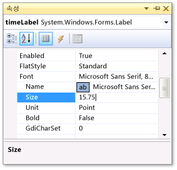
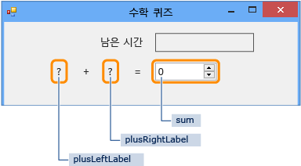
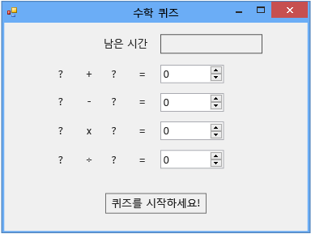

# 1단계: 프로젝트 만들기 및 폼에 레이블 추가
이 퀴즈를 개발하는 첫 번째 단계는 프로젝트를 만들고 폼에 레이블, 단추 및 기타 컨트롤을 추가하는 것입니다. 추가한 각 컨트롤의 속성도 설정합니다. 프로젝트에 폼, 컨트롤 및 코드(자습서의 뒷부분에서 만듦)가 포함됩니다. 단추로 퀴즈를 시작하고 레이블에 퀴즈 문제를 표시하며 나머지 다른 컨트롤에 퀴즈의 답과 퀴즈 완료까지 남은 시간을 표시합니다.  
  
> [!NOTE]
>  이 항목은 기본 코딩 개념에 대해 설명하는 자습서 시리즈의 일부입니다. 자습서에 대한 개요는 [자습서 2: 시간이 지정된 수학 퀴즈 만들기](../ide/tutorial-2-create-a-timed-math-quiz.md)를 참조하세요.  
  
### 프로젝트를 만들고 폼의 속성을 설정하려면  
  
1.  메뉴 모음에서 **파일**, **새로 만들기**, **프로젝트**를 차례로 선택합니다.  
  
2.  **설치된 템플릿** 목록에서 **C#** 또는 **Visual Basic**을 선택합니다.  
  
3.  템플릿 목록에서 **Windows Forms 응용 프로그램** 템플릿을 선택하고 이름으로 **수학 퀴즈**를 지정한 다음 **확인** 단추를 선택합니다.  
  
     선택한 프로그래밍 언어에 따라 **Form1.cs** 또는 **Form1.vb**라는 폼이 표시됩니다.  
  
4.  폼을 선택한 다음 **Text** 속성을 **수학 퀴즈**로 변경합니다.  
  
     **속성** 창에는 폼 속성이 포함되어 있습니다.  
  
5.  이 폼의 크기를 500*400픽셀로 변경합니다.  
  
     IDE(통합 개발 환경)의 왼쪽 아래 모퉁이에 올바른 크기가 표시될 때까지 폼의 가장자리를 끌어서 크기를 조정할 수 있습니다. 또는 **Size** 속성의 값을 변경해도 됩니다.  
  
6.  **FormBorderStyle** 속성의 값을 **Fixed3D**로 변경하고 **MaximizeBox** 속성을 **False**로 설정합니다.  
  
     값을 이렇게 설정하면 퀴즈를 푸는 사람이 폼 크기를 변경할 수 없습니다.  
  
### 남은 시간 상자를 만들려면  
  
1.  도구 상자에서 **Label** 컨트롤을 추가한 다음 **(Name)** 속성의 값을 `timeLabel`로 설정합니다.  
  
     이 레이블은 오른쪽 위 모퉁이에 퀴즈의 남은 시간(초)을 표시하는 상자로 나타납니다.  
  
2.  상자의 크기를 조정할 수 있도록 **AutoSize** 속성을 **False**로 변경합니다.  
  
3.  **BorderStyle** 속성을 **FixedSingle**로 변경하여 상자 주위에 선을 그립니다.  
  
4.  **Size** 속성을 **200, 30**으로 설정합니다.  
  
5.  파란색 공백 줄이 나타나는 폼의 오른쪽 위 모퉁이로 레이블을 이동합니다.  
  
     이 줄을 사용하면 폼의 컨트롤을 쉽게 정렬할 수 있습니다.  
  
6.  **속성** 창에서 **Text** 속성을 선택한 다음 백스페이스 키를 선택하여 속성 값을 지웁니다.  
  
7.  **Font** 속성 옆의 더하기 기호(+)를 선택한 다음 **Size** 속성의 값을 **15.75**로 변경합니다.  
  
     다음 그림과 같이 여러 가지 글꼴 속성을 변경할 수 있습니다.  
  
       
글꼴 크기가 표시된 속성 창  
  
8.  도구 상자에서 다른 **Label** 컨트롤을 추가한 후 글꼴 크기를 **15.75**로 설정합니다.  
  
9. **Text** 속성을 **Time Left**로 설정합니다.  
  
10. 레이블을 이동하여 **timeLabel** 레이블 바로 왼쪽에 정렬합니다.  
  
### 더하기 문제의 컨트롤을 추가하려면  
  
1.  도구 상자에서 **Label** 컨트롤을 추가한 후 **Text** 속성을 **?**로 설정합니다. 설정합니다.  
  
2.  **AutoSize** 속성을 **False**로 설정합니다.  
  
3.  **Size** 속성을 **60, 50**으로 설정합니다.  
  
4.  글꼴 크기를 **18**로 설정합니다.  
  
5.  **TextAlign** 속성을 **MiddleCenter**로 설정합니다.  
  
6.  **Location** 속성을 **50, 75**로 설정하여 컨트롤을 폼에 배치합니다.  
  
7.  **(Name)** 속성을 **plusLeftLabel**로 설정합니다.  
  
8.  **plusLeftLabel** 레이블을 선택한 다음 Ctrl+C 키를 누르거나 **편집** 메뉴의 **복사**를 선택합니다.  
  
9. Ctrl+V 키를 누르거나 **편집** 메뉴의 **붙여넣기**를 선택하여 레이블을 세 번 붙여넣습니다.  
  
10. 세 레이블이 **plusLeftLabel** 레이블의 오른쪽에 나란히 놓이도록 정렬합니다.  
  
     공백 줄을 사용하여 세 레이블을 일정한 간격으로 정렬할 수 있습니다.  
  
11. 두 번째 레이블의 **Text** 속성 값을 **+**(더하기 기호)로 설정합니다.  
  
12. 세 번째 레이블의 **(Name)** 속성 값을 **plusRightLabel**로 설정합니다.  
  
13. 네 번째 레이블의 **Text** 속성 값을 **=**(등호)로 설정합니다.  
  
14. 도구 상자에서 **NumericUpDown** 컨트롤을 추가한 후 글꼴 크기를 **18**로, 너비를 **100**으로 설정합니다.  
  
     이 컨트롤 종류에 대해서는 나중에 자세히 설명하도록 하겠습니다.  
  
15. 더하기 문제의 레이블 컨트롤에 맞춰 **NumericUpDown** 컨트롤을 정렬합니다.  
  
16. **NumericUpDown** 컨트롤의 **(Name)** 속성 값을 **sum**으로 변경합니다.  
  
     다음 그림과 같이 첫 번째 행이 만들어졌습니다.  
  
       
수학 퀴즈의 첫 번째 행  
  
### 빼기, 곱하기 및 나누기 문제의 컨트롤을 추가하려면  
  
1.  더하기 문제의 컨트롤 다섯 개(Label 컨트롤 네 개와 NumericUpDown 컨트롤 한 개)를 모두 복사한 다음 붙여 넣습니다.  
  
     폼에 선택된 상태의 새 컨트롤 다섯 개가 포함되어 있습니다.  
  
2.  다섯 개의 컨트롤을 모두 이동하여 더하기 컨트롤 아래에 배치합니다.  
  
     공백 줄을 사용하여 두 행 사이에 충분한 간격을 둘 수 있습니다.  
  
3.  두 번째 레이블의 **Text** 속성 값을 **-**(빼기 기호)로 변경합니다.  
  
4.  첫 번째 물음표 레이블의 이름을 **minusLeftLabel**로 지정합니다.  
  
5.  두 번째 물음표 레이블의 이름을 **minusRightLabel**로 지정합니다.  
  
6.  **NumericUpDown** 컨트롤의 이름을 **difference**로 지정합니다.  
  
7.  다섯 개의 컨트롤을 두 번 더 붙여 넣습니다.  
  
8.  세 번째 행의 경우 첫 번째 레이블의 이름을 **timesLeftLabel**로 지정하고, 두 번째 레이블의 **Text** 속성을 **×**(곱하기 기호)로 변경하고, 세 번째 레이블의 이름을 **timesRightLabel**로 지정하고, NumericUpDown 컨트롤의 이름을 **product**로 지정합니다.  
  
9. 네 번째 행의 경우 첫 번째 레이블의 이름을 **dividedLeftLabel**로 지정하고, 두 번째 레이블의 **Text** 속성을 **÷**(나누기 기호)로 변경하고, 세 번째 레이블의 이름을 **dividedRightLabel**로 지정하고, NumericUpDown 컨트롤의 이름을 **quotient**로 지정합니다.  
  
    > [!NOTE]
    >  이 자습서에서 곱하기 기호 ×와 나누기 기호 ÷를 복사하여 폼에 붙여 넣을 수 있습니다.  
  
### 시작 단추를 추가하고 탭 인덱스 순서를 설정하려면  
  
1.  도구 상자에서 **Button** 컨트롤을 추가한 후 **(Name)** 속성을 **startButton**으로 설정합니다.  
  
2.  **Text** 속성을 **퀴즈 시작**으로 설정합니다.  
  
3.  글꼴 크기를 **14**로 설정합니다.  
  
4.  단추의 크기가 텍스트에 맞게 자동으로 조정되도록 **AutoSize** 속성을 **True**로 설정합니다.  
  
5.  단추를 폼의 아래쪽 가운데에 배치합니다.  
  
6.  **startButton** 컨트롤의 **TabIndex** 속성 값을 **1**로 설정합니다.  
  
    > [!NOTE]
    >  **TabIndex** 속성은 퀴즈를 푸는 사람이 Tab 키를 선택할 때 컨트롤의 순서를 설정합니다. 작동 방식을 보려면 메뉴 모음에서 **파일**, **열기**를 선택하는 등의 작업을 수행하여 아무 대화 상자나 열고 Tab 키를 여러 번 눌러 봅니다. Tab 키를 선택할 때마다 커서가 컨트롤 사이에서 어떻게 이동하는지 살펴봅니다. 이러한 순서는 폼이 만들어질 때 프로그래머에 의해 설정됩니다.  
  
7.  NumericUpDown sum 컨트롤의 **TabIndex** 속성 값을 **2**, difference 컨트롤의 경우 **3**, product 컨트롤의 경우 **4**, quotient 컨트롤의 경우 **5**로 설정합니다.  
  
     그러면 폼이 다음 그림과 같이 표시됩니다.  
  
       
초기 수학 퀴즈 폼  
  
8.  **TabIndex** 속성이 예상대로 작동하는지 확인하려면 프로그램을 저장한 후 F5 키를 선택하거나 메뉴 모음에서 **디버그**, **디버깅 시작**을 선택하여 프로그램을 실행한 다음 Tab 키를 여러 번 누릅니다.  
  
### 계속하거나 검토하려면  
  
-   다음 자습서 단계로 이동하려면 [2단계: 난수 더하기 문제 만들기](../ide/step-2-create-a-random-addition-problem.md)를 참조하세요.  
  
-   개요 항목으로 돌아가려면 [자습서 2: 시간이 지정된 수학 퀴즈 만들기](../ide/tutorial-2-create-a-timed-math-quiz.md)를 참조하세요.