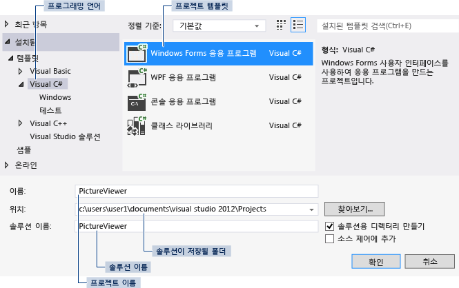

# 1단계: Windows Forms 응용 프로그램 프로젝트 만들기
사진 뷰어를 만드는 첫 번째 단계는 Windows Forms 응용 프로그램 프로젝트를 만드는 것입니다.  
  
 이 항목의 비디오 버전을 보려면 [자습서 1: Visual Basic에서 사진 뷰어 만들기 - 비디오 1](http://go.microsoft.com/fwlink/?LinkId=205209) 또는 [자습서 1: C#에서 사진 뷰어 만들기 - 비디오 1](http://go.microsoft.com/fwlink/?LinkId=205199)을 참조하세요. 이러한 비디오에서는 이전 버전의 Visual Studio를 사용하므로 일부 메뉴 명령과 기타 사용자 인터페이스 요소가 약간 다를 수 있습니다. 그러나 개념 및 절차는 Visual Studio의 현재 버전에서 비슷하게 작동합니다.  
  
### Windows Forms 응용 프로그램 프로젝트를 만들려면  
  
1.  메뉴 모음에서 **파일**, **새로 만들기**, **프로젝트**를 차례로 선택합니다. 대화 상자는 다음과 같습니다.  
  
       
새 프로젝트 대화 상자  
  
2.  **설치된 템플릿** 목록에서 **Visual C#** 또는 **Visual Basic**을 선택합니다.  
  
3.  템플릿 목록에서 **Windows Forms 응용 프로그램** 아이콘을 선택합니다. 새 폼의 이름을 **PictureViewer**로 지정한 후 **확인** 단추를 선택합니다.  
  
     Visual Studio에서 프로그램의 솔루션이 생성됩니다. 솔루션은 프로그램에 필요한 모든 프로젝트 및 파일의 컨테이너 역할을 합니다. 이러한 용어에 대해서는 이 자습서의 뒷부분에서 자세히 설명합니다.  
  
4.  다음 그림에는 지금 Visual Studio 인터페이스에 표시되어야 하는 화면이 나와 있습니다.  
  
    > [!NOTE]
    >  창 레이아웃은 이 그림과 다를 수 있습니다. 정확한 창 레이아웃은 Visual Studio 버전, 사용 중인 프로그래밍 언어 및 기타 요소에 따라 달라집니다. 그러나 3개 창이 모두 나타나는지 확인해야 합니다.  
  
       
IDE 창  
  
     인터페이스에는 주 창, **솔루션 탐색기** 및 **속성** 창의 세 가지 창이 포함되어 있습니다.  
  
     이러한 창 중 하나라도 없는 경우 메뉴 모음에서 **창**, **창 레이아웃 다시 설정**을 선택하여 기본 창 레이아웃을 복원합니다. 메뉴 명령을 사용하여 창을 표시할 수도 있습니다. 메뉴 모음에서 **보기**를 선택하고 **속성 창** 또는 **솔루션 탐색기**를 선택합니다. 다른 창이 열려 있는 경우 오른쪽 위 모서리에서 **닫기**(x) 단추를 선택하여 해당 창을 닫습니다.  
  
5.  그림에 표시된 창은 다음과 같습니다(왼쪽 위 모퉁이부터 시계 방향으로).  
  
    -   **주 창** 이 창에서는 폼 작업, 코드 편집 등 대부분의 작업을 수행합니다. 그림에서 이 창에는 폼 편집기의 폼이 표시되어 있습니다. 창의 맨 위에 **시작 페이지** 탭과 **Form1.cs[디자인]** 탭이 나타납니다. Visual Basic에서는 탭 이름이 .cs가 아닌 .vb로 끝납니다.  
  
    -   **솔루션 탐색기 창** 이 창에서는 솔루션의 모든 항목을 보고 탐색할 수 있습니다. 파일을 선택하면 **속성** 창의 내용이 변경됩니다. Visual C#에서는 .cs로 끝나고 Visual Basic에서는 .vb로 끝나는 코드 파일을 열면 코드 파일이나 코드 파일의 디자이너가 나타납니다. 디자이너는 단추, 목록 등의 컨트롤을 추가할 수 있는 시각적 화면입니다. Visual Studio 폼의 디자이너를 Windows Forms 디자이너라고 합니다.  
  
    -   **속성 창** 이 창에서는 다른 창에서 선택한 항목의 속성을 변경할 수 있습니다. 예를 들어 Form1을 선택하는 경우 **Text** 속성을 설정하여 제목을 변경하고 **Backcolor** 속성을 설정하여 배경색을 변경할 수 있습니다.  
  
    > [!NOTE]
    >  **솔루션 탐색기**의 가장 위쪽 줄에는 Visual Studio에서 솔루션이 생성되었음을 의미하는 **솔루션 'PictureViewer'(프로젝트 1개)**가 표시됩니다. 솔루션에 둘 이상의 프로젝트를 포함할 수는 있지만, 지금은 하나의 프로젝트만 포함된 솔루션으로 작업하겠습니다.  
  
6.  메뉴 모음에서 **파일**, **모두 저장**을 차례로 선택합니다.  
  
     또는 다음 그림과 같이 도구 모음에서 **모두 저장** 단추를 선택합니다.  
  
       
모두 저장 도구 모음 단추  
  
     Visual Studio에서 자동으로 폴더 이름과 프로젝트 이름이 채워진 후 프로젝트 폴더에 프로젝트가 저장됩니다.  
  
### 계속하거나 검토하려면  
  
-   다음 자습서 단계로 이동하려면 [2단계: 프로그램 실행](../ide/step-2-run-your-program.md)을 참조하세요.  
  
-   개요 항목으로 돌아가려면 [자습서 1: 사진 뷰어 만들기](../ide/tutorial-1-create-a-picture-viewer.md)를 참조하세요.