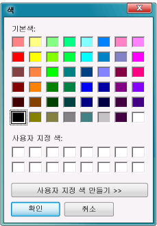

# 11단계: 프로그램 실행 및 기타 기능 사용
이제 프로그램이 완성되어 실행할 준비가 되었으므로 프로그램을 실행하고 <xref:System.Windows.Forms.PictureBox>의 배경색을 설정할 수 있습니다. 더 자세한 내용을 알아보려면 폼의 색의 변경하고, 단추와 확인란을 사용자 지정하고, 폼의 속성을 변경하여 프로그램을 향상시킵니다.  
  
 샘플의 전체 버전을 다운로드하려면 [Complete picture viewer tutorial sample](http://code.msdn.microsoft.com/Complete-Picture-Viewer-7d91d3a8)(전체 사진 뷰어 자습서 샘플)을 참조하세요.  
  
 이 항목의 비디오 버전을 보려면 [Tutorial 1: Create a picture viewer in Visual Basic - Video 5](http://go.microsoft.com/fwlink/?LinkId=205216)(자습서 1: Visual Basic에서 사진 뷰어 만들기 - 비디오 5) 또는 [Tutorial 1: Create a picture viewer in C# - Video 5](http://go.microsoft.com/fwlink/?LinkId=205206)(자습서 1: C#에서 사진 뷰어 만들기 - 비디오 5)를 참조하세요. 이러한 비디오에서는 이전 버전의 Visual Studio를 사용하므로 일부 메뉴 명령과 기타 사용자 인터페이스 요소가 약간 다를 수 있습니다. 그러나 개념 및 절차는 Visual Studio의 현재 버전에서 비슷하게 작동합니다.  
  
## 프로그램을 실행하고 배경색을 설정하려면  
  
1.  **F5** 키를 선택하거나 메뉴 모음에서 **디버그** > **디버깅 시작**을 선택합니다.  
  
2.  그림을 열기 전에 **배경색 설정** 단추를 선택합니다. **색** 대화 상자가 열립니다.  

       
**색** 대화 상자 
  
3.  PictureBox 배경색으로 설정할 색을 선택합니다. `backgroundButton_Click()` 메서드가 어떤 식으로 작동하는지 자세히 살펴봅니다.  

    > [!NOTE]
    >  **파일 열기** 대화 상자에 URL을 붙여넣어 인터넷에서 그림을 로드할 수 있습니다. 배경색이 보이도록 배경이 투명한 이미지를 찾아 봅니다.  

4.  **그림 지우기** 단추를 선택하여 그림을 지웁니다. 그런 다음 **닫기** 단추를 선택하여 프로그램을 종료합니다.  

## 다른 기능을 테스트하려면  

-   **BackColor** 속성을 사용하여 폼과 단추의 색을 변경합니다.  

-   **Font** 및 **ForeColor** 속성을 사용하여 단추와 확인란을 사용자 지정합니다.  

-   폼의 **FormBorderStyle** 및 **ControlBox** 속성을 변경합니다.  
  
-   폼의 **AcceptButton** 및 **CancelButton** 속성을 사용하여 사용자가 **Enter** 키나 **Esc** 키를 선택하면 단추가 자동으로 선택되도록 만듭니다. 사용자가 **Enter** 키를 선택하면 **파일 열기** 대화 상자가 열리고 **Esc** 키를 선택하면 이 대화 상자가 닫히도록 프로그램을 설정합니다.  
  
## 계속하거나 검토하려면  
  
-   Visual Studio에서의 프로그래밍에 대한 자세한 내용은 [프로그래밍 개념](http://msdn.microsoft.com/Library/65c12cca-af4f-4017-886e-2dbc00a189d6)을 참조하세요.  
  
-   Visual Basic에 대한 자세한 내용은 [Visual Basic으로 응용 프로그램 개발](/dotnet/visual-basic/developing-apps/index)을 참조하세요.  
  
-   Visual C#에 대한 자세한 내용은 [C# 언어 및 .NET Framework 소개](/dotnet/csharp/getting-started/introduction-to-the-csharp-language-and-the-net-framework)를 참조하세요.  
  
-   다음 자습서로 이동하려면 [자습서 2: 시간이 지정된 수학 퀴즈 만들기](../ide/tutorial-2-create-a-timed-math-quiz.md)를 참조하세요.  
  
-   이전 자습서 단계로 돌아가려면 [10단계: 추가 단추 및 확인란에 대한 코드 작성](../ide/step-10-write-code-for-additional-buttons-and-a-check-box.md)을 참조하세요.
