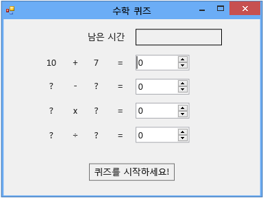

# 2단계: 난수 더하기 문제 만들기
이 자습서의 2단계에서는 난수 기반 수학 문제를 추가하여 퀴즈를 좀 더 어렵게 만듭니다. 문제를 채우고 카운트다운 타이머를 시작하는 `StartTheQuiz()`라는 메서드도 추가합니다. 이 자습서의 뒷부분에서는 빼기, 곱하기 및 나누기 문제를 추가합니다.

> [!NOTE]
>  이 항목은 기본 코딩 개념에 대해 설명하는 자습서 시리즈의 일부입니다. 자습서에 대한 개요는 [자습서 2: 시간이 지정된 수학 퀴즈 만들기](../ide/tutorial-2-create-a-timed-math-quiz.md)를 참조하세요.

### 난수 더하기 문제를 만들려면

1.  폼 디자이너에서 폼(Form1)을 선택합니다.

2.  메뉴 모음에서 **보기**, **코드**를 차례로 선택합니다.

     폼의 숨김 코드를 볼 수 있도록 사용 중인 프로그래밍 언어에 따라 Form1.cs 또는 Form1.vb가 표시됩니다.

3.  코드 위쪽에 다음과 같은 `Random` 문을 추가하여 `new` 개체를 만듭니다.

     [!code-csharp[VbExpressTutorial3Step2#1](../ide/codesnippet/CSharp/step-2-create-a-random-addition-problem_1.cs)]
     [!code-vb[VbExpressTutorial3Step2#1](../ide/codesnippet/VisualBasic/step-2-create-a-random-addition-problem_1.vb)]

     `Random` 개체가 폼에 추가되고 이름이 **randomizer**로 지정되었습니다.

     `Random`을 개체라고 합니다. 이전에 한 번쯤 들어보았을 개체의 프로그래밍적 의미에 대해서는 다음 자습서에서 자세히 설명합니다. 지금은 `new` 문을 사용하여 개체라고 하는 단추, 레이블, 패널, OpenFileDialogs, ColorDialogs, SoundPlayers, Randoms, 폼 등의 항목을 만들 수 있다는 점만 기억하면 됩니다. 프로그램을 실행하면 폼이 시작되고 폼의 숨김 코드가 `Random` 개체를 만들어 이름을 **randomizer**로 지정합니다.

     이제 곧 답을 확인하는 메서드를 빌드하게 되므로 퀴즈에서는 각 문제에 대해 생성하는 난수를 저장할 변수를 사용해야 합니다. [변수](/dotnet/visual-basic/programming-guide/language-features/variables/index) 또는 [형식](/dotnet/csharp/programming-guide/types/index)을 참조하세요. 변수를 적절히 사용하려면 변수를 선언해야 합니다. 즉, 변수의 이름과 데이터 형식을 나열해야 합니다.

4.  폼에 두 개의 정수 변수를 추가하고 이름을 **addend1** 및 **addend2**로 지정합니다.

    > [!NOTE]
    >  정수 변수를 C#에서는 int라고 하고 Visual Basic에서는 Integer라고 합니다. 이러한 종류의 변수는 -2147483648에서 2147483647 사이의 소수가 아닌 양의 정수 또는 음의 정수만 저장할 수 있습니다.

     다음 코드에서처럼 `Random` 개체를 추가할 때와 비슷한 구문을 사용하여 정수 변수를 추가할 수 있습니다.

     [!code-csharp[VbExpressTutorial3Step2#2](../ide/codesnippet/CSharp/step-2-create-a-random-addition-problem_2.cs)]
     [!code-vb[VbExpressTutorial3Step2#2](../ide/codesnippet/VisualBasic/step-2-create-a-random-addition-problem_2.vb)]

5.  `StartTheQuiz()` 개체의 `Random` 메서드를 사용하여 레이블에 난수를 표시하는 `Next()`라는 메서드를 추가합니다. `StartTheQuiz()`는 모든 문제를 채우고 타이머를 시작합니다. 주석을 추가하십시오. 함수는 다음과 같습니다.

     [!code-csharp[VbExpressTutorial3Step2#3](../ide/codesnippet/CSharp/step-2-create-a-random-addition-problem_3.cs)]
     [!code-vb[VbExpressTutorial3Step2#3](../ide/codesnippet/VisualBasic/step-2-create-a-random-addition-problem_3.vb)]

     코드에서 **randomizer** 뒤에 점(.)을 입력하면 IntelliSense 창이 열리고 호출 가능한 `Random` 개체의 모든 메서드가 표시됩니다. 예로 들면 다음과 같이 IntelliSense는 `Next()` 메서드를 나열합니다.

      Next 메서드

     개체 뒤에 점을 입력하면 IntelliSense에 속성, 메서드, 이벤트 등 개체의 멤버 목록이 표시됩니다.

    > [!NOTE]
    >  `Next()`를 호출할 때처럼 `Random` 메서드를 `randomizer.Next(50)` 개체와 함께 사용하는 경우 50 미만(0에서 49 사이)의 난수가 반환됩니다. 이 예제에서는 `randomizer.Next(51)`가 호출되었습니다. 50이 아니라 51이 사용된 이유는 두 난수를 더해 0에서 100 사이의 답이 나오도록 하기 위해서입니다. `Next()` 메서드에 50을 전달하면 0에서 49 사이의 숫자가 선택되므로 가능한 가장 큰 답은 100이 아니라 98입니다. 이 메서드의 처음 두 문을 실행하고 나면 두 개의 정수 변수인 `addend1`과 `addend2`에 각각 0에서 50 사이의 난수 값이 들어갑니다. 이 스크린 샷에는 Visual C# 코드가 나와 있지만 Visual Basic에서도 IntelliSense가 동일하게 작동합니다.

     이러한 문을 자세히 살펴봅니다.

     [!code-csharp[VbExpressTutorial3Step2#18](../ide/codesnippet/CSharp/step-2-create-a-random-addition-problem_4.cs)]
     [!code-vb[VbExpressTutorial3Step2#18](../ide/codesnippet/VisualBasic/step-2-create-a-random-addition-problem_4.vb)]

     이러한 문은 **plusLeftLabel**과 **plusRightLabel**의 **Text** 속성을 설정하여 레이블에서 두 개의 난수를 표시하도록 합니다. 정수의 `ToString()` 메서드를 사용하여 숫자를 텍스트로 변환해야 합니다. 프로그래밍에서 문자열은 텍스트를 의미합니다. 레이블 컨트롤에는 숫자가 아니라 텍스트만 표시됩니다.

6.  디자인 창에서 **시작** 단추를 두 번 클릭하거나, 이 단추를 선택한 후 Enter 키를 선택합니다.

     퀴즈를 푸는 사람이 이 단추를 선택하면 퀴즈가 시작되어야 합니다. 이 동작을 구현하기 위해 방금 전에 Click 이벤트 처리기를 추가했습니다.

7.  다음 두 문을 추가합니다.

     [!code-csharp[VbExpressTutorial3Step2#4](../ide/codesnippet/CSharp/step-2-create-a-random-addition-problem_5.cs)]
     [!code-vb[VbExpressTutorial3Step2#4](../ide/codesnippet/VisualBasic/step-2-create-a-random-addition-problem_5.vb)]

     첫 번째 문은 새 `StartTheQuiz()` 메서드를 호출합니다. 두 번째 문은 **startButton** 컨트롤의 **Enabled** 속성을 **False**로 설정하여 퀴즈를 푸는 사람이 퀴즈를 푸는 동안 이 단추를 선택할 수 없도록 합니다.

8.  코드를 저장하고 실행한 다음 **시작** 단추를 선택합니다.

     다음 그림과 같이 난수 더하기 문제가 나타납니다.

      임의의 덧셈 문제

     자습서의 다음 단계에서는 합계를 추가합니다.

### 계속하거나 검토하려면

-   다음 자습서 단계로 이동하려면 [3단계: 카운트다운 타이머 추가](../ide/step-3-add-a-countdown-timer.md)를 참조하세요.

-   이전 자습서 단계로 돌아가려면 [1단계: 프로젝트 만들기 및 폼에 레이블 추가](../ide/step-1-create-a-project-and-add-labels-to-your-form.md)를 참조하세요.