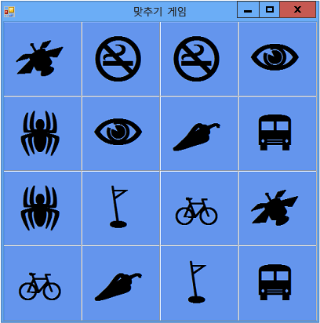

# <a name="step-3-assign-a-random-icon-to-each-label"></a>3단계: 각 레이블에 임의 아이콘 할당
모든 게임의 동일한 셀에 이 아이콘이 표시되는 경우 게임이 재미가 없습니다. 이를 방지하려면 `AssignIconsToSquares()` 메서드를 사용하여 폼의 레이블 컨트롤에 아이콘을 임의로 할당합니다.  

### <a name="to-assign-a-random-icon-to-each-label"></a>각 레이블에 임의의 아이콘을 할당하려면  

1.  다음 코드를 추가하기 전에 메서드가 동작하는 방식을 고려해야 합니다. Visual C#에는 `foreach`, Visual Basic에는 `For Each`라는 새 키워드가 사용됩니다. 코드 줄 중 하나가 주석 처리되어 있으며 이에 대해서는 이 절차의 끝 부분에서 설명합니다.  

     [!code-csharp[VbExpressTutorial4Step2_3_4#2](../ide/codesnippet/CSharp/step-3-assign-a-random-icon-to-each-label_1.cs)]
     [!code-vb[VbExpressTutorial4Step2_3_4#2](../ide/codesnippet/VisualBasic/step-3-assign-a-random-icon-to-each-label_1.vb)]  

2.  이전 단계와 같이 `AssignIconsToSquares()` 메서드를 추가합니다. 이 메서드를 [2단계: 임의의 개체 및 아이콘 목록 추가](../ide/step-2-add-a-random-object-and-a-list-of-icons.md)에서 추가한 코드 바로 다음에 둡니다.  

     앞서 언급했듯이, `AssignIconsToSquares()` 메서드에 `foreach` 루프(Visual C#의 경우)와 `For Each`(Visual Basic의 경우)라는 새로운 키워드가 있습니다. 같은 작업을 여러 번 수행하려는 경우 언제든지 `For Each` 루프를 사용할 수 있습니다. 이 경우에는 다음 코드에서 설명하는 것처럼 TableLayoutPanel의 모든 레이블에 대해 같은 문을 실행하려고 합니다. 첫 번째 줄에서는 컨트롤에서 실행되는 루프에 문이 있을 때 각 컨트롤을 한 번에 하나씩 저장하는 `control`이라는 변수를 만듭니다.  

     [!code-csharp[VbExpressTutorial4Step2_3_4#14](../ide/codesnippet/CSharp/step-3-assign-a-random-icon-to-each-label_2.cs)]
     [!code-vb[VbExpressTutorial4Step2_3_4#14](../ide/codesnippet/VisualBasic/step-3-assign-a-random-icon-to-each-label_2.vb)]  

    > [!NOTE]
    >  "iconLabel" 및 "control"과 같이 의미를 알기 쉬운 이름이 사용되었습니다. 이러한 이름은 다른 이름으로 바꿀 수 있으며, 코드는 루프 내의 각 문에서 이름을 변경하는 한 동일하게 작동합니다.  

     `AssignIconsToSquares()` 메서드는 TableLayoutPanel의 각 Label 컨트롤을 반복하고 각 컨트롤에 대해 동일한 문을 실행합니다. 이러한 문은 [2단계: 임의의 개체 및 아이콘 목록 추가](../ide/step-2-add-a-random-object-and-a-list-of-icons.md)에서 추가한 목록에서 임의의 아이콘을 끌어옵니다. 이 때문에 각 아이콘을 두 개씩 목록에 포함했습니다. 따라서 임의의 Label 컨트롤에 아이콘 쌍이 할당됩니다.  

     `foreach` 또는 `For Each` 루프 내에서 실행되는 코드에 대해 보다 자세히 살펴봅니다. 이 코드가 여기에 재현되어 있습니다.  

     [!code-csharp[VbExpressTutorial4Step2_3_4#16](../ide/codesnippet/CSharp/step-3-assign-a-random-icon-to-each-label_3.cs)]
     [!code-vb[VbExpressTutorial4Step2_3_4#16](../ide/codesnippet/VisualBasic/step-3-assign-a-random-icon-to-each-label_3.vb)]  

     첫 번째 줄은 `control` 변수를 `iconLabel`이라는 레이블로 변환합니다. 그 다음 줄은 변환이 작동했는지 확인하는 `if` 문입니다. 변환이 작동하지 않은 경우 `if` 문에서 이 문을 실행합니다. (이전 자습서에서 확인한 바와 같이, 지정한 모든 조건을 평가하는 데에 `if` 문을 사용합니다.) `if` 문의 첫 번째 줄은 아이콘 목록의 항목 중 하나에 해당하는 난수가 포함된 `randomNumber`라는 변수를 만듭니다. 이를 위해 이전에 만든 `Next` 개체의 `Random` 메서드가 사용됩니다. `Next` 메서드는 난수를 반환합니다. 이 줄에서는 또한 `Count` 목록의 `icons` 속성을 사용하여 난수를 선택할 수 있는 범위를 결정합니다. 다음 줄은 레이블의 `Text` 속성에 아이콘 목록 항목 중 하나를 할당합니다. 주석 처리된 줄은 이 항목의 뒷부분에 설명되어 있습니다. 끝으로 `if` 문의 마지막 줄은 폼에 추가된 아이콘을 목록에서 제거합니다.  

     코드의 일부 기능에 대해 잘 모를 경우 마우스 포인터를 코드 요소 위에 놓으면 나타나는 도구 설명을 검토할 수 있습니다. Visual Studio 디버거를 사용하여 프로그램이 실행되는 동안 코드의 각 줄을 단계별로 실행할 수 있습니다. 자세한 내용은 [How Do I: Step with The Debugger in Visual Studio?](http://msdn.microsoft.com/vstudio/ee672313.aspx)(방법: Visual Studio에서 디버거를 사용하여 단계별 실행) 또는 [디버거로 코드 탐색](../debugger/navigating-through-code-with-the-debugger.md)을 참조하세요.  

3.  게임 보드를 아이콘으로 채우려면 프로그램이 시작되자 마자 `AssignIconsToSquares()` 메서드를 호출해야 합니다. Visual C#을 사용하는 경우 `Form1` *생성자*에서 `InitializeComponent()` 메서드 호출 바로 아래에 문을 추가합니다. 그러면 폼이 표시되기 전에 폼을 설정하는 새로운 메서드가 호출됩니다. 생성자는 클래스 또는 구조체와 같은 새 개체를 만들 때 호출됩니다. 자세한 내용은 Visual Basic의 [생성자(C# 프로그래밍 가이드)](http://msdn.microsoft.com/library/ace5hbzh.aspx) or [생성자 및 소멸자 사용](http://msdn.microsoft.com/library/2z08e49e.aspx)을 참조하세요.  

     [!code-csharp[VbExpressTutorial4Step2_3_4#13](../ide/codesnippet/CSharp/step-3-assign-a-random-icon-to-each-label_4.cs)]  

     Visual Basic의 경우 `AssignIconsToSquares()` 메서드를 호출하는 `Form1_Load` 메서드를 추가합니다. 코드는 다음과 같습니다.  

    ```vb  
    Private Sub Form1_Load(sender As Object, e As EventArgs) Handles MyBase.Load  
        AssignIconsToSquares()  
    End Sub  
    ```  

4.  프로그램을 저장하고 실행합니다. 각 레이블에 임의의 아이콘이 할당된 폼이 나타납니다.  

5.  프로그램을 닫고 다시 실행합니다. 다음 그림과 같이 각 레이블에 서로 다른 아이콘이 할당됩니다.  

       
임의의 아이콘을 표시하는 일치 게임  

     아이콘을 숨기지 않았으므로 지금은 아이콘이 보입니다. 플레이어에서 아이콘을 숨기려면 각 레이블의 `Forecolor` 속성을 해당 `BackColor` 속성과 같은 색으로 설정하면 됩니다.  

    > [!TIP]
    >  레이블과 같은 컨트롤을 숨기는 또 다른 방법은 해당 **Visible** 속성을 `False`로 설정하는 것입니다.  

6.  아이콘을 숨기려면 프로그램을 중지하고 `For Each` 루프 내 코드의 주석 처리된 줄에 대한 주석 표시를 제거합니다.  

     [!code-csharp[VbExpressTutorial4Step2_3_4#15](../ide/codesnippet/CSharp/step-3-assign-a-random-icon-to-each-label_5.cs)]
     [!code-vb[VbExpressTutorial4Step2_3_4#15](../ide/codesnippet/VisualBasic/step-3-assign-a-random-icon-to-each-label_5.vb)]  

7.  메뉴 모음에서 **모두 저장** 단추를 선택하여 프로그램을 저장하고 실행합니다. 아이콘이 사라진 것처럼 보이고 파란색 배경만 나타납니다. 그러나 아이콘이 임의로 할당되어 그대로 남아 있습니다. 아이콘이 배경과 같은 색이므로 플레이어에게 보이지 않는 것입니다. 어쨌든, 플레이어가 모든 아이콘을 바로 볼 수 있으면 아주 어려운 게임이 될 수 없습니다.  

### <a name="to-continue-or-review"></a>계속하거나 검토하려면  

-   다음 자습서 단계로 이동하려면 [4단계: 각 레이블에 클릭 이벤트 처리기 추가](../ide/step-4-add-a-click-event-handler-to-each-label.md)를 참조하세요.  

-   이전 자습서 단계로 돌아가려면 [2단계: 임의의 개체 및 아이콘 목록 추가](../ide/step-2-add-a-random-object-and-a-list-of-icons.md)를 참조하세요.
