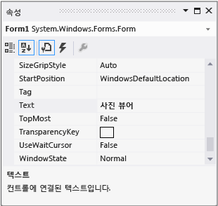

# 3단계: 폼 속성 설정
이제 **속성** 창을 사용하여 폼의 모양을 변경합니다.  
  
 이 항목의 비디오 버전을 보려면 [자습서 1: Visual Basic에서 사진 뷰어 만들기 - 비디오 1](http://go.microsoft.com/fwlink/?LinkId=205209) 또는 [자습서 1: C#에서 사진 뷰어 만들기 - 비디오 1](http://go.microsoft.com/fwlink/?LinkId=205199)을 참조하세요. 이러한 비디오에서는 이전 버전의 Visual Studio를 사용하므로 일부 메뉴 명령과 기타 사용자 인터페이스 요소가 약간 다를 수 있습니다. 그러나 개념 및 절차는 Visual Studio의 현재 버전에서 비슷하게 작동합니다.  
  
### 폼 속성을 설정하려면  
  
1.  Windows Forms 디자이너가 열려 있는지 확인합니다. Visual Studio IDE(통합 개발 환경)에서 **Form1.cs[디자인]** 탭(또는 Visual Basic의 **Form1.vb[디자인]** 탭)을 선택합니다.  
  
2.  **Form1** 폼 내부의 아무 곳이나 선택하여 해당 폼을 선택합니다. **속성** 창에 선택한 폼의 속성이 표시됩니다. 폼에는 다양한 속성이 있습니다. 예를 들어 전경색, 배경색, 폼의 맨 위에 표시되는 제목 텍스트 및 기타 속성을 설정할 수 있습니다.  
  
    > [!NOTE]
    >  **속성** 창이 나타나지 않으면 도구 모음에서 사각형 **디버깅 중지** 단추를 선택하여 프로그램을 중지하거나 창을 닫습니다. 프로그램이 중지되었는데도 **속성** 창이 나타나지 않는 경우 메뉴 모음에서 **보기**, **속성 창**을 차례로 선택합니다.  
  
3.  폼을 선택한 후 **속성** 창에서 **텍스트** 속성을 찾습니다. 목록을 정렬 방법에 따라 아래로 스크롤해야 할 수도 있습니다. **텍스트**를 선택하고 **사진 뷰어**를 입력한 다음 Enter 키를 선택합니다.  이제 폼의 제목 표시줄에 **사진 뷰어**라는 텍스트가 표시되고 **속성** 창이 다음 그림과 같이 표시됩니다.  
  
       
속성 창  
  
    > [!NOTE]
    >  속성은 항목별 뷰 또는 사전순 뷰로 정렬할 수 있는데, **속성** 창에 있는 단추를 사용하면 이러한 두 뷰 간에 전환할 수 있습니다. 이 자습서에서는 사전순 뷰에서 속성을 더 쉽게 찾을 수 있습니다.  
  
4.  Windows Forms 디자이너로 돌아갑니다. 폼의 오른쪽 아래에 있는 흰색의 작은 사각형인 끌기 핸들을 선택합니다. 끌기 핸들은 다음과 같이 생겼습니다.  
  
       
끌기 핸들  
  
     핸들을 끌어 폼의 너비와 높이를 늘립니다.  
  
5.  **속성** 창을 살펴보면 **크기** 속성이 변경되었음을 알 수 있습니다. **크기** 속성은 폼의 크기를 조정할 때마다 변경됩니다. 폼의 핸들을 끌어 폼의 크기를 이 프로젝트에 적합한 크기인 약 550, 350(정확할 필요는 없음)으로 조정합니다. 또는 **크기** 속성에 값을 직접 입력한 다음 Enter 키를 선택할 수도 있습니다.  
  
6.  프로그램을 다시 실행합니다. 프로그램을 실행하려면 다음 방법 중 하나를 사용할 수 있습니다.  
  
    -   **F5** 키를 선택합니다.  
  
    -   메뉴 모음에서 **디버그**, **디버깅 시작**을 차례로 선택합니다.  
  
    -   도구 모음에서 **디버깅 시작** 단추를 선택하면 다음과 같이 표시됩니다.  
  
           
디버깅 도구 모음 시작 단추  
  
     이전과 마찬가지로 IDE에 의해 프로그램이 빌드되고 실행되며 창이 나타납니다.  
  
7.  다음 단계로 이동하기 전에 프로그램을 중지합니다. 이는 IDE가 프로그램이 실행 중일 때 프로그램을 변경하는 것을 허용하지 않기 때문입니다. 프로그램을 중지하려면 다음 방법 중 하나를 사용할 수 있습니다.  
  
    -   도구 모음에서 **디버깅 중지** 단추를 선택합니다.  
  
    -   메뉴 모음에서 **디버그**, **디버깅 중지**를 차례로 선택합니다.  
  
    -   **Form1** 창의 위쪽 모퉁이에 있는 X 단추를 선택합니다.  
  
### 계속하거나 검토하려면  
  
-   다음 자습서 단계로 이동하려면 [4단계: TableLayoutPanel 컨트롤을 사용하여 폼 레이아웃](../ide/step-4-lay-out-your-form-with-a-tablelayoutpanel-control.md)을 참조하세요.  
  
-   이전 자습서 단계로 돌아가려면 [2단계: 프로그램 실행](../ide/step-2-run-your-program.md)을 참조하세요.