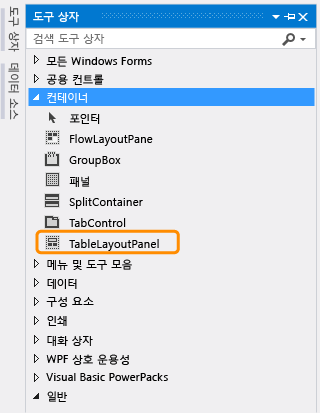
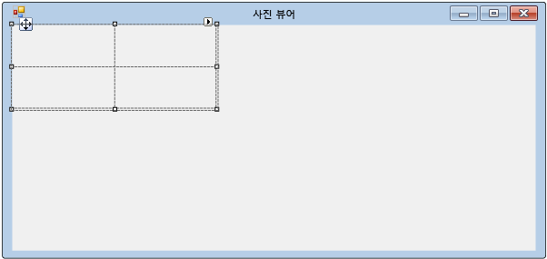
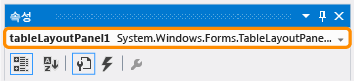
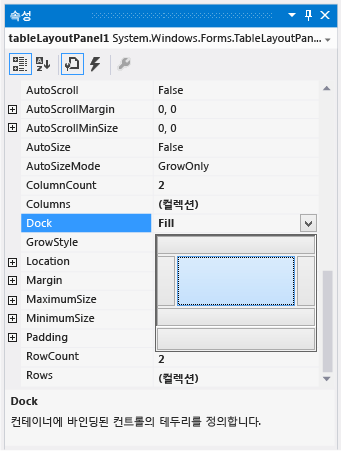
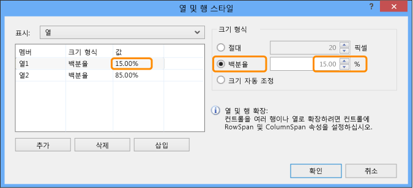

# 4단계: TableLayoutPanel 컨트롤을 사용하여 폼 레이아웃
이 단계에서는 폼에 `TableLayoutPanel` 컨트롤을 추가합니다. TableLayoutPanel을 사용하여 나중에 추가하는 폼에서 컨트롤을 적절히 맞출 수 있습니다.  
  
 이 항목의 비디오 버전을 보려면 [자습서 1: Visual Basic에서 사진 뷰어 만들기 - 비디오 2](http://go.microsoft.com/fwlink/?LinkId=205211) 또는 [자습서 1: C#에서 사진 뷰어 만들기 - 비디오 2](http://go.microsoft.com/fwlink/?LinkId=205200)를 참조하세요. 이러한 비디오에서는 이전 버전의 Visual Studio를 사용하므로 일부 메뉴 명령과 기타 사용자 인터페이스 요소가 약간 다를 수 있습니다. 그러나 개념 및 절차는 Visual Studio의 현재 버전에서 비슷하게 작동합니다.  
  
### TableLayoutPanel 컨트롤을 사용하여 폼을 레이아웃하려면  
  
1.  Visual Studio IDE의 왼쪽에서 **도구 상자** 탭을 찾습니다. **도구 상자** 탭을 선택하면 도구 상자가 나타납니다. 또는 메뉴 모음에서 **보기**, **도구 상자**를 차례로 선택합니다.  
  
2.  다음 그림에 표시된 대로 **컨테이너** 그룹 옆의 작은 삼각형 기호를 선택하여 해당 그룹을 엽니다.  
  
       
컨테이너 그룹  
  
3.  단추, 확인란, 레이블 등과 같은 컨트롤을 폼에 추가할 수 있습니다. 도구 상자에서 `TableLayoutPanel` 컨트롤을 두 번 클릭합니다. 또는 컨트롤을 도구 상자에서 폼으로 끌어 놓을 수 있습니다. 이렇게 하면 다음 그림과 같이 IDE가 `TableLayoutPanel` 컨트롤을 폼에 추가합니다.  
  
       
TableLayoutPanel 컨트롤  
  
    > [!NOTE]
    >  TableLayoutPanel을 추가한 후 제목이 **TableLayoutPanel Tasks**인 창이 폼 안에 표시되면 폼 안쪽 아무 곳이나 선택하여 폼을 닫습니다. 이 창에 대해서는 이 자습서의 뒷부분에서 자세히 설명합니다.  
  
     도구 상자 탭을 선택할 때 도구 상자가 폼에 맞게 확대되는 방식과 도구 상자 바깥쪽 아무 곳이나 선택한 후 도구 상자가 닫히는 방식을 살펴봅니다. 이 기능이 IDE 자동 숨기기 기능입니다. 창의 오른쪽 위 모퉁이에 있는 압정 아이콘을 선택하여 해당 창에서 자동 숨기기 기능을 사용하거나 사용하지 않도록 설정하고 창을 현재 위치에 고정할 수 있습니다. 압정 아이콘은 다음과 같습니다.  
  
       
압정 아이콘  
  
4.  **TableLayoutPanel**을 선택하여 이 컨트롤이 선택된 상태가 되도록 합니다. 다음 그림과 같이 **속성** 창의 맨 위에 있는 드롭다운 목록에서 선택된 컨트롤을 확인할 수 있습니다.  
  
       
TableLayoutPanel 컨트롤이 표시된 속성 창  
  
5.  **속성** 창의 도구 모음에서 **사전순** 단추를 선택합니다. 이렇게 하면 **속성** 창의 속성 목록이 사전순으로 표시되므로 이 자습서에서 속성을 손쉽게 찾을 수 있습니다.  
  
6.  컨트롤 선택기는 **속성** 창의 맨 위에 있는 드롭다운 목록입니다. 이 예제에서는 이 드롭다운 목록에 `tableLayoutPanel1`이라는 컨트롤이 선택되어 있는 것을 보여 줍니다. Windows Forms 디자이너에서 영역을 선택하거나 컨트롤 선택기에서 선택하여 컨트롤을 선택할 수 있습니다. 이제 `TableLayoutPanel`이 선택되어 있으므로 **Dock** 속성을 찾아서 **None**으로 설정해야 하는 **Dock**을 선택합니다. 값 옆에 드롭다운 화살표가 나타납니다. 이 화살표를 선택하고 다음 그림과 같이 **채우기** 단추(가운데 있는 큰 단추)를 선택합니다.  
  
       
Fill이 선택된 속성 창  
  
     Visual Studio에서 *도킹*은 창이 IDE의 다른 창이나 영역에 연결되는 경우를 말합니다. 예를 들어 속성 창은 도킹 해제, 즉 Visual Studio 내에서 연결되지 않은 상태로 자유롭게 움직이거나 **솔루션 탐색기**에 대해 도킹될 수 있습니다.  
  
7.  TableLayoutPanel **Dock** 속성을 **Fill**로 설정합니다. 그러면 패널이 전체 폼으로 채워집니다. 폼의 크기를 다시 조정하면 TableLayoutPanel은 도킹된 상태를 유지한 채 폼의 크기에 맞게 자동으로 크기가 조정됩니다.  
  
    > [!NOTE]
    >  TableLayoutPanel은 열과 행이 있고 개별 셀이 여러 열과 행에 걸쳐 있을 수 있다는 점에서 Microsoft Office Word의 표와 비슷합니다. 각 셀에는 단추, 확인란, 레이블 등과 같은 컨트롤이 하나만 있을 수 있습니다. TableLayoutPanel에는 전체 위쪽 행에 걸쳐 있는 하나의 `PictureBox` 컨트롤, 왼쪽 아래 셀에 있는 하나의 `CheckBox` 컨트롤 및 오른쪽 아래 셀에 있는 네 개의 `Button` 컨트롤이 포함되어 있습니다.  
  
8.  현재 TableLayoutPanel에는 크기가 같은 행과 열이 각각 두 개씩 있는데, 위쪽 행과 오른쪽 열의 크기를 훨씬 더 크게 만들어야 합니다. Windows Forms 디자이너에서 TableLayoutPanel을 선택합니다. 오른쪽 위 모퉁이에 다음과 같은 작은 검정색 삼각형 단추가 있습니다.  
  
       
삼각형 단추  
  
     이 단추는 이 컨트롤에 해당 속성을 자동으로 설정하는 데 도움이 되는 작업이 포함되어 있음을 나타냅니다.  
  
9. 삼각형을 선택하여 다음 그림과 같이 컨트롤의 작업 목록을 표시합니다.  
  
       
TableLayoutPanel 작업  
  
10. **행 및 열 편집** 작업을 선택하여 **열 및 행 스타일** 창을 표시합니다. **Column1**을 선택한 다음 **백분율** 단추가 선택되어 있는지 확인하고 **백분율** 상자에 `15`를 입력하여 크기를 15%로 설정합니다. 이 컨트롤이 이 자습서의 뒷부분에서 사용할 `NumericUpDown` 컨트롤입니다. **Column2**를 선택하고 크기를 85%로 설정합니다. 창이 닫히므로 아직 **확인** 단추는 선택하지 않습니다. 실수로 창을 닫은 경우 작업 목록을 사용하여 다시 열 수 있습니다.  
  
       
TableLayoutPanel 열 및 행 스타일  
  
11. 창의 맨 위에 있는 **표시** 드롭다운 목록에서 **행**을 선택합니다. **Row1**을 90%로 설정하고 **Row2**를 10%로 설정합니다.  
  
12. **확인** 단추를 선택합니다. 이제 TableLayoutPanel에는 큰 위쪽 행, 작은 아래쪽 행, 작은 왼쪽 열, 큰 오른쪽 열이 있습니다. 폼에서 tableLayoutPanel1을 선택하고 해당 열과 행 테두리를 끌어 TableLayoutPanel의 행과 열의 크기를 조정할 수 있습니다.  
  
       
크기가 조정된 TableLayoutPanel이 있는 Form1  
  
### 계속하거나 검토하려면  
  
-   다음 자습서 단계로 이동하려면 [5단계: 폼에 컨트롤 추가](../ide/step-5-add-controls-to-your-form.md)를 참조하세요.  
  
-   이전 자습서 단계로 돌아가려면 [3단계: 폼 속성 설정](../ide/step-3-set-your-form-properties.md)을 참조하세요.