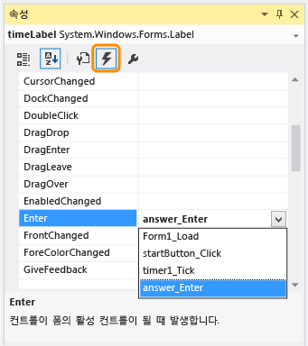

# 5단계: NumericUpDown 컨트롤에 대한 Enter 이벤트 처리기 추가
이 자습서의 5단계에서는 퀴즈 문제의 답을 좀 더 쉽게 입력할 수 있도록 Enter 이벤트 처리기를 추가합니다. 이 코드에서는 퀴즈를 푸는 사람이 NumericUpDown 컨트롤을 선택하고 다른 값을 입력하는 즉시 각 NumericUpDown 컨트롤의 현재 값을 선택하고 지웁니다.  
  
> [!NOTE]
>  이 항목은 기본 코딩 개념에 대해 설명하는 자습서 시리즈의 일부입니다. 자습서에 대한 개요는 [자습서 2: 시간이 지정된 수학 퀴즈 만들기](../ide/tutorial-2-create-a-timed-math-quiz.md)를 참조하세요.  
  
### 기본 동작을 확인하려면  
  
1.  프로그램을 실행하고 퀴즈를 시작합니다.  
  
     더하기 문제의 NumericUpDown 컨트롤에서 **0** 옆에 커서가 깜박이고 있습니다.  
  
2.  `3`을 입력하면 컨트롤에 **30**이 표시됩니다.  
  
3.  `5`를 입력하면 **350**이 나타나지만 잠시 후 **100**으로 변경됩니다.  
  
     이 문제를 해결하려면 먼저 무엇이 문제인지 알아야 합니다. 즉, `3`을 입력했을 때 **0**이 사라지지 않는 이유와 **350**이 잠시 나타났다가 **100**으로 변경되는 이유가 무엇인지 알아야 합니다.  
  
     이 동작은 예기치 않은 동작으로 보일 수 있지만 코드의 논리를 보면 그럴만한 이유가 있습니다. **시작** 단추를 선택하면 단추의 **Enabled** 속성이 **False**로 설정되어 단추가 흐리게 표시되고 사용할 수 없게 됩니다. 프로그램에서는 현재 선택 항목(포커스가 있는 항목)을 TabIndex 값이 그 다음으로 가장 낮은 컨트롤(더하기 문제의 NumericUpDown 컨트롤)로 변경합니다. Tab 키를 사용하여 NumericUpDown 컨트롤로 이동하면 커서가 자동으로 컨트롤의 시작 부분에 놓이게 되어 숫자를 입력하면 오른쪽이 아닌 왼쪽에서 입력됩니다. 100으로 설정된 **MaximumValue** 속성 값보다 큰 값으로 숫자를 지정할 경우, 입력하는 숫자가 이 속성 값으로 대체됩니다.  
  
### NumericUpDown 컨트롤에 대한 Enter 이벤트 처리기를 추가하려면  
  
1.  폼에서 이름이 "sum"인 첫 번째 NumericUpDown 컨트롤을 선택한 다음 **속성** 대화 상자에서 도구 모음의 **이벤트** 아이콘을 선택합니다.  
  
     **속성** 대화 상자의 **이벤트** 탭에 폼에서 선택하는 항목에 대해 응답(처리)할 수 있는 모든 이벤트가 표시됩니다. NumericUpDown 컨트롤을 선택했으므로 이 컨트롤과 관련된 모든 이벤트가 나열됩니다.  
  
2.  **Enter** 이벤트를 선택하고 `answer_Enter`를 입력한 다음 Enter 키를 선택합니다.  
  
       
속성 대화 상자  
  
     sum NumericUpDown 컨트롤에 대한 Enter 이벤트 처리기를 추가하고 처리기 이름을 **answer_Enter**로 지정했습니다.  
  
3.  **answer_Enter** 이벤트 처리기의 메서드에 다음 코드를 추가합니다.  
  
     [!code-vb[VbExpressTutorial3Step5_6#11](../ide/codesnippet/VisualBasic/step-5-add-enter-event-handlers-for-the-numericupdown-controls_1.vb)]
     [!code-csharp[VbExpressTutorial3Step5_6#11](../ide/codesnippet/CSharp/step-5-add-enter-event-handlers-for-the-numericupdown-controls_1.cs)]  
  
     이 코드는 복잡하게 보일 수 있지만 차근차근 살펴보면 쉽게 이해할 수 있습니다. 먼저 메서드의 맨 위를 살펴보면 `object sender`(Visual C#) 또는 `sender As System.Object`(Visual Basic)가 있습니다. 이 매개 변수는 이벤트를 발생시킨 개체, 즉 이벤트 전송자를 참조합니다. 이 코드에서는 전송자 개체가 NumericUpDown 컨트롤입니다. 따라서 메서드의 첫 번째 줄에서 해당 전송자가 단순히 일반 개체가 아니라 NumericUpDown 컨트롤임을 명시적으로 지정합니다. 모든 NumericUpDown 컨트롤은 개체이지만 모든 개체가 NumericUpDown 컨트롤은 아닙니다. 이 메서드에서 NumericUpDown 컨트롤의 이름은 **answerBox**입니다. 이 이름은 sum NumericUpDown 컨트롤뿐 아니라 폼의 모든 NumericUpDown 컨트롤에 사용되기 때문입니다. 이 메서드에 answerBox 변수를 선언하기 때문에 변수 범위가 이 메서드로만 한정됩니다. 다시 말해 이 메서드 내에서만 이 변수를 사용할 수 있습니다.  
  
     다음 줄에서는 answerBox가 개체에서 NumericUpDown 컨트롤로 성공적으로 변환(캐스팅)되었는지 여부를 확인합니다. 변환에 실패할 경우 변수 값은 `null`(C#) 또는 `Nothing`(Visual Basic)입니다. 세 번째 줄은 NumericUpDown 컨트롤에 표시되는 답의 길이를 가져오고, 네 번째 줄은 이 길이를 기준으로 컨트롤의 현재 값을 선택합니다. 이제 퀴즈를 푸는 사람이 컨트롤을 선택하면 Visual Studio에서 이 이벤트를 발생시키고 현재 답이 선택됩니다. 퀴즈를 푸는 사람이 다른 답을 입력하기 시작하면 이전 답이 지워지고 새 답으로 대체됩니다.  
  
4.  Windows Forms 디자이너에서 difference NumericUpDown 컨트롤을 선택합니다.  
  
5.  **속성** 대화 상자의 **이벤트** 페이지에서 **Enter** 이벤트로 스크롤하여 행 끝의 드롭다운 화살표를 선택한 다음 방금 추가한 `answer_Enter` 이벤트 처리기를 선택합니다.  
  
6.  product 및 quotient NumericUpDown 컨트롤에 대해 이전 단계를 반복합니다.  
  
7.  프로그램을 저장한 후 실행합니다.  
  
     NumericUpDown 컨트롤을 선택하면 기존 값이 자동으로 선택되고 다른 값을 입력하기 시작하면 기존 값이 지워집니다.  
  
### 계속하거나 검토하려면  
  
-   다음 자습서 단계로 이동하려면 [6단계: 빼기 문제 추가](../ide/step-6-add-a-subtraction-problem.md)를 참조하세요.  
  
-   이전 자습서 단계로 돌아가려면 [4단계: CheckTheAnswer() 메서드 추가](../ide/step-4-add-the-checktheanswer-parens-method.md)를 참조하세요.