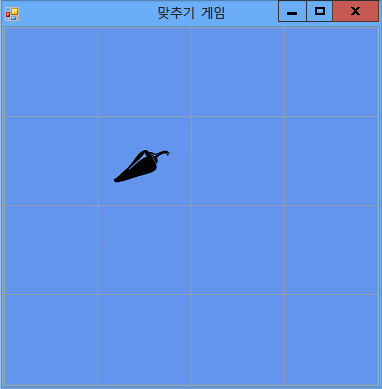

# 5단계: 레이블 참조 추가
프로그램에서는 플레이어가 선택하는 레이블 컨트롤을 추적해야 합니다. 지금은 프로그램에 플레이어가 선택한 모든 레이블이 표시됩니다. 이는 나중에 변경할 것입니다. 첫 번째 레이블이 선택된 후 해당 레이블의 아이콘이 표시됩니다. 두 번째 레이블이 선택된 후에는 프로그램에 두 아이콘이 모두 잠깐 표시된 후 다시 숨겨집니다. 프로그램에서는 이제 *참조 변수*를 사용하여 첫 번째 선택한 레이블 컨트롤과 두 번째 선택한 레이블 컨트롤을 추적합니다.  
  
### 레이블 참조를 추가하려면  
  
1.  다음 코드를 사용하여 폼에 레이블 참조를 추가합니다.  
  
     [!code-vb[VbExpressTutorial4Step5#5](../ide/codesnippet/VisualBasic/step-5-add-label-references_1.vb)]  [!code-cs[VbExpressTutorial4Step5#5](../ide/codesnippet/CSharp/step-5-add-label-references_1.cs)]  
  
     이러한 참조 변수는 이전에 폼에 개체(예: `Timer` 개체, `List` 개체 및 `Random` 개체)를 추가할 때 사용한 문과 비슷합니다. 그러나 두 문 중 하나에 `new` 키워드가 사용되지 않았으므로 이러한 문을 통해 두 개의 추가 레이블 컨트롤이 폼에 나타나지 않습니다. `new` 키워드가 없으면 개체가 만들어지지 않습니다. 이 때문에 `firstClicked`와 `secondClicked`를 참조 변수라고 합니다. 참조 변수는 `Label` 개체를 추적 또는 참조만 합니다.  
  
     변수가 개체를 추적하지 않으면 `null`(Visual C#의 경우)과 `Nothing`(Visual Basic의 경우)이라는 예약된 특수 값이 변수에 설정됩니다. 따라서 프로그램이 시작되면 `firstClicked`와 `secondClicked` 둘 다 `null` 또는 `Nothing`으로 설정되며, 이는 변수가 아무것도 추적하고 있지 않음을 나타냅니다.  
  
2.  `firstClicked` 참조 변수를 사용하도록 Click 이벤트 처리기를 수정합니다. `label_Click()` 이벤트 처리기 메서드의 마지막 문(`clickedLabel.ForeColor = Color.Black;`)을 제거하고 다음에 나오는 `if` 문으로 바꿉니다. (주석 및 전체 `if` 문을 포함해야 합니다.)  
  
     [!code-vb[VbExpressTutorial4Step5#6](../ide/codesnippet/VisualBasic/step-5-add-label-references_2.vb)]  [!code-cs[VbExpressTutorial4Step5#6](../ide/codesnippet/CSharp/step-5-add-label-references_2.cs)]  
  
3.  프로그램을 저장하고 실행합니다. 레이블 컨트롤 중 하나를 선택하면 아이콘이 나타납니다.  
  
4.  다음 레이블 컨트롤을 선택하면 아무것도 실행되지 않습니다. 프로그램에서는 이미 플레이어가 선택한 첫 번째 레이블을 추적하고 있으므로 `firstClicked`는 `null`(Visual C#의 경우) 또는 `Nothing`(Visual Basic의 경우)과 같지 않습니다. `if` 문에서 `firstClicked`를 검사하여 `null` 또는 `Nothing`과 같은지 여부를 확인하는 경우 같지 않음을 알게 되고 `if` 문의 문을 실행하지 않습니다. 따라서 다음 그림과 같이 첫 번째 선택한 아이콘만 검은색으로 바뀌고 다른 아이콘은 표시되지 않습니다.  
  
       
한 아이콘만 표시된 일치 게임  
  
     자습서의 다음 단계에서 **타이머** 컨트롤을 추가하여 이 문제를 해결합니다.  
  
### 계속하거나 검토하려면  
  
-   다음 자습서 단계로 이동하려면 [6단계: 타이머 추가](../ide/step-6-add-a-timer.md)를 참조하세요.  
  
-   이전 자습서 단계로 돌아가려면 [4단계: 각 레이블에 클릭 이벤트 처리기 추가](../ide/step-4-add-a-click-event-handler-to-each-label.md)를 참조하세요.
