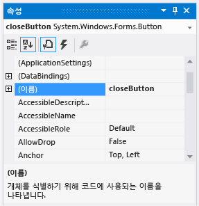

# 6단계: 단추 컨트롤 이름 지정
폼에 **pictureBox1**이라는 PictureBox와 **checkBox1**이라는 CheckBox가 각각 하나씩만 있습니다. 이러한 이름은 해당 컨트롤이 추가될 때 IDE에 의해 자동으로 지정되었습니다. 이제 CheckBox 및 PictureBox를 참조하는 코드를 작성하면 이러한 컨트롤은 하나씩만 있기 때문에 코드에서 **pictureBox1** 또는 **checkBox1** 이 무엇을 의미하는지 알 수 있습니다.  

> [!NOTE]
>  Visual Basic에서는 컨트롤 이름의 첫 글자가 기본적으로 대문자이어야 하기 때문에 **PictureBox1**, **CheckBox1**과 같은 식으로 이름이 지정됩니다.  

 그러나 단추의 경우 IDE에 의해 **button1**, **button2**, **button3**및 **button4**로 이름이 지정된 네 개가 폼에 있는데, 현재 이름만으로 어떤 단추가 **닫기** 단추이고 어떤 단추가 **그림 표시** 단추인지 알 수 없습니다. 따라서 보다 자세한 정보를 주는 단추 컨트롤의 이름을 지정하는 것이 좋습니다.  

 이 항목의 비디오 버전을 보려면 [자습서 1: Visual Basic에서 사진 뷰어 만들기 - 비디오 3](http://go.microsoft.com/fwlink/?LinkId=205213) 또는 [자습서 1: C#에서 사진 뷰어 만들기 - 비디오 3](http://go.microsoft.com/fwlink/?LinkId=205202)을 참조하세요. 이러한 비디오에서는 이전 버전의 Visual Studio를 사용하므로 일부 메뉴 명령과 기타 사용자 인터페이스 요소가 약간 다를 수 있습니다. 그러나 개념 및 절차는 Visual Studio의 현재 버전에서 비슷하게 작동합니다.  

### 단추 컨트롤의 이름을 지정하려면  

1.  폼에서 **닫기** 단추를 선택합니다. (단추가 모두 선택되어 있는 경우 Esc 키를 눌러 선택을 취소합니다.) **(Name)** 속성이 보일 때까지 **속성** 창을 스크롤합니다. 속성이 사전순으로 정렬되어 있는 경우 **(Name)** 속성은 목록의 위쪽에 있습니다. 다음 그림과 같이 이름을 **closeButton**으로 바꿉니다.  

       
closeButton 이름이 있는 속성 창  

    > [!NOTE]
    >  단추 이름을 **closeButton**(close와 Button 사이에 공백이 있음)으로 바꾸려고 하면 "속성 값이 잘못되었습니다."라는 오류 메시지가 나타납니다. 공백을 비롯한 일부 문자는 컨트롤 이름에 사용할 수 없습니다.  

2.  다른 세 단추의 이름을 **backgroundButton**, **clearButton**및 **showButton**으로 바꿉니다. **속성** 창에서 컨트롤 선택기 드롭다운 목록을 선택하면 이름을 확인할 수 있습니다. 새 단추 이름이 표시됩니다.  

3.  폼에서 **그림 표시** 단추를 두 번 클릭합니다. 대신 폼에서 **그림 표시** 단추를 선택한 다음 Enter 키를 선택해도 됩니다. 이렇게 하면 IDE에서 주 창에 **Form1.cs** (Visual Basic을 사용하는 경우**Form1.vb** )라는 탭이 추가로 열립니다. 이 탭에서는 다음 그림에 표시된 것처럼 폼 이면의 코드 파일을 보여 줍니다.  

       
Visual C# 코드가 사용된 Form1.cs 탭  

4.  다음 코드 부분을 중점적으로 살펴봅니다. (Visual Basic을 사용하는 경우 아래의 **VB** 탭을 선택하여 코드의 Visual Basic 버전을 봅니다.)  

     [!code-vb[VbExpressTutorial1Step6#1](../ide/codesnippet/VisualBasic/step-6-name-your-button-controls_1.vb)]
     [!code-csharp[VbExpressTutorial1Step6#1](../ide/codesnippet/CSharp/step-6-name-your-button-controls_1.cs)]  

     `showButton_Click()`이라는 코드를 보고 있습니다. IDE에서는 **showButton** 단추에 대한 코드 파일을 열면 이를 폼 코드에 추가합니다. 디자인 타임에 폼에서 컨트롤에 대한 코드 파일을 열면, 컨트롤에 대한 코드가 아직 없을 경우 이 코드가 생성됩니다. *메서드*라고 하는 이 코드는 프로그램을 실행하고 컨트롤(이 경우 **사진 표시** 단추)을 선택할 때 실행됩니다.  

    > [!NOTE]
    >  이 자습서에서는 괄호 () 사이에 있는 모든 코드를 제거하여 자동으로 생성되는 Visual Basic 코드를 간단하게 만들었습니다. 이러한 코드는 이 동작이 발생할 때마다 제거할 수 있습니다. 프로그램은 둘 중 한 가지 방식으로 작동합니다. 이 자습서의 나머지 부분에서도 자동으로 생성되는 코드가 있으면 가능한 경우 항상 간단하게 만듭니다.  

5.  Windows Forms 디자이너 탭을 다시 선택하고(Visual C#에서는**Form1.cs [디자인]** , Visual Basic에서는 **Form1.vb [디자인]** ) **그림 지우기** 단추용 코드 파일을 열어 폼 코드에 메서드를 만듭니다. 남은 두 단추에 대해 이 작업을 반복합니다. 매번 새 메서드가 폼의 코드 파일에 추가됩니다.  

6.  둘 이상의 메서드를 추가하려면 IDE에서 `checkBox1_CheckedChanged()` 메서드가 추가되도록 Windows Forms 디자이너에서 CheckBox 컨트롤에 대한 코드 파일을 엽니다. 이 메서드는 사용자가 확인란을 선택하거나 선택 취소할 때마다 호출됩니다.  

    > [!NOTE]
    >  프로그램에서 작업할 때 코드 편집기와 Windows Forms 디자이너 사이를 이동하는 경우가 자주 있습니다. IDE를 사용하면 프로젝트 내에서 손쉽게 이동할 수 있습니다. **솔루션 탐색기** 에서 **Form1.cs** (Visual C#) 또는 **Form1.vb** (Visual Basic)를 두 번 클릭하여 Windows Forms 디자이너를 열거나 메뉴 모음에서 **보기**, **디자이너**를 차례로 선택합니다.  

     다음은 코드 편집기에 표시되는 새 코드입니다.  

     [!code-vb[VbExpressTutorial1Step6#2](../ide/codesnippet/VisualBasic/step-6-name-your-button-controls_2.vb)]
     [!code-csharp[VbExpressTutorial1Step6#2](../ide/codesnippet/CSharp/step-6-name-your-button-controls_2.cs)]  

     여기서 추가한 5개의 메서드는 사용자가 단추를 선택하거나 상자를 선택하는 등의 이벤트가 발생할 때마다 호출되므로 *이벤트 처리기*라고 합니다.  

     디자인 타임에 IDE에서 컨트롤에 대한 코드를 볼 때 컨트롤에 대한 이벤트 처리기 메서드가 없을 경우 메서드가 하나 추가됩니다. 예를 들어 단추를 두 번 클릭하면 사용자가 단추를 선택할 때마다 호출되는 Click 이벤트에 대한 이벤트 처리기가 추가되고, 확인란을 두 번 클릭하면 사용자가 상자를 선택하거나 선택 취소할 때마다 호출되는 CheckedChanged 이벤트에 대한 이벤트 처리기가 추가됩니다.  

     컨트롤에 대한 이벤트 처리기를 추가한 후에는 언제든지 컨트롤을 두 번 클릭하거나 메뉴 모음에서 **보기**, **코드**를 선택하여 Windows Forms 디자이너에서 이벤트 처리기로 돌아갈 수 있습니다.  

     프로그램을 빌드할 때는 이름이 중요하므로 이벤트 처리기를 비롯한 메서드에 원하는 이름을 지정할 수 있습니다. IDE를 사용하여 이벤트 처리기를 추가하면 컨트롤 이름과 처리 중인 이벤트를 기반으로 이름이 만들어집니다. 예를 들어 **showButton** 이라는 단추에 대한 Click 이벤트의 이름은 `showButton_Click()` 이벤트 처리기 메서드로 지정됩니다. 또한 일반적으로 메서드 이름 뒤에는 메서드임을 나타내기 위해 여는 괄호와 닫는 괄호 ()가 추가됩니다. 코드 변수 이름을 변경하려고 결정한 경우 코드에서 변수를 마우스 오른쪽 단추로 클릭한 다음 **리팩터링**, **이름 바꾸기**를 선택합니다. 코드에서 해당 변수의 인스턴스 이름이 모두 바뀝니다. 자세한 내용은 [이름 바꾸기 리팩터링](../ide/reference/rename.md)을 참조하세요.

### 계속하거나 검토하려면  

-   다음 자습서 단계로 이동하려면 [7단계: 폼에 대화 상자 구성 요소 추가](../ide/step-7-add-dialog-components-to-your-form.md)를 참조하세요.  

-   이전 자습서 단계로 돌아가려면 [5단계: 폼에 컨트롤 추가](../ide/step-5-add-controls-to-your-form.md)를 참조하세요.
