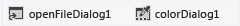

# 7단계: 폼에 대화 상자 구성 요소 추가
[!INCLUDE[vs2017banner](../code-quality/includes/vs2017banner.md)]

이 단계에서, 그림 파일을 열고 배경색을 선택할 수 있도록 프로그램을 설정하려면 **OpenFileDialog** 구성 요소 및 **ColorDialog** 구성 요소를 폼에 추가합니다.  
  
 구성 요소는 몇 가지 점에서 컨트롤과 비슷합니다.  도구 상자를 사용하여 구성 요소를 폼에 추가하고 **속성** 창을 사용하여 구성 요소의 속성을 설정합니다.  그러나 컨트롤과 달리 구성 요소를 폼에 추가할 때는 실제로 폼에 표시되는 항목이 추가되지 않습니다.  대신 코드를 사용하여 트리거할 수 있는 특정 동작이 제공됩니다.  예를 들어 **파일 열기** 대화 상자를 여는 것은 바로 구성 요소입니다.  
  
  이 항목의 비디오 버전을 보려면 [자습서 1: Visual Basic에서 사진 뷰어 만들기 \- 비디오 3](http://go.microsoft.com/fwlink/?LinkId=205213) 또는 [자습서 1: C\#에서 사진 뷰어 만들기 \- 비디오 3](http://go.microsoft.com/fwlink/?LinkId=205202)을 참조하십시오.  이러한 비디오에서는 이전 버전의 Visual Studio를 사용하므로 일부 메뉴 명령과 기타 사용자 인터페이스 요소가 약간 다를 수 있습니다.  그러나 개념 및 절차는 Visual Studio의 현재 버전에서 비슷하게 작동합니다.  
  
### 폼에 대화 상자 구성 요소를 추가하려면  
  
1.  Windows Forms 디자이너\(Form1.cs \[디자인\] 또는 Form1.vb \[디자인\]\)를 선택하고 도구 상자에서 **대화 상자** 그룹을 엽니다.  
  
    > [!NOTE]
    >  도구 상자의 **대화 상자** 그룹에는 파일을 열거나 닫고, 폴더를 찾아보고, 글꼴과 색을 선택하는 데 사용할 수 있는 많은 유용한 대화 상자를 여는 구성 요소가 있습니다.  이 프로젝트에서는 **OpenFileDialog**와 **ColorDialog**라는 두 개의 구성 요소를 사용합니다.  
  
2.  **openFileDialog1**이라는 구성 요소를 폼에 추가하려면 **OpenFileDialog**를 두 번 클릭합니다.  **colorDialog1**이라는 구성 요소를 폼에 추가하려면 도구 상자에서 **ColorDialog**를 두 번 클릭합니다. 다음 자습서 단계에서는 이 구성 요소가 사용됩니다. Windows Forms 디자이너의 맨 아래\(사진 뷰어 폼 바로 아래\)에서 다음 그림과 같이 두 대화 상자 구성 요소 각각에 대한 아이콘이 포함된 영역을 볼 수 있습니다.  
  
       
대화 상자 구성 요소  
  
3.  Windows Forms 디자이너 아래쪽의 이 영역에서 **openFileDialog1** 아이콘을 선택합니다.  다음 두 가지 속성을 설정합니다.  
  
    -   다음과 같이 **Filter** 속성을 설정합니다\(복사하여 붙여 넣을 수 있음\).  
  
        ```  
        JPEG Files (*.jpg)|*.jpg|PNG Files (*.png)|*.png|BMP Files (*.bmp)|*.bmp|All files (*.*)|*.*  
        ```  
  
    -   **Title** 속성을 그림 파일 선택으로 설정합니다.  
  
         **Filter** 속성 설정은 **그림 선택** 파일 대화 상자에 표시되는 파일 형식을 지정합니다.  
  
    > [!NOTE]
    >  다른 응용 프로그램에서 **파일 열기** 대화 상자의 예제를 보려면 메모장이나 그림판을 열고 메뉴 모음에서 **파일**, **열기**를 선택합니다.  맨 아래에 있는 **파일 형식** 드롭다운 목록을 살펴봅니다.  이러한 값은 단순히 **OpenFileDialog** 구성 요소의 **Filter** 속성을 사용하여 설정했습니다.  또한 **속성** 창에서 굵게 표시된 **Title** 및 **Filter** 속성도 살펴봅니다.  IDE에서는 굵은 글꼴을 사용하여 기본값에서 변경된 속성을 표시합니다.  
  
### 계속하거나 검토하려면  
  
-   다음 자습서 단계로 이동하려면 [8단계: 그림 단추 이벤트 처리기 표시를 위한 코드 작성](../ide/step-8-write-code-for-the-show-a-picture-button-event-handler.md)을 참조하십시오.  
  
-   이전 자습서 단계로 돌아가려면 [6단계: 단추 컨트롤 이름 지정](../ide/step-6-name-your-button-controls.md)을 참조하십시오.