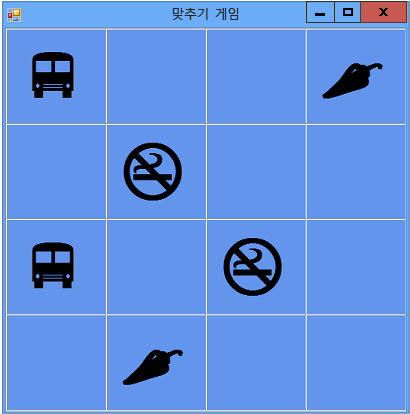

# <a name="step-7-keep-pairs-visible"></a>7단계: 쌍 표시
플레이어가 서로 일치하지 않는 아이콘 쌍을 선택하는 경우 게임이 제대로 실행됩니다. 그러나 일치하는 쌍을 선택할 경우에는 어떻게 되는지 고려해야 합니다. 타이머를 설정(<xref:System.Windows.Forms.Timer.Start> 메서드 사용)하여 아이콘이 사라지게 하는 대신 `firstClicked` 및 `secondClicked` 참조 변수를 사용하여 선택한 두 레이블의 색을 다시 설정하는 것이 아니라 레이블을 더 이상 추적하지 않도록 게임 자체를 다시 설정해야 합니다.  

## <a name="to-keep-pairs-visible"></a>쌍을 표시하려면  

1.  타이머를 시작하는 문 바로 위의 거의 코드 끝부분에서 `if` 이벤트 처리기 메서드에 다음 `label_Click()` 문을 추가합니다. 프로그램에 추가하는 동안 코드를 자세히 검토하고 코드가 어떻게 실행되는지 살펴보세요.  

     [!code-csharp[VbExpressTutorial4Step7#9](../ide/codesnippet/CSharp/step-7-keep-pairs-visible_1.cs)]
     [!code-vb[VbExpressTutorial4Step7#9](../ide/codesnippet/VisualBasic/step-7-keep-pairs-visible_1.vb)]  
  
     방금 추가한 `if` 문의 첫 번째 줄은 플레이어가 선택하는 첫 번째 레이블의 아이콘이 두 번째 레이블의 아이콘과 같은지 여부를 검사합니다. 두 아이콘이 일치하는 경우 중괄호 사이의 세 문(C#의 경우) 또는 `if` 문 내의 세 문(Visual Basic의 경우)이 실행됩니다. 처음 두 문은 `firstClicked` 및 `secondClicked` 참조 변수를 다시 설정하여 레이블을 더 이상 추적하지 않도록 합니다. 타이머의 <xref:System.Windows.Forms.Timer.Tick> 이벤트 처리기에서 이러한 두 문을 인식할 수 있습니다. 세 번째 문은 프로그램에서 메서드의 나머지 문을 실행하지 않고 건너뛰도록 지시하는 `return` 문입니다.  
  
     Visual C# 프로그래밍의 경우 코드 일부에서는 단일 등호(`=`)가 사용되고 다른 문에서는 이중 등호(`==`)가 사용되는 것을 알 수 있습니다. 일부 상황에서는 `=`가 사용되지만 다른 상황에서는 `==`가 사용되는 이유를 알아야 합니다.  

     다음은 이러한 차이를 보여주는 좋은 예제입니다. `if` 문에서 괄호 사이의 코드를 주의 깊게 살펴보세요.  

    ```vb  
    firstClicked.Text = secondClicked.Text  
    ```  

    ```csharp  
    firstClicked.Text == secondClicked.Text  
    ```  

     그런 다음 `if` 문 뒤에 나오는 코드 블록에서 첫 번째 문을 검토하세요.  

    ```vb  
    firstClicked = Nothing  
    ```  

    ```csharp  
    firstClicked = null;  
    ```  

     이러한 두 문 중 첫 번째 문은 두 아이콘이 같은지 여부를 검사합니다. 두 값이 비교되므로 Visual C# 프로그램에서 `==` 같음 연산자를 사용합니다. 두 번째 문은 실제로 값을 변경(*할당*)하고 `firstClicked` 참조 변수를 `null`로 설정하여 다시 설정합니다. 이 때문에 `=` 할당 연산자가 대신 사용됩니다. Visual C#에서는 `=` 기호를 사용하여 값을 설정하고 `==` 기호를 사용하여 값을 비교합니다. Visual Basic에서는 변수 할당과 비교에 둘 다 `=` 기호를 사용합니다.  
  
2.  프로그램을 저장하고 실행한 뒤 폼에서 아이콘 선택을 시작합니다. 일치하지 않는 쌍을 선택하면 타이머의 Tick 이벤트가 트리거되고 두 아이콘이 모두 사라집니다. 일치하는 쌍을 선택할 경우에는 새 `if` 문이 실행되고 return 문은 메서드가 타이머를 시작하는 코드를 건너뛰게 하므로 다음 그림과 같이 아이콘이 계속 표시됩니다.  
  
       
아이콘 쌍이 표시된 **일치 게임**  
  
## <a name="to-continue-or-review"></a>계속하거나 검토하려면  
  
-   다음 자습서 단계로 이동하려면 [8단계: 게임 플레이어가 이겼는지 여부를 확인하는 메서드 추가](../ide/step-8-add-a-method-to-verify-whether-the-player-won.md)를 참조하세요.  
  
-   이전 자습서 단계로 돌아가려면 [6단계: 타이머 추가](../ide/step-6-add-a-timer.md)를 참조하세요.
