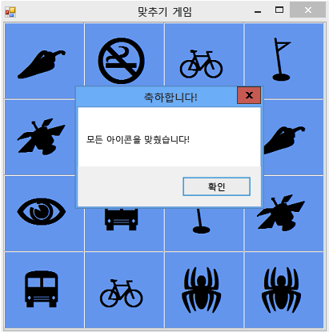

# 8단계: 게임 플레이어가 이겼는지 여부를 확인하는 메서드 추가
재미있는 게임을 만들었지만 이를 마무리하려면 추가 항목이 필요합니다. 플레이어가 이기면 게임이 끝나야 하므로 `CheckForWinner()` 메서드를 추가하여 플레이어가 이겼는지 여부를 확인해야 합니다.  

### 플레이어가 게임에 이겼는지 여부를 확인하기 위해 메서드를 추가하려면  

1.  다음 코드와 같이 코드 아래쪽 `CheckForWinner()` 이벤트 처리기 아래에 `timer1_Tick()` 메서드를 추가합니다.  

     [!code-csharp[VbExpressTutorial4Step8#10](../ide/codesnippet/CSharp/step-8-add-a-method-to-verify-whether-the-player-won_1.cs)]
     [!code-vb[VbExpressTutorial4Step8#10](../ide/codesnippet/VisualBasic/step-8-add-a-method-to-verify-whether-the-player-won_1.vb)]  

     이 메서드는 다른 `foreach` 루프(Visual C#의 경우) 또는 `For Each` 루프(Visual Basic의 경우)를 사용하여 TableLayoutPanel의 각 레이블을 하나씩 처리합니다. 이 루프에서는 같음 연산자(Visual C#의 `==` 및 Visual Basic의 경우 `=`)를 사용하여 각 레이블의 아이콘 색을 검사한 후 배경과 일치하는지 여부를 확인합니다. 색이 일치하면 아이콘이 표시되지 않은 상대로 유지되고 플레이어가 남아 있는 아이콘 중 일부를 찾지 않았습니다. 이 경우 프로그램에서는 `return` 문을 사용하여 메서드의 나머지 부분을 건너뜁니다. 루프에서 `return` 문을 실행하지 않고 모든 레이블을 차례로 처리하면 폼의 모든 아이콘이 일치되었음을 의미합니다. 그러면 프로그램에서 플레이어에게 게임에 이긴 것을 축하하는 내용의 MessageBox를 표시한 다음, 폼의 `Close()` 메서드를 호출하여 게임을 끝냅니다.  

2.  다음에는 레이블의 Click 이벤트 처리기에서 새 `CheckForWinner()` 메서드를 호출하도록 합니다. 프로그램에서는 플레이어가 선택하는 두 번째 아이콘을 표시한 후 바로 승자 여부를 검사해야 합니다. 두 번째 선택한 아이콘의 색을 설정하는 줄을 찾은 후, 다음 코드와 같이 바로 그 뒤에서 `CheckForWinner()` 메서드를 호출합니다.  

     [!code-csharp[VbExpressTutorial4Step8#11](../ide/codesnippet/CSharp/step-8-add-a-method-to-verify-whether-the-player-won_2.cs)]
     [!code-vb[VbExpressTutorial4Step8#11](../ide/codesnippet/VisualBasic/step-8-add-a-method-to-verify-whether-the-player-won_2.vb)]  

3.  프로그램을 저장하고 실행합니다. 게임을 진행하고 일치하는 아이콘을 모두 찾습니다. 게임에 이기면 프로그램에서 다음 그림과 같은 축하 MessageBox를 표시한 후 상자를 닫습니다.  

       
MessageBox가 표시된 일치 게임  

### 계속하거나 검토하려면  

-   다음 자습서 단계로 이동하려면 [9단계: 기타 기능 사용](../ide/step-9-try-other-features.md)를 참조하세요.  

-   이전 자습서 단계로 돌아가려면 [7단계: 쌍 표시](../ide/step-7-keep-pairs-visible.md)를 참조하세요.
