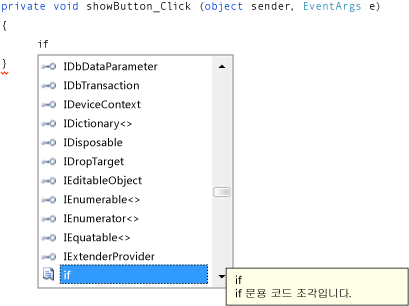

# 8단계: 사진 표시 단추 이벤트 처리기를 위한 코드 작성
이 단계에서는 **사진 표시** 단추가 다음과 같이 작동하도록 합니다.  

-   사용자가 해당 단추를 선택하면 프로그램이 <xref:System.Windows.Forms.OpenFileDialog> 상자를 엽니다.  
  
-   사용자가 사진 파일을 열면 프로그램의 <xref:System.Windows.Forms.PictureBox>에 해당 사진이 표시됩니다.  
  
 IDE에는 코드 작성에 유용한 IntelliSense라는 강력한 도구가 있습니다. 코드 입력을 시작하면 입력한 부분 단어에 대한 완성 단어를 제시하는 상자가 IDE에서 열립니다. IntelliSense는 사용자가 다음에 할 일을 판단하며 목록에서 사용자가 마지막으로 선택한 항목으로 자동으로 이동합니다. 위쪽 또는 아래쪽 화살표를 사용하여 목록에서 이동하거나 문자를 계속 입력하여 선택 범위를 좁힐 수 있습니다. 원하는 선택 항목이 있으면 **Tab** 키를 선택해서 항목을 선택합니다. 원하는 항목이 없는 경우 제시되는 항목을 무시할 수도 있습니다.  
  
 이 항목의 비디오 버전을 보려면 [Tutorial 1: Create a picture viewer in Visual Basic - Video 4](http://go.microsoft.com/fwlink/?LinkId=205215)(자습서 1: Visual Basic에서 사진 뷰어 만들기 - 비디오 4) 또는 [Tutorial 1: Create a picture viewer in C# - Video 4](http://go.microsoft.com/fwlink/?LinkId=205203)(자습서 1: C#에서 사진 뷰어 만들기 - 비디오 4)를 참조하세요. 이러한 비디오에서는 이전 버전의 Visual Studio를 사용하므로 일부 메뉴 명령과 기타 사용자 인터페이스 요소가 약간 다를 수 있습니다. 그러나 개념 및 절차는 Visual Studio의 현재 버전에서 비슷하게 작동합니다.  
  
## 사진 표시 단추 이벤트 처리기를 위한 코드를 작성하려면  
  
1.  **Windows Forms 디자이너**로 이동하여 **사진 표시** 단추를 두 번 클릭합니다. IDE는 즉시 코드 디자이너로 이동하여 사용자가 이전에 추가한 `showButton_Click()` 메서드 내부로 커서를 이동합니다.  
  
2.  두 중괄호 `{ }` 사이의 빈 줄에 `i`를 입력합니다. Visual Basic의 경우 `Private Sub...`와 `End Sub` 사이의 빈 줄에 입력합니다. 다음 그림과 같이 **IntelliSense** 창이 열립니다.  
  
       
Visual C# 코드가 사용된 **IntelliSense**  
  
3.  **IntelliSense** 창에 단어 `if`가 강조 표시됩니다. 강조 표시되지 않을 경우 소문자 `f`를 입력하면 강조 표시됩니다. **IntelliSense** 창 옆에 작은 *도구 설명* 상자가 설명 **if 문용 코드 조각**과 함께 나타납니다. Visual Basic의 도구 설명에도 코드 조각임이 표시되지만 표현은 약간 다릅니다. 해당 코드 조각을 사용해야 하므로 **Tab** 키를 선택해서 `if`를 코드에 삽입합니다. 그런 다음, **코드 조각을 사용하려면**Tab`if` 키를 다시 선택합니다. 다른 곳을 선택하여 **IntelliSense** 창이 사라진 경우 백스페이스로 `i`를 지우고 다시 입력하면 **IntelliSense** 창이 다시 열립니다.  
  
       
Visual C# 코드  

4.  다음으로, IntelliSense를 사용하여 코드를 더 입력하면 **파일 열기** 대화 상자가 열립니다. 사용자가 **확인** 단추를 선택하면 PictureBox에서 사용자가 선택한 파일을 로드합니다. 다음 단계에서는 코드를 입력하는 방법을 보여줍니다. 단계 수는 많지만 키 입력은 몇 번뿐입니다.  

    1.  코드 조각에서 선택된 텍스트 **true**로 이동합니다. `op`를 입력하여 이 단어를 덮어씁니다. Visual Basic에서는 첫 문자가 대문자이므로 `Op`를 입력합니다.  
  
    2.  **IntelliSense** 창이 열리고 **openFileDialog1**이 표시됩니다. 선택하려면 **Tab** 키를 선택합니다. Visual Basic에서는 첫 문자가 대문자이므로 **OpenFileDialog1**이 표시됩니다. **OpenFileDialog1**이 선택되었는지 확인합니다.  
  
         `OpenFileDialog`에 대한 자세한 내용은 [OpenFileDialog](http://msdn.microsoft.com/library/system.windows.forms.openfiledialog.aspx)를 참조하세요.  
  
    3.  마침표(`.`)를 입력합니다. 프로그래머들은 마침표를 점으로 지칭하는 경우가 많습니다. **openFileDialog1** 바로 다음에 점을 입력했으므로 모든 **OpenFileDialog** 구성 요소의 속성과 메서드가 포함된 **IntelliSense** 창이 열립니다. 이 속성은 **Windows Forms 디자이너**에서 선택할 경우 **속성** 창에 표시되는 것과 같습니다. 또한 구성 요소에 대화 상자 열기와 같은 작업을 지시할 수 있는 메서드를 선택할 수도 있습니다.  
  
        > [!NOTE]
        >  **IntelliSense** 창에는 속성과 메서드가 모두 표시될 수 있습니다. 표시되는 항목을 확인하려면 **IntelliSense** 창의 각 항목 왼쪽에 있는 아이콘을 봅니다. 각 메서드 옆에는 벽돌 그림이, 각 속성 옆에는 렌치(또는 스패너) 그림이 표시됩니다. 또한 각 이벤트 옆에는 번개 모양 아이콘이 표시됩니다. 이러한 그림은 다음과 같습니다.  

           
**메서드** 아이콘  
  
           
**속성** 아이콘  
  
           
**이벤트** 아이콘  
  
    4.  `ShowDialog` 입력을 시작합니다(IntelliSense에서 대문자 표시는 중요하지 않음). `ShowDialog()` 메서드에서 **파일 열기** 대화 상자를 표시합니다. 창에서 **ShowDialog**가 강조 표시된 후 **Tab** 키를 선택합니다. “ShowDialog”를 강조 표시하고 **F1** 키를 선택하여 도움말을 표시할 수도 있습니다.  
  
         `ShowDialog()` 메서드에 대한 자세한 내용은 [ShowDialog Method](http://msdn.microsoft.com/library/c7ykbedk.aspx)(ShowDialog 메서드)를 참조하세요.  

    5.  컨트롤 또는 구성 요소에서 메서드를 사용할 경우(*메서드 호출*이라고 함) 괄호를 추가해야 합니다. 따라서 `ShowDialog`: `()`에서 “g” 바로 다음에 열기와 닫기 괄호를 입력합니다. 이제 “openFileDialog1.ShowDialog()”처럼 보여야 합니다.  

        > [!NOTE]
        >  메서드는 모든 프로그램에서 중요한 부분이며 이 자습서에는 여러 가지 메서드 사용 방법이 나와 있습니다. **OpenFileDialog** 구성 요소의 `ShowDialog()` 메서드를 호출한 것과 같이 구성 요소의 메서드를 호출하여 작업을 지시할 수 있습니다. 직접 고유의 메서드를 만들어 프로그램에 작업을 지시할 수 있습니다. 사용자가 단추를 선택할 경우 대화 상자와 그림을 열도록 지금 빌드 중인 `showButton_Click()` 메서드가 그 예입니다.  

    6.  Visual C#의 경우 공백을 추가하고 두 개의 등호(`==`)를 추가합니다. Visual Basic의 경우 공백을 추가하고 하나의 등호(`=`)를 사용합니다. Visual C#과 Visual Basic에서 사용되는 같음 연산자는 다릅니다.  
  
    7.  공백을 하나 더 추가합니다. 그러면 바로 다른 **IntelliSense** 창이 열립니다. `DialogResult` 입력을 시작하고 **Tab** 키를 선택하여 추가합니다.  
  
        > [!NOTE]
        >  메서드를 호출하기 위한 코드를 작성할 때 값이 반환되는 경우가 있습니다. 이 경우 **OpenFileDialog** 구성 요소의 <xref:System.Windows.Forms.CommonDialog.ShowDialog> 메서드는 <xref:System.Windows.Forms.DialogResult> 값을 반환합니다. DialogResult는 대화 상자에서 수행된 작업을 알려 주는 특수 값입니다. **OpenFileDialog** 구성 요소에서 사용자가 **확인** 또는 **취소**를 선택하면 `ShowDialog()` 메서드가 `DialogResult.OK` 또는 `DialogResult.Cancel`을 반환합니다.  
  
    8.  점을 입력하여 DialogResult 값 **IntelliSense** 창을 엽니다. 문자 `O`를 입력하고 **Tab** 키를 선택하여 **OK**를 삽입합니다.  
  
         DialogResult에 대한 자세한 내용은 [DialogResult](http://msdn.microsoft.com/library/system.windows.forms.dialogresult.aspx)를 참조하세요.  

        > [!NOTE]
        >  그러면 첫 번째 코드 줄이 완성됩니다. Visual C#의 경우 다음과 같이 됩니다.  
        >   
        >  `if (openFileDialog1.ShowDialog() == DialogResult.OK)`  
        >   
        >  Visual Basic의 경우 다음과 같이 됩니다.  
        >   
        >  `If OpenFileDialog1.ShowDialog() = DialogResult.OK Then`  

    9. 이제 코드 한 줄을 추가합니다. 입력하거나 복사하여 붙여넣을 수 있지만 IntelliSense를 사용하여 추가해 보세요. IntelliSense에 익숙할수록 코드를 더 빠르게 작성할 수 있습니다. 최종 `showButton_Click()` 메서드는 다음과 같습니다. Visual Basic 버전의 코드를 보려면 **VB** 탭을 선택합니다.  

         [!code-csharp[VbExpressTutorial1Step8#1](../ide/codesnippet/CSharp/step-8-write-code-for-the-show-a-picture-button-event-handler_1.cs)]
         [!code-vb[VbExpressTutorial1Step8#1](../ide/codesnippet/VisualBasic/step-8-write-code-for-the-show-a-picture-button-event-handler_1.vb)]  

## 계속하거나 검토하려면  
  
-   다음 자습서 단계로 이동하려면 [9단계: 코드 검토, 주석 처리 및 테스트](../ide/step-9-review-comment-and-test-your-code.md)를 참조하세요.  
  
-   이전 자습서 단계로 돌아가려면 [7단계: 폼에 대화 상자 구성 요소 추가](../ide/step-7-add-dialog-components-to-your-form.md)를 참조하세요.
