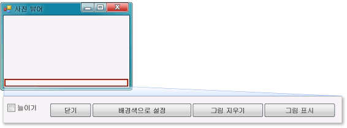

# <a name="step-9-review-comment-and-test-your-code"></a>9단계: 코드 검토, 주석 처리 및 테스트
다음으로 코드에 주석을 추가합니다. 주석은 프로그램 동작에 영향을 주지 않는 일종의 메모로서 코드를 읽는 사용자가 코드에서 수행하는 작업을 보다 쉽게 이해할 수 있도록 도와줍니다. 코드에 주석을 추가하는 것은 좋은 습관입니다. Visual C#에서는 두 개의 슬래시(//)를 사용하여 주석 줄을 표시하고, Visual Basic에서는 작은따옴표(')를 사용하여 주석 줄을 표시합니다. 주석을 추가한 후에는 프로그램을 테스트합니다. 프로젝트에서 작업하는 동안 자주 코드를 실행하고 테스트하는 것은 좋은 습관이며, 코드가 더 복잡해지기 전에 조기에 문제를 파악하고 해결할 수 있습니다. 이를 *반복적 테스트*라고 합니다.  
  
 이제 아직 완성되지는 않았지만 그림을 로드할 수 있는 프로그램이 빌드되었습니다. 코드에 주석을 추가하고 테스트하려면 먼저 이러한 작업에 자주 사용될 다음과 같은 코드 개념을 알아야 합니다.  
  
-   Windows Forms 디자이너에서 **그림 표시** 단추를 두 번 클릭하면 IDE에서 자동으로 *메서드*를 프로그램의 코드에 추가합니다.  
  
-   메서드는 코드 구성 방법, 즉 코드 그룹화 방법을 결정합니다.  
  
-   대부분의 경우 메서드는 특정 순서로 적은 수의 작업을 수행합니다. 예를 들어 `showButton_Click()` 메서드는 대화 상자를 연 다음 그림을 로드합니다.  
  
-   메서드는 코드*문* 또는 코드 줄로 구성됩니다. 메서드는 여러 개의 코드 문을 하나로 묶는 기능으로 간주될 수 있습니다.  
  
-   메서드가 실행되거나 *호출*되면 해당 메서드의 문이 첫 번째 문부터 차례대로 실행됩니다.  
  
     다음은 문의 예제입니다.  
  
    ```csharp  
    pictureBox1.Load(openFileDialog1.FileName);  
    ```  
  
    ```vb  
    pictureBox1.Load(openFileDialog1.FileName)  
    ```  
  
     문은 특정 작업을 수행하도록 프로그램에 지시합니다. Visual C#에서는 문이 항상 세미콜론으로 끝나고, Visual Basic에서는 줄의 끝이 문의 끝입니다. Visual Basic에서는 세미콜론이 필요하지 않습니다. 위의 문은 사용자가 **OpenFileDialog** 구성 요소를 사용하여 선택한 파일을 로드하도록 `PictureBox` 컨트롤에 지시합니다.  
  
 이 항목의 비디오 버전을 보려면 [자습서 1: Visual Basic에서 사진 뷰어 만들기 - 비디오 5](http://go.microsoft.com/fwlink/?LinkId=205216) 또는 [자습서 1: C#에서 사진 뷰어 만들기 - 비디오 5](http://go.microsoft.com/fwlink/?LinkId=205206)를 참조하세요. 이러한 비디오에서는 이전 버전의 Visual Studio를 사용하므로 일부 메뉴 명령과 기타 사용자 인터페이스 요소가 약간 다를 수 있습니다. 그러나 개념 및 절차는 Visual Studio의 현재 버전에서 비슷하게 작동합니다.  
  
### <a name="to-add-comments"></a>주석을 추가하려면  
  
1.  다음 주석을 코드에 추가합니다.  
  
     [!code-vb[VbExpressTutorial1Step9_10#1](../ide/codesnippet/VisualBasic/step-9-review-comment-and-test-your-code_1.vb)]
     [!code-csharp[VbExpressTutorial1Step9_10#1](../ide/codesnippet/CSharp/step-9-review-comment-and-test-your-code_1.cs)]  
  
    > [!NOTE]
    >  이제 **showButton** 단추의 Click 이벤트 처리기가 완성되어 작동합니다. `if` 문으로 시작하는 코드 작성을 시작했습니다. `if` 문은 "한 가지 사항을 확인하고 true일 경우 해당 작업을 수행"하라고 프로그램에 지시합니다. 이 자습서에서는 **파일 열기** 대화 상자를 연 다음 사용자가 파일을 선택하고 **확인** 단추를 선택하면 PictureBox에 파일을 로드하도록 프로그램에 지시합니다.  
  
    > [!TIP]
    >  IDE는 사용자가 코드를 손쉽게 작성할 수 있도록 하기 위한 것으로, *코드 조각*이라는 기능을 제공합니다. 조각은 작은 코드 블록으로 확장되는 바로 가기입니다.  
    >   
    >  사용 가능한 모든 코드 조각을 볼 수 있습니다. 메뉴 모음에서 **도구**, **코드 조각 관리자**를 차례로 선택합니다. Visual C#의 경우 `if` 코드 조각이 **Visual C#** 에 있습니다. Visual Basic의 경우 `if` 코드 조각이 **조건 및 루프**, **코드 패턴**에 있습니다. 이 관리자를 사용하여 기존 조각을 찾거나 사용자 고유의 조각을 추가할 수 있습니다.  
    >   
    >  코드를 입력할 때 코드 조각을 활성화하려면 코드를 입력하고 Tab 키를 선택합니다. **IntelliSense** 창에 여러 코드 조각이 표시되므로 Tab 키를 두 번 선택해야 하는데, 첫 번째는 **IntelliSense** 창에서 코드 조각을 선택하기 위한 것이고 두 번째는 이 코드 조각을 사용하도록 IDE에 지시하기 위한 것입니다. IntelliSense에서는 `if` 조각은 지원하지만 `ifelse` 조각은 지원하지 않습니다.  
  
2.  프로그램을 실행하기 전에 다음과 같은 **모두 저장** 도구 모음 단추를 선택하여 프로그램을 저장합니다.  
  
       
모두 저장 단추  
  
     또는 메뉴 모음에서 **파일**, **모두 저장**을 차례로 선택하여 프로그램을 저장합니다. 프로그램은 초기에 자주 저장하는 것이 좋습니다.  
  
     실행 중인 프로그램은 다음과 같습니다.  
  
       
Picture Viewer  
  
### <a name="to-test-your-program"></a>프로그램을 테스트하려면  
  
1.  F5 키를 선택하거나 **디버깅 시작** 도구 모음 단추를 선택합니다.  
  
2.  **그림 표시** 단추를 선택하여 방금 작성한 코드를 실행합니다. 프로그램에서 **파일 열기** 대화 상자가 열립니다. 대화 상자의 맨 아래에 있는 **파일 형식** 드롭다운 목록에 사용자의 필터가 있는지 확인합니다. 그런 다음 그림을 찾아서 엽니다. 일반적으로 **내 문서** 폴더의 **My Pictures\Sample Pictures** 폴더에서 Windows 운영 체제와 함께 제공되는 샘플 그림을 찾을 수 있습니다.  
  
    > [!NOTE]
    >  **그림 파일 선택** 대화 상자에 이미지가 표시되지 않는 경우 대화 상자 오른쪽 아래에 있는 드롭다운 목록에서 "모든 파일(*.\*)" 필터가 선택되어 있는지 확인하십시오.  
  
3.  그림을 로드합니다. 로드된 그림은 PictureBox에 표시됩니다. 그런 다음 폼 테두리를 끌어서 폼 크기를 조정해 봅니다. 자동으로 폼 안에 도킹되는 TableLayoutPanel 안에 PictureBox가 도킹되기 때문에 그림 영역은 폼과 같은 너비로 폼의 위쪽 90퍼센트를 차지하도록 크기가 조정됩니다. TableLayoutPanel 및 FlowLayoutPanel 컨테이너를 사용하는 것은 바로 이러한 이유 때문입니다. 이러한 컨테이너는 사용자가 폼의 크기를 조정할 때 폼의 크기가 올바로 조정되도록 합니다.  
  
     지금은 더 큰 사진이 사진 뷰어 프로그램 테두리 밖으로 나갑니다. 다음 단계에서는 그림을 창 크기에 맞추는 코드를 추가합니다.  
  
### <a name="to-continue-or-review"></a>계속하거나 검토하려면  
  
-   다음 자습서 단계로 이동하려면 [10단계: 추가 단추 및 확인란의 코드 작성](../ide/step-10-write-code-for-additional-buttons-and-a-check-box.md)을 참조하세요.  
  
-   이전 자습서 단계로 돌아가려면 [8단계: 그림 단추 이벤트 처리기 표시를 위한 코드 작성](../ide/step-8-write-code-for-the-show-a-picture-button-event-handler.md)을 참조하세요.