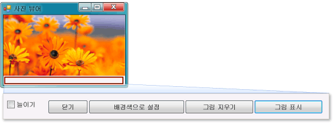

# 자습서 1: 사진 뷰어 만들기
이 자습서에서는 파일에서 그림을 로드하여 창에 표시하는 프로그램을 빌드합니다. 또한 단추와 그림 상자 같은 컨트롤을 폼으로 끌어서 놓고, 이러한 컨트롤의 속성을 설정하고, 컨테이너를 사용하여 폼의 크기를 자연스럽게 조정하는 방법에 대해 배우고 코드 작성을 시작합니다. 여기에서는 다음과 같은 작업을 수행하는 방법에 대해 배우게 됩니다.  
  
-   새 프로젝트를 만듭니다.  
  
-   응용 프로그램을 테스트(디버깅)합니다.  
  
-   확인란과 단추 같은 기본 컨트롤을 폼에 추가합니다.  
  
-   레이아웃을 사용하여 폼에 컨트롤을 배치합니다.  
  
-   폼에 **파일 열기** 및 **색** 대화 상자를 추가합니다.  
  
-   IntelliSense 및 코드 조각을 사용하여 코드를 작성합니다.  
  
-   이벤트 처리기 메서드를 작성합니다.  
  
 자습서 실행이 끝나면 프로그램이 다음 그림과 같이 만들어집니다.  
  
   
이 자습서에서 만드는 사진  
  
 샘플의 전체 버전을 다운로드하려면 [전체 사진 뷰어 자습서 샘플](http://code.msdn.microsoft.com/Complete-Picture-Viewer-7d91d3a8)을 참조하세요.  
  
 이 항목의 비디오 버전을 보려면 [How Do I: Create a Picture Viewer in Visual Basic?](http://go.microsoft.com/fwlink/?LinkId=205207)(방법: Visual Basic에서 사진 뷰어 만들기) 또는 [How Do I: Create a Picture Viewer in C#?](http://go.microsoft.com/fwlink/?LinkId=205198)(방법: C#에서 사진 뷰어 만들기)를 참조하세요.  
  
> [!NOTE]
>  이러한 비디오에서는 이전 버전의 Visual Studio를 사용하므로 일부 메뉴 명령과 기타 사용자 인터페이스 요소가 약간 다를 수 있습니다. 그러나 개념 및 절차는 Visual Studio의 현재 버전에서 비슷하게 작동합니다. 이 자습서에는 Visual C#과 Visual Basic이 둘 다 설명되어 있으므로 사용 중인 프로그래밍 언어와 관련된 정보를 참조하십시오.  
>   
>  Visual Basic의 코드를 보려면 코드 블록의 맨 위에 있는 **VB** 탭을 선택하고 Visual C#의 코드를 보려면 **C#** 탭을 선택합니다. Visual C++에 대한 자세한 내용은 [시작](../ide/getting-started-with-cpp-in-visual-studio.md) 및 [C++ Language Tutorial](http://www.cplusplus.com/doc/tutorial/)(C++ 언어 자습서)를 참조하세요.  
>   
>  Visual C# 또는 Visual Basic UWP 앱을 작성하는 방법을 알아보려면 [UWP 앱 빌드](https://developer.microsoft.com/windows/apps)를 참조하세요.
  
## 관련 항목  
  
|제목|설명|  
|-----------|-----------------|  
|[1단계: Windows Forms 응용 프로그램 프로젝트 만들기](../ide/step-1-create-a-windows-forms-application-project.md)|먼저 Windows Forms 응용 프로그램 프로젝트를 만듭니다.|  
|[2단계: 프로그램 실행](../ide/step-2-run-your-program.md)|이전 단계에서 만든 Windows Forms 응용 프로그램 프로젝트를 실행합니다.|  
|[3단계: 폼 속성 설정](../ide/step-3-set-your-form-properties.md)|**속성** 창을 사용하여 폼의 모양을 변경합니다.|  
|[4단계: TableLayoutPanel 컨트롤을 사용하여 폼 레이아웃](../ide/step-4-lay-out-your-form-with-a-tablelayoutpanel-control.md)|폼에 `TableLayoutPanel` 컨트롤을 추가합니다.|  
|[5단계: 폼에 컨트롤 추가](../ide/step-5-add-controls-to-your-form.md)|`PictureBox` 컨트롤 및 `CheckBox` 컨트롤과 같은 컨트롤을 폼에 추가합니다. 폼에 단추를 추가합니다.|  
|[6단계: 단추 컨트롤 이름 지정](../ide/step-6-name-your-button-controls.md)|단추의 이름을 더 의미 있는 이름으로 변경합니다.|  
|[7단계: 폼에 대화 상자 구성 요소 추가](../ide/step-7-add-dialog-components-to-your-form.md)|**OpenFileDialog** 구성 요소와 **ColorDialog** 구성 요소를 폼에 추가합니다.|  
|[8단계: 그림 단추 이벤트 처리기 표시를 위한 코드 작성](../ide/step-8-write-code-for-the-show-a-picture-button-event-handler.md)|IntelliSense 도구를 사용하여 코드를 작성합니다.|  
|[9단계: 코드 검토, 주석 처리 및 테스트](../ide/step-9-review-comment-and-test-your-code.md)|코드를 검토하고 테스트합니다. 필요한 경우 주석을 추가합니다.|  
|[10단계: 추가 단추 및 확인란의 코드 작성](../ide/step-10-write-code-for-additional-buttons-and-a-check-box.md)|IntelliSense를 사용하여 다른 단추와 확인란이 작동하도록 코드를 작성합니다.|  
|[11단계: 프로그램 실행 및 기타 기능 사용](../ide/step-11-run-your-program-and-try-other-features.md)|프로그램을 실행하고 배경색을 설정합니다. 색, 글꼴 및 테두리 변경과 같은 다른 기능을 사용해 봅니다.|