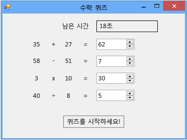

# 자습서 2: 시간이 지정된 수학 퀴즈 만들기
이 자습서에서는 퀴즈를 푸는 사람이 지정된 시간 내에 네 가지 난수 산술 문제에 대답해야 하는 퀴즈를 빌드합니다. 여기에서는 다음과 같은 작업을 수행하는 방법에 대해 배우게 됩니다.  

-   `Random` 클래스를 사용하여 난수를 생성합니다.  

-   **Timer** 컨트롤을 사용하여 이벤트가 특정 시간에 발생하도록 이벤트를 트리거합니다.  

-   `if else` 문을 사용하여 프로그램 흐름을 제어합니다.  

-   코드에서 기본 산술 연산을 수행합니다.  

 자습서를 완료하면 숫자가 다른 것을 제외하면 퀴즈가 다음 그림과 같이 만들어집니다.  

   
이 자습서에서 만드는 퀴즈  

 퀴즈의 전체 버전을 다운로드하려면 [전체 수학 퀴즈 자습서 샘플](http://code.msdn.microsoft.com/Complete-Math-Quiz-8581813c)을 참조하세요.  

> [!NOTE]
>  이 자습서에서는 Visual C#과 Visual Basic 모두에 대해 다루고 있으므로 사용 중인 프로그래밍 언어와 관련된 정보를 참조하십시오.  

## 관련 항목  

|제목|설명|  
|-----------|-----------------|  
|[1단계: 프로젝트 만들기 및 폼에 레이블 추가](../ide/step-1-create-a-project-and-add-labels-to-your-form.md)|먼저 프로젝트를 만들고 속성을 변경한 다음 `Label` 컨트롤을 추가합니다.|  
|[2단계: 난수 더하기 문제 만들기](../ide/step-2-create-a-random-addition-problem.md)|더하기 문제를 만들고 `Random` 클래스를 사용하여 난수를 생성합니다.|  
|[3단계: 카운트다운 타이머 추가](../ide/step-3-add-a-countdown-timer.md)|일정 시간이 지나면 퀴즈가 종료되도록 카운트다운 타이머를 추가합니다.|  
|[4단계: CheckTheAnswer() 메서드 추가](../ide/step-4-add-the-checktheanswer-parens-method.md)|퀴즈를 푸는 사람이 문제의 올바른 답을 입력했는지 여부를 확인하는 메서드를 추가합니다.|  
|[5단계: NumericUpDown 컨트롤에 대한 Enter 이벤트 처리기 추가](../ide/step-5-add-enter-event-handlers-for-the-numericupdown-controls.md)|퀴즈를 사용하기 쉽게 만드는 이벤트 처리기를 추가합니다.|  
|[6단계: 빼기 문제 추가](../ide/step-6-add-a-subtraction-problem.md)|난수를 생성하고 타이머를 사용하며 올바른 답을 확인하는 빼기 문제를 추가합니다.|  
|[7단계: 곱하기 및 나누기 문제 추가](../ide/step-7-add-multiplication-and-division-problems.md)|난수를 생성하고 타이머를 사용하며 올바른 답을 확인하는 곱하기 및 나누기 문제를 추가합니다.|  
|[8단계: 퀴즈 사용자 지정](../ide/step-8-customize-the-quiz.md)|색 변경과 힌트 추가 같은 다른 기능을 사용해 봅니다.|
