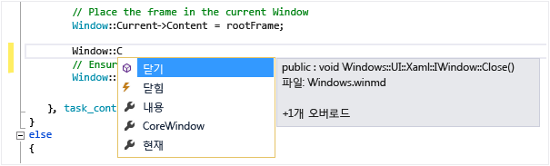

# IntelliSense 사용
[!INCLUDE[vs2017banner](../code-quality/includes/vs2017banner.md)]

IntelliSense는 멤버 목록, 매개 변수 정보, 요약 정보 및 단어 자동 완성 등 여러 기능을 위한 제네릭 형식입니다.  이러한 기능을 사용하면 사용 중인 코드에 대한 자세한 정보를 보고, 입력하는 매개 변수를 계속 추적하고, 단 몇 번의 키 입력으로 속성과 메서드에 대한 호출을 추가할 수 있습니다.  
  
 IntelliSense의 많은 부분은 언어별로 고유합니다.  다른 언어의 IntelliSense에 대한 자세한 내용을 보려면 참고 항목의 항목을 참조하세요.  
  
## 멤버 목록  
 형식\(또는 네임스페이스\)의 유효한 멤버 목록은 트리거 문자\(예: 관리 코드에서는 마침표\(`.`\), C\+\+에서는 `::`\)를 입력하면 나타납니다.  문자를 계속 입력하는 경우 해당 문자로 시작하는 멤버만 포함하도록 목록이 필터링됩니다.  
  
 항목을 선택한 후에 Tab 키를 누르거나 공백을 입력하여 코드에 삽입할 수 있습니다.  항목을 선택하고 마침표를 입력하면 항목 뒤에 마침표가 표시되면서 다른 멤버 목록이 나타납니다.  항목을 선택하고 삽입하기 전에 해당 항목에 대한 요약 정보를 볼 수 있습니다.  
  
 멤버 목록에서 왼쪽에 있는 아이콘은 네임스페이스, 클래스, 함수 또는 변수와 같은 멤버 형식을 나타냅니다.  아이콘 목록은 [클래스 뷰 및 개체 브라우저 아이콘](../ide/class-view-and-object-browser-icons.md)을 참조하세요.  목록이 특히 길 때는 Page Up 및 Page Down 키를 눌러 목록에서 위나 아래로 이동할 수 있습니다.  
  
   
  
 Ctrl\+J를 직접 입력하거나 **편집\/IntelliSense\/멤버 목록**을 클릭하거나 편집기 도구 모음에서 **멤버 목록** 단추를 클릭하여 **멤버 목록** 기능을 수동으로 호출할 수 있습니다.  빈 줄 또는 인식할 수 있는 범위 외부에서 호출하면 목록의 전역 네임스페이스에 기호가 표시됩니다.  
  
 특별히 호출하지 않는 한 표시되지 않도록 멤버 목록을 기본적으로 꺼 두려면 **도구\/옵션\/모든 언어**로 이동하고 **멤버 목록 자동 표시**를 선택 취소합니다.  특정 언어에 대해서만 멤버 목록을 끄려면 해당 언어의 **일반** 설정으로 이동합니다.  
  
 제안 모드를 변경하여 입력한 텍스트만 코드에 삽입되도록 할 수도 있습니다.  예를 들어 목록에 없는 식별자를 입력하고 Tab 키를 누를 경우, 완료 모드에서는 입력한 식별자 대신 다른 항목으로 대체됩니다.  완료 모드와 제안 모드 사이를 전환하려면 Ctrl\+Alt\+스페이스바를 누르거나 **편집, IntelliSense, 완료 모드 설정\/해제**를 누릅니다.  
  
## 매개 변수 정보  
 매개 변수 정보는 메서드, 특성 제네릭 형식 매개 변수\(C\#\), 또는 템플릿\(C\+\+\)에서 요구하는 매개 변수의 개수, 이름 및 형식에 대한 정보를 제공합니다.  
  
 굵게 표시된 매개 변수는 함수를 입력할 때 필요한 다음 매개 변수를 나타냅니다.  오버로드된 함수의 경우 위쪽 화살표와 아래쪽 화살표를 사용하여 함수 오버로드에 대한 대체 매개 변수 정보를 볼 수 있습니다.  
  
   
  
 XML 문서 주석을 사용하여 함수와 매개 변수에 주석을 달 경우 주석은 매개 변수 정보로 표시됩니다.  자세한 내용은 [XML 코드 주석 제공](../ide/supplying-xml-code-comments.md)을 참조하세요.  
  
 **IntelliSense 편집\/매개 변수 정보**를 클릭하거나 Ctrl\+Shift\+스페이스바를 누르거나 편집기 도구 모음에서 **매개 변수 정보** 단추를 클릭하여 매개 변수 정보를 수동으로 호출할 수 있습니다.  
  
## 요약 정보  
 요약 정보는 코드의 식별자에 대한 전체 선언을 표시합니다.  
  
   
  
 **멤버 목록** 상자에서 멤버를 선택해도 요약 정보가 나타납니다.  
  
   
  
 **편집\/IntelliSense\/요약 정보**를 클릭하거나 Ctrl\+I를 누르거나 편집기 도구 모음에서 **요약 정보** 단추를 클릭하여 요약 정보를 수동으로 호출할 수 있습니다.  
  
 오버로드된 함수의 경우 IntelliSense가 모든 오버로드 폼에 대한 정보를 표시하지 못할 수도 있습니다.  
  
 **도구\/옵션\/텍스트 편집기\/C\/C\+\+\/고급\/자동 요약 정보**를 `false`로 설정하여 C\+\+에서 요약 정보를 설정 해제할 수 있습니다.  
  
## 단어 자동 완성  
 단어 자동 완성은 항이 인식될 수 있을 정도의 문자를 사용자가 입력하면 변수, 명령 또는 함수 이름의 나머지 부분이 자동으로 입력되는 기능입니다.  **편집\/IntelliSense\/단어 자동 완성**을 클릭하거나 Ctrl\+스페이스바를 누르거나 편집기 도구 모음에서 **단어 자동 완성** 단추를 클릭하여 단어 자동 완성을 호출할 수 있습니다.  
  
## IntelliSense 옵션  
 IntelliSense 옵션은 기본적으로 켜져 있습니다.  멤버 목록 기능을 원하지 않을 경우 해당 기능을 끄려면 **도구\/옵션\/텍스트 편집기**를 클릭하고 **매개 변수 정보** 또는 **멤버 목록 자동 표시**를 선택 취소합니다.  
  
## IntelliSense 문제 해결  
 경우에 따라 IntelliSense 옵션이 정상적으로 작동하지 않을 수 있습니다.  
  
 **커서가 코드 오류 아래에 있습니다.** 커서 위의 코드에 불완전한 함수나 기타 오류가 있는 경우 IntelliSense가 해당 코드 요소를 구문 분석할 수 없기 때문에 IntelliSense를 사용할 수 없습니다.  해당하는 코드를 주석으로 처리하여 이 문제를 해결할 수 있습니다.  
  
 **커서가 코드 주석 안에 있습니다.** 소스 파일의 주석에 커서가 있는 경우 IntelliSense를 사용할 수 없습니다.  
  
 **커서가 문자열 리터럴 안에 있습니다.** 다음 예제와 같이 커서가 문자열 리터럴 주변 따옴표에 있는 경우 IntelliSense를 사용할 수 없습니다.  
  
```  
MessageBox( hWnd, "String literal|") )  
```  
  
 **자동 옵션이 꺼져 있습니다.** 기본적으로 IntelliSense는 자동으로 작동하지만 비활성화할 수 있습니다.  자동 문 완성을 비활성화한 경우에도 IntelliSense 기능을 호출할 수 있습니다.  
  
## 참고 항목  
 [Visual Basic 관련 IntelliSense](../ide/visual-basic-specific-intellisense.md)   
 [Visual C\# IntelliSense](../ide/visual-csharp-intellisense.md)   
 [JavaScript IntelliSense](../ide/javascript-intellisense.md)   
 [XML 코드 주석 제공](../ide/supplying-xml-code-comments.md)