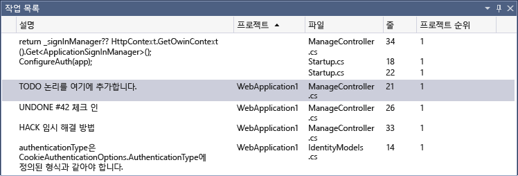

# <a name="use-the-task-list"></a>작업 목록 사용

**작업 목록**을 사용하여 `TODO` 및 `HACK` 같은 토큰 또는 사용자 지정 토큰을 사용하는 코드 주석을 추적하고 코드에서 미리 정의된 위치로 직접 연결되는 바로 가기를 관리합니다. 목록의 항목을 클릭하면 소스 코드의 해당 위치로 이동합니다.

## <a name="the-task-list-window"></a>작업 목록 창

**작업 목록**이 열리면서 응용 프로그램 창의 아래쪽에 나타납니다.

**작업 목록**을 열려면 **보기** > **작업 목록**을 선택하거나 키보드에서 **Ctrl**+**\\**,**T**를 누릅니다.



목록의 정렬 순서를 변경하려면 열 머리글을 선택합니다. 검색 결과를 더 구체화하려면 **Shift** 키를 누르고 두 번째 열 머리글을 클릭합니다. 또는 바로 가기 메뉴에서 **정렬 기준**을 선택하고 머리글을 선택합니다. 검색 결과를 더 구체화하려면 **Shift** 키를 누르고 두 번째 머리글을 선택합니다.

열을 표시하거나 숨기려면 바로 가기 메뉴에서 **열 표시**를 선택합니다. 표시하거나 숨길 열을 선택합니다.

열 순서를 변경하려면 열 머리글을 원하는 위치로 끌어옵니다.

## <a name="user-tasks"></a>사용자 작업

사용자 작업 기능은 Visual Studio 2015에서 제거되었습니다. Visual Studio 2013 이전 버전의 사용자 작업 데이터가 포함된 솔루션을 열 경우 *.suo* 파일의 사용자 작업 데이터는 영향을 받지 않지만, 사용자 작업이 작업 목록에 표시되지 않습니다.

사용자 작업 데이터에 계속 액세스하여 업데이트하려면 Visual Studio 2013에서 프로젝트를 열고 사용자 작업 내용을 기본 프로젝트 관리 도구(예: Team Foundation Server)에 복사합니다.

## <a name="tokens-and-comments"></a>토큰 및 주석

주석 표식 뒤에 오는 코드의 주석과 미리 정의된 토큰도 **작업 목록**에 나타납니다. 예를 들어 다음 C# 주석은 세 개의 구분된 부분으로 되어 있습니다.

- 주석 마커(`//`)

- 예: 토큰(`TODO`)

- 주석(텍스트의 나머지 부분)

```csharp
// TODO: Load state from previously suspended application
```

`TODO`는 미리 정의된 토큰이므로 이 주석은 목록에 `TODO` 작업으로 표시됩니다.

### <a name="custom-tokens"></a>사용자 지정 토큰

기본적으로 Visual Studio에는 `HACK`, `TODO`, `UNDONE` 및 `NOTE` 토큰이 포함됩니다. 대/소문자를 구분하지 않습니다.

또한 사용자가 직접 토큰을 만들 수도 있습니다. 사용자 지정 토큰을 만들려면:

1. **도구** 메뉴에서 **옵션**을 선택합니다.

2. **환경** 폴더를 연 다음 **작업 목록**을 선택합니다.

   [작업 목록 옵션 페이지](../ide/reference/task-list-environment-options-dialog-box.md)가 표시됩니다.

   

3. **토큰** 범주에서 **이름** 텍스트 상자에 토큰 이름(예: **BUG**)을 입력합니다.

4. **우선 순위** 드롭다운 목록에서 새 토큰의 기본 우선 순위를 선택합니다. **추가** 단추를 선택합니다.

### <a name="c-todo-comments"></a>C++ TODO 주석

기본적으로 C++ TODO 주석은 **작업 목록**에 표시됩니다.

C++ TODO 주석을 끄려면 **도구** 메뉴에서 **옵션** > **텍스트 편집기** > **C/C++** > **보기** > **주석 작업 열거**를 선택한 다음, 값을 **false**로 설정합니다.

## <a name="shortcuts"></a>바로 가기

‘바로 가기’는 **작업 목록**에서 추적되는 코드의 책갈피입니다. 일반 책갈피와는 다른 아이콘이 있습니다. **작업 목록**의 바로 가기를 두 번 클릭하여 코드의 해당 위치로 이동합니다.


### <a name="create-a-shortcut"></a>바로 가기 만들기

바로 가기를 만들려면 바로 가기를 저장할 코드에 포인터를 삽입합니다. **편집** > **책갈피** > **작업 목록 바로 가기 추가**를 선택하거나 **Ctrl**+**K** 및 **Ctrl**+**H** 키를 누릅니다.

코드에서 바로 가기를 탐색하려면 목록에서 바로 가기를 선택한 다음 바로 가기 메뉴에서 **다음 작업** 또는 **이전 작업** 을 선택합니다.

## <a name="see-also"></a>참고 항목

- [작업 목록, 환경, 옵션 대화 상자](../ide/reference/task-list-environment-options-dialog-box.md)