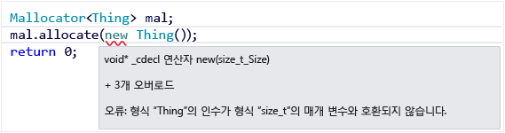
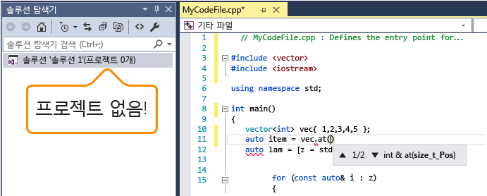

# Visual C++ IntelliSense

IntelliSense for C++는 C++ 프로젝트의 일부인 파일의 경우와 마찬가지로 독립 실행형 파일에도 사용할 수 있습니다. 플랫폼 간 프로젝트에서는 Android 또는 iOS 컨텍스트에 있는 경우에도 공유 코드 프로젝트의 .cpp 및 .c 파일에서 일부 IntelliSense 기능을 사용할 수 있습니다.

## C++의 IntelliSense 기능

IntelliSense는 코딩을 보다 편리하게 하는 기능 집합에 지정된 이름입니다. 사람마다 편리성에 대한 생각이 다르기 때문에 거의 모든 IntelliSense 기능은 **텍스트 편집기, C/C++, 고급** 속성 페이지에서 사용하거나 사용하지 않도록 설정할 수 있습니다.

다음 이미지에 표시된 메뉴 항목 및 바로 가기 키를 사용하여 IntelliSense에 액세스할 수 있습니다.

### 문 완성 및 멤버 목록

키워드, 형식, 함수, 변수 이름 또는 컴파일러에서 인식하는 기타 프로그램 요소의 입력을 시작하면 편집기에서 단어 완성 기능을 제공합니다.

아이콘 목록과 해당 의미는 [클래스 뷰 및 개체 브라우저 아이콘](../ide/class-view-and-object-browser-icons.md)을 참조하세요.

멤버 목록을 처음 호출하는 경우 현재 컨텍스트에서 액세스할 수 있는 멤버만 표시됩니다. 그 후에 **Ctrl+J**를 사용하면 접근성과 관계없이 모든 멤버가 표시됩니다. 세 번째로 호출하면 보다 광범위한 프로그램 요소 목록이 표시됩니다. **C/C++ 일반 옵션** 페이지에서 문 완성을 끌 수 있습니다.

### 매개 변수 도움말

클래스 템플릿 변수 선언에서 함수 호출을 여는 중괄호 또는 꺾쇠 괄호를 입력하면 편집기에서 함수 또는 생성자의 각 오버로드에 대한 매개 변수 형식이 포함된 작은 창을 표시합니다. 커서 위치에 따라 "현재" 매개 변수가 굵게 표시됩니다. **C/C++ 일반 옵션** 페이지에서 문 완성을 끌 수 있습니다.

### 요약 정보

변수 위에 마우스 커서를 놓으면 형식 정보 및 형식이 정의된 헤더를 표시하는 작은 창이 인라인으로 나타납니다. 함수 호출을 마우스로 가리키면 함수의 서명이 표시됩니다. **텍스트 편집기, C/C++, 고급** 페이지에서 요약 정보를 끌 수 있습니다.

### 오류 표시선

프로그램 요소(변수, 키워드, 중괄호, 형식 이름 등) 아래의 표시선은 코드의 오류 또는 잠재적 오류를 알립니다. 녹색 표시선은 정방향 선언을 작성할 때 나타나며, 여전히 구현을 작성해야 함을 알립니다. 현재 활성화되지 않은 코드에 오류가 있는 경우, 예를 들어 Windows 컨텍스트에서 작업하는데 Android 컨텍스트에서 오류가 발생하는 내용을 입력하는 경우 공유 프로젝트에 자주색 표시선이 나타납니다. 빨간색 표시선은 처리해야 하는 활성 코드의 컴파일러 오류 또는 경고를 나타냅니다.

### 코드 색 지정 및 글꼴

**환경, 글꼴 및 색** 속성 페이지를 사용하여 기본색 및 글꼴을 변경할 수 있습니다. 여기서 편집기뿐 아니라 많은 UI 창의 글꼴을 변경할 수 있습니다. C++와 관련된 설정은 "C++"로 시작하고 다른 설정은 모든 언어에 적용됩니다.

### 플랫폼 간 IntelliSense

공유 코드 프로젝트에서 표시선과 같은 일부 IntelliSense 기능은 Android 컨텍스트에서 작업하는 경우에도 사용할 수 있습니다. 비활성 프로젝트에서 오류가 발생하는 일부 코드를 작성하는 경우에도 IntelliSense에서 표시선을 표시하지만 현재 컨텍스트의 오류 표시선과 다른 색으로 표시됩니다.

다음은 Android 및 iOS를 위해 빌드하도록 구성된 OpenGLES 응용 프로그램입니다. 다음 그림은 편집 중인 공유 코드를 보여 줍니다. 첫 번째 이미지에서는 Android가 활성 프로젝트입니다.

다음 사항을 참고하십시오.

- Android 프로젝트에 대해 __ANDROID\_\_가 정의되어 있으므로 8줄의 #else 분기가 비활성 지역을 나타내기 위해 회색으로 표시되어 있습니다.

- 11줄의 인사말 변수는 자주색 물결 기호가 있는 HELLO 식별자로 초기화됩니다. 이는 현재 비활성 iOS 프로젝트에 정의된 HELLO 식별자가 없기 때문입니다. Android에서 프로젝트 줄 11이 컴파일되는 동안에는 iOS에 없습니다. 공유 코드이므로 현재 활성 구성에서 컴파일되더라도 변경해야 합니다.

- 줄 12에는 BYE 식별자에 빨간색 물결 기호가 있습니다. 이 식별자는 현재 선택한 활성 프로젝트에 정의되어 있지 않습니다.

이제, 활성 프로젝트를 iOS.StaticLibrary로 변경하고 물결 기호 변경 방법에 대해 살펴보겠습니다.

다음 사항을 참고하십시오.

- __ANDROID\_\_가 iOS 프로젝트에 대해 정의되지 않았으므로 6줄 #ifdef 분기가 회색으로 표시되어 비활성 지역을 나타냅니다.

- 11줄의 인사말 변수는 HELLO 식별자로 초기화되어 이제 빨간색 물결 기호가 표시되었습니다. 이는 HELLO 식별자가 현재 활성 iOS 프로젝트에 정의되어 있지 않기 때문입니다.

- 12줄에는 BYE 식별자에 자주색 물결 기호가 있습니다. 이 식별자는 현재 비활성 Android.NativeActivity 프로젝트에 정의되어 있지 않았습니다.

### 독립 실행형 파일의 IntelliSense

프로젝트 외부의 단일 파일을 여는 경우에도 IntelliSense가 작동합니다. **텍스트 편집기, C/C++, 고급**으로 이동하여 IntelliSense 기능을 켜면 특정 기능을 사용하거나 사용하지 않도록 설정할 수 있습니다. 프로젝트의 일부가 아닌 단일 파일에 대해 IntelliSense를 구성하려면 **고급** 섹션에서 **프로젝트가 아닌 파일에 대한 IntelliSense 및 검색**을 찾습니다. [Visual C++ 둘러보기](http://msdn.microsoft.com/en-us/499cb66f-7df1-45d6-8b6b-33d94fd1f17c)를 참조하세요.

기본적으로 단일 파일 IntelliSense는 표준 포함 디렉터리만 사용하여 헤더 파일을 찾습니다. 디렉터리를 추가하려면 다음 그림에 표시된 것처럼 솔루션 노드에서 바로 가기 메뉴를 열고 해당 디렉터리를 **소스 코드 디버그** 목록에 추가합니다.

## 참고 항목

[IntelliSense 사용](../ide/using-intellisense.md)