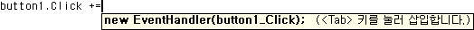

# C# IntelliSense

C# IntelliSense는 편집기에서 코딩할 때와 [직접 실행 모드](../ide/reference/immediate-window.md) 명령 창에서 디버그하는 동안 사용할 수 있습니다.

## 완성 목록

C#의 IntelliSense 완성 목록에는 멤버 목록, 단어 자동 완성 등의 토큰이 있습니다. 이를 통해 다음 항목에 빠르게 액세스할 수 있습니다.

- 형식 또는 네임스페이스의 멤버

- 변수, 명령 및 함수 이름

- 코드 조각

- 언어 키워드

- 확장 메서드

또한 C#의 완성 목록은 컨텍스트에 따라 관련이 없는 토큰을 필터링하고 토큰을 미리 선택할 정도로 스마트합니다. 자세한 내용은 [필터링된 완성 목록](#filtered-completion-lists)을 참조하세요.

## 완성 목록의 코드 조각

C#의 완성 목록에는 미리 정의된 코드 본문을 프로그램에 쉽게 삽입하도록 지원하는 코드 조각이 포함되어 있습니다. 코드 조각은 완성 목록에 코드 조각의 [바로 가기 텍스트](../ide/code-snippets-schema-reference.md#shortcut)로 나타납니다. C#에서 기본적으로 사용할 수 있는 코드 조각에 대한 자세한 내용은 [C# 코드 조각](../ide/visual-csharp-code-snippets.md)을 참조하세요.

## 완성 목록의 언어 키워드

C#의 완성 목록에는 언어 키워드도 포함되어 있습니다. C# 언어 키워드에 대한 자세한 내용은 [C# 키워드](/dotnet/csharp/language-reference/keywords/index)를 참조하세요.

## 완성 목록의 확장 메서드

C#의 완성 목록에는 범위에 속한 확장 메서드가 포함되어 있습니다.

> [!NOTE]
> 완성 목록에 <xref:System.String> 개체의 모든 확장 메서드가 표시되지는 않습니다.

확장명 메서드는 인스턴스 메서드와 다른 아이콘을 사용합니다. 목록 아이콘의 목록은 [클래스 뷰 및 개체 브라우저 아이콘](../ide/class-view-and-object-browser-icons.md)을 참조하세요. 인스턴스 메서드와 확장명 메서드가 이름이 같고 둘 다 범위에 속할 경우 완성 목록에는 확장명 메서드 아이콘이 표시됩니다.

## 필터링된 완성 목록

IntelliSense는 필터를 사용하여 완성 목록에서 불필요한 멤버를 제거합니다. C#은 다음 항목에 대해 표시되는 완성 목록을 필터링합니다.

- **인터페이스 및 기본 클래스**: IntelliSense는 클래스 선언 기본 및 인터페이스 목록과 제약 조건 목록 둘 다의 인터페이스 및 기본 클래스 완성 목록에서 항목을 자동으로 제거합니다. 예를 들어 열거형은 기본 클래스에 사용할 수 없으므로 열거형이 기본 클래스의 완성 목록에 표시되지 않습니다. 기본 클래스의 완성 목록에는 인터페이스와 네임스페이스만 포함되어 있습니다. C#에서 다중 상속을 지원하지 않으므로 목록의 항목을 선택한 후 쉼표를 입력하는 경우 IntelliSense의 완성 목록에서 기본 클래스가 제거됩니다. 제약 조건 절에 대해서도 동일한 동작이 수행됩니다.

- **특성**: 형식에 특성을 적용할 경우 완성 목록은 <xref:System.Attribute>와 같이 해당 형식이 포함된 네임스페이스에서 물려받은 형식만 목록에 포함하도록 필터링됩니다.

- **Catch 절**

- **개체 이니셜라이저**: 초기화할 수 있는 멤버만 완성 목록에 표시됩니다.

- **new 키워드**: `new`를 입력한 후 **스페이스**를 누르면 완성 목록이 표시됩니다. 코드의 컨텍스트에 따라 항목이 목록에서 자동으로 선택됩니다. 예를 들어 메서드의 선언 문과 반환 문에 대한 항목이 완성 목록에서 자동으로 선택됩니다.

- **enum 키워드**: 열거형 할당의 등호 이후에 **스페이스**를 누르면 완성 목록이 표시됩니다. 코드의 컨텍스트에 따라 항목이 목록에서 자동으로 선택됩니다. 예를 들어 return 키워드를 입력한 후 그리고 선언을 만들 때 항목이 완성 목록에서 자동으로 선택됩니다.

- **as 및 is 연산자**: 필터링된 완성 목록은 `as` 또는 `is` 키워드를 입력한 후 **스페이스**를 누르면 자동으로 표시됩니다.

- **이벤트**: `event` 키워드를 입력하면 완성 목록에 대리자 형식만 포함됩니다.

- **매개 변수 도움말**은 사용자가 입력하는 매개 변수와 일치하는 첫 번째 메서드 오버로드에 대해 자동으로 정렬됩니다. 여러 메서드 오버로드를 사용할 수 있는 경우 위쪽/아래쪽 화살표 키를 사용하여 목록에서 가능한 다음 오버로드로 이동할 수 있습니다.

## 가장 최근에 사용한 멤버

IntelliSense는 자동 개체 이름 완성을 위해 팝업 [멤버 목록](../ide/using-intellisense.md) 상자에서 최근에 선택한 멤버를 기억합니다. 다음번에 멤버 목록을 사용할 때 가장 최근에 사용한 멤버가 맨 위에 표시됩니다. 가장 최근에 사용한 멤버의 기록은 IDE의 각 세션 사이에서 지워집니다.

## override

[override](/dotnet/csharp/language-reference/keywords/override)를 입력하고 **스페이스**를 누르면 IntelliSense가 팝업 목록 상자에서 재정의할 수 있는 모든 유효한 기본 클래스 멤버를 표시합니다. `override` 뒤에 메서드의 반환 형식을 입력하면 IntelliSense가 같은 형식을 반환하는 메서드만 표시합니다. IntelliSense가 일치 항목을 찾을 수 없으면 기본 클래스 멤버가 모두 표시됩니다.

## 자동 코드 생성

### using 추가

**using 추가** IntelliSense 작업은 필요한 `using` 지시문을 코드 파일에 자동으로 추가합니다. 이 기능을 사용하면 코드의 다른 부분으로 포커스를 이동할 필요 없이 작성 중인 코드에 포커스를 유지할 수 있습니다.

**using 추가** 작업을 시작하려면 확인할 수 없는 형식 참조에 커서를 놓습니다. 예를 들어 콘솔 응용 프로그램을 만든 다음 `XmlTextReader`를 `Main` 메서드의 본문에 추가하면 형식 참조를 확인할 수 없으므로 빨간색 물결선이 해당 코드 줄에 나타납니다. 그런 다음, **빠른 작업**을 통해 **using 추가**를 호출할 수 있습니다. **빠른 작업**은 커서가 바인딩되지 않은 형식에 있을 때만 표시됩니다.

전구 아이콘을 클릭한 다음 **using System.Xml;** 을 선택하여 using 지시문을 자동으로 추가합니다.

### using 제거 및 정렬

**Using 제거 및 정렬** 옵션은 소스 코드의 동작을 변경하지 않고 `using` 및 `extern` 선언을 정렬하고 제거합니다. 시간이 지나면서 구성되지 않고 불필요한 `using` 지시문 때문에 소스 파일이 커지고 읽기 어려워집니다. **Using 제거 및 정렬** 옵션은 사용되지 않은 `using` 지시문을 제거하여 소스 코드를 압축하고 정렬을 통해 가독성을 높입니다. **편집** 메뉴에서 **IntelliSense**, **Usings 구성**을 차례로 선택합니다.

### 인터페이스 구현

IntelliSense는 코드 편집기에서 작업하는 동안 [인터페이스](/dotnet/csharp/language-reference/keywords/interface)를 구현하는 데 도움이 되는 옵션을 제공합니다. 일반적으로 인터페이스를 제대로 구현하려면 클래스에서 인터페이스의 모든 멤버에 대한 메서드 선언을 생성해야 합니다. IntelliSense를 사용하여 클래스 선언에서 인터페이스의 이름을 입력하면 **빠른 작업** 전구가 표시됩니다. 전구는 명시적 또는 암시적 명명을 사용하여 자동으로 인터페이스를 구현하는 옵션을 제공합니다. 명시적 명명에서 메서드 선언은 인터페이스의 이름을 전달하고, 암시적 명명에서 메서드 선언은 속해 있는 인터페이스를 나타내지 않습니다. 명시적으로 명명된 인터페이스는 인터페이스 인스턴스를 통해서만 액세스할 수 있으며 클래스 인스턴스를 통해서는 액세스할 수 없습니다. 자세한 내용은 [명시적 인터페이스 구현](/dotnet/csharp/programming-guide/interfaces/explicit-interface-implementation)을 참조하세요.

인터페이스 구현은 인터페이스를 충족하는 데 필요한 최소 수의 메서드 스텁을 생성합니다. 기본 클래스에서 인터페이스의 일부를 구현하면 이러한 스텁이 다시 생성되지 않습니다.

### 추상 기본 클래스 구현

IntelliSense는 코드 편집기에서 작업하는 동안 자동으로 추상 기본 클래스의 멤버를 구현하는 데 도움이 되는 옵션을 제공합니다. 일반적으로 추상 기본 클래스의 멤버를 구현하려면 파생 클래스에서 추상 기본 클래스의 각 메서드에 대한 새 메서드 정의를 만들어야 합니다. IntelliSense를 사용하여 클래스 선언에서 추상 기본 클래스의 이름을 입력하면 **빠른 작업** 전구가 표시됩니다. 전구는 자동으로 기본 클래스 메서드를 구현하는 옵션을 제공합니다.

**I추상 기본 클래스 구현** 기능에서 생성되는 메서드 스텁은 *MethodStub.snippet* 파일에 정의된 코드 조각을 통해 모델링됩니다. 코드 조각은 수정 가능합니다. 자세한 내용은 [연습: 코드 조각 만들기](../ide/walkthrough-creating-a-code-snippet.md)를 참조하세요.

### 관례에서 생성

**관례에서 생성** 기능을 사용하면 클래스와 멤버를 정의하기 전에 사용할 수 있습니다. 사용하려고 하지만 아직 정의하지 않은 모든 클래스, 생성자, 메서드, 속성, 필드 또는 열거형의 스텁을 생성할 수 있습니다. 코드에서 현재 위치를 벗어나지 않고 새 형식 및 멤버를 생성할 수 있습니다. 이렇게 하면 워크플로의 중단이 최소화됩니다.

빨간색 물결선 밑줄이 정의되지 않은 각 식별자 아래에 나타납니다. 식별자에 마우스 포인터를 놓으면 오류 메시지가 도구 설명에 나타납니다. 적절한 옵션을 표시하려면 다음 절차 중 하나를 사용할 수 있습니다.

- 정의되지 않은 식별자를 클릭합니다. **빠른 작업** 전구가 식별자 아래에 나타납니다. 전구를 클릭합니다.

- 정의되지 않은 식별자를 클릭한 다음 **Ctrl**+**.** (**Ctrl** + 마침표)를 누릅니다.

- 정의되지 않은 식별자를 마우스 오른쪽 단추로 클릭한 다음 **빠른 작업 및 리팩터링**을 클릭합니다.

표시되는 옵션에는 다음이 포함될 수 있습니다.

- **속성 생성**

- **필드 생성**

- **메서드 생성**

- **클래스 생성**

- **새 형식 생성**(클래스, 구조체, 인터페이스 또는 열거형의 경우)

## 이벤트 처리기 생성

코드 편집기에서 IntelliSense는 메서드(이벤트 처리기)를 이벤트 필드에 연결하는 데 도움이 될 수 있습니다.

*.cs* 파일에서 이벤트 필드 뒤에 `+=` 연산자를 입력하는 경우 IntelliSense는 **탭** 키를 누르는 옵션을 표시합니다. 이때 이벤트를 처리하는 메서드를 가리키는 대리자의 새 인스턴스가 삽입됩니다.

**탭** 키를 누르는 경우 IntelliSense는 자동으로 문을 완료하고 이벤트 처리기 참조를 코드 편집기에서 선택된 텍스트로 표시합니다. 자동 이벤트 연결을 완료하기 위해 IntelliSense는 이벤트 처리기에 대한 빈 스텁을 만들려면 **탭** 키를 다시 누르라는 메시지를 표시합니다.

> [!NOTE]
> IntelliSense에 의해 만들어진 새 대리자가 기존 이벤트 처리기를 참조하는 경우 IntelliSense는 도구 설명에 이 정보를 전달합니다. 이 참조는 수정할 수 있습니다. 텍스트가 코드 편집기에서 이미 선택되어 있습니다. 그렇지 않은 경우에는 자동 이벤트 연결이 이 시점에서 완료됩니다.

**탭** 키를 누르는 경우 IntelliSense에서 올바른 서명으로 메서드가 스텁 아웃되고 이벤트 처리기의 본문에 커서가 위치합니다.

> [!NOTE]
> 이벤트 연결 문으로 돌아가려면 **보기** 메뉴에서 **뒤로 탐색** 명령(**Ctrl**+**-**)을 사용합니다.

## 참고 항목

- [IntelliSense 사용](../ide/using-intellisense.md)
- [Visual Studio IDE](../ide/visual-studio-ide.md)