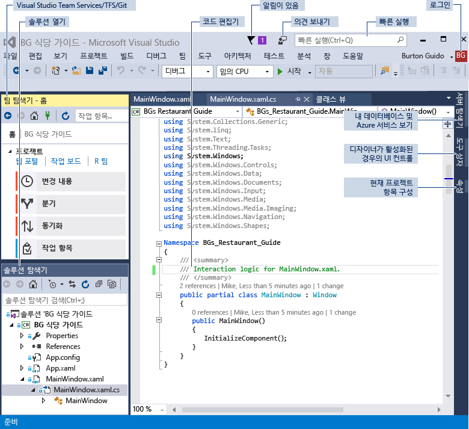
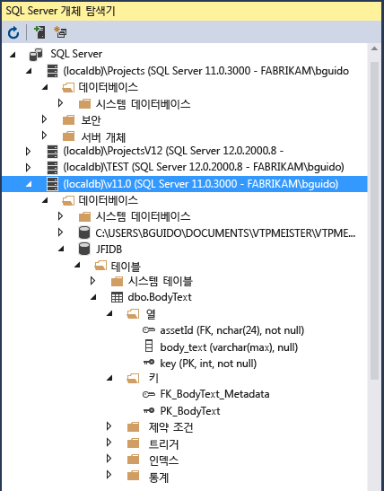

# <a name="visual-studio-ide-overview"></a>Visual Studio IDE 개요

Visual Studio IDE(대화형 개발 환경)는 거의 모든 종류의 코드를 보고 편집한 다음, Android, iOS, Windows, 웹 및 클라우드용 앱을 디버그, 빌드 및 게시하는 데 사용할 수 있는 창조적인 실행 패드입니다. Mac 및 Windows에서 사용할 수 있는 버전이 있습니다. 이 문서에서는 Visual Studio IDE의 기능을 소개합니다. Visual Studio로 수행할 수 있는 몇 가지 작업과 이를 설치하고 사용하는 방법, 간단한 프로젝트를 만드는 방법, 코드 디버깅 및 배포에 대한 지침을 얻는 방법, 다양한 도구 창을 둘러보는 방법을 단계별로 살펴봅니다.

## <a name="what-can-you-do-with-the-visual-studio-ide"></a>Visual Studio IDE로 수행할 수 있는 작업

Android 휴대폰용 앱을 만들고 싶은가요? 예, 그렇게 할 수 있습니다. C++를 사용하여 첨단 게임을 만드는 방법은 어떤가요? 원하는 만큼 아주 많이 만들 수 있습니다. Visual Studio는 웹 사이트, 게임, 데스크톱 앱, 모바일 앱, Office용 앱 등을 만드는 데 도움이 되는 템플릿을 제공합니다.


또는 거의 모든 곳에서 얻을 수 있는 일부 코드를 열어서 작업할 수 있습니다. 좋아하는 GitHub 프로젝트를 볼 수 있을까요? 리포지토리를 복제하고, Visual Studio에서 열어, 코딩을 시작만 하면 됩니다!

### <a name="create-mobile-apps"></a>모바일 앱 만들기

C#과 Xamarin 또는 Visual C++를 사용하여 다양한 플랫폼용 네이티브 모바일 앱을 만들거나 Apache Cordova에서 JavaScript를 사용하는 하이브리드 앱을 만들 수 있습니다. Unity, Unreal, DirectX, Cocos 등을 위한 모바일 게임을 작성할 수 있습니다. Visual Studio에는 Android 앱을 실행하고 디버그하는 데 도움이 되는 Android 에뮬레이터가 포함되어 있습니다.

Azure 앱 서비스를 만들어 모바일 앱에서 클라우드의 강력한 기능을 활용할 수 있습니다. Azure 앱 서비스를 사용하면 앱에서 데이터를 클라우드에 저장하고, 사용자를 안전하게 인증하며, 앱과 비즈니스의 요구를 수용할 수 있도록 리소스를 자동으로 강화하거나 축소할 수 있습니다. 자세한 내용은 [모바일 앱 개발](https://www.visualstudio.com/vs/mobile-app-development/)을 참조하세요.

### <a name="create-cloud-apps-for-azure"></a>Azure용 클라우드 앱 만들기

Visual Studio는 Microsoft Azure에서 구동하는 클라우드 지원 응용 프로그램을 쉽게 만들 수 있는 도구 모음을 제공합니다. IDE에서 직접 Microsoft Azure의 응용 프로그램과 서비스를 구성, 빌드, 디버그, 패키징 및 배포할 수 있습니다. .NET용 Azure 도구를 얻으려면 Visual Studio를 설치할 때 **Azure 개발** 작업을 선택합니다. 자세한 내용은 [Visual Studio Tools for Azure](https://www.visualstudio.com/vs/azure-tools/)를 참조하세요.

다음과 같이 연결된 서비스를 통해 앱에 대한 Azure 서비스를 활용할 수 있습니다.

- [Azure 모바일 서비스](http://azure.microsoft.com/documentation/services/mobile-services/)

- [Azure 저장소](http://azure.microsoft.com/documentation/services/storage/)

[HockeyApp](https://www.visualstudio.com/hockey-app/)을 통해 베타 버전을 배포하고, 실시간 충돌 보고서를 수집하고, 실제 사용자의 의견을 얻으세요. 또한 Office 365 REST API를 자신의 앱에 통합하여 클라우드에 저장된 데이터에 연결할 수 있습니다. 자세한 내용은 [이 GitHub 샘플](https://github.com/OfficeDev/?utf8=%E2%9C%93&query=o365)을 참조하세요.

[Application Insights](https://marketplace.visualstudio.com/items?itemName=VisualStudioOnlineApplicationInsights.application-insights)는 앱 및 웹 서비스의 품질 문제를 확인 및 진단하는 데 도움이 됩니다. Application Insights를 통해 사용자가 실제로 앱을 통해 무엇을 하는지 이해하고 사용자 환경을 최적화할 수도 있습니다.

### <a name="create-apps-for-the-web"></a>웹앱 만들기

웹은 현대 세계를 이끌고 있고, Visual Studio에서 이를 위한 앱을 작성할 수 있습니다. ASP.NET, Node.js, Python, JavaScript 및 TypeScript를 사용하여 웹앱을 만들 수 있습니다. Visual Studio는 Angular, jQuery, Express 등과 같은 웹 프레임워크를 이해합니다. ASP.NET Core 및 .NET Core는 Windows, Mac 및 Linux 운영 체제에서 실행됩니다. [ASP.NET Core](http://www.asp.net/core/overview)는 MVC, WebAPI 및 SignalR에 대한 주요 업데이트이며 Windows, Mac 및 Linux에서 실행됩니다.  ASP.NET Core는 최신 클라우드 기반 웹앱 및 서비스를 빌드하기 위한 간결하고 구성 가능한 .NET 스택을 제공하도록 처음부터 다시 설계되었습니다.

자세한 내용은 [최신 웹 도구](https://www.visualstudio.com/vs/modern-web-tooling/)를 참조하세요.

### <a name="build-cross-platform-apps-and-games"></a>플랫폼 간 앱 및 게임 제작

Visual Studio를 사용하여 Android, iOS 및 기타 모바일 장치뿐 아니라 macOS, Linux, Windows용 앱과 게임을 빌드할 수 있습니다.

- Windows, macOS 및 Linux에서 실행되는 [.NET Core](/dotnet/core/) 앱을 빌드합니다.

- [Xamarin](https://developer.xamarin.com/guides/cross-platform/windows/visual-studio/)을 사용하여 C# 및 F#으로 iOS, Android 및 Windows용 모바일 앱을 빌드합니다.

- HTML, CSS, JavaScript 등의 표준 웹 기술을 사용하여 [Apache Cordova](/visualstudio/cross-platform/tools-for-cordova/)로 iOS, Android 및 Windows용 모바일 앱을 빌드할 수 있습니다.

- [Visual Studio Tools for Unity](../cross-platform/visual-studio-tools-for-unity.md)를 사용하여 C#으로 2D 및 3D 게임을 빌드합니다.

- [플랫폼 간 개발용 C++](../cross-platform/visual-cpp-for-cross-platform-mobile-development.md)를 사용하여 iOS, Android 및 Windows 장치용 네이티브 C++ 앱을 빌드하고 iOS, Android 및 Windows용으로 빌드된 라이브러리에서 공통 코드를 공유합니다.

- [Android Emulator](../cross-platform/visual-studio-emulator-for-android.md)를 사용하여 Android 앱을 배포, 테스트 및 디버그합니다.

Visual Studio는 더 많은 작업을 수행하는 데 도움을 줄 수 있습니다. 더 자세한 목록은 [www.visualstudio.com](https://www.visualstudio.com/vs/)을 참조하세요.

## <a name="install-the-visual-studio-ide"></a>Visual Studio IDE 설치

시작하려면 Visual Studio를 다운로드하여 시스템에 설치합니다. [Visual Studio 2017](https://aka.ms/vsdownload?utm_source=mscom&utm_campaign=msdocs)에서 다운로드할 수 있습니다.

이제 Visual Studio는 그 어느 때보다도 가벼워졌습니다. 모듈식 설치 관리자를 사용하면 선호하는 프로그래밍 언어 또는 플랫폼에 필요한 기능 그룹인 *워크로드*를 선택하여 설치할 수 있습니다. 이 전략을 통해 Visual Studio 설치에 필요한 공간을 이전보다 더 작게 유지할 수 있습니다. 즉 Visual Studio를 설치하고 업데이트하는 속도가 매우 빨라집니다. 향상된 설치 성능 이외에도 Visual Studio 2017은 더 짧은 IDE 시작 및 솔루션 로드 시간을 갖습니다.

시스템에 Visual Studio를 설치하는 방법에 대한 자세한 내용은 [Visual Studio 2017 설치](../install/install-visual-studio.md)를 참조하세요. [프로그램을 만드는](#create-a-program) 단계를 수행하려면 설치 중에 **.NET Core 플랫폼 간 개발** 워크로드를 선택해야 합니다.


## <a name="sign-in"></a>로그인

Visual Studio를 처음 시작하면 필요에 따라 Microsoft 계정이나 회사 또는 학교 계정으로 로그인할 수 있습니다. 로그인하면 여러 장치에서 창 레이아웃과 같은 Visual Studio 설정을 동기화할 수 있습니다. 또한 Azure 구독 및 [Visual Studio Team Services](/vsts/)와 같은 필요한 서비스에 자동으로 연결됩니다.

## <a name="create-a-program"></a>프로그램 만들기

무언가를 자세히 알아보는 좋은 방법 중 하나는 사용해 보는 것입니다! 이제 새롭고 간단한 프로그램을 만들어 보겠습니다.

1. Visual Studio를 엽니다. 메뉴에서 **파일** > **새로 만들기** > **프로젝트...**를 선택합니다.

  

1. **새 프로젝트** 대화 상자에는 여러 프로젝트 템플릿이 표시됩니다. **Visual C#**에서 **.NET Core** 범주를 선택한 다음 **콘솔 앱(.NET Core)** 템플릿을 선택합니다. **이름** 텍스트 상자에 "HelloWorld"를 입력합니다. **확인** 단추를 선택합니다.

  

  > [!NOTE]
  > **.NET Core** 범주가 표시되지 않으면 **.NET Core 플랫폼 간 개발** 워크로드를 설치해야 합니다. 이를 수행하려면 **새 프로젝트** 대화 상자의 왼쪽 아래에 있는 **Visual Studio 설치 관리자 열기** 링크를 선택합니다. **Visual Studio 설치 관리자**가 열리면 아래로 스크롤하여 **.NET Core 플랫폼 간 개발** 워크로드를 선택한 다음 **수정**을 선택합니다.

   Visual Studio에서는 템플릿을 사용하여 프로젝트를 만듭니다. 이 프로젝트는 <xref:System.Console.WriteLine> 메서드를 호출하여 리터럴 문자열 “Hello World!”를 표시하는 간단한 “Hello World” 응용 프로그램입니다. 콘솔 창에 표시합니다.

1. 잠시 후 다음 스크린샷과 비슷하게 표시됩니다.

  

   응용 프로그램의 C# 코드는 대부분의 공간을 차지하는 편집기 창에 표시됩니다. 코드 구문은 지정된 색으로 자동으로 표시되어 다양한 유형의 코드(예: 키워드 또는 형식)를 나타냅니다. 또한 코드에서 작은 세로 파선은 서로 일치하는 중괄호를 나타내며, 줄 번호는 나중에 코드를 찾는 데 도움이 됩니다. 작은 상자 안에 있는 빼기 기호를 선택하여 코드를 축소하거나 확장할 수 있습니다. 이 코드 개요 기능을 사용하면 필요 없는 코드를 숨길 수 있으므로 화면 상의 혼란을 최소화할 수 있습니다.

   프로젝트 파일은 **솔루션 탐색기**라는 창의 오른쪽에 나열됩니다.

  

  다른 메뉴와 도구 창을 사용할 수 있지만 지금은 넘어가겠습니다.

1. 이제 앱을 시작합니다. 메뉴 모음의 **디버그** 메뉴에서 **디버깅하지 않고 시작**을 선택하면 됩니다. **Ctrl**+**F5**를 누를 수도 있습니다.

  

  Visual Studio에서 앱을 빌드하며, 콘솔 창이 열리고 “Hello World!” 메시지가 표시됩니다. 이제 실행 중인 앱이 있습니다!

  

1. 콘솔 창을 닫으려면 키보드에서 아무 키나 누릅니다.

1. 앱에 일부 코드를 추가하겠습니다. `Console.WriteLine("Hello World!");` 줄 앞에 다음 C# 코드를 추가합니다.

   ```csharp
   Console.WriteLine("\nWhat is your name?");
   var name = Console.ReadLine();
   ```

   이 코드는 "What is your name?"을 콘솔 창에 표시하고 사용자가 일부 텍스트를 입력한 후 **Enter** 키를 누를 때까지 기다립니다.

1. 이제 `Console.WriteLine("Hello World!");` 줄을 다음 코드로 변경합니다.

   ```csharp
   Console.WriteLine($"\nHello {name}!");
   ```

1. **디버그** > **디버깅하지 않고 시작**을 선택하거나 **Ctrl**+**F5**를 눌러 앱을 다시 실행합니다.

   Visual Studio에서 앱을 다시 빌드하고, 콘솔 창이 열리며 사용자 이름을 묻는 메시지가 표시됩니다.

1. 콘솔 창에 이름을 입력하고 **Enter** 키를 누릅니다.

   

1. 콘솔 창을 닫으려면 아무 키나 누릅니다.

## <a name="debug-test-and-improve-your-code"></a>코드 디버그, 테스트 및 향상

항상 완벽하게 실행되는 것은 없습니다. 코드를 작성할 때 이를 실행하고 버그와 성능을 테스트해야 합니다. Visual Studio의 최신 디버깅 시스템을 사용하면 로컬 프로젝트에서 실행 중인 코드를 원격 장치 또는 에뮬레이터(예: [Android 장치용 에뮬레이터](../cross-platform/visual-studio-emulator-for-android.md))에서 디버그할 수 있습니다. 한 번에 문 하나씩, 코드를 단계별로 실행하고 변수를 검사할 수 있습니다. 지정된 조건이 true인 경우에만 적중되는 중단점을 설정할 수 있습니다. 코드 실행 등과 같은 변수 값을 모니터링할 수 있습니다. 이러한 값을 모두 코드 편집기 자체에서 관리할 수 있으므로 코드를 떠날 필요가 없습니다. Visual Studio의 디버깅에 대한 자세한 내용은 [디버거 기능 둘러보기](../debugger/debugger-feature-tour.md)를 참조하세요.

테스트를 위해 Visual Studio는 단위 테스트, IntelliTest, 부하 및 성능 테스트 등을 제공합니다. 테스트에 대한 자세한 내용은 [테스트 도구 및 시나리오](../test/developer-testing-scenarios.md)를 참조하세요. 앱 성능 향상에 대한 자세한 내용은 [프로파일링 기능 둘러보기](../profiling/profiling-feature-tour.md)를 참조하세요.

## <a name="deploy-your-finished-application"></a>완성된 응용 프로그램 배포

사용자 또는 고객에게 응용 프로그램을 배포할 준비가 되면 Microsoft Store 또는 SharePoint 사이트에 배포하든, InstallShield 또는 Windows Installer 기술을 사용하여 배포하든 Visual Studio에서는 배포 작업을 수행할 수 있는 도구를 제공합니다. 이 경우 IDE를 통해 모두 액세스할 수 있습니다. 자세한 내용은 [응용 프로그램, 서비스 및 구성 요소 배포](../deployment/deploying-applications-services-and-components.md)를 참조하세요.

## <a name="quick-tour-of-the-ide"></a>IDE 둘러보기

다음 이미지에서는 Visual Studio에 대한 높은 수준의 시각적 개요를 제공하기 위해 열려 있는 프로젝트가 있는 Visual Studio와 가장 많이 사용하는 몇 가지 주요 도구 창을 보여 줍니다.

- [솔루션 탐색기](../ide/solutions-and-projects-in-visual-studio.md) - 코드 파일을 보고, 탐색하고, 관리할 수 있습니다. 솔루션 탐색기에서 파일을 솔루션 및 프로젝트로 그룹화하여 코드를 구성할 수 있습니다.

- 대부분의 시간을 보낼 가능성이 있는 [편집기](../ide/writing-code-in-the-code-and-text-editor.md) 창은 코드를 보여 주고 이를 통해 소스 코드를 편집하고 UI를 디자인할 수 있습니다.

- [출력](../ide/reference/output-window.md) 창에는 디버깅 및 오류 메시지, 컴파일러 경고, 게시 상태 메시지 등의 Visual Studio 알림이 표시됩니다. 각 메시지 원본에 해당하는 탭이 있습니다.

- [팀 탐색기(VSTS)](/vsts/user-guide/work-team-explorer) - [Git](https://git-scm.com/), [TFVC(Team Foundation 버전 제어)](/vsts/tfvc/overview) 등의 버전 제어 기술을 통해 작업 항목을 추적하고 다른 사용자와 코드를 공유할 수 있습니다.

- [클라우드 탐색기](/azure/vs-azure-tools-resources-managing-with-cloud-explorer) - 가상 컴퓨터, 테이블, SQL 데이터베이스 등의 Azure 리소스를 보고 관리할 수 있습니다. 특정 작업에 Azure Portal이 필요한 경우 클라우드 탐색기에 이동해야 하는 Azure Portal 내 위치로 이동하는 링크가 제공됩니다.



다음은 Visual Studio의 다른 일반적인 생산성 기능입니다.

- [빠른 실행](../ide/reference/quick-launch-environment-options-dialog-box.md) 검색 상자는 Visual Studio에서 필요한 항목을 빠르게 찾을 수 있는 좋은 방법입니다. 찾으려는 항목의 이름을 입력하기만 하면 Visual Studio는 원하는 곳으로 정확하게 안내하는 결과를 나열합니다. 빠른 실행은 작업 또는 개별 구성 요소에 대한 Visual Studio 설치 관리자를 시작하는 링크도 표시합니다.

  

- [리팩터링](../ide/refactoring-in-visual-studio.md)에는 변수의 지능형 이름 바꾸기, 선택한 코드 줄을 별도 함수로 이동, 코드를 다른 위치로 이동, 함수 매개 변수 다시 정렬 등의 작업이 포함되어 있습니다.

 

- **IntelliSense** 는 편집기에서 직접 코드에 대한 형식 정보를 표시하고 경우에 따라 약간의 코드를 자동으로 작성하는 인기 있는 기능 집합에 대한 포괄적인 용어입니다. IntelliSense는 별도의 도움말 창에서 형식 정보를 조회할 필요가 없도록 기본 설명서를 편집기에 인라인으로 포함하는 것과 같습니다. IntelliSense 기능은 언어에 따라 달라집니다. 자세한 내용은 [C# IntelliSense](../ide/visual-csharp-intellisense.md), [Visual C++ IntelliSense](../ide/visual-cpp-intellisense.md), [JavaScript IntelliSense](../ide/javascript-intellisense.md) 및 [Visual Basic IntelliSense](../ide/visual-basic-specific-intellisense.md)를 참조하세요. 다음 그림에서는 일부 IntelliSense 기능의 작동을 보여 줍니다.

  

- **오류 표시선**은 물결 모양의 빨간색 밑줄이며, 입력할 때 코드의 오류 또는 잠재적인 문제를 실시간으로 알려줍니다. 이렇게 하면 컴파일 또는 런타임 중에 오류를 발견할 때까지 기다리지 않고 바로 수정할 수 있습니다. 오류 표시선 위로 마우스를 가져가면 오류에 대한 추가 정보가 표시됩니다. 오류를 수정하는 방법에 대한 제안 사항과 함께 전구가 왼쪽 여백에 나타날 수도 있습니다. 자세한 내용은 [빠른 작업](../ide/quick-actions.md)을 참조하세요.

 

- 텍스트 편집기의 상황에 맞는 메뉴에서 [호출 계층 구조](../ide/reference/call-hierarchy.md) 창을 열어 캐럿(삽입 지점) 아래에서 호출하는 메서드와 이 메서드로 호출되는 메서드를 표시할 수 있습니다.

 

- [코드 렌즈](../ide/find-code-changes-and-other-history-with-codelens.md)를 사용하면 편집기 내에서 코드 참조, 코드 변경 내용, 연결된 버그, 작업 항목, 코드 검토 및 단위 테스트를 확인할 수 있습니다.

 

- [정의 보기](../ide/how-to-view-and-edit-code-by-using-peek-definition-alt-plus-f12.md) 창은 현재 컨텍스트를 벗어나지 않고 메서드 또는 형식 정의를 인라인으로 표시합니다.

 

- **정의로 이동** 상황에 맞는 메뉴 옵션은 함수 또는 개체가 정의된 위치로 바로 이동합니다. 편집기에서 마우스 오른쪽 단추를 클릭하면 다른 탐색 명령도 사용할 수 있습니다.

 

## <a name="manage-your-source-code-and-collaborate-with-others"></a>소스 코드 관리 및 다른 사용자와 공동 작업

GitHub를 포함한 모든 공급자가 호스팅하는 Git 리포지토리에서 원본 코드를 관리할 수 있습니다. 또는 [VSTS(Visual Studio Team Services)](/vsts/index)를 사용하여 전체 프로젝트의 버그 및 작업 항목과 함께 코드를 관리합니다. Visual Studio에서 팀 탐색기를 사용하여 Git 리포지토리를 관리하는 방법에 대해 알아보려면 [Git 및 Team Services 시작하기(VSTS)](/vsts/git/gitquickstart?tabs=visual-studio)를 참조하세요. Visual Studio에는 기본 제공된 다른 소스 제어 기능이 있습니다. 이에 대한 자세한 내용은 [Visual Studio 2017의 새로운 Git 기능(블로그)](https://blogs.msdn.microsoft.com/visualstudioalm/2017/03/06/new-git-features-in-visual-studio-2017/)을 참조하세요.

VSTS는 소프트웨어 프로젝트를 호스팅하고 팀 공동 작업을 수행할 수 있는 클라우드 기반 서비스입니다. VSTS는 Git 및 Team Foundation 소스 제어 시스템과 Scrum, CMMI 및 Agile 개발 방법론을 지원합니다. TFVC(Team Foundation 버전 제어)는 하나의 중앙 집중식 서버 리포지토리를 사용하여 파일을 추적하고 버전을 관리합니다. 다른 개발자가 최신 변경 내용을 가져올 수 있는 중앙 서버에 로컬 변경 내용이 항상 체크 인됩니다.

TFS(Team Foundation Server)는 Visual Studio용 응용 프로그램 수명 주기 관리 허브입니다. 개발 프로세스와 관련된 모든 사람이 단일 솔루션을 사용하여 참여할 수 있도록 해줍니다. TFS는 성격이 다른 팀과 프로젝트들을 관리하는 데 유용합니다.

네트워크에 Visual Studio Team Services 계정 또는 Team Foundation Server가 있는 경우 Visual Studio의 [팀 탐색기] 창을 통해 연결합니다. 이 창에서 코드를 소스 제어에 체크 인 또는 체크 아웃하고, 작업 항목을 관리하고, 빌드를 시작하고, 단체 방 및 작업 영역에 액세스할 수 있습니다. **빠른 실행** 상자나 **보기, 팀 탐색기** 또는 **팀, 연결 관리**의 주 메뉴에서 [팀 탐색기]를 열 수 있습니다.

다음 이미지는 VSTS에서 호스트되는 솔루션에 대한 팀 탐색기 창을 보여 줍니다.


팀의 개발자들이 버전 제어에 체크 인한 코드를 빌드하도록 빌드 프로세스를 자동화할 수도 있습니다. 예를 들어 밤마다 또는 코드를 체크 인할 때마다 하나 이상의 프로젝트를 빌드할 수 있습니다. 자세한 내용은 [빌드 및 릴리스(VSTS 및 TFS)](/vsts/build-release/index)를 참조하세요.

## <a name="connect-to-services-databases-and-cloud-based-resources"></a>서비스, 데이터베이스 및 클라우드 기반 리소스에 연결

클라우드는 오늘날의 온라인 환경에서 매우 중요하며, Visual Studio는 이를 활용하는 방법을 제공합니다. 예를 들어 [연결된 서비스] 기능을 사용하면 앱을 서비스에 연결할 수 있습니다. 무엇보다도 사용자의 앱에서 Azure 저장소에 데이터를 저장하는 데 이 기능을 사용할 수 있습니다.


**연결된 서비스** 페이지에서 서비스를 선택하면, [연결된 서비스 마법사]가 시작되어 프로젝트를 구성하고 필요한 NuGet 패키지를 다운로드하여 서비스에 대한 코딩을 시작할 수 있습니다.

[클라우드 탐색기](/azure/vs-azure-tools-resources-managing-with-cloud-explorer)를 사용하여 Visual Studio 내에서 Azure 기반 클라우드 리소스를 보고 관리할 수 있습니다. [클라우드 탐색기]에서는 로그인한 Azure 구독으로 관리되는 모든 계정의 Azure 리소스를 보여 줍니다. Visual Studio 설치 관리자에서 **Azure 개발** 작업을 선택하여 클라우드 탐색기를 가져올 수 있습니다.


**서버 탐색기**를 사용하면 원격으로, 로컬로, Azure, Salesforce.com, Office 365 및 웹 사이트에서 SQL Server 인스턴스와 자산을 찾아보고 관리할 수 있습니다. 서버 탐색기를 열려면 주 메뉴에서 **보기** > **서버 탐색기**를 선택합니다. 서버 탐색기 사용에 대한 자세한 내용은 [새 연결 추가](../data-tools/add-new-connections.md)를 참조하세요.

[SSDT(SQL Server Data Tools)](/sql/ssdt/download-sql-server-data-tools-ssdt)는 SQL Server, Azure SQL Database 및 Azure SQL Data Warehouse를 위한 강력한 개발 환경입니다. 이 도구를 사용하면 데이터베이스를 빌드, 디버그, 유지 관리 및 리팩터링할 수 있습니다. 데이터베이스 프로젝트에 대해 작업하거나, 온-프레미스 또는 오프-프레미스로 연결된 데이터베이스 인스턴스에 대해 직접 작업할 수 있습니다.

Visual Studio의 **SQL Server 개체 탐색기**는 SQL Server Management Studio와 비슷한 데이터베이스 개체 보기를 제공합니다. SQL Server 개체 탐색기를 사용하면, SQL Server 개체 탐색기의 바로 상황에 맞는 메뉴를 통해 테이블 데이터 편집, 스키마 비교 및 쿼리 실행 등을 포함하여 간단한 데이터베이스 관리 및 디자인 작업을 수행할 수 있습니다.



## <a name="extend-visual-studio"></a>Visual Studio 확장

요구되는 적절한 기능이 Visual Studio에 없으면 추가할 수 있습니다! 워크플로와 스타일에 따라 IDE를 개인 설정하고, Visual Studio와 아직 통합되지 않은 외부 도구에 대한 지원을 추가하고, 기존 기능을 수정하여 생산성을 높일 수 있습니다. 최신 버전의 Visual Studio 확장성 도구(VS SDK)를 찾으려면 [Visual Studio SDK](../extensibility/visual-studio-sdk.md)를 참조하세요.

.NET 컴파일러 플랫폼("Roslyn")을 사용하여 사용자 고유의 코드 분석기 및 코드 생성기를 작성할 수 있습니다. [Roslyn](https://github.com/dotnet/Roslyn)(영문)에서 필요한 모든 항목을 찾으세요.

Microsoft 개발자와 개발 커뮤니티에서 만든 [기존 Visual Studio용 확장](https://marketplace.visualstudio.com/vs)을 찾아 보세요.

Visual Studio 확장에 대한 자세한 내용은 [Visual Studio IDE 확장](https://www.visualstudio.com/vs/extend/)을 참조하세요.

## <a name="learn-more-and-find-out-whats-new"></a>새로운 기능에 대한 자세한 정보 확인

Visual Studio를 사용해 본 적이 없다면 [Visual Studio에서 개발 시작](../ide/get-started-developing-with-visual-studio.md)을 살펴보거나 [Microsoft Virtual Academy](https://mva.microsoft.com/product-training/visual-studio-courses#!index=2&lang=1033)에서 제공하는 무료 Visual Studio 과정을 확인해 보세요. Visual Studio 2017의 새로운 기능을 확인하려면 [Visual Studio 2017의 새로운 기능](../ide/whats-new-in-visual-studio.md)을 참조하세요.

Visual Studio IDE 둘러보기를 완료하신 것을 축하합니다! 주요 기능 중 유용한 일부에 대해 알아보았습니다.

## <a name="see-also"></a>참고 항목

* [Visual Studio IDE](https://www.visualstudio.com/vs/)
* [Visual Studio 다운로드](https://www.visualstudio.com/downloads/)
* [Visual Studio 블로그](https://blogs.msdn.microsoft.com/visualstudio/)
* [Visual Studio 포럼](https://social.msdn.microsoft.com/Forums/vstudio/home?category=visualstudio%2Cvsarch%2Cvsdbg%2Cvstest%2Cvstfs%2Cvsdata%2Cvsappdev%2Cvisualbasic%2Cvisualcsharp%2Cvisualc)
* [Microsoft Virtual Academy](https://mva.microsoft.com/)