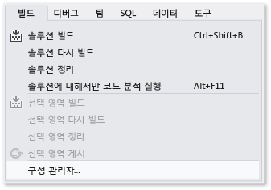
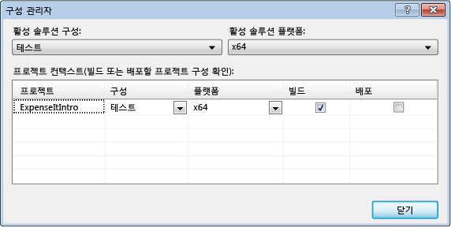
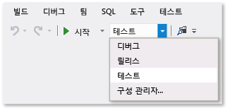
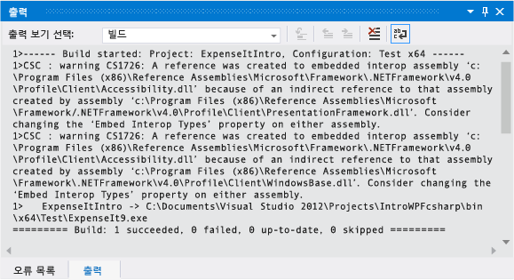
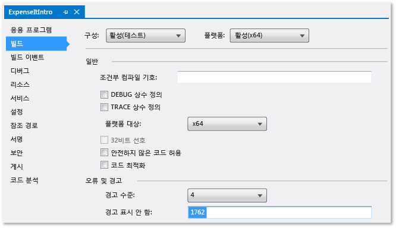
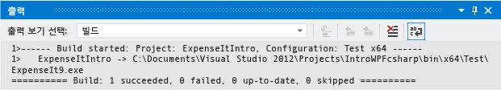
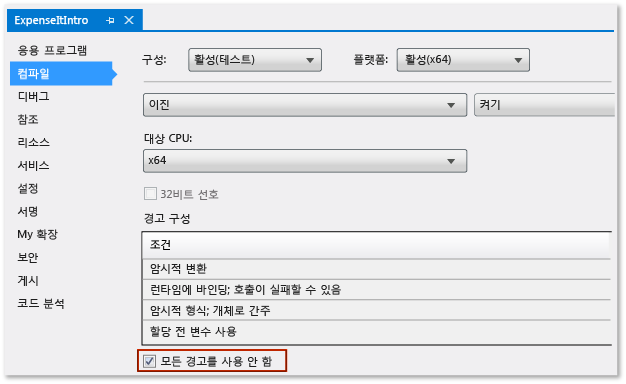
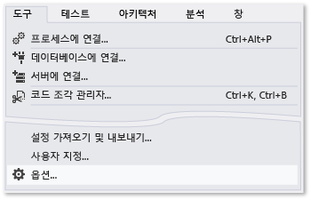
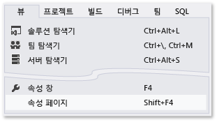
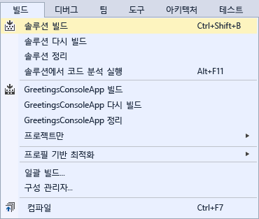

# 연습: 응용 프로그램 빌드
이 연습을 완료하면 Visual Studio로 응용 프로그램을 빌드할 때 구성할 수 있는 여러 옵션에 더 익숙해집니다. 샘플 응용 프로그램에 대한 사용자 지정 빌드 구성을 만들고, 특정 경고 메시지를 숨기고, 빌드 출력 정보를 늘립니다.  
  
 이 항목에는 다음과 같은 단원이 포함되어 있습니다.  
  
 [샘플 응용 프로그램 설치](../ide/walkthrough-building-an-application.md#BKMK_installapp)  
  
 [사용자 지정 빌드 구성 만들기](../ide/walkthrough-building-an-application.md#BKMK_CreateBuildConfig)  
  
 [응용 프로그램 빌드](../ide/walkthrough-building-an-application.md#BKMK_building)  
  
 [컴파일러 경고 숨기기](../ide/walkthrough-building-an-application.md#BKMK_hidewarning)  
  
 [출력 창에 추가 빌드 세부 정보 표시](../ide/walkthrough-building-an-application.md#BKMK_outputdetails)  
  
 [릴리스 빌드 만들기](../ide/walkthrough-building-an-application.md#BKMK_releasebuild)  
  
##   샘플 응용 프로그램 설치  
[WPF 응용 프로그램 빌드 소개](https://code.msdn.microsoft.com/Introduction-to-Building-b8d16419) 샘플을 다운로드합니다. C# 또는 Visual Basic을 선택합니다. .zip 파일을 다운로드한 후 압축을 풀고 Visual Studio를 사용하여 **ExpenseItIntro.sln** 파일을 엽니다.  
  
##   사용자 지정 빌드 구성 만들기  
 솔루션을 만들면 솔루션에 대한 디버그 및 릴리스 빌드 구성과 해당 기본 플랫폼 대상이 자동으로 정의됩니다. 나중에 이러한 구성을 사용자 지정하거나 고유한 구성을 만들 수 있습니다. 빌드 구성은 빌드 형식을 지정합니다. 빌드 플랫폼은 응용 프로그램이 해당 구성에 대한 대상으로 지정하는 운영 체제를 지정합니다. 자세한 내용은 [빌드 구성 이해](../ide/understanding-build-configurations.md), [빌드 플랫폼 이해](../ide/understanding-build-platforms.md) 및 [디버그 및 릴리스 프로젝트 구성](http://msdn.microsoft.com/en-us/0440b300-0614-4511-901a-105b771b236e)을 참조하세요.  
  
 **구성 관리자** 대화 상자를 사용하여 구성 및 플랫폼 설정을 변경하거나 만들 수 있습니다. 이 절차에서는 테스트용 빌드 구성을 만듭니다.  
  
#### 빌드 구성을 만들려면  
  
1.  **구성 관리자** 대화 상자를 엽니다.  
  
       
  
2.  **활성 솔루션 구성** 목록에서 **\<새로 만들기...\>**를 선택합니다.  
  
3.  **새 솔루션 구성** 대화 상자에서 새 구성의 이름을 `Test`로 지정하고, 기존 디버그 구성에서 설정을 복사하고, **확인** 단추를 선택합니다.  
  
       
  
4.  **활성 솔루션 플랫폼** 목록에서 **\<새로 만들기...\>**를 선택합니다.  
  
5.  **새 솔루션 플랫폼** 대화 상자에서 **x64**를 선택하지만 x86 플랫폼에서 설정을 복사하지 않습니다.  
  
       
  
6.  **확인** 단추를 선택합니다.  
  
 활성 솔루션 구성이 Test로 변경되고 활성 솔루션 플랫폼이 x64로 설정되었습니다.  
  
   
  
7. **닫기**를 선택합니다.  

**표준** 도구 상자에서 **솔루션 구성** 목록을 사용하여 활성 솔루션 구성을 빠르게 확인하거나 변경할 수 있습니다.  
  
  
  
##   응용 프로그램 빌드  
 다음에는 사용자 지정 빌드 구성을 사용하여 솔루션을 빌드합니다.  
  
#### 솔루션을 빌드하려면  
  
-   메뉴 모음에서 **빌드**, **솔루션 빌드**를 선택합니다.  
  
    **출력** 창에는 빌드 결과가 표시됩니다. 빌드에 성공했습니다.  
  
##   컴파일러 경고 숨기기  
다음으로 컴파일러에서 생성되는 경고를 발생하는 일부 코드를 소개합니다.  

1. C# 프로젝트에서 **ExpenseReportPage.xaml.cs** 파일을 엽니다. **ExpenseReportPage** 메서드에 다음 코드를 추가합니다. `int i;`  

    또는

    Visual Basic 프로젝트에서 **ExpenseReportPage.xaml.vb** 파일을 엽니다. 사용자 지정 생성자 **Public Sub New...**에서 다음 코드를 추가합니다. `Dim i`  

2. 솔루션을 빌드합니다.  

**출력** 창에는 빌드 결과가 표시됩니다. 빌드에 성공했지만 경고가 발생했습니다.  

 그림 1: Visual Basic 경고  
  
   
  
 그림 2: Visual C# 경고  
  
   
  
빌드 출력을 어지럽히지 않도록 빌드하는 동안 특정 경고 메시지를 일시적으로 숨길 수 있습니다.  

#### 특정 Visual C# 경고를 숨기려면  
  
1.  **솔루션 탐색기**에서 최상위 프로젝트 노드를 선택합니다.  
  
2.  메뉴 모음에서 **보기**, **속성 페이지**를 선택합니다.  
  
     **프로젝트 디자이너**가 열립니다.  
  
3.  **빌드** 페이지를 선택하고 **경고 표시 안 함** 상자에서 경고 번호 **0168**을 지정합니다.  
  
       
  
     자세한 내용은 [프로젝트 디자이너, 빌드 페이지(C#)](../ide/reference/build-page-project-designer-csharp.md)를 참조하세요.  
  
4.  솔루션을 빌드합니다.  
  
     **출력** 창에는 빌드에 대한 요약 정보만 표시됩니다.  
  
       
  
#### 모든 Visual Basic 빌드 경고를 표시하지 않으려면  
  
1.  **솔루션 탐색기**에서 최상위 프로젝트 노드를 선택합니다.  
  
2.  메뉴 모음에서 **보기**, **속성 페이지**를 선택합니다.  
  
     **프로젝트 디자이너**가 열립니다.  
  
3.  **컴파일** 페이지에서 **모든 경고 사용 안 함** 확인란을 선택합니다.  
  
       
  
     자세한 내용은 [Visual Basic에서 경고 구성](../ide/configuring-warnings-in-visual-basic.md)을 참조하세요.  
  
4.  솔루션을 빌드합니다.  
  
 **출력** 창에는 빌드에 대한 요약 정보만 표시됩니다.  
  
   
  
 자세한 내용은 [방법: 컴파일러 경고 표시 안 함](../ide/how-to-suppress-compiler-warnings.md)을 참조하세요.  
  
##   출력 창에 추가 빌드 세부 정보 표시  
 **출력** 창에 표시할 빌드 프로세스에 대한 정보의 양을 변경할 수 있습니다. 빌드의 자세한 정도는 대개 최소로 설정되고, 이는 **출력** 창에 빌드 프로세스의 요약만 높은 우선 순위 또는 오류와 함께 표시됨을 의미합니다. [옵션 대화 상자, 프로젝트 및 솔루션, 빌드 및 실행](../ide/reference/options-dialog-box-projects-and-solutions-build-and-run.md)을 사용하여 빌드에 대한 추가 정보를 표시할 수 있습니다.  
  
> [!IMPORTANT]
>  추가 정보를 표시하면 빌드를 완료하는 데 더 오랜 시간이 걸립니다.  
  
#### [출력] 창에서 정보의 양을 변경하려면  
  
1.  **옵션** 대화 상자를 엽니다.  
  
       
  
2.  **프로젝트 및 솔루션** 범주를 선택하고 나서 **빌드 및 실행** 페이지를 선택합니다.  
  
3.  **MSBuild 프로젝트 빌드 출력의 자세한 정도** 목록에서 **보통**을 선택하고 나서 **확인** 단추를 선택합니다.  
  
4.  메뉴 모음에서 **빌드**, **솔루션 정리**를 선택합니다.  
  
5.  솔루션을 빌드하고 **출력** 창에서 정보를 검토합니다.  
  
     빌드 정보에는 빌드가 시작된 시간(시작 부분에 있음) 및 파일이 처리된 순서가 포함됩니다. 이 정보에는 빌드하는 동안 Visual Studio에서 실행하는 실제 컴파일러 구문도 포함됩니다.  
  
     예를 들어 Visual C# 빌드에서 [/nowarn](/dotnet/visual-basic/reference/command-line-compiler/nowarn) 옵션은 이 항목에서 이전에 지정한 경고 코드, 1762를 세 개의 다른 경고와 함께 나열합니다.  
  
     Visual Basic 빌드에서 [/nowarn](/dotnet/visual-basic/reference/command-line-compiler/nowarn)은 제외할 특정 경고를 포함하지 않으므로 경고가 나타나지 않습니다.  
  
    > [!TIP]
    >  Ctrl+F 키를 선택하여 **찾기** 대화 상자를 표시하면 **출력** 창의 내용을 검색할 수 있습니다.  
  
자세한 내용은 [방법: 빌드 로그 파일 보기, 저장 및 구성](../ide/how-to-view-save-and-configure-build-log-files.md)을 참조하세요.  
  
##   릴리스 빌드 만들기  
 전달에 최적화된 샘플 응용 프로그램 버전을 빌드할 수 있습니다. 릴리스 빌드의 경우 빌드가 시작되기 전에 실행 파일이 네트워크 공유에 복사되도록 지정합니다.  
  
 자세한 내용은 [방법: 빌드 출력 디렉터리 변경](../ide/how-to-change-the-build-output-directory.md) 및 [Visual Studio에서 프로젝트 및 솔루션 빌드 및 정리](../ide/building-and-cleaning-projects-and-solutions-in-visual-studio.md)를 참조하세요.  
  
#### Visual Basic에 대한 릴리스 빌드를 지정하려면  
  
1.  **프로젝트 디자이너**를 엽니다.  
  
       
  
2.  **컴파일** 페이지를 선택합니다.  
  
3.  **구성** 목록에서 **릴리스**를 선택합니다.  
  
4.  **플랫폼** 목록에서 **x86**을 선택합니다.  
  
5.  **빌드 출력 경로** 상자에서 네트워크 경로를 지정합니다.  
  
     예를 들어 \\\myserver\builds를 지정할 수 있습니다.  
  
    > [!IMPORTANT]
    >  지정한 네트워크 공유가 신뢰할 수 있는 위치가 아님을 경고하는 메시지 상자가 나타날 수 있습니다. 지정한 위치를 신뢰하는 경우 메시지 상자에서 **확인** 단추를 선택합니다.  
  
6.  응용 프로그램을 빌드합니다.  
  
       
  
#### Visual C#에 대한 릴리스 빌드를 지정하려면 #
  
1.  **프로젝트 디자이너**를 엽니다.  
  
       
  
2.  **빌드** 페이지를 선택합니다.  
  
3.  **구성** 목록에서 **릴리스**를 선택합니다.  
  
4.  **플랫폼** 목록에서 **x86**을 선택합니다.  
  
5.  **출력 경로** 상자에서 네트워크 경로를 지정합니다.  
  
     예를 들어 \\\myserver\builds를 지정할 수 있습니다.  
  
    > [!IMPORTANT]
    >  지정한 네트워크 공유가 신뢰할 수 있는 위치가 아님을 경고하는 메시지 상자가 나타날 수 있습니다. 지정한 위치를 신뢰하는 경우 메시지 상자에서 **확인** 단추를 선택합니다.  
  
6.  **표준 도구 모음**에서 솔루션 구성을 **릴리스**로, 솔루션 플랫폼을 **x86**으로 설정합니다.  

7.  응용 프로그램을 빌드합니다.  
  
       
  
 실행 파일이 지정한 네트워크 경로에 복사됩니다. 해당 경로는 \\\myserver\builds\\*FileName*.exe입니다.  
  
축하합니다. 이 연습을 완료했습니다.  
  
## 참고 항목  
 [연습: 프로젝트 빌드(C++)](/cpp/ide/walkthrough-building-a-project-cpp)   
 [ASP.NET 웹 응용 프로그램 프로젝트 미리 컴파일 개요](http://msdn.microsoft.com/en-us/b940abbd-178d-4570-b441-52914fa7b887)   
 [연습: MSBuild 사용](../msbuild/walkthrough-using-msbuild.md)
