# <a name="walkthrough-create-a-simple-application-with-visual-c-or-visual-basic"></a>연습: Visual C# 또는 Visual Basic으로 간단한 응용 프로그램 만들기
이 연습을 완료하면 Visual Studio를 사용하여 응용 프로그램을 개발할 때 사용할 수 있는 여러 도구, 대화 상자 및 디자이너에 익숙해집니다. IDE(통합 개발 환경)의 작업에 대해 배우면서 간단한 “Hello, World” 스타일의 응용 프로그램을 만들고, UI를 디자인하고, 코드를 추가하고, 오류를 디버그하게 됩니다.  
  
 이 항목에는 다음과 같은 단원이 포함되어 있습니다.  
  
 [IDE 구성](../ide/walkthrough-create-a-simple-application-with-visual-csharp-or-visual-basic.md#BKMK_ConfigureIDE)  
  
 [간단한 응용 프로그램 만들기](../ide/walkthrough-create-a-simple-application-with-visual-csharp-or-visual-basic.md#BKMK_CreateApp)  
  
 [응용 프로그램 디버깅 및 테스트](../ide/walkthrough-create-a-simple-application-with-visual-csharp-or-visual-basic.md#BKMK_DebugTest)  
  
> [!NOTE]
>  이 연습은 Visual Studio Professional을 기반으로 하며, 여기서 제공하는 WPF 응용 프로그램 템플릿에서 이 연습용 프로젝트를 빌드하게 됩니다. Visual Studio Express for Windows Desktop에서도 이 템플릿을 제공하지만, Visual Studio Express for Windows 및 Visual Studio Express for Web에서는 제공하지 않습니다. Visual Studio Express for Windows 사용 방법에 대한 기본적인 정보는 [Windows 스토어 앱용 개발자 센터](http://msdn.microsoft.com/windows/apps/br229519)를 참조하세요. Visual Studio Express for Web 사용 방법에 대한 기본적인 정보는 [ASP.NET 시작](http://www.asp.net/get-started)을 참조하세요. 또한 사용 중인 Visual Studio 버전과 설정에 따라 일부 사용자 인터페이스 요소의 이름과 위치가 결정됩니다. [Visual Studio IDE 개인 설정](../ide/personalizing-the-visual-studio-ide.md)을 참조하세요.  
  
##  <a name="BKMK_ConfigureIDE"></a> IDE 구성  
 Visual Studio를 처음 시작하는 경우 MSA(Microsoft Service Account)로 로그인하라는 [Visual Studio에 로그인](http://blogs.msdn.com/b/visualstudio/archive/2013/06/28/welcome-sign-in-to-visual-studio.aspx)메시지가 표시됩니다. 당장 로그인할 필요는 없으며 나중에 로그인해도 됩니다.  
  
 Visual Studio가 시작되면 다음으로 IDE에는 일련의 미리 정의된 사용자 지정을 적용하는 설정 조합을 선택해야 합니다. 각 설정 조합은 쉽게 응용 프로그램을 개발할 수 있도록 설계되었습니다.  
  
 이 연습은 사용자가 IDE에 최소한의 사용자 지정을 적용하는 **일반 개발 설정**을 적용한다고 가정합니다. C# 또는 Visual Basic(둘 다 적합)을 이미 선택한 경우 설정을 변경할 필요가 없습니다.  설정을 변경하려는 경우 **설정 가져오기 및 내보내기 마법사**를 사용할 수 있습니다. [Visual Studio IDE 개인 설정](../ide/personalizing-the-visual-studio-ide.md)을 참조하세요.  
  
 Visual Studio를 열면 도구 창, 메뉴 및 도구 모음, 주 창 공간을 식별할 수 있습니다. **빠른 실행**, 메뉴 모음 및 상단의 표준 도구 모음이 포함된 도구 창은 응용 프로그램 창 왼쪽과 오른쪽에 도킹되어 있습니다. 응용 프로그램 창의 가운데에 **시작 페이지**가 있습니다. 솔루션이나 프로젝트를 로드하는 경우 편집기 및 디자이너가 **시작 페이지** 가 있는 공간에 나타납니다. 응용 프로그램을 개발할 때 이 중앙 영역에서 대부분의 시간을 보냅니다.  
  
 그림 2: Visual Studio IDE  
  
 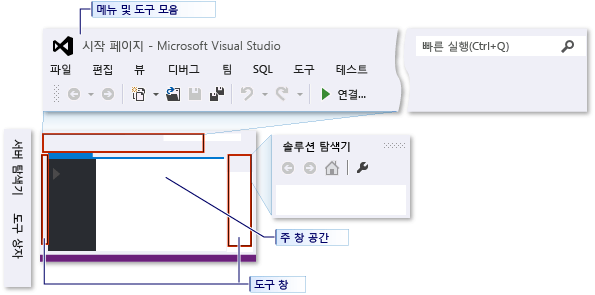  
  
 **옵션** 대화 상자를 사용하여 편집기에 있는 텍스트의 글꼴과 크기 또는 IDE의 색 테마를 변경하는 등 Visual Studio를 추가로 사용자 지정할 수 있습니다. 적용한 설정 조합에 따라 해당 대화 상자의 일부 항목이 자동으로 나타나지 않을 수 있습니다. **모든 설정 표시** 확인란을 선택하여 가능한 모든 옵션이 나타나도록 할 수 있습니다.  
  
 그림 3: 옵션 대화 상자  
  
 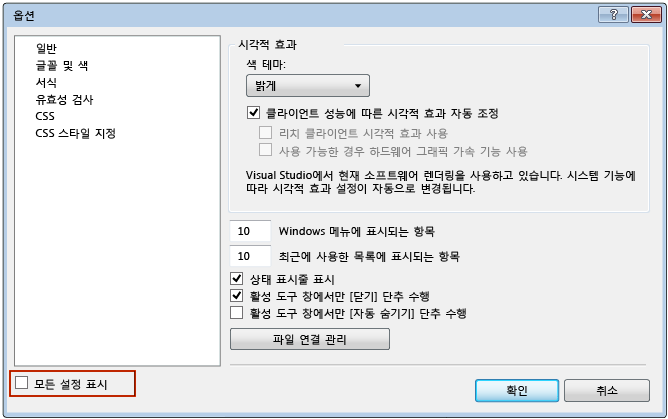  
  
 이 예제에서는 IDE의 색 테마를 밝은색에서 어두운색으로 변경합니다.  원하는 경우 프로젝트 만들기 과정으로 건너뛸 수 있습니다.  
  
#### <a name="to-change-the-color-theme-of-the-ide"></a>IDE의 색 테마를 변경하려면  
  
1.  상단에서 **도구** 메뉴를 선택하고 **옵션...** 항목을 선택하여 **옵션** 대화 상자를 엽니다.  
  
       
  
2.  **색 테마** 를 **어둡게**로 변경한 다음 **확인**을 클릭합니다.  
  
     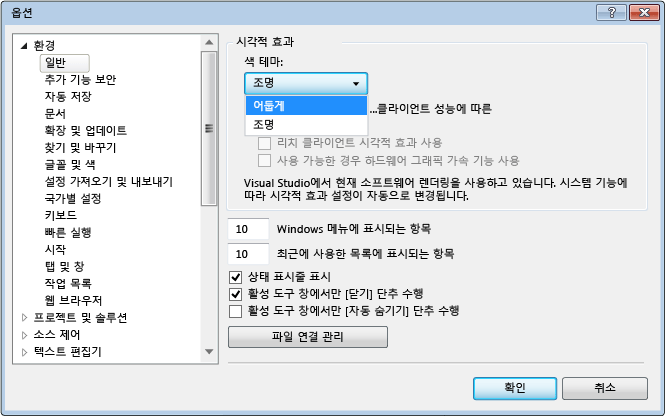  
  
 Visual Studio의 색은 다음 이미지와 일치해야 합니다.  
  
 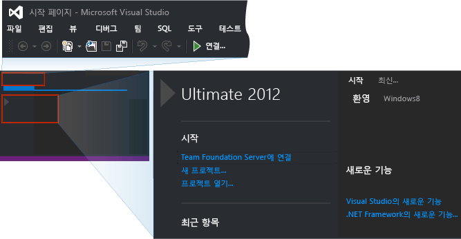  
  
 이 연습의 나머지 부분에서 나오는 그림에 사용된 색 테마는 밝은 테마입니다. IDE 사용자 지정에 대한 자세한 내용은 [Visual Studio IDE 개인 설정](../ide/personalizing-the-visual-studio-ide.md)을 참조하세요.  
  
##  <a name="BKMK_CreateApp"></a> 간단한 응용 프로그램 만들기  
  
### <a name="create-the-project"></a>프로젝트를 만듭니다.  
 Visual Studio에서 응용 프로그램을 만들 때 먼저 프로젝트와 솔루션을 만들어야 합니다. 이 예제에서는 WPF(Windows Presentation Foundation) 프로젝트를 만듭니다.  
  
##### <a name="to-create-the-wpf-project"></a>WPF 프로젝트를 만들려면  
  
1.  새 프로젝트를 만듭니다. 메뉴 모음에서 **파일**, **새로 만들기**, **프로젝트...**를 차례로 선택합니다.  
  
     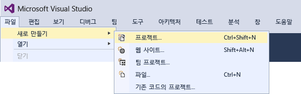  
  
     **빠른 실행** 상자에 **새 프로젝트** 를 입력해도 같은 작업이 수행됩니다.  
  
       
  
2.  예를 들어 왼쪽 창에서 **설치됨**, **템플릿**, **Visual C#**, **Windows**를 차례로 선택한 다음 가운데 창에서 WPF 응용 프로그램을 선택하여 Visual Basic 또는 Visual C# WPF 응용 프로그램 템플릿을 선택합니다.  새 프로젝트 대화 상자 아래쪽의 프로젝트 이름을 HelloWPFApp으로 지정합니다.  
  
       
  
     또는  
  
     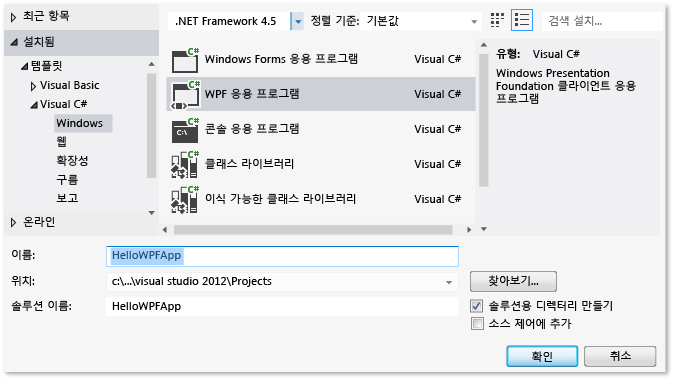  
  
 HelloWPFApp 프로젝트 및 솔루션이 만들어지고 **솔루션 탐색기** 에 다양한 파일이 표시됩니다. WPF Designer는 분할 뷰에 디자인 뷰와 MainWindow.xaml의 XAML 뷰를 표시합니다. 분할자를 밀어 뷰를 더 많이 표시하거나 더 적게 표시할 수 있습니다.  시각적 뷰만 표시하거나 XAML 뷰만 표시하도록 선택할 수 있습니다. 자세한 내용은 [Windows Forms 개발자용 WPF 디자이너](http://msdn.microsoft.com/en-us/47ad0909-e89b-4996-b4ac-874d929f94ca)를 참조하세요. 다음 항목이 **솔루션 탐색기**에 나타납니다.  
  
 그림 5: 프로젝트 항목  
  
   
  
 프로젝트를 만든 후 사용자 지정할 수 있습니다. **보기** 메뉴에 있는 **속성** 창을 사용하여 프로젝트 항목, 컨트롤 및 응용 프로그램의 기타 항목에 대한 옵션을 표시하고 변경할 수 있습니다. 프로젝트 속성 및 속성 페이지를 사용하여 프로젝트 및 솔루션의 옵션을 표시하고 변경할 수 있습니다.  
  
##### <a name="to-change-the-name-of-mainwindowxaml"></a>MainWindow.xaml의 이름을 변경하려면  
  
1.  다음 절차에서 MainWindow에 보다 구체적인 이름을 지정하겠습니다. **솔루션 탐색기**에서 MainWindow.xaml을 선택합니다. **속성** 창이 표시되어야 하지만 표시되지 않는 경우 **보기** 메뉴 및 **속성 창** 항목을 선택합니다. **파일 이름** 속성을 `Greetings.xaml`로 변경합니다.  
  
       
  
     **솔루션 탐색기** 에는 파일의 이름이 지금은 Greetings.xaml로 표시되고, 노드에 포커스를 두고 오른쪽 화살표 키를 눌러 MainWindow.xaml 노드를 확장하면 이제 MainWindow.xaml.vb 또는 MainWindow.xaml.cs의 이름이 Greetings.xaml.vb 또는 Greetings.xaml.cs로 된 것을 알 수 있습니다. 이 코드 파일은 .xaml 파일과 서로 밀접하게 관련되어 있음을 나타내기 위해 이 파일 노드 아래에 중첩됩니다.  
  
    > [!WARNING]
    >  이 변경으로 인해 이후 단계에서 디버깅하고 수정하는 방법을 배울 수 있는 오류가 발생합니다.  
  
2.  **솔루션 탐색기**의 디자이너 뷰에서 노드에 포커스가 있는 상태로 Enter 키를 눌러 Greetings.xaml을 열고 마우스를 사용하여 창의 제목 표시줄을 선택합니다.  
  
3.  **속성** 창에서 **Title** 속성의 값을 `Greetings`로 변경합니다.  
  
 MainWindow.xaml의 제목 표시줄에 이제 Greetings가 표시됩니다.  
  
### <a name="design-the-user-interface-ui"></a>사용자 인터페이스(UI) 디자인  
 이 응용 프로그램에 TextBlock 컨트롤 1개, RadioButton 컨트롤 2개 및 Button 컨트롤 1개 등 세 가지 유형의 컨트롤을 추가합니다.  
  
##### <a name="to-add-a-textblock-control"></a>TextBlock 컨트롤을 추가하려면  
  
1.  **보기** 메뉴 및 **도구 상자** 항목을 선택하여 **도구 상자** 창을 엽니다.  
  
2.  **도구 상자**에서 TextBlock 컨트롤을 찾습니다.  
  
     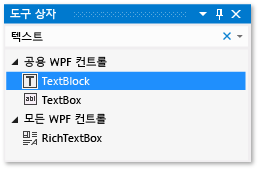  
  
3.  TextBlock 항목을 선택한 후 디자인 화면의 창으로 끌어와서 디자인 화면에 TextBlock 컨트롤을 추가합니다.  컨트롤을 창 상단의 가운데에 배치합니다.  
  
 해당 창은 다음 그림과 유사합니다.  
  
 그림 7: TextBlock 컨트롤이 있는 Greetings 창  
  
 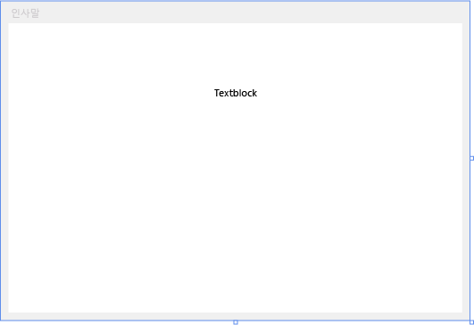  
  
 XAML 태그는 다음과 유사합니다.  
  
```  
<TextBlock HorizontalAlignment="Center" TextWrapping="Wrap" VerticalAlignment="Center" RenderTransformOrigin="4.08,2.312" Margin="237,57,221,238"><Run Text="TextBlock"/><InlineUIContainer><TextBlock TextWrapping="Wrap" Text="TextBlock"/>  
```  
  
##### <a name="to-customize-the-text-in-the-text-block"></a>텍스트 블록의 텍스트를 사용자 지정하려면  
  
1.  XAML 뷰에서 TextBlock의 태그를 찾아 Text 특성을 다음과 같이 변경합니다. `Text="Select a message option and then choose the Display button."`  
  
2.  TextBlock이 디자인 뷰에 맞게 확장되지 않은 경우 가장자리의 잡기 핸들로 TextBlock 컨트롤을 확대하여 전체 텍스트가 표시되도록 합니다.  
  
3.  Ctrl+S를 누르거나 **파일** 메뉴 항목을 사용하여 변경 내용을 저장합니다.  
  
 다음에는 [RadioButton](/dotnet/framework/wpf/controls/radiobutton) 컨트롤 두 개를 폼에 추가합니다.  
  
##### <a name="to-add-radio-buttons"></a>라디오 단추를 추가하려면  
  
1.  **도구 상자**에서 RadioButton 컨트롤을 찾습니다.  
  
     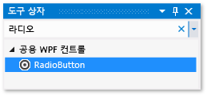  
  
2.  RadioButton 항목을 선택한 후 디자인 화면의 창에 두 번 끌어와서 두 개의 RadioButton 컨트롤을 디자인 화면에 추가하고, 이러한 단추가 TextBlock 컨트롤 아래에 나란히 표시되도록 단추를 선택한 후 화살표 키를 사용하여 단추를 이동합니다.  
  
     창이 다음과 같이 나타납니다.  
  
     그림 8: Greetings 창의 RadioButton  
  
     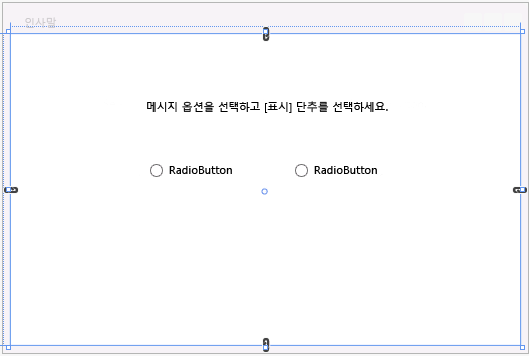  
  
3.  왼쪽 RadioButton 컨트롤의 **속성** 창에서 **속성** 창 맨 위에 있는 속성인 **Name** 속성을 `RadioButton1`로 변경합니다.  양식의 배경 모눈이 아닌 RadioButton을 선택해야 합니다. 속성 창에서 이름 필드 아래의 형식 필드에는 RadioButton이 표시되어야 합니다.  
  
4.  오른쪽 RadioButton 컨트롤의 **속성** 창에서 **Name** 속성을 `RadioButton2`로 변경한 다음 Ctrl+S를 누르거나 **파일** 메뉴 항목을 사용하여 변경 사항을 저장합니다.  변경 및 저장을 수행하기 전에 RadioButton을 선택해야 합니다.  
  
 이제 각 RadioButton 컨트롤에 대한 표시 텍스트를 추가할 수 있습니다. 다음 절차는 RadioButton 컨트롤에 대한 **Content** 속성을 업데이트합니다.  
  
##### <a name="to-add-display-text-for-each-radio-button"></a>각 라디오 단추에 표시할 텍스트를 추가하려면  
  
1.  디자인 화면에서 마우스 오른쪽 단추로 RadioButton1을 선택하여 RadioButton1의 바로 가기 메뉴를 열고 **텍스트 편집**을 선택한 후 `Hello`를 입력합니다.  
  
2.  마우스 오른쪽 단추로 RadioButton2를 선택하여 RadioButton2의 바로 가기 메뉴를 열고 **텍스트 편집**을 선택한 후 `Goodbye`를 입력합니다.  
  
 추가할 마지막 UI 요소는 [Button](/dotnet/framework/wpf/controls/button) 컨트롤입니다.  
  
##### <a name="to-add-the-button-control"></a>단추 컨트롤을 추가하려면  
  
1.  **도구 상자**에서 **Button** 컨트롤을 검색해서 Button을 선택한 다음 디자인 뷰의 폼으로 끌어와 RadioButton 컨트롤 아래의 디자인 화면에 추가합니다.  
  
2.  XAML 뷰에서 Button 컨트롤의 **Content** 값을 `Content="Button"` 에서 `Content="Display"`로 변경한 다음 Ctrl+S를 누르거나 **파일** 메뉴를 사용하여 변경 내용을 저장합니다.  
  
     태그는 다음 예제와 유사합니다. `<Button Content="Display" HorizontalAlignment="Left" VerticalAlignment="Top" Width="75" Margin="215,204,0,0"/>`  
  
 해당 창은 다음 그림과 유사합니다.  
  
 그림 9: 마지막 Greetings UI  
  
 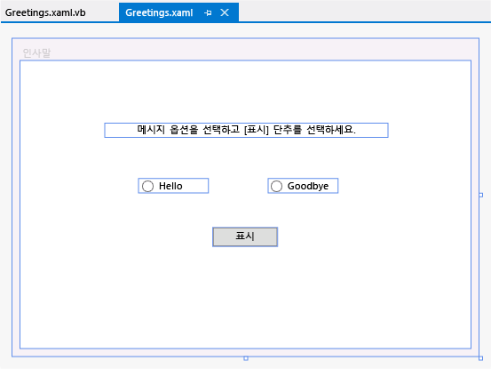  
  
### <a name="add-code-to-the-display-button"></a>표시 버튼에 코드 추가  
 이 응용 프로그램을 실행하면 사용자가 먼저 라디오 단추를 선택한 다음 **표시** 단추를 선택하면 메시지 상자가 나타납니다. Hello에 대한 메시지 상자가 하나 나타나고 Goodbye에 대한 메시지 상자가 하나 나타납니다. 이 동작을 만들려면 Greetings.xaml.vb 또는 Greetings.xaml.cs에서 Button_Click 이벤트에 코드를 추가합니다.  
  
##### <a name="add-code-to-display-message-boxes"></a>메시지 상자를 표시하는 코드를 추가합니다.  
  
1.  디자인 화면에서 **표시** 단추를 두 번 클릭합니다.  
  
     Greetings.xaml.vb 또는 Greetings.xaml.cs는 Button_Click 이벤트에 커서가 있는 상태에서 열립니다. 또한 다음과 같이 click 이벤트 처리기를 추가할 수도 있습니다. 붙여넣은 코드의 이름 아래에 빨간색 물결 무늬가 있는 경우 디자인 화면에서 RadioButton 컨트롤을 선택하고 이름을 바꾸지 않았을 수 있습니다.  
  
     Visual Basic에 대한 이벤트 처리기는 다음과 같습니다.  
  
    ```vb#  
    Private Sub Button_Click_1(sender As Object, e As RoutedEventArgs)  
  
    End Sub  
    ```  
  
     Visual C#에 대한 이벤트 처리기는 다음과 같습니다.  
  
    ```c#  
    private void Button_Click_1(object sender, RoutedEventArgs e)  
    {  
  
    }  
    ```  
  
2.  Visual Basic의 경우 다음 코드를 입력합니다.  
  
    ```vb#  
    If RadioButton1.IsChecked = True Then  
        MessageBox.Show("Hello.")  
    Else RadioButton2.IsChecked = True  
        MessageBox.Show("Goodbye.")  
    End If  
  
    ```  
  
     Visual C#의 경우 다음 코드를 입력합니다.  
  
    ```  
    if (RadioButton1.IsChecked == true)  
    {  
        MessageBox.Show("Hello.");  
    }  
    else  
    {  
        RadioButton2.IsChecked = true;  
        MessageBox.Show("Goodbye.");  
    }  
    ```  
  
3.  응용 프로그램을 저장합니다.  
  
##  <a name="BKMK_DebugTest"></a> 응용 프로그램 디버깅 및 테스트  
 그런 다음 응용 프로그램을 디버그하여 오류를 검색하고 두 메시지 상자가 모두 제대로 나타나는지 테스트합니다. 다음 지침에서는 디버거를 빌드하고 시작하는 방법을 설명하지만 나중에 [WPF 응용 프로그램 빌드(WPF)](/dotnet/framework/wpf/app-development/building-a-wpf-application-wpf) 및 [WPF 디버그](../debugger/debugging-wpf.md)에서 추가 정보를 확인할 수 있습니다.  
  
### <a name="find-and-fix-errors"></a>오류 찾기 및 수정  
 이 단계에서는 이전에 주 창 XAML 파일의 이름을 변경해서 발생시킨 오류를 찾습니다.  
  
##### <a name="to-start-debugging-and-find-the-error"></a>디버깅을 시작하고 오류를 찾으려면  
  
1.  **디버그**를 선택한 다음 **디버깅 시작**을 선택하여 디버거를 시작합니다.  
  
       
  
     IOException이 발생했음을 나타내는 다음과 같은 대화 상자가 나타납니다. ‘mainwindow.xaml’ 리소스가 없습니다.  
  
2.  **확인** 단추를 선택한 다음 디버거를 중지합니다.  
  
     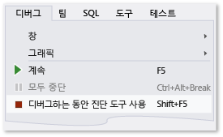  
  
 이 연습을 시작할 때 Mainwindow.xaml의 이름을 Greetings.xaml로 바꾸었지만 코드가 여전히 응용 프로그램의 시작 URI로 Mainwindow.xaml을 나타내고 있으므로 프로젝트를 시작할 수 없습니다.  
  
##### <a name="to-specify-greetingsxaml-as-the-startup-uri"></a>Greetings.xaml을 시작 URI로 지정하려면  
  
1.  **솔루션 탐색기**의 XAML 뷰(디자인 뷰에서 열 수 없음)에서 App.xaml 파일(C# 프로젝트의 경우) 또는 Application.xaml 파일(Visual Basic 프로젝트의 경우)을 선택하고 Enter 키를 누르거나 파일을 두 번 클릭하여 엽니다.  
  
2.  `StartupUri="MainWindow.xaml"` 을 `StartupUri="Greetings.xaml"`로 변경한 다음 Ctrl+S를 눌러 변경 내용을 저장합니다.  
  
 F5 키를 눌러 디버거를 다시 시작합니다. 응용 프로그램의 Greetings 창이 표시됩니다.  
  
### <a name="to-debug-with-breakpoints"></a>중단점으로 디버깅하려면  
 일부 중단점을 추가하여 디버깅하는 동안 코드를 테스트할 수 있습니다. 기본 메뉴에서 **디버그** , **중단점 설정/해제** 를 선택하거나 중단시킬 코드 줄 옆의 편집기 왼쪽 여백을 클릭하여 중단점을 추가할 수 있습니다.  
  
##### <a name="to-add-breakpoints"></a>중단점을 추가하려면  
  
1.  Greetings.xaml.vb 또는 Greetings.xaml.cs를 열고 다음 줄을 선택합니다. `MessageBox.Show("Hello.")`  
  
2.  메뉴에서 **디버그**를 선택한 다음 **중단점 설정/해제**를 선택하여 중단점을 추가합니다.  
  
     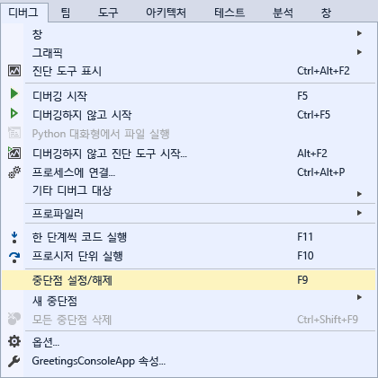  
  
     편집기 창의 맨 왼쪽 여백 코드 줄 옆에 빨간색 원이 나타납니다.  
  
3.  `MessageBox.Show("Goodbye.")`줄을 선택합니다.  
  
4.  F9 키를 눌러 중단점을 추가한 다음 F5 키를 눌러 디버깅을 시작합니다.  
  
5.  **Greetings** 창에서 **Hello** 라디오 단추를 선택한 다음 **표시** 단추를 선택합니다.  
  
     `MessageBox.Show("Hello.")` 줄이 노란색으로 강조 표시됩니다. IDE 하단에 있는 자동, 로컬 및 조사식 창은 모두 왼쪽에 도킹되고 호출 스택, 중단점, 명령, 직접 실행 및 출력 창은 모두 오른쪽에 도킹됩니다.  
  
6.  메뉴 모음에서 **디버그**, **프로시저 나가기**를 선택합니다.  
  
     응용 프로그램은 실행을 다시 시작하고 “Hello”라는 단어가 포함된 메시지 상자가 나타납니다.  
  
7.  메시지 상자에서 **확인** 단추를 선택하여 닫습니다.  
  
8.  **Greetings** 창에서 **Goodbye** 라디오 단추를 선택한 다음 **표시** 단추를 선택합니다.  
  
     `MessageBox.Show("Goodbye.")` 줄이 노란색으로 강조 표시됩니다.  
  
9. F5 키를 선택하여 계속 디버깅합니다. 메시지 상자가 나타나면 메시지 상자에서 **확인** 단추를 선택하여 닫습니다.  
  
10. 먼저 Shift 키를 누른 상태에서 F5 키를 눌러 디버깅을 중지합니다.  
  
11. 메뉴 모음에서 **디버그**, **모든 중단점 해제**를 선택합니다.  
  
### <a name="build-a-release-version-of-the-application"></a>응용 프로그램 릴리스 버전 빌드  
 모든 것이 작동하는 것을 확인했으므로 응용 프로그램의 릴리스 빌드를 준비할 수 있습니다.  
  
##### <a name="to-clean-the-solution-files-and-build-a-release-version"></a>솔루션 파일을 정리하고 릴리스 버전을 빌드하려면  
  
1.  기본 메뉴에서 **빌드**를 선택한 다음 **솔루션 정리** 를 선택하여 이전 빌드 과정에서 만들어진 중간 파일과 출력 파일을 삭제합니다.  꼭 필요한 작업은 아니지만 이 과정을 통해 디버그 빌드 출력이 정리됩니다.  
  
     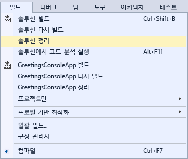  
  
2.  도구 모음에서 드롭다운 컨트롤(현재 “디버그”로 표시)을 사용하여 HelloWPFApp의 빌드 구성을 **디버그**에서 **릴리스**로 변경합니다.  
  
       
  
3.  **빌드**를 선택한 다음 **솔루션 빌드** 를 선택하거나 F6 키를 눌러 솔루션을 빌드합니다.  
  
       
  
 이 연습을 완료한 것을 축하 드립니다! 솔루션 및 프로젝트 디렉터리(...\HelloWPFApp\HelloWPFApp\bin\Release\\)에서 빌드한 .exe를 찾을 수 있습니다. 더 많은 예제를 탐색하려는 경우 [Visual Studio 샘플](../ide/visual-studio-samples.md)을 참조하세요.  
  
## <a name="see-also"></a>참고 항목  
 [Visual Studio 2017의 새로운 기능](../ide/whats-new-in-visual-studio.md)   
 [Visual Studio에서 개발 시작](../ide/get-started-developing-with-visual-studio.md)   
 [생산성 팁](../ide/productivity-tips-for-visual-studio.md)
