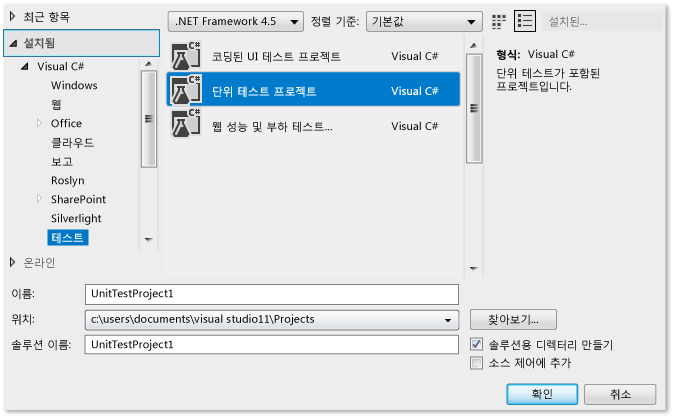
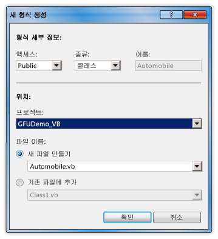
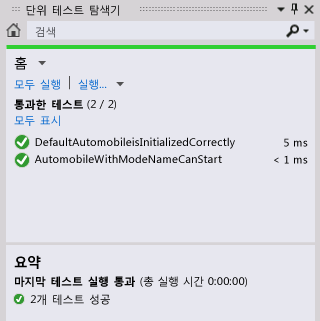

# 연습: 관례에서 생성 기능을 통한 테스트 우선 개발

이 항목에서는 테스트 우선 개발을 지원하는 [관례에서 생성](../ide/visual-csharp-intellisense.md#generate-from-usage) 기능을 사용하는 방법을 보여 줍니다.  
  
 *테스트 우선 개발* 은 먼저 제품 사양에 따라 단위 테스트를 작성한 다음 테스트에 성공하는 데 필요한 소스 코드를 작성하는 소프트웨어 디자인 방식입니다. Visual Studio는 정의하기 전에 테스트 사례에서 처음 참조할 때 소스 코드에서 새 형식과 멤버를 생성하여 테스트 우선 개발을 지원합니다.  
  
 Visual Studio는 워크플로를 중단을 최소화하면서 새 형식과 멤버를 생성합니다. 코드에서 현재 위치를 벗어나지 않고 형식, 메서드, 속성, 필드 또는 생성자에 대한 스텁을 만들 수 있습니다. 형식 생성 옵션을 지정할 수 있는 대화 상자를 여는 경우 대화 상자를 닫으면 포커스가 즉시 현재 열린 파일로 돌아갑니다.  
  
 Visual Studio와 통합된 테스트 프레임워크와 함께 사용법에서 생성 기능을 사용할 수 있습니다. 이 항목에서는 Microsoft 단위 테스트 프레임워크를 보여 줍니다.  
  
[!INCLUDE[note_settings_general](../data-tools/includes/note_settings_general_md.md)]  
  
### Windows 클래스 라이브러리 프로젝트 및 테스트 프로젝트를 만들려면  
  
1.  [!INCLUDE[csprcs](../data-tools/includes/csprcs_md.md)] 또는 [!INCLUDE[vbprvb](../code-quality/includes/vbprvb_md.md)]에서 새 **Windows 클래스 라이브러리** 프로젝트를 만듭니다. 사용하는 언어에 따라 이름을 `GFUDemo_VB` 또는 `GFUDemo_CS`로 지정합니다.  
  
2.  **솔루션 탐색기**에서 맨 위의 솔루션 아이콘을 마우스 오른쪽 단추로 클릭하고 **추가**를 선택한 다음 **새 프로젝트**를 선택합니다. **새 프로젝트** 대화 상자의 왼쪽 창에서 **테스트**를 선택합니다.  
  
3.  가운데 창에서 **단위 테스트 프로젝트**를 선택하고 기본 이름인 UnitTestProject1을 적용합니다. 다음 그림에서는 [!INCLUDE[csprcs](../data-tools/includes/csprcs_md.md)]에 표시되는 경우의 대화 상자를 보여 줍니다. [!INCLUDE[vbprvb](../code-quality/includes/vbprvb_md.md)]에서도 대화 상자가 유사하게 표시됩니다.  
  
       
  
4.  **확인** 을 선택하여 **새 프로젝트** 대화 상자를 닫습니다.  

### 클래스 라이브러리 프로젝트에 참조를 추가하려면

1.  **솔루션 탐색기**의 단위 테스트 프로젝트 아래에서 **참조** 항목을 마우스 오른쪽 단추로 클릭하고 **참조 추가**를 선택합니다.

2.  **참조 관리자** 대화 상자에서 **프로젝트**를 선택한 다음 클래스 라이브러리 프로젝트를 선택합니다.

3.  **확인**을 선택하여 **참조 관리자** 대화 상자를 닫습니다.  
    
4.  솔루션을 저장합니다. 이제 테스트 작성을 시작할 준비가 되었습니다.  
  
### 단위 테스트에서 새 클래스를 생성하려면  
  
1.  테스트 프로젝트에는 UnitTest1이라는 파일이 포함되어 있습니다. **솔루션 탐색기**에서 이 파일을 두 번 클릭하여 코드 편집기에서 엽니다. 테스트 클래스 및 테스트 메서드가 생성되었습니다.  
  
2.  `UnitTest1` 클래스에 대한 선언을 찾아서 이름을 `AutomobileTest`로 바꿉니다.  
  
 > [!NOTE]
 >  이제 IntelliSense는 IntelliSense 문 완성을 위해 *완성 모드* 및 *제안 모드*라는 두 가지 대안을 제공합니다. 클래스 및 멤버를 정의하기 전에 사용하는 경우에는 제안 모드를 사용합니다. IntelliSense 창이 열려 있으면 **Ctrl+Alt+스페이스바**를 눌러 완성 모드와 제안 모드 간을 전환할 수 있습니다. 자세한 내용은 [Using IntelliSense](../ide/using-intellisense.md) 를 참조하세요. 제안 모드는 다음 단계에서 `Automobile` 을 입력할 때 도움이 됩니다.  
  
3.  `TestMethod1()` 메서드를 찾아서 이름을 `DefaultAutomobileIsInitializedCorrectly()`로 바꿉니다. 이 메서드 내에서 다음 스크린샷과 같이 `Automobile`이라는 클래스의 새 인스턴스를 만듭니다. 컴파일 타임 오류를 나타내는 물결선이 표시되고 왼쪽 여백(C#에만 해당) 또는 가리키는 경우 오류 표시선 바로 아래에 [빠른 작업](../ide/quick-actions.md) 전구가 나타납니다.  
  
       

       
  
4.  빠른 작업 전구를 선택하거나 클릭합니다. `Automobile` 유형이 정의되지 않았다는 오류 메시지가 표시됩니다. 또한 몇 가지 솔루션이 표시됩니다.  
  
5. **새 형식 생성...** 을 클릭하여 **형식 생성** 대화 상자를 엽니다. 이 대화 상자는 다른 프로젝트에서 형식 생성을 포함하는 옵션을 제공합니다.  

6. **프로젝트** 목록에서 **GFUDemo\_VB** 또는 **GFUDemo_CS**를 클릭하여 테스트 프로젝트 대신 클래스 라이브러리 프로젝트에 파일을 추가하도록 Visual Studio에 지시합니다. 선택되어 있지 않은 경우 **새 파일 만들기**를 선택하고 이름을 **Automobile.cs** 또는 **Automobile.vb**로 지정합니다.  
  
       
  
6.  **확인** 을 클릭하여 대화 상자를 닫고 새 파일을 만듭니다.  
  
7.  **솔루션 탐색기**의 GFUDemo_VB 또는 GFUDemo_CS 프로젝트 노드 아래에서 새 Automobile.vb 또는 Automobile.cs 파일이 있는지 확인합니다. 코드 편집기에서 포커스는 여전히 `AutomobileTest.DefaultAutomobileIsInitializedCorrectly`에 있으며 이를 통해 최소한의 사용 중단으로 테스트를 계속해서 작성할 수 있습니다.  
  
### 속성 스텁을 생성하려면  
제품 사양에 따라 `Automobile` 클래스에 `Model` 및 `TopSpeed`라는 두 개의 공용 속성이 있다고 가정합니다. 이러한 속성은 기본값 `"Not specified"` 및 `-1` 을 사용하여 기본 생성자에서 초기화되어야 합니다. 다음 단위 테스트는 기본 생성자가 속성을 올바른 기본값으로 설정하는지 확인합니다.  
  
1. 다음 코드 줄을 `DefaultAutomobileIsInitializedCorrectly` 테스트 메서드에 추가합니다.  
  
     [!code-csharp[VbTDDWalkthrough#1](../ide/codesnippet/CSharp/walkthrough-test-first-support-with-the-generate-from-usage-feature_1.cs)]
     [!code-vb[VbTDDWalkthrough#1](../ide/codesnippet/VisualBasic/walkthrough-test-first-support-with-the-generate-from-usage-feature_1.vb)]  
  
2. 코드에서 두 개의 정의되지 않은 `Automobile`속성을 참조하기 때문에 `Model` 및 `TopSpeed` 아래에 물결선이 나타납니다. `Model` 위로 마우스를 가져가고 빠른 작업 전구를 선택한 다음 **속성 'Automobile.Model' 생성**을 선택합니다.  

3. 동일한 방식으로 `TopSpeed` 속성에 대한 속성 스텁을 생성합니다.  
  
     `Automobile` 클래스에서 새 속성의 형식이 컨텍스트에서 올바르게 유추됩니다.  
  
### 새로운 생성자에 대한 스텁을 생성하려면  
이제 생성자 스텁을 생성하여 `Model` 및 `TopSpeed` 속성을 초기화하는 테스트 메서드를 만들겠습니다. 나중에 더 많은 코드를 추가하여 테스트를 완료합니다.  

1. 다음과 같은 추가 테스트 메서드를 `AutomobileTest` 클래스에 추가합니다.  
  
     [!code-csharp[VbTDDWalkthrough#2](../ide/codesnippet/CSharp/walkthrough-test-first-support-with-the-generate-from-usage-feature_2.cs)]
     [!code-vb[VbTDDWalkthrough#2](../ide/codesnippet/VisualBasic/walkthrough-test-first-support-with-the-generate-from-usage-feature_2.vb)]  
  
2.  빨간색 물결선 아래의 빠른 작업 전구를 클릭한 다음 **'Automobile'에서 생성자 생성**을 클릭합니다.  

     `Automobile` 클래스 파일에서 새로운 생성자가 생성자 호출에 사용되는 지역 변수의 이름을 검사하고 `Automobile` 클래스에서 동일한 이름을 가진 속성을 찾고 `Model` 및 `TopSpeed` 속성에 인수 값을 저장하는 코드를 생성자 본문에 제공한 것을 확인합니다.
  

3.  새로운 생성자를 생성하면 `DefaultAutomobileIsInitializedCorrectly`의 기본 생성자 호출 아래에 물결선이 표시됩니다. `Automobile` 클래스에 인수를 사용하지 않는 생성자가 없다는 오류 메시지가 나타납니다. 매개 변수가 없는 명시적 기본 생성자를 생성하려면 빠른 작업 전구를 클릭한 다음 **'Automobile'에서 생성자 생성**을 클릭합니다.  
  
### 메서드에 대한 스텁을 생성하려면  
`Automobile` 및 `Model` 속성이 기본값이 아닌 다른 값으로 설정된 경우 사양에 따라 새 `TopSpeed` 을 실행 중 상태로 전환할 수 있다고 가정합니다.  

1. `AutomobileWithModelNameCanStart` 메서드에 다음 줄을 추가합니다.
  
     [!code-csharp[VbTDDWalkthrough#3](../ide/codesnippet/CSharp/walkthrough-test-first-support-with-the-generate-from-usage-feature_3.cs)]
     [!code-vb[VbTDDWalkthrough#3](../ide/codesnippet/VisualBasic/walkthrough-test-first-support-with-the-generate-from-usage-feature_3.vb)]  
  
2.  `myAuto.Start` 메서드 호출에 대한 빠른 작업 전구를 클릭한 다음 **메서드 'Automobile.Start' 생성**을 클릭합니다.  
  
3.  `IsRunning` 속성에 대한 빠른 작업 전구를 클릭한 다음 **속성 'Automobile.IsRunning' 생성**을 클릭합니다.  

     `Automobile` 클래스는 이제 `Start()`라는 메서드 및 `IsRunning`이라는 속성을 포함합니다.  
  
### 테스트를 실행하려면  
  
1.  **테스트** 메뉴에서 **실행**, **모든 테스트**를 선택합니다.  

     **실행**, **모든 테스트** 명령은 현재 솔루션에 대해 작성된 모든 테스트 프레임워크의 모든 테스트를 실행합니다. 이 경우 두 가지 테스트가 있으며 둘 다 예상대로 실패합니다. `DefaultAutomobileIsInitializedCorrectly` 테스트는 `Assert.IsTrue` 조건이 `False`를 반환하기 때문에 실패합니다. `AutomobileWithModelNameCanStart` 테스트는 `Start` 클래스의 `Automobile` 메서드에서 예외가 발생하기 때문에 실패합니다.  
  
     다음 그림에는 **테스트 결과** 창이 나와 있습니다.  
  
       
  
2.  **테스트 결과** 창에서 각 테스트 결과 행을 두 번 클릭하면 각 테스트 위치로 이동할 수 있습니다.  
  
### 소스 코드를 구현하려면  
  
1.  `Model`, `TopSpeed` 및 `IsRunning` 속성이 모두 올바른 기본값인 `"Not specified"`, `-1`및 `False`(또는 C#의 경우 `false`)로 초기화되도록 기본 생성자에 다음 코드를 추가합니다.  
  
     [!code-csharp[VbTDDWalkthrough#5](../ide/codesnippet/CSharp/walkthrough-test-first-support-with-the-generate-from-usage-feature_5.cs)]
     [!code-vb[VbTDDWalkthrough#5](../ide/codesnippet/VisualBasic/walkthrough-test-first-support-with-the-generate-from-usage-feature_5.vb)]  
  
2.  `Start` 메서드를 호출할 경우 `IsRunning` 또는 `Model` 속성이 기본값 이외의 값으로 설정된 경우에만 `TopSpeed` 플래그를 true로 설정해야 합니다. 메서드 본문에서 `NotImplementedException` 을 제거하고 다음 코드를 추가합니다.  
  
     [!code-csharp[VbTDDWalkthrough#6](../ide/codesnippet/CSharp/walkthrough-test-first-support-with-the-generate-from-usage-feature_6.cs)]
     [!code-vb[VbTDDWalkthrough#6](../ide/codesnippet/VisualBasic/walkthrough-test-first-support-with-the-generate-from-usage-feature_6.vb)]  
  
### 테스트를 다시 실행하려면  
  
- **테스트** 메뉴에서 **실행**을 가리킨 다음 **모든 테스트**를 클릭합니다.  

     이번에는 테스트가 성공합니다. 다음 그림에는 **테스트 결과** 창이 나와 있습니다.  
  
     
  
## 참고 항목  
 [관례에서 생성](../ide/visual-csharp-intellisense.md#generate-from-usage)   
 [코드 작성](../ide/writing-code-in-the-code-and-text-editor.md)   
 [IntelliSense 사용](../ide/using-intellisense.md)   
 [코드 단위 테스트](../test/unit-test-your-code.md)  
 [빠른 작업](../ide/quick-actions.md)  