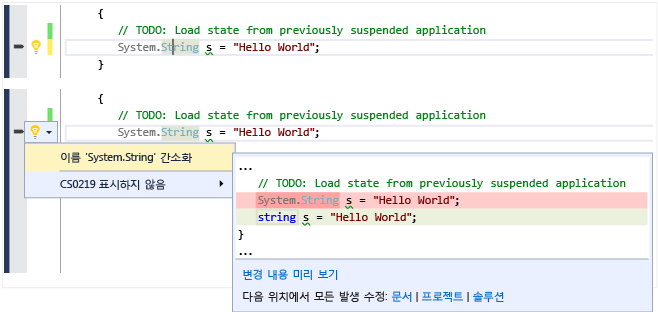
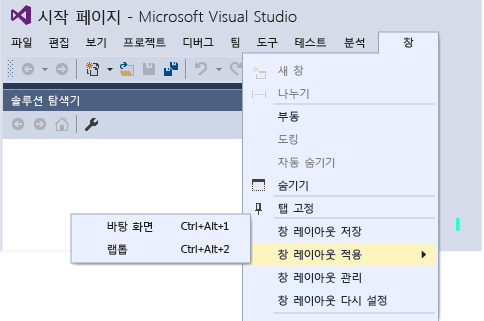

# Visual Studio 2015의 새로운 기능
[!INCLUDE[vs2017banner](../code-quality/includes/vs2017banner.md)]

웹, Windows 스토어, 데스크톱, Android 및 iOS를 위한 최고의 앱과 게임을 만들 수 있는 개발자 생산성 도구, 클라우드 서비스 및 확장의 통합 모음인 Visual Studio 2015를 시작합니다.  
  
 이 페이지는 Visual Studio 2013 업데이트 중 하나에 처음으로 도입된 기능을 포함하여 Visual Studio 2013 RTM 이후 새로 포함된 가장 중요한 기능 중 일부에 대해 주로 다룹니다. Visual Studio 2015의 새로운 기능의 전체 목록은 [릴리스 정보](https://www.visualstudio.com/news/vs2015-vs)를 참조하세요.  
  
 Visual Studio ALM의 다양한 개선 기능과 새로운 기능에 대해 자세히 알아보려면 [Visual Studio 2015 응용 프로그램 수명 주기 관리의 새로운 기능](http://msdn.microsoft.com/ko-kr/54b98a53-6083-4303-869a-8063d8fae938)을 참조하세요.  
  
## 새로운 설치 환경  
 [!INCLUDE[downloadvs](../debugger/includes/downloadvs_md.md)]  
  
 Visual Studio 2015 설치 환경은 필요한 부분만 설치할 수 있도록 구성 요소화되어 있습니다. 따라서 .NET 또는 웹 개발과 관련된 많은 일반적인 시나리오에 맞게 빠른 설치가 가능합니다. 플랫폼 간 모바일 개발과 같은 다른 형식의 개발을 수행하는 경우나 C\+\+ 또는 F\#으로 작업하는 경우에는 **사용자 지정** 설치를 선택한 후 구성 요소와 선택적으로 필요한 타사 SDK를 선택합니다. 사용자 지정 구성 요소를 나중에 설치할 수도 있습니다. 예를 들어 기본 설치를 선택하는 경우 새 C\+\+ 프로젝트를 만들려고 하면 C\+\+ 개발 도구를 다운로드하라는 메시지가 표시됩니다.  
  
   
  
## 여러 계정에 로그인  
 Visual Studio 2015에서는 단순화된 새로운 로그인 환경을 통해 Visual Studio 계정이 여러 개인 경우에도 온라인 리소스에 간편하게 액세스할 수 있습니다. Visual Studio에 로그인하면 컴퓨터의 Visual Studio 2015 및 Blend의 모든 인스턴스에 자동으로 로그인됩니다. 자동으로 로그인되면 설정 로밍이 자동으로 시작됩니다. Visual Studio 2015에서는 기능 간에 계정이 공유되므로 적절한 토큰이 있는 동안에는 **팀 탐색기**에서 Visual Studio Team Services 계정에 액세스하고 서버 탐색기에서 Microsoft Azure 구독의 리소스와 웹 사이트에 액세스할 수 있습니다. 또한 Application Insights 프로젝트의 새 프로젝트 대화 상자에 Azure 리소스가 표시되는 것은 물론, 새 **연결된 서비스 추가** 대화 상자에는 Azure 모바일, Azure 저장소, [Microsoft Office 365](http://msdn.microsoft.com/office/aa905340.aspx) 및 [Saleforce.com developer](https://developer.salesforce.com/) 계정도 표시됩니다.  
  
 새로운 계정 관리자를 통해 여러 사용자 계정을 추가하는 등 Visual Studio에서 여러 사용자 계정으로 작업한 후, 서비스에 연결하거나 온라인 리소스에 액세스할 경우 즉시 이러한 계정 사이를 전환할 수 있습니다. Visual Studio는 Visual Studio 또는 Blend의 모든 인스턴스에서 사용할 수 있도록 추가하는 계정을 기억합니다. 또한 Visual Studio는 다른 장치에서 해당 계정 중 하나로 신속하게 작업을 시작할 수 있도록 개인 설정 계정을 사용하여 계정 목록을 로밍할 예정입니다. 그러나 중요한 자격 증명은 로밍하지 않습니다. 물론 언제든지 계정 설정 대화 상자에서 계정을 제거할 수 있습니다. 시작하려면 [여러 사용자 계정으로 작업](../ide/work-with-multiple-user-accounts.md)을 참조하세요.  
  
   
  
## 대상 플랫폼 선택  
 Visual Studio 2015는 플랫폼 간 모바일 장치 개발을 지원합니다. iOS, Android 및 Windows를 대상으로 하는 앱 및 게임을 작성하고 Visual Studio IDE 내에서 공통 코드베이스를 공유할 수 있습니다. 이러한 새 프로젝트 형식을 파일, 새 프로젝트 대화 상자에서 모두 볼 수 있습니다.  
  
 물론 기존의 데스크톱 응용 프로그램에 대한 지원은 언어, 라이브러리 및 도구의 다양한 향상을 통해 이전보다 더욱 개선되었습니다.  
  
### Xamarin for Visual Studio를 사용하여 C\#으로 작성하는 플랫폼 간 모바일 앱  
 Xamarin은 C\#으로 코드를 작성할 수 있으며 iOS 및 Android API에 기본적으로 바인딩되는 모바일 프레임워크입니다. Microsoft는 공유 코드를 포함하는 단일 솔루션에서 Android, iOS 및 Windows Phone용으로 개발할 수 있는 확장인 Xamarin for Visual Studio 릴리스에서 Xamarin과 긴밀하게 협력했습니다. Xamarin을 사용하면 하나의 언어와 하나의 코드베이스를 사용하므로 플랫폼 사이의 델타가 최소화됩니다.  Xamarin for Visual Studio는 Visual Studio 2010 이상에서 지원됩니다. Visual Studio 2015에는 스타터 버전의 Xamarin기 포함되어 있습니다. 시작하려면 [Visual Studio에서 Xamarin을 사용하여 네이티브 UI로 앱 빌드](../cross-platform/build-apps-with-native-ui-using-xamarin-in-visual-studio.md)를 참조하세요.  
  
### Apache Cordova를 사용하여 HTML\/JavaScript로 작성하는 플랫폼 간 모바일 앱  
 Visual Studio Tools for Apache Cordova는 Microsoft와 오픈 소스 Apache Cordova 커뮤니티 사이의 긴밀한 공동 작업의 결과입니다. 이 도구는 HTML, CSS 및 JavaScript\(또는 Typescript\)를 사용한 플랫폼 간 모바일 개발을 지원합니다. 단일한 코드베이스를 사용하여 Android, iOS 및 Windows를 대상으로 하며 JavaScript IntelliSense, DOM 탐색기, JavaScript 콘솔, 중단점, 조사식, 지역, 내 코드만 등을 포함하는 다양한 Visual Studio IDE를 사용할 수 있습니다.  Visual Studio Tools for Apache Cordova를 사용하여 응용 프로그램은 공통 JavaScript API를 제공하는 플러그인을 통해 모든 플랫폼에서 기본 장치 기능에 액세스할 수 있습니다. 시작하려면 [Visual Studio Tools for Apache Cordova 시작](../Topic/Get%20Started%20with%20Visual%20Studio%20Tools%20for%20Apache%20Cordova1.md)을 참조하세요.  
  
### Unity를 사용하여 C\#으로 작성하는 플랫폼 간 모바일 게임  
 Unity는 다중 플랫폼 2D 및 3D 게임 개발용으로 널리 사용되는 플랫폼입니다. C\#으로 게임을 작성하고 Android, iOS, Windows Phone 및 다수의 다른 플랫폼 에서 기본적으로 실행할 수 있습니다. Visual Studio Tools for Unity는 Unity와 Visual Studio IDE를 통합하는 확장입니다. 이 확장을 통해 Unity 개발자용으로 설계된 생산성 기능 외에 Visual Studio IDE 및 디버거의 모든 기능을 사용할 수 있습니다. Visual Studio Tools for Unity 2.0 Preview 2는 Visual Studio 2015에 대한 지원을 비롯해 지역 창과 조사식 창의 향상된 개체 시각화 같은 다양한 새로운 기능을 추가합니다. Microsoft는 최근에 Visual Studio Tools for Unity의 제작사인 SyntaxTree를 인수했습니다. Visual Studio Tools for Unity 2.0 Preview 2를 다운로드하고 Visual Studio Tools for Unity에 대한 자세한 내용을 보려면 [Visual Studio Tools for Unity 2.0](http://Aka.ms/vstu)을 참조하세요.  
  
### 네이티브 C\+\+용 플랫폼 간 앱 및 라이브러리  
 C\+\+는 대부분의 모바일 장치에서 기본적으로 사용할 수 있는 언어입니다. 이 언어를 사용하여 여러 모바일 플랫폼 대상에 대해 빌드할 수 있는 플랫폼 간 공유 코드 라이브러리를 작성할 수 있습니다. C\+\+를 사용하여 전체 모바일 앱을 만들 수도 있습니다. Visual C\+\+를 사용하여 플랫폼 간 코드를 편집, 빌드, 배포 및 디버그할 수 있습니다. Windows 앱용 템플릿 외에도 Android Native\-Activity 앱, iOS 앱용 템플릿을 사용하여 프로젝트를 만들거나 Xamarin 하이브리드 앱이 포함된 여러 플랫폼에 대해 공유 코드 라이브러리를 사용하여 프로젝트를 만들 수도 있습니다. 플랫폼별 IntelliSense를 사용하면 API를 탐색하고 Android, iOS 또는 Windows 대상에 대한 올바른 코드를 생성할 수 있습니다. x86 또는 ARM 네이티브 플랫폼에 대한 빌드를 구성하거나, 네트워크에 연결된 Mac의 iOS 시뮬레이터 또는 iOS 장치에 코드를 배포하거나 직접 연결된 Android 장치에 코드를 배포하거나, 높은 성능의 Android용 Microsoft Visual Studio 에뮬레이터를 사용하여 테스트할 수 있습니다. Visual Studio 디버거에서 중단점을 설정하고 변수를 조사하고 스택을 보고 단계별로 C\+\+ 코드를 실행할 수 있습니다. 플랫폼에 가장 특정한 코드를 제외한 모든 코드를 여러 앱 플랫폼 간에 공유하고, Visual Studio에서 하나의 솔루션을 사용하여 이 코드를 모두 빌드할 수 있습니다.  
  
 플랫폼 간 C\+\+에서 시작하려면 [Visual C\+\+를 사용하여 플랫폼 간 앱 제작](../misc/build-cross-platform-mobile-apps-with-visual-cpp.md)를 참조하세요.  
  
### Windows 10 장치용 유니버설 Windows 앱  
 유니버설 Windows 플랫폼과 단일 Windows 코어를 사용하여 휴대폰에서 데스크톱에 이르는 모든 Windows 10 장치에서 동일한 앱을 실행할 수 있습니다. Visual Studio 2015 및 유니버설 Windows 앱 개발 도구를 사용하여 이러한 유니버설 Windows 앱을 만듭니다.  
  
   
  
 Windows 10 Phone, Windows 10 데스크톱 또는 Xbox에서 이 앱을 실행합니다. 동일한 앱 패키지입니다. Windows 10 단일 통합 코어가 도입되면서 하나의 앱 패키지를 모든 플랫폼에서 실행할 수 있습니다. 일부 플랫폼에는 플랫폼 특정 동작을 활용하기 위해 앱에 추가할 수 있는 확장 SDK가 있습니다. 예를 들어 모바일용 SDK 확장은 Windows Phone에서 뒤로 단추를 누르는 동작을 처리합니다. 프로젝트에서 확장 SDK를 참조하는 경우 런타임 검사를 추가하여 해당 플랫폼에서 SDK를 사용할 수 있는지 테스트하면 됩니다. 이런 방식으로 각 플랫폼에 동일한 앱 패키지를 사용할 수 있습니다.  
  
 C\#, Visual Basic, C\+\+ 또는 JavaScript를 사용하여 이러한 [유니버설 Windows 앱](http://msdn.microsoft.com/library/dn975273.aspx)\(영문\)을 만들 수 있습니다.  
  
### 웹  
 ASP.NET 5는 MVC, WebAPI 및 SignalR에 대한 주요 업데이트이며 Windows, Mac 및 Linux에서 실행됩니다.  ASP.NET 5는 최신 클라우드 기반 응용 프로그램을 빌드하기 위한 간결하고 구성 가능한 .NET 스택을 제공하도록 처음부터 다시 설계되었습니다. Visual Studio 2015 도구는 Bower 및 Grunt와 같이 인기 있는 웹 개발 도구와 더욱 긴밀하게 통합되었습니다. 시작하려면 [NET 웹 개발 및 도구 블로그](http://blogs.msdn.com/b/webdev/)에서 다양한 블로그 게시물을 참조하세요.  
  
### 기존 데스크톱 및 Windows 스토어  
 Visual Studio 2015는 기존의 데스크톱 및 Windows 스토어 개발을 계속 지원합니다. Windows가 진화함에 따라 Visual Studio도 그에 따라 진화합니다.  Visual Studio 2015에서는 C\+\+용 라이브러리 및 언어는 물론 .NET용 라이브러리 및 언어도 대폭 향상되어 모든 Windows 버전에 적용할 수 있게 되었습니다.  
  
#### .NET Framework  
 Microsoft [!INCLUDE[net_v46](../ide/includes/net_v46_md.md)]에서는 약 150개의 새로운 API와 50개의 업데이트된 API를 통해 더 많은 시나리오를 지원합니다. 예를 들어 이제 더 많은 컬렉션에서 <xref:System.Collections.Generic.IReadOnlyCollection%601>을 구현하므로 컬렉션을 보다 쉽게 사용할 수 있습니다. 또한 ASP.NET 5는 앞에서 언급한 것처럼 첨단 클라우드 기반 앱을 빌드하기 위한 간결한 .NET 플랫폼을 제공합니다.  
  
 따라서 이제 C\#으로 작성되었으며 .NET Framework를 대상으로 하는 Windows Store 앱에서 .NET 네이티브를 활용하여 앱을 IL이 아닌 네이티브 코드로 컴파일할 수 있습니다. 또한 [!INCLUDE[net_v46](../ide/includes/net_v46_md.md)]에서는 64비트 JIT\(Just\-In\-Time\) 컴파일러인 RyuJIT를 추가합니다.  
  
 새로운 C\# 및 VB 컴파일러\("Roslyn"\)는 컴파일 시간을 대폭 개선하고 포괄적인 코드 분석 API를 제공합니다. Visual Studio 2015에서는 Roslyn을 활용하여 인라인 이름 바꾸기, 분석기, 빠른 수정을 비롯해 보다 다양한 리팩터링을 수행합니다.  
  
 C\# 및 Visual Basic 언어 모두 핵심 언어 및 IDE 지원의 작은 향상들을 다양하게 포함합니다. 이러한 개선 사항은 모두 .NET 코딩 환경을 훨씬 더 직관적이고 편리하며 생산성이 뛰어난 공간으로 만드는 데 기여하게 됩니다.  
  
 자세한 내용은 [새로운 기능](../Topic/What's%20New%20in%20the%20.NET%20Framework.md) 및 [.NET 블로그](http://blogs.msdn.com/b/dotnet/)를 참조하세요.  
  
#### C\+\+  
 Visual C\+\+에서는 C\+\+11\/14 언어 규칙이 대폭 개선된 것은 물론, 플랫폼 간 모바일 장치 개발과 다시 시작 가능한 함수 및 await\(현재 C\+\+17에서 표준화하기로 계획\)가 지원되며, CRT\(C 런타임 라이브러리\) 및 C\+\+ STL\(표준 템플릿 라이브러리\) 구현의 개선 사항 및 버그 수정, MFC의 크기 조정 가능한 대화 상자를 비롯해 새로운 컴파일러 최적화 기능, 향상된 빌드 성능, 새로운 진단 기능, 코드 편집기의 새로운 생산성 도구를 제공합니다.  
  
 자세한 내용은 [Visual C\+\+의 새로운 기능](/visual-cpp/top/what-s-new-for-visual-cpp-in-visual-studio-2015) 및 [Visual C\+\+ 블로그](http://blogs.msdn.com/b/vcblog/)를 참조하세요.  
  
## 장치 미리 보기 메뉴 모음  
 유니버설 Windows 플랫폼 프로젝트에서 장치 미리 보기 메뉴 모음을 사용하면 XAML기반 UI가 다양한 화면 크기에서 렌더링되는 방식을 볼 수 있습니다.  
  
   
  
## Visual Studio 그래픽 진단  
 Visual Studio 2013 버전부터 Visual Studio 그래픽 진단에 프레임 분석, Windows Phone 지원, 셰이더 편집 및 적용, 명령줄 캡처 도구와 같은 다양한 새 기능이 추가되었습니다. 또한 DirectX12 앱 디버그를 위한 지원도 추가되었습니다. 자세한 내용은 [Visual Studio 그래픽 진단](../debugger/visual-studio-graphics-diagnostics.md)을 참조하세요.  
  
## 서비스 연결  
 Visual Studio 2015를 사용하면 앱과 서비스를 그 어느 때보다 쉽게 연결할 수 있습니다.  새로운 '연결된 서비스 추가' 마법사는 프로젝트를 구성하고 필요한 인증 지원을 추가하며 필요한 NuGet 패키지를 다운로드하여 신속하고 어려움 없이 서비스에 대한 코딩을 시작할 수 있습니다. '연결된 서비스 추가' 마법사는 또한 새로운 계정 관리자와 통합되어 여러 사용자 계정 및 구독에 대한 작업을 간편하게 수행할 수 있습니다. Visual Studio 2015에서는 다음 서비스에 대한 지원이 기본적으로 제공됩니다\(사용자에게 계정이 있다고 가정\).  
  
1.  Azure 모바일 서비스  
  
2.  Azure 저장소  
  
3.  Office 365\(메일, 연락처, 달력, 파일, 사용자 및 그룹\)  
  
4.  Salesforce  
  
 새 서비스는 지속적으로 추가될 예정이며 마법사의 "새 서비스 찾기 링크"를 클릭하여 검색할 수 있습니다.  
  
   
  
## UI 설계  
 XAML 사용자 인터페이스를 설계하기 위한 Blend 환경이 크게 향상되었습니다. Blend는 보다 직관적인 UI, IntelliSense가 포함된 보다 강력한 XAML 편집 기능, 보다 향상된 Visual Studio 통합을 제공하도록 완전히 다시 설계되었습니다. 자세한 내용은 [Designing XAML in Visual Studio and Blend for Visual Studio](../designers/designing-xaml-in-visual-studio.md)을 참조하세요.  
  
## 플랫폼 간 디버깅 지원  
 Visual Studio를 사용하여 Windows, iOS 및 Android 장치에서 실행되는 네이티브 모바일 앱을 만들고 디버그할 수 있습니다.[Android용 Visual Studio 에뮬레이터](http://blogs.msdn.com/b/visualstudioalm/archive/2014/11/12/introducing-visual-studio-s-emulator-for-android.aspx)\(영문\)를 사용하거나 장치를 연결하고 Visual Studio에서 직접 코드를 디버그합니다.  
  
-   **JavaScript \/ Cordova**.[Visual Studio Tools for Apache Cordova](http://msdn.microsoft.com/library/dn879821\(v=vs.140\).aspx)를 사용하여 JavaScript로 Windows, iOS 및 Android용 네이티브 앱을 빌드합니다.  
  
     MSDN Library의 [앱 디버그](../Topic/Debug%20Your%20App%20Built%20with%20Visual%20Studio%20Tools%20for%20Apache%20Cordova.md)에서 Cordova에 대한 Visual Studio 디버깅 지원에 대해 자세히 설명합니다.  
  
-   **C\# \/ Xamarin**.[Xamarin](http://msdn.microsoft.com/library/dn879698\(v=vs.140\).aspx)을 사용하여 Visual Studio에서 C\#으로 Windows, iOS 및 Android용 네이티브 앱을 빌드합니다.  
  
     [Xamarin 개발자 가이드](http://developer.xamarin.com/guides)의 [디버깅](http://developer.xamarin.com/guides/ios/deployment,_testing,_and_metrics/debugging_in_xamarin_ios/)\(iOS\) 및 [장치에서 디버그](http://developer.xamarin.com/guides/android/deployment,_testing,_and_metrics/debugging_with_xamarin_android/)에서는 디버깅 환경에 대해 설명합니다.  
  
-   **C\+\+ \/ Android**.[플랫폼 간 모바일 개발용 Visual C\+\+](http://msdnstage.redmond.corp.microsoft.com/library/dn872463\(v=vs.140\).aspx) 템플릿을 [Android NDK](https://developer.android.com/tools/sdk/ndk/index.html)\(영문\)와 같은 타사 도구와 함께 사용하여 Windows 및 Android용 네이티브 앱을 만듭니다.  
  
## 디버깅 및 진단  
 디버깅의 새로운 기능에 대한 자세한 내용은 [Visual Studio 2015 디버거의 새로운 기능](../debugger/what’s-new-for-the-debugger-in-visual-studio-2015.md)을 참조하세요.  
  
 진단의 새로운 기능에 대한 자세한 내용은 [진단 도구의 새로운 기능](../profiling/what-s-new-in-profiling-tools.md)을 참조하세요.  
  
 다음은 코드에 대해 다양한 형식의 진단과 분석을 수행하는 새로운 도구 및 향상된 도구입니다.  
  
### PerfTips  
 성능 팁은 디버깅 동안 메서드의 실행 시간을 표시하여, 프로파일러를 호출할 필요 없이 신속하게 병목 현상을 찾아낼 수 있습니다. 시작하려면 [성능 팁: Visual Studio를 사용하여 디버그하는 동안 성능 정보 요약](http://blogs.msdn.com/b/visualstudioalm/archive/2014/08/18/perftips-performance-information-at-a-glance-while-debugging-with-visual-studio.aspx)을 참조하세요.  
  
### 오류 목록  
 이제 오류 목록이 모든 열에서 필터링을 지원합니다. 또한 코드 변경으로 수천 개의 경고가 생성되는 경우에도 입력하는 내용에 따라 전체 C\# 또는 Visual Basic 솔루션의 오류, 경고 및 코드 분석의 실시간 보기를 보여 줍니다. 새로운 오류 목록은 기존 사용법과 호환됩니다. 자세한 내용은 [오류 목록 창](../ide/reference/error-list-window.md)을 참조하세요.  
  
### GPU 사용 도구  
 GPU 사용 도구는 DirectX 앱 및 게임의 GPU 사용 데이터를 수집 및 분석하고, 성능 병목 현상이 CPU 또는 GPU에서 비롯되는지 여부에 상관 없이 문제를 해결할 수 있도록 도와 줍니다. 도구를 시작하려면 [Visual C\+\+ 팀 블로그 게시물](http://blogs.msdn.com/b/vcblog/archive/2014/09/05/gpu-usage-tool-in-visual-studio-2013-update-4-ctp1.aspx)을 참조하세요.  
  
## 라이브 코드 분석\(전구\)  
 새로운 C\# 및 Visual Basic용 Roslyn 컴파일러는 컴파일 시간을 개선할 뿐 아니라, 라이브 코드 분석과 같은 완전히 새로운 시나리오를 지원하여 입력하는 내용에 따라 코드 편집기 내부에서 직접 다양한 사용자 지정 가능 피드백과 제안을 제공합니다. Visual Studio 2015에서 전구는 왼쪽 여백\(키보드 사용 시\) 또는 도구 설명\(마우스 커서로 오류를 가리킬 경우\)에 표시됩니다. 전구는 컴파일러\(사용자 지정 규칙 집합을 사용할 수 있음\)가 코드에서 문제를 감지했음을 실시간으로 알려주고 문제를 해결하는 방법에 대한 제안도 제공합니다. 전구가 나타나면 클릭하여 조치 가능한 제안을 확인합니다.  
  
   
  
## 이러한 추가 IDE 개선 사항 활용  
  
### 동기화된 설정\(로밍 설정\)  
 Visual Studio 2013은 텍스트 편집기, 키 바인딩, 테마 및 글꼴 및 색상, 시작, 환경 별칭과 같이 가장 일반적으로 구성되는 일부 설정에 대해 동기화된 설정을 도입했습니다.  Visual Studio 2015는 더 많은 설정을 동기화하고 Professional, Enterprise, Express SKU, Blend와 같은 Visual Studio 응용 프로그램 제품군 전체에서 설정을 동기화하여 이러한 환경을 향상합니다. Visual Studio 2013에서 사용한 것과 동일한 계정으로 Visual Studio 2015에 처음으로 로그인하면 Visual Studio 2013에서 적용된 동기화된 설정을 볼 수 있습니다.**빠른 실행**에서 "동기화"를 입력하거나 **도구 \> 옵션 \> 환경 \> 동기화된 설정**으로 이동하여 설정에 액세스할 수 있습니다.  
  
### 자동 확장 업데이트  
 이제 Visual Studio 갤러리에서 새 버전을 사용할 수 있는 경우 설치된 Visual Studio 확장이 자동으로 업데이트됩니다. 자동 확장 업데이트를 사용자 지정할 수 있는 방법에 대한 자세한 내용은 [Visual Studio 확장 찾기 및 사용](../ide/finding-and-using-visual-studio-extensions.md)을 참조하세요.  
  
### 제목 대소문자 메뉴  
 사용자의 의견을 반영하였습니다. 원래대로 Visual Studio 메뉴의 첫 글자가 대문자로 표시되도록 바뀌었습니다. 그러나 모두 대문자 스타일이 마음에 든다면 시작 시 또는 **도구 \> 옵션 \> 일반** 속성 페이지에서 설정할 수 있습니다.  
  
   
  
### 고해상도 이미지 및 터치 조작 지원  
 Visual Studio IDE는 밀도가 높은 표시 부분\(메뉴, 상황에 맞는 메뉴, 도구 창 명령 모음과 같은 영역, 솔루션 탐색기의 일부 프로젝트\)에서 고해상도 이미지를 제공합니다. 또한 Visual Studio 코드 편집기 창의 터치 스크린에서 길게 누르기, 손가락 모으기, 누르기 등과 같은 제스처를 사용하여 확대\/축소, 스크롤, 텍스트 선택, 상황에 맞는 메뉴 호출 등을 수행할 수 있습니다.  
  
   
  
### 사용자 지정 레이아웃  
 사용자 지정 창 레이아웃을 만들고 저장하고 로밍할 수 있습니다. 예를 들어 데스크톱 컴퓨터에서 사용할 한 개의 선호하는 레이아웃을 정의하고, 랩톱 또는 작은 화면 장치에서 사용할 다른 레이아웃을 정의할 수 있습니다. 또는 UI 프로젝트에서 사용할 한 개의 레이아웃과 데이터베이스 프로젝트에서 사용할 또 다른 레이아웃을 정의할 수 있습니다. 키 바인딩을 사용하여 레이아웃 간에 빠르게 전환할 수 있습니다. 이러한 레이아웃은 로그인 시 Visual Studio의 모든 인스턴스에서 사용할 수 있습니다. 자세한 내용은 [사용자 지정 창 레이아웃 만들기](../misc/create-custom-window-layouts.md)를 참조하세요.  
  
   
  
### 알림 허브  
 알림 허브에 대한 UI가 쉽고 빠르게 검색할 수 있도록 간소화되었습니다. 성능 문제, 렌더링 문제 및 크래시를 포함하는 기타 종류의 알림이 추가되었으며, 이제 알림 표시를 중지하도록 Visual Studio에 지시할 수 있습니다. 자세한 내용은 [Visual Studio 알림](../ide/visual-studio-notifications.md)을 참조하세요.  
  
### CodeLens: 코드 변경 사항 찾기\(Enterprise 및 Professional Edition에만 해당\)  
 코드에 대한 정보를 찾는 동안 편집기에서 나가지 않고 계속 작업에 집중할 수 있습니다. VSTS\(Visual Studio Team Services\) 또는 TFS\(Team Foundation Server\)에 저장된 코드에 대한 작업 항목, 버그, 코드 검토 등의 변경 내용과 기타 기록을 검토할 수 있습니다.  
  
 Visual Studio Enterprise 및 Visual Studio Professional에서 이제 다음 작업을 수행할 수 있습니다.  
  
-   Visual Studio 편집기에서 전체 코드 파일의 기록을 가져옵니다.  
  
       
  
-   코드를 변경한 사용자를 보여 주는 그래프를 확인합니다. 이는 팀의 변경 내용에서 패턴을 찾고 해당 영향을 평가하는 데 도움이 될 수 있습니다.  
  
       
  
-   코드가 마지막으로 변경된 시기를 쉽게 확인합니다.  
  
-   코드에 영향을 주는 다른 분기의 변경 내용을 찾습니다.  
  
 [CodeLens](../ide/find-code-changes-and-other-history-with-codelens.md)를 참조하세요.  
  
### 디자인 및 모델링 도구\(Enterprise Edition에만 해당\)  
 **코드 맵 및 종속성 그래프**  
  
 Visual Studio Enterprise에서는 코드의 특정 종속성을 파악하려는 경우 코드 맵을 만들어 해당 코드를 시각화합니다. 그런 다음 코드 옆에 표시되는 맵을 사용하여 이러한 관계를 탐색할 수 있습니다. 코드 맵은 또한 코드 작업을 하거나 디버그할 때 코드 내의 위치를 추적하는 데에도 도움이 될 수 있으므로 코드 디자인에 대해 자세히 알아보는 동안 읽게 되는 코드가 줄어듭니다.  
  
 이 릴리스에서는 그룹 선택, 편집, 관리 및 그룹 콘텐츠 레이아웃 변경 등과 관련된 여러 섹션으로 명령을 그룹화하여 코드 포인트 및 링크에 대한 바로 가기 메뉴를 훨씬 더 쉽게 사용할 수 있도록 만들었습니다. 테스트 프로젝트는 다른 프로젝트와 다른 스타일로 표시되며, 맵의 요소에 대한 아이콘이 더 적절한 버전으로 업데이트되었습니다.  
  
   
  
 기타 기능 향상은 다음과 같습니다.  
  
-   **향상된 하향식 다이어그램**. 이제 중간 규모부터 대규모 Visual Studio 솔루션까지 간소화된 아키텍처 메뉴를 사용하여 솔루션에 보다 유용한 코드 맵을 이용할 수 있습니다. 솔루션 어셈블리가 솔루션 폴더별로 그룹화되므로, 컨텍스트 내에서 이를 확인하고 솔루션을 구조화하는 데 투입한 노력을 활용할 수 있습니다. 프로젝트 및 어셈블리 참조를 즉시 확인할 수 있으며, 링크 형식이 나타납니다. 또한 솔루션에 대한 외부 어셈블리가 보다 간결한 방식으로 그룹화됩니다.  
  
-   **테스트 프로젝트는 다른 방식으로 스타일이 지정되며, 필터링이 지원됨**. 이제 테스트 프로젝트의 스타일이 다르게 지정되므로 맵에서 테스트 프로젝트를 쉽고 빠르게 식별할 수 있습니다. 또한 필터도 적용할 수 있으므로, 응용 프로그램의 작업 코드에 집중할 수 있습니다.  
  
-   **간단한 외부 종속성 링크**. 종속성 링크는 더 이상 System.Object, System.ValueType, System.Enum, System.Delegate에서 상속성을 나타내지 않으므로, 코드 맵에서 외부 종속성을 보다 쉽게 확인할 수 있습니다.  
  
-   **'종속성 링크로 드릴인'에서 필터가 사용됨**. 종속성 링크에 대한 기여도를 파악할 때 유용하고 명확한 다이어그램을 이용할 수 있습니다. 이 다이어그램은 덜 복잡하며 선택한 링크 필터링 옵션도 사용할 수 있습니다.  
  
-   **코드 포인트가 해당 컨텍스트와 함께 코드 맵에 추가됨**. 다이어그램이 이제 해당 컨텍스트\(필요한 경우 필터를 적용할 수 있는 어셈블리 및 솔루션 폴더\)와 함께 표시되므로 솔루션 탐색기, 클래스 뷰, 개체 브라우저에서 코드 포인트를 끌어 놓거나 솔루션 탐색기에서 요소를 선택할 때 및 코드 맵에 표시를 선택할 때 보다 유용한 다이어그램을 사용할 수 있습니다.  
  
-   **보다 신속하게 반응 코드 맵 얻기**. 끌어 놓기 작업은 즉각적인 결과를 생산하고 노드 간 링크는 보다 빠르게 생성되며, 이때 노드 확장 또는 추가 노드 요청과 같은 후속 사용자 시작 작업에는 영향을 주지 않습니다. 솔루션을 빌드하지 않고 코드 맵을 만드는 경우, 이제 어셈블리를 작성하지 않은 경우와 같은 비정상적인 상황이 모두 처리됩니다.  
  
-   **솔루션 다시 빌드 건너뛰기.** 다이어그램을 만들고 편집할 때 더 나은 성능을 제공합니다.  
  
-   **코드 포인트 노드 및 그룹 필터링**. 범주별로 코드 포인트를 표시하거나 숨기고 솔루션 폴더, 어셈블리, 네임스페이스, 프로젝트 폴더, 형식별로 코드 포인트를 그룹화하여 맵을 빠르게 정리할 수 있습니다.  
  
-   **관계를 필터링하여 더 읽기 쉬운 다이어그램 만들기**. 링크 필터링은 이제 그룹 간 링크에도 적용되므로, 필터 창을 사용할 때 이전 릴리스보다 작업 방해가 줄어들었습니다.  
  
-   **클래스 뷰 및 개체 브라우저에서 다이어그램 만들기**. 클래스 뷰 및 개체 브라우저 창에서 파일 및 어셈블리를 새 맵이나 기존 맵에 끌어서 놓습니다.  
  
 [솔루션 전체의 종속성 매핑](../modeling/map-dependencies-across-your-solutions.md)을 참조하세요.  
  
 **이 릴리스의 다른 디자인 및 모델링 변경:**  
  
-   **레이어 다이어그램**. 클래스 뷰 및 개체 브라우저를 사용하여 이러한 다이어그램을 업데이트합니다. 소프트웨어 디자인 요구 사항에 충족하기 위해, 레이어 다이어그램을 사용하여 소프트웨어에 대한 원하는 종속성을 설명합니다. 이러한 제약 조건을 충족하지 않는 코드를 찾고 이 기준에 맞춰 향후 코드의 유효성을 검사하여 코드를 이 디자인과 일관되게 유지합니다.  
  
-   **UML 다이어그램**. 이제 코드에서 UML 클래스 다이어그램 및 시퀀스 다이어그램을 만들 수 없습니다. 하지만 새 UML 요소를 사용하여 이러한 다이어그램을 만들 수 있습니다.  
  
-   **아키텍처 탐색기**. 이제 아키텍처 탐색기를 사용하여 다이어그램을 만들 수 없습니다. 하지만 솔루션 탐색기를 사용할 수 있습니다.  
  
## Visual Studio 확장성 도구  
 이제 Visual Studio 확장성 도구\(VS SDK 및 템플릿\)가 설치 시 구성 요소 옵션으로 포함되어 있기 때문에 설치가 쉬워졌습니다.  확장성 도구를 통해 개발자는 Visual Studio에 기능을 추가하고 사용자 지정하도록 확장을 작성할 수 있습니다. Visual Studio 확장성에 대한 자세한 내용은 [Visual Studio SDK](../extensibility/visual-studio-sdk.md)를 참조하세요.  
  
 사용자 지정 설치를 사용하여 확장성 도구를 포함하려는 경우 **기능 \/ 일반 도구 \/ Visual Studio 확장성 도구**에서 찾을 수 있습니다.**새 프로젝트** 대화 상자를 열어 **Visual C\# \/ 확장성**에서 **Visual Studio 확장성 도구 설치** 항목을 선택하여 나중에 확장성 도구를 설치할 수도 있습니다.  
  
## 피드백 보내기  
 피드백을 보낼 때는 Visual Studio 팀에 피드백을 보내는 이유도 함께 알려 주세요. Microsoft는 고객 여러분의 피드백을 소중하게 생각하며, 실제로 피드백 시스템에 접수되는 모든 피드백을 일일히 검토하고 있습니다. 사용자의 피드백은 Microsoft에서 추진하는 업무에 큰 역할을 합니다.  
  
### 웃는 얼굴 보내기  
 마음에 드는 부분을 알려 주시면 사용자의 기대치를 보다 효과적으로 충족할 수 있게 됩니다. 새 기능을 디자인하고 구현할 때는 디자인 관련 의사 결정을 손쉽게 내릴 수 있도록 사용자가 원하는 기능에 대한 데이터를 활용하게 됩니다. 따라서 Visual Studio에서 마음에 드는 기능이 있으면 직접 알려 주시기 바랍니다. 간편하게 IDE 내에서 직접 의사를 표현할 수 있습니다.  
  
 제목 표시줄에서 노란색의 웃는 얼굴을 클릭하고 마음에 든 부분에 대한 설명을 입력한 후 **웃는 얼굴 보내기** 단추를 클릭하기만 하면 됩니다.  
  
 정말 간단하죠. 사용자의 피드백은 적절한 역량을 갖춘 팀으로 전달되며 해당 팀에서는 곧바로 사용자의 만족도를 높이기 위한 방법을 고안하기 시작합니다.  
  
### 찡그린 얼굴 보내기  
 제품에서 개선해야 할 부분에 대한 피드백을 받으면 고객에게 가장 중요한 부분에 가장 우선적으로 집중하게 되므로 백로그를 관리하는 데 도움이 됩니다. 거슬리거나 불편하게 하는 부분이 있는 경우 IDE 내에서 바로 **찡그린 얼굴 보내기** 기능을 사용하여 알려 주시기 바랍니다. 이 프로세스 역시 무척 간단합니다.  
  
 우선 제목 표시줄에서 노란색 웃는 얼굴을 클릭한 후 **찡그린 얼굴 보내기**를 클릭합니다. 그런 다음 마음에 들지 않는 부분에 대한 설명을 입력한 후 찡그린 얼굴 보내기 단추를 클릭하면 됩니다. 자세한 내용은 [의견 보내기](../ide/talk-to-us.md)을 참조하세요.  
  
### 충돌, 중단 및 성능 문제 신고  
 때로는 찡그린 얼굴에 간략한 메모를 남기는 것만으로는 마음에 들지 않는 무언가가 미치는 온전한 영향을 충분히 전달할 수 없는 경우가 있습니다. 중단, 충돌 또는 성능 문제가 발생하는 경우 찡그린 얼굴을 보낸 후 표시되는 대화 상자를 사용하여 재현 단계, 크래시 덤프 및 추적 파일을 손쉽게 공유할 수 있습니다.  
  
 먼저, 위에서 설명한 대로 찡그린 얼굴을 보냅니다. 대화 상자가 나타나면 기본 태그 중 하나를 사용하여 피드백에 태그를 지정할 수도 있고 태그를 직접 만들 수도 있습니다. 태그는 Microsoft에서 사용자의 피드백을 적절한 기능 팀으로 전달하는 데 도움이 됩니다.**범주 선택** 드롭다운 목록에서 Microsoft에 알리려는 문제를 나타내는 옵션을 선택한 후 문제를 재현하기 위한 단계를 수행합니다. Visual Studio를 사용하여 피드백을 보내는 방법과 관련된 자세한 단계도 확인할 수 있습니다. 자세한 내용은 [Visual Studio 웃는 얼굴 보내기 지침](../Topic/Visual%20Studio%20Send%20a%20Smile%20Instructions.md)을 참조하세요.  
  
### Connect에서 문제 추적  
 Visual Studio 2015 피드백의 상태를 추적하려는 경우 [Connect](http://connect.microsoft.com/)로 이동하여 버그를 신고하세요. 버그를 신고한 후에는 Connect로 돌아와 상태를 추적할 수 있습니다.  
  
## 참고 항목  
 [Apache Cordova를 사용하여 플랫폼 간 앱 제작](../Topic/Build%20cross-platform%20apps%20with%20Visual%20Studio%20Tools%20for%20Apache%20Cordova.md)   
 [Visual Studio에서 Xamarin을 사용하여 네이티브 UI로 앱 빌드](../cross-platform/build-apps-with-native-ui-using-xamarin-in-visual-studio.md)   
 [Visual C\+\+를 사용하여 플랫폼 간 앱 제작](../misc/build-cross-platform-mobile-apps-with-visual-cpp.md)   
 [IntelliTest를 사용하여 코드에 대한 단위 테스트 생성](../test/generate-unit-tests-for-your-code-with-intellitest.md)   
 [여러 사용자 계정으로 작업](../ide/work-with-multiple-user-accounts.md)   
 [사용자 지정 창 레이아웃 만들기](../misc/create-custom-window-layouts.md)   
 [전구를 사용하여 빠른 작업 수행](../ide/perform-quick-actions-with-light-bulbs.md)   
 [Visual Studio 2015 응용 프로그램 수명 주기 관리의 새로운 기능](http://msdn.microsoft.com/ko-kr/54b98a53-6083-4303-869a-8063d8fae938)