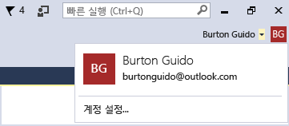
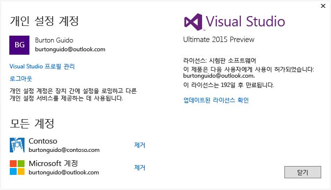

# Work with multiple user accounts

여러 Microsoft 계정 및/또는 회사나 학교 계정이 있는 경우 별도로 로그인하지 않고도 모든 계정에서 리소스에 액세스할 수 있도록 모든 계정을 Visual Studio에 추가할 수 있습니다. 현재 Azure, Application Insights, Team Foundation Server 및 Office 365 서비스는 간소화된 로그인 환경을 지원합니다. 시간이 지나면서 추가 서비스를 사용할 수 있게 됩니다.

한 대의 컴퓨터에서 여러 계정을 추가한 후 다른 컴퓨터에서 Visual Studio에 로그인하면 해당 계정 집합이 사용자와 함께 로밍됩니다. 계정 이름은 로밍되지만 자격 증명은 그렇지 않습니다. 따라서 새 컴퓨터에서 처음으로 해당 리소스를 사용하려고 할 경우 다른 계정에 대한 자격 증명을 입력하라는 메시지가 표시됩니다.

이 연습에서는 Visual Studio에 여러 계정을 추가하는 방법과 해당 계정에서 액세스할 수 있는 리소스가 **연결된 서비스 추가** 대화 상자, **서버 탐색기**및 **팀 탐색기**와 같은 위치에 반영되는지 확인하는 방법을 보여 줍니다.

## Visual Studio에 로그인

- Microsoft 계정 또는 조직 계정으로 Visual Studio에 로그인합니다. 다음과 같이 창의 위쪽 모서리에 사용자 이름이 나타나야 합니다.

     

### 서버 탐색기에서 Azure 계정 액세스

**Ctrl**+**Alt**+**S**를 눌러 **서버 탐색기**를 엽니다. **Azure** 아이콘을 선택합니다. Azure가 확장되면 Visual Studio에 로그인할 때 사용한 ID와 연관된 Azure 계정에서 사용할 수 있는 리소스가 나타나야 합니다. 사용자 고유의 리소스가 표시된다는 점을 제외하고 다음과 유사한 출력이 나타나야 합니다.

특정 장치에서 Visual Studio를 처음 사용할 경우 로그인 대화 상자에서 IDE에 로그인할 때 사용한 ID 아래에는 등록된 구독만 표시됩니다. **Azure** 노드를 마우스 오른쪽 단추로 클릭하고 **구독 관리 및 필터링**을 선택한 후 계정 선택 컨트롤에서 계정을 추가하여 다른 계정에 대한 리소스를 **서버 탐색기**에서 직접 액세스할 수 있습니다. 원할 경우 아래쪽 화살표를 클릭하고 계정 목록 중에서 선택하여 다른 계정을 선택할 수 있습니다. 계정을 선택한 후 해당 계정 아래에서 **서버 탐색기**에 표시할 구독을 선택할 수 있습니다.

다음번에 **서버 탐색기**를 열면 해당 구독에 대한 리소스가 표시됩니다.

### 연결된 서비스 추가 대화 상자를 통해 Azure 계정 액세스

1. C#에서 UWP 앱 프로젝트를 만듭니다.

1. **솔루션 탐색기**에서 프로젝트 노드를 선택한 다음, **추가** > **연결된 서비스**를 선택합니다. **연결된 서비스 추가** 마법사가 나타나고 Visual Studio 로그인 ID와 연관된 Azure 계정의 서비스 목록이 표시됩니다. 별도로 Azure에 로그인할 필요가 없습니다. 그렇지만 지정된 컴퓨터에서 처음으로 해당 리소스에 액세스하려고 할 경우 다른 계정으로 로그인해야 합니다.

    > [!WARNING]
    > 특정 컴퓨터의 Visual Studio에서 UWP 앱을 처음 만드는 경우 컴퓨터의 **설정** > **업데이트 및 보안** > **개발자용**으로 이동하여 장치를 개발 모드에 사용할 수 있게 하라는 메시지가 표시됩니다. 자세한 내용은 [개발에 장치 사용](/windows/uwp/get-started/enable-your-device-for-development)을 참조하세요.

###  웹 프로젝트에서 Azure Active Directory 액세스

Azure AD는 ASP.NET MVC 웹 응용 프로그램에서의 최종 사용자 Single Sign-In 또는 웹 API 서비스에서의 AD 인증을 지원합니다. 도메인 인증은 개별 사용자 계정 인증과 다릅니다. Active Directory 도메인에 액세스할 수 있는 사용자는 기존 Azure AD 계정을 사용하여 웹 응용 프로그램에 연결할 수 있습니다. Office 365 앱은 도메인 인증도 사용할 수 있습니다. 이 작업의 실행 과정을 보려면 웹 응용 프로그램을 만듭니다(**파일** > **새 프로젝트** > **C#** > **클라우드** > **ASP.NET 웹 응용 프로그램**). **새 ASP.NET 프로젝트** 대화 상자에서 **인증 변경**을 선택합니다. 인증 마법사가 나타나고 응용 프로그램에서 사용할 인증 종류를 선택할 수 있습니다.

ASP.NET에서 사용되는 다양한 종류의 인증에 대한 자세한 내용은 [Visual Studio 2013에서 ASP.NET 웹 프로젝트 만들기](http://www.asp.net/visual-studio/overview/2013/creating-web-projects-in-visual-studio#orgauth)를 참조하세요(인증에 대한 정보는 현재 버전의 Visual Studio에도 적용됨).

### Visual Studio Team Services 계정 액세스

기본 메뉴에서 **팀** > **Team Foundation Server에 연결**을 선택하여 **팀 탐색기** 창을 표시합니다. **팀 프로젝트 선택**을 클릭한 후 **Team Foundation Server 선택**아래의 목록 상자를 보면 Visual Studio Team Services 계정의 URL이 나타나야 합니다. URL을 선택하면 자격 증명을 다시 입력하지 않고도 로그인됩니다.

## Visual Studio에 두 번째 사용자 계정 추가

Visual Studio의 위쪽 모서리에서 사용자 이름 옆의 아래쪽 화살표를 클릭합니다. 그런 다음 **계정 설정** 메뉴 항목을 선택합니다. **계정 관리자** 대화 상자가 나타나고 로그인할 때 사용한 계정이 표시됩니다. 대화 상자의 아래쪽 모서리에서 **계정 추가** 링크를 선택하여 새 Microsoft 계정이나 새 회사 또는 학교 계정을 추가합니다.

표시되는 메시지에 따라 새 계정 자격 증명을 입력합니다. 다음 그림에서는 사용자가 자신의 *Contoso.com* 사무실 계정을 추가한 후의 **계정 관리자**를 보여 줍니다.

## 연결된 서비스 추가 마법사 및 서버 탐색기 다시 확인

이제 **서버 탐색기**로 다시 이동하고 **Azure** 노드를 마우스 오른쪽 단추로 클릭한 후 **구독 관리 및 필터링**을 선택합니다. 현재 계정 옆에 있는 드롭다운 화살표를 클릭하여 새 계정을 선택하고 **서버 탐색기**에서 표시할 구독을 선택합니다. 지정된 구독과 연결된 모든 서비스가 표시되어야 합니다. 두 번째 계정을 사용하여 Visual Studio IDE에 로그인하지 않더라도 해당 계정의 서비스 및 리소스에 로그인됩니다. **프로젝트** > **연결된 서비스 추가** 및 **팀** > **Team Foundation Server에 연결**의 경우에도 마찬가지입니다.

## 참고 항목

- [Visual Studio에 로그인](signing-in-to-visual-studio.md)
