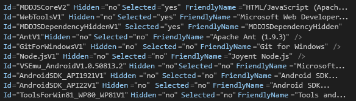

# 방법: Visual Studio 무인 설치 만들기 및 실행
[!INCLUDE[vs2017banner](../code-quality/includes/vs2017banner.md)]

[!INCLUDE[vsprvs](../code-quality/includes/vsprvs_md.md)]에 대한 설치 응용 프로그램을 DVD와 같은 미디어 대신 인트라넷을 통해 무인\(즉, 사용자 지정된 자동 설치\) 설치로 실행할 수 있습니다. 이 항목에서는 네트워크 공유에서 이 유형을 사용하여 설치하는 경우 [!INCLUDE[vsprvs](../code-quality/includes/vsprvs_md.md)]를 준비하는 방법을 보여 줍니다.  
  
## 네트워크 이미지 만들기  
 먼저 [!INCLUDE[vsprvs](../code-quality/includes/vsprvs_md.md)] 미디어의 네트워크 이미지를 만듭니다.  
  
#### 네트워크 이미지를 만들려면  
  
1.  서버에 폴더\(예: *Drive*:\\IDEinstall\\\)를 만듭니다.  
  
2.  다음 단계 중 하나를 수행합니다.  
  
    -   웹 부트스트래퍼를 다운로드한 다음 *Product*.exe \/Layout *Drive*:\\IDEinstall\\을 실행합니다.  
  
         또는  
  
    -   Visual Studio 미디어의 내용을 IDEinstall 폴더에 복사합니다. 콘텐츠를 복사한 후 설치하려는 타사 소프트웨어를 다운로드해야 합니다.  
  
3.  네트워크에서 IDEinstall 폴더를 공유하고 적절한 보안 설정을 지정합니다.  
  
     [!INCLUDE[vsprvs](../code-quality/includes/vsprvs_md.md)]에 대한 설치 응용 프로그램의 네트워크 경로는 \\\\*ServerName*\\IDEinstall\\*Product*.exe와 유사합니다.  
  
    > [!NOTE]
    >  경로 및 파일 이름 조합이 260자를 초과하면 설치가 실패할 수 있습니다.[!INCLUDE[vsprvs](../code-quality/includes/vsprvs_md.md)]에서 경로의 최대 길이는 221자입니다.  로컬 경로 이름은 70자를 초과하면 안 되고 네트워크 경로 이름은 39자를 초과하면 안 됩니다.  
  
     또한 경로의 폴더 이름에 공백이 포함\(예: "\\\\*ServerName*\\IDE install" 또는 \\\\\\*ServerName*\\Visual Studio\\\)된 경우 설치가 실패할 수 있습니다.  
  
## 무인 모드로 Visual Studio 배포  
 무인 모드로 [!INCLUDE[vsprvs](../code-quality/includes/vsprvs_md.md)]를 배포하려면 AdminDeployment.xml 파일을 수정해야 합니다. 이렇게 하려면 먼저 `/CreateAdminFile <file location>` 명령줄 매개 변수를 사용하여 AdminDeployment.xml 파일을 만들어야 합니다. 그런 다음 이 파일을 사용하여 네트워크에 Visual Studio의 배포를 푸시하거나 *Drive*:\\IDEinstall\\packages 디렉터리에 해당 파일을 복사한 경우 끌어와서 설치할 수 있습니다. AdminDeployment.xml 파일은 운영 체제, 아키텍처, Visual Studio 버전 또는 운영 체제 언어에 고유하지 않습니다.  
  
> [!CAUTION]
>  AdminDeployment.xml 파일에서 선택된 것으로 나열된 항목이 설치되지 않는 경우도 있습니다. 이 문제를 해결하려면 "선택됨\="yes""로 표시된 항목을 AdminDeployment.xml 파일의 **끝**에 배치합니다.  
>   
>  항목의 선택적 종속성을 설치하지 않으려는 경우 부모를 먼저 선택한 후 다음 스크린샷에 표시된 대로 부모 뒤의 선택적 종속성을 선택 취소해야 합니다.  
>   
>    
>   
>  이 작업을 수행하는 또 다른 방법은 단순히 부모의 선택적 자식을 생략하는 것입니다. 즉, "선택됨\="no"" 항목을 포함하지 마세요. 하지만 "선택됨\="yes"" 항목은 모두 AdminDeployment.xml 파일의 끝에 배치해야 합니다.  
  
> [!IMPORTANT]
>  설치하는 동안 컴퓨터가 한 번 이상 자동으로 다시 시작될 수 있습니다. 다시 시작한 후, 컴퓨터를 다시 시작하기 전에 설치를 수행하기 위해 로그온했던 사용자 계정으로 다시 로그인해야 합니다. 무인 설치를 실행하기 전에 필수 조건을 설치하여 자동으로 다시 시작되지 않게 할 수 있습니다. 자세한 내용은 [Visual Studio 관리자 가이드](../install/visual-studio-administrator-guide.md)에서 “설치 중 다시 시작 방지” 섹션을 참조하세요.  
  
 AdminDeployment 파일 스키마에는 다음 요소가 포함되어 있습니다.  
  
|요소|특성|값|설명|  
|--------|--------|-------|--------|  
|BundleCustomizations|TargetDir|*경로*|설치 응용 프로그램의 사용자 인터페이스에서 경로를 재정의하는 작업과 동일하게 동작합니다. Visual Studio가 이미 설치된 경우 이 요소는 무시됩니다.|  
|BundleCustomizations|NoWeb|yes&#124;default|이 요소의 값이 yes이면 설치 응용 프로그램이 설치 작업 중 웹으로 이동하려고 시도하지 않습니다.|  
|SelectableItemCustomization|Hidden|Yes&#124;No|이 요소의 값이 Yes이면 사용자 지정 트리에서 선택 가능한 항목을 숨깁니다.|  
|SelectableItemCustomization|선택함|Yes&#124;No|사용자 지정 트리에서 선택 가능한 항목을 선택하거나 선택 취소합니다.|  
|BundleCustomizations|Feed|경로|사용자가 사용하려는 피드의 위치입니다.  이 피드는 컴퓨터의 후속 수정 작업에 사용됩니다\(기본적으로 "Default"\).|  
|BundleCustomizations|SuppressRefreshPrompt|yes&#124;default|최신 버전을 사용할 수 있는 경우 설치를 새로 고치라는 메시지가 사용자에게 표시되지 않도록 합니다.|  
|BundleCustomizations|NoRefresh|yes&#124;default|최신 버전을 사용할 수 있는 경우 설치를 새로 고치지 않습니다.|  
|BundleCustomizations|NoCacheOnlyMode|yes&#124;default|패키지 캐시 미리 채우기를 방지합니다.|  
  
> [!WARNING]
>  선택 가능한 항목이 숨겨진 경우에도 설치 응용 프로그램이 선택함 상태를 적용합니다. 예를 들어 선택 가능한 항목을 항상 설치하려는 경우 이 항목을 숨기고 선택함 상태로 표시할 수 있습니다.  
  
#### Visual Studio의 무인 설치를 만들려면  
  
1.  *Drive*:\\IDEinstall\\AdminDeployment.xml 파일에서 다음 예제와 같이 BundleCustomizations 요소의 NoWeb 특성 값을 "default"에서 "yes"로 변경합니다.  
  
     `<BundleCustomizations TargetDir="default" NoWeb="default"/>`를 `<BundleCustomizations TargetDir="default" NoWeb="yes"/>`로 변경  
  
2.  선택적 구성 요소에 맞게 SelectableItemCustomization 특성을 변경하고 파일을 저장합니다.  
  
## 무인 설치 실행  
 클라이언트 컴퓨터에서 Visual Studio에 대한 설치 응용 프로그램을 자동으로 실행하거나 정의한 설정을 사용하여 사용자가 직접 응용 프로그램을 실행하도록 허용하여 무인 설치를 실행할 수 있습니다.  
  
#### 클라이언트 컴퓨터에서 무인 설치를 실행하려면  
  
-   **시작** 메뉴를 열고 **실행**을 선택한 다음 `\\ServerName\IDEinstall\vs_Product.exe /adminfile PathOfTheAdmindeployment.xmlFile`*AdditionalParametersAsNeeded*를 입력합니다.  
  
     예를 들어 `\\server1\IDEinstall\vs_ultimate.exe /adminfile \\server1\ IDEinstall\AdminDeployment.xml /quiet /norestart` 명령줄을 지정할 수 있습니다.  
  
#### 클라이언트가 미리 정의된 설정을 사용하여 Visual Studio를 수동으로 설치할 수 있도록 하려면  
  
1.  사용자 지정된 AdminDeployment.xml 파일을 읽기 전용인 네트워크 공유 위치에 복사합니다\(예: \\\\*ServerName*\\IDEinstall\\packages\\AdminDeployment.xml\).  
  
2.  사용자가 해당 공유에서 설치할 수 있도록 설정합니다.  
  
## 설치 유지 관리  
 **제어판**을 열고 설치 응용 프로그램을 다시 실행하면 Visual Studio의 기능을 수정하고 프로그래밍 언어를 제거하고 Visual Studio를 복구하거나 제거할 수 있습니다.  
  
> [!NOTE]
>  유지 관리 모드를 사용하려면 로컬 컴퓨터에서 관리자 자격 증명이 있어야 합니다.  
  
#### 클라이언트 컴퓨터에서 설치를 유지 관리하려면  
  
-   **제어판**을 열고 **프로그램 및 기능**을 선택합니다.  
  
-   [!INCLUDE[vsprvs](../code-quality/includes/vsprvs_md.md)]를 선택한 다음 **변경**을 선택합니다.  
  
#### Visual Studio가 설치된 후 클라이언트 컴퓨터에서 AdminDeployment 설정을 변경하려면  
  
1.  필요에 따라 AdminDeployment.xml을 업데이트합니다.  
  
2.  **시작** 메뉴를 열고 **실행**을 선택합니다.  
  
3.  다음 텍스트를 입력합니다.  
  
     `\\ServerName\IDEinstall\vs_Product.exe /AdminFile PathToAdmindeployment.xmlFile` AdditionalParametersAsNeeded  
  
     예를 들어 `\\server1\IDEinstall\vs_ultimate.exe /adminfile \\server1\IDEinstall\AdminDeployment.xml /quiet /norestart` 명령줄을 지정할 수 있습니다.  
  
 Visual Studio가 설치된 후에는 복구가 기본 매개 변수입니다. 업데이트된 \/AdminFile로 Visual Studio를 복구하는 경우 업데이트된 AdminDeployment.xml이 호출하는 설정으로 현재 관리자 배포 설정을 덮어씁니다.  
  
## 제품 등록  
 설치가 완료된 후 [!INCLUDE[vsprvs](../code-quality/includes/vsprvs_md.md)] 내에서 [!INCLUDE[vsprvs](../code-quality/includes/vsprvs_md.md)]의 복사본을 등록할 수 있습니다.  
  
#### 등록하려면  
  
1.  **도움말** 메뉴를 열고 **제품 등록**을 선택합니다.  
  
2.  제품 키를 입력합니다.  
  
## 참고 항목  
 [Visual Studio 설치](../Topic/Installing%20Visual%20Studio%202015.md)