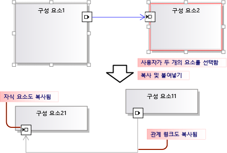
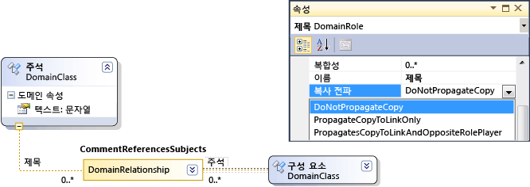
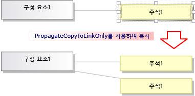
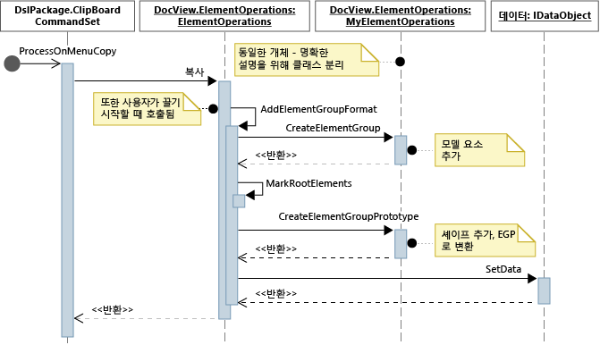
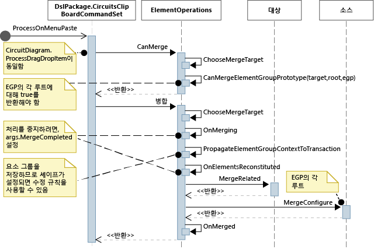

# <a name="customizing-copy-behavior"></a>복사 동작 사용자 지정
[!INCLUDE[vsprvs](../code-quality/includes/vsprvs_md.md)] Visualization and Modeling SDK를 사용하여 만든 DSL(Domain-Specific Language)에서는 사용자가 요소를 복사하고 붙여넣을 때 수행되는 작업을 변경할 수 있습니다.

## <a name="standard-copy-and-paste-behavior"></a>표준 복사 및 붙여넣기 동작
 복사를 사용 하려면 설정는 **복사 붙여넣기를 사용 하도록 설정** 의 속성은 **편집기** DSL 탐색기에서 노드.

 기본적으로 사용자가 요소를 클립보드에 복사하면 다음 요소도 복사됩니다.

-   선택한 요소의 포함된 종속 항목 이러한 항목은 복사한 요소를 소스로 사용하는 포함 관계의 대상인 요소입니다.

-   복사한 요소 간의 관계 링크

 이 규칙은 복사한 요소와 링크에 재귀적으로 적용됩니다.

 

 복사한 요소와 링크는 serialize되어 클립보드에 배치되는 EGP(<xref:Microsoft.VisualStudio.Modeling.ElementGroupPrototype>)에 저장됩니다.

 복사한 요소의 이미지도 클립보드에 배치됩니다. 따라서 사용자가 Word 등의 다른 응용 프로그램에 해당 이미지를 붙여넣을 수 있습니다.

 사용자는 DSL 정의에 따라 요소를 수락할 수 있는 대상에 복사한 요소를 붙여넣을 수 있습니다. 예를 들어 구성 요소 솔루션 템플릿에서 생성된 DSL에서 사용자는 포트를 구성 요소에는 붙여넣을 수 있지만 다이어그램에는 붙여넣을 수 없으며, 구성 요소를 다이어그램에는 붙여넣을 수 있지만 다른 구성 요소에는 붙여넣을 수 없습니다.

## <a name="customizing-copy-and-paste-behavior"></a>복사 및 붙여넣기 동작 사용자 지정
 프로그램 코드를 사용 하 여 모델을 사용자 지정 하는 방법에 대 한 자세한 내용은 참조 [탐색 및 프로그램 코드에서 모델 업데이트](../modeling/navigating-and-updating-a-model-in-program-code.md)합니다.

 **복사, 잘라내기 및 붙여넣기를 사용 하지 않도록 설정 하거나 사용 합니다.**
DSL 탐색기에서 설정 된 **복사 붙여넣기를 사용 하도록 설정** 속성의는 **편집기** 노드.

 **동일한 대상에 대 한 링크를 복사 합니다.** 예를 들어 복사 된 설명 상자를 동일한 주체 요소에 연결 합니다.
설정의 **전파 복사** 역할의 속성 **에 정보만 연결 전파**합니다. 자세한 내용은 참조 [링크 복사 동작을 사용자 지정](#customizeLinks)합니다.

 연결된 요소를 복사합니다. 예를 들어 새 요소를 복사하면 연결된 주석 상자의 복사본도 만들어집니다.
설정의 **전파 복사** 역할의 속성 **반대 역할 수행자 복사 링크에 전파**합니다. 자세한 내용은 참조 [링크 복사 동작을 사용자 지정](#customizeLinks)합니다.

 **복사 하 여 중복 요소를 신속 하 게 합니다.** 일반적으로 방금 복사한 항목 여전히을 선택한 동일한 유형의 요소에 붙여 넣을 수 없습니다.
요소 병합 지시문을 도메인 클래스에 추가하고 부모 클래스로 병합을 전달하도록 설정합니다. 이 작업의 효과는 끌기 작업에서도 동일합니다. 자세한 내용은 참조 [사용자 지정 요소 만들기 및 이동](../modeling/customizing-element-creation-and-movement.md)합니다.

 \- 또는 -

 `ClipboardCommandSet.ProcessOnPasteCommand()`를 재정의하여 요소를 붙여넣기 전에 다이어그램을 선택합니다. DslPackage 프로젝트의 사용자 지정 파일에 이 코드를 추가합니다.

```csharp
namespace Company.MyDsl {
using System.Linq;
using Microsoft.VisualStudio.Modeling.Diagrams;
using Microsoft.VisualStudio.Modeling.Shell;
partial class MyDslClipboardCommandSet
{
  protected override void ProcessOnMenuPasteCommand()
  {
 // Deselect the current selection after copying:
 Diagram diagram = (this.CurrentModelingDocView as SingleDiagramDocView).Diagram;
    this.CurrentModelingDocView
     .SelectObjects(1, new object[] { diagram }, 0);
  }
} }

```

 **사용자가 선택한 대상에 붙여 넣는 경우에 추가 링크를 만듭니다.** 예를 들어 설명 상자 요소에 붙여넣으면 링크가 서로 만들어집니다.
요소 병합 지시문을 대상 도메인 클래스에 추가하고 링크를 추가하여 병합을 처리하도록 설정합니다. 이 작업의 효과는 끌기 작업에서도 동일합니다. 자세한 내용은 참조 [사용자 지정 요소 만들기 및 이동](../modeling/customizing-element-creation-and-movement.md)합니다.

 \- 또는 -

 `ClipboardCommandSet.ProcessOnPasteCommand()`를 재정의하여 기본 메서드를 호출한 후 추가 링크를 만듭니다.

 **요소를 복사할 수 있는 형식 사용자 지정** 외부 응용 프로그램-예를 들어에 비트맵 형식에 테두리를 추가 합니다.
재정의 *MyDsl* `ClipboardCommandSet.ProcessOnMenuCopyCommand()` DslPackage 프로젝트에 있습니다.

 **Copy 명령으로 있지만 끌기 작업에는 없는 요소가 클립보드에 복사 되는 방식을 사용자 지정 합니다.**
재정의 *MyDsl* `ClipboardCommandSet.CopyModelElementsIntoElementGroupPrototype()` DslPackage 프로젝트에 있습니다.

 **Copy 통한 셰이프 레이아웃 유지 및 붙여넣기 합니다.**
사용자가 여러 모양을 복사할 때 모양이 붙여넣기되는 상대 위치를 보존할 수 있습니다. 이 방법은에 나오는 예제에서 설명 않음 [VMSDK: 회로 다이어그램 샘플](http://go.microsoft.com/fwlink/?LinkId=213879)합니다.

 이 결과를 얻으려면 복사한 ElementGroupPrototype에 모양과 연결선을 추가합니다. 재정의 시 가장 편리한 메서드는 ElementOperations.CreateElementGroupPrototype()입니다. 이렇게 하려면 Dsl 프로젝트에 다음 코드를 추가합니다.

```csharp

public class MyElementOperations : DesignSurfaceElementOperations
{
  // Create an EGP to add to the clipboard.
  // Called when the elements to be copied have been
  // collected into an ElementGroup.
 protected override ElementGroupPrototype CreateElementGroupPrototype(ElementGroup elementGroup, ICollection<ModelElement> elements, ClosureType closureType)
  {
 // Add the shapes and connectors:
 // Get the elements already in the group:
    ModelElement[] mels = elementGroup.ModelElements
        .Concat(elementGroup.ElementLinks) // Omit if the paste target is not the diagram.
        .ToArray();
 // Get their shapes:
    IEnumerable<PresentationElement> shapes =
       mels.SelectMany(mel =>
            PresentationViewsSubject.GetPresentation(mel));
    elementGroup.AddRange(shapes);

 return base.CreateElementGroupPrototype
           (elementGroup, elements, closureType);
  }

 public MyElementOperations(IServiceProvider serviceProvider, ElementOps1Diagram diagram)
      : base(serviceProvider, diagram)
  { }
}

// Replace the standard ElementOperations
// singleton with your own:
partial class MyDslDiagram // EDIT NAME
{
 /// <summary>
 /// Singleton ElementOperations attached to this diagram.
 /// </summary>
 public override DesignSurfaceElementOperations ElementOperations
  {
 get
    {
 if (singleton == null)
      {
        singleton = new MyElementOperations(this.Store as IServiceProvider, this);
      }
 return singleton;
    }
  }
 private MyElementOperations singleton = null;
}

```

 **현재 커서 위치 등의 선택한 위치에 셰이프를 붙여 넣습니다.**
사용자가 여러 모양을 복사할 때 모양이 붙여넣기되는 상대 위치를 보존할 수 있습니다. 이 방법은에 나오는 예제에서 설명 않음 [VMSDK: 회로 다이어그램 샘플](http://go.microsoft.com/fwlink/?LinkId=213879)합니다.

 이 결과를 얻으려면 `ClipboardCommandSet.ProcessOnMenuPasteCommand()`의 위치별 버전을 사용하도록 `ElementOperations.Merge()`를 재정의합니다. 이렇게 하려면 DslPackage 프로젝트에 다음 코드를 추가합니다.

```csharp

partial class MyDslClipboardCommandSet // EDIT NAME
{
   /// <summary>
    /// This method assumes we only want to paste things onto the diagram
    /// - not onto anything contained in the diagram.
    /// The base method pastes in a free space on the diagram.
    /// But if the menu was used to invoke paste, we want to paste in the cursor position.
    /// </summary>
    protected override void ProcessOnMenuPasteCommand()
    {

  NestedShapesSampleDocView docView = this.CurrentModelingDocView as NestedShapesSampleDocView;

      // Retrieve data from clipboard:
      System.Windows.Forms.IDataObject data = System.Windows.Forms.Clipboard.GetDataObject();

      Diagram diagram = docView.CurrentDiagram;
      if (diagram == null) return;

      if (!docView.IsContextMenuShowing)
      {
        // User hit CTRL+V - just use base method.

        // Deselect anything that's selected, otherwise
        // pasted item will be incompatible:
        if (!this.IsDiagramSelected())
        {
          docView.SelectObjects(1, new object[] { diagram }, 0);
        }

        // Paste into a convenient spare space on diagram:
    base.ProcessOnMenuPasteCommand();
      }
      else
      {
        // User right-clicked - paste at mouse position.

        // Utility class:
        DesignSurfaceElementOperations op = diagram.ElementOperations;

        ShapeElement pasteTarget = diagram;

        // Check whether what's in the paste buffer is acceptable on the target.
        if (pasteTarget != null && op.CanMerge(pasteTarget, data))
        {

        // Although op.Merge would be a no-op if CanMerge failed, we check CanMerge first
          // so that we don't create an empty transaction (after which Undo would be no-op).
          using (Transaction t = diagram.Store.TransactionManager.BeginTransaction("paste"))
          {
            PointD place = docView.ContextMenuMousePosition;
            op.Merge(pasteTarget, data, PointD.ToPointF(place));
            t.Commit();
          }
        }
      }
    }
  }
```

 **사용자가 끌어서 놓기 요소 수입니다.**
참조 [하는 방법: 끌어서 놓기 처리기를 추가](../modeling/how-to-add-a-drag-and-drop-handler.md)합니다.

##  <a name="customizeLinks"></a> 링크 복사 동작 사용자 지정
 사용자가 요소를 복사할 때의 표준 동작은 포함된 요소도 모두 복사하는 것입니다. 이러한 표준 복사 동작을 수정할 수 있습니다. DSL 정의에서 속성 창 설정 및 관계의 한 쪽에서 역할을 선택 된 **전파 복사** 값입니다.

 

 다음과 같은 세 가지 값이 있습니다.

-   Do not propagate copy

-   Propagate copy to link only - 그룹을 붙여넣을 때 이 링크의 새 복사본이 링크 반대쪽의 기존 요소를 참조합니다.

-   Propagate copy to link and opposite role player - 복사한 그룹에 링크 반대쪽의 요소 복사본이 포함됩니다.

 

 수행하는 변경 내용은 복사된 이미지와 요소에 모두 적용됩니다.

## <a name="programming-copy-and-paste-behavior"></a>복사 및 붙여넣기 동작 프로그래밍
 인스턴스에서 복사, 붙여넣기, 생성 및 삭제 개체의 관련 하 여 DSL의 동작의 다양 한 제어 됩니다 <xref:Microsoft.VisualStudio.Modeling.ElementOperations> 다이어그램 연결 됩니다. 고유한 클래스를 파생 하 여 DSL의 동작을 수정할 수 <xref:Microsoft.VisualStudio.Modeling.ElementOperations> 재정의 <xref:Microsoft.VisualStudio.Modeling.Diagrams.Diagram.ElementOperations%2A> 다이어그램 클래스의 속성입니다.

> [!TIP]
>  프로그램 코드를 사용 하 여 모델을 사용자 지정 하는 방법에 대 한 자세한 내용은 참조 [탐색 및 프로그램 코드에서 모델 업데이트](../modeling/navigating-and-updating-a-model-in-program-code.md)합니다.

 

 

#### <a name="to-define-your-own-elementoperations"></a>고유 ElementOperations를 정의하려면

1.  DSL 프로젝트의 새 파일에서 <xref:Microsoft.VisualStudio.Modeling.Diagrams.DesignSurfaceElementOperations>로부터 파생되는 클래스를 만듭니다.

2.  다이어그램 클래스에 대한 partial 클래스 정의를 추가합니다. 이 클래스의 이름에 있습니다 **Dsl\GeneratedCode\Diagrams.cs**합니다.

     다이어그램 클래스에서 ElementOperations 서브클래스 인스턴스를 반환하도록 <xref:Microsoft.VisualStudio.Modeling.Diagrams.Diagram.ElementOperations%2A>를 재정의합니다. 모든 호출에서 같은 인스턴스를 반환해야 합니다.

 DslPackage 프로젝트의 사용자 지정 코드 파일에 이 코드를 추가합니다.

```csharp

using Microsoft.VisualStudio.Modeling;
using Microsoft.VisualStudio.Modeling.Diagrams;
using Microsoft.VisualStudio.Modeling.Diagrams.ExtensionEnablement;

  public partial class MyDslDiagram
  {
    public override DesignSurfaceElementOperations ElementOperations
    {
      get
      {
        if (this.elementOperations == null)
        {
          this.elementOperations = new MyElementOperations(this.Store as IServiceProvider, this);
        }
        return this.elementOperations;
      }
    }
    private MyElementOperations elementOperations = null;
  }

  public class MyElementOperations : DesignSurfaceElementOperations
  {
    public MyElementOperations(IServiceProvider serviceProvider, MyDslDiagram diagram)
      : base(serviceProvider, diagram)
    { }
    // Overridden methods follow
  }

```

## <a name="receiving-items-dragged-from-other-models"></a>다른 모델에서 끈 항목 수신
 ElementOperations를 사용하여 복사, 이동, 삭제 및 끌어서 놓기 동작을 정의할 수도 있습니다. ElementOperations 사용법을 설명하기 위해 여기서 제공하는 예제에서는 사용자 지정 끌어서 놓기 동작을 정의합니다. 그러나 포함 하기 위해 해야 할에 설명 된 다른 접근 방식은 [하는 방법: 끌어서 놓기 처리기를 추가](../modeling/how-to-add-a-drag-and-drop-handler.md), 변수인 범위를 확장 합니다.

 ElementOperations 클래스에서 두 메서드를 정의합니다.

-   `CanMerge(ModelElement targetElement, System.Windows.Forms.IDataObject data)` 이 메서드는 소스 요소를 대상 모양, 연결선 또는 다이어그램으로 끌 수 있는지 여부를 결정합니다.

-   `MergeElementGroupPrototype(ModelElement targetElement, ElementGroupPrototype sourcePrototype)` 이 메서드는 소스 요소를 대상에 결합합니다.

### <a name="canmerge"></a>CanMerge()
 `CanMerge()` 이 메서드는 다이어그램에서 마우스를 이동하면 사용자에게 제공되어야 하는 피드백을 확인하기 위해 호출됩니다. 이 메서드의 매개 변수는 마우스로 가리키는 요소와 끌기 작업을 수행한 소스에 대한 데이터입니다. 사용자는 화면의 어느 위치에서나 끌기를 수행할 수 있습니다. 그러므로 소스 개체는 다양한 형식이 될 수 있으며 여러 형식으로 serialize할 수 있습니다. 소스가 DSL 또는 UML 모델이면 데이터 매개 변수는 <xref:Microsoft.VisualStudio.Modeling.ElementGroupPrototype>의 serialization입니다. 끌기, 복사 및 도구 상자 작업에서는 ElementGroupPrototypes를 사용하여 모델의 코드 조각을 표시합니다.

 요소 그룹 프로토타입은 요소와 링크를 수에 제한 없이 포함할 수 있습니다. 요소 형식은 해당 GUID로 식별할 수 있습니다. 여기서 GUID는 기본 모델 요소의 GUID가 아닌 끌어 온 모양의 GUID입니다. 다음 예에서는 UML 다이어그램의 클래스 모양을 이 다이어그램으로 끌면 `CanMerge()`가 true를 반환합니다.

```csharp
public override bool CanMerge(ModelElement targetShape, System.Windows.Forms.IDataObject data)
 {
  // Extract the element prototype from the data.
  ElementGroupPrototype prototype = ElementOperations.GetElementGroupPrototype(this.ServiceProvider, data);
  if (targetShape is MyTargetShape && prototype != null &&
        prototype.RootProtoElements.Any(rootElement =>
          rootElement.DomainClassId.ToString()
          ==  "3866d10c-cc4e-438b-b46f-bb24380e1678")) // Guid of UML Class shapes
          // or SourceClass.DomainClassId
        return true;
   return base.CanMerge(targetShape, data);
 }

```

## <a name="mergeelementgroupprototype"></a>MergeElementGroupPrototype()
 사용자가 요소를 다이어그램, 모양 또는 연결선에 놓으면 이 메서드가 호출됩니다. 이 메서드는 끌어 온 콘텐츠를 대상 요소에 병합해야 합니다. 이 예에서 코드는 대상 및 프로토타입 형식 조합을 인식할 수 있는지 여부를 확인합니다. 해당 조합을 인식할 수 있으면 메서드가 끌어 온 요소를 모델에 추가해야 하는 요소 프로토타입으로 변환합니다. 변환된 요소 또는 변환되지 않은 요소의 병합을 수행하기 위해 기본 메서드가 호출됩니다.

```csharp
public override void MergeElementGroupPrototype(ModelElement targetShape, ElementGroupPrototype sourcePrototype)
{
  ElementGroupPrototype prototypeToMerge = sourcePrototype;
  MyTargetShape pel = targetShape as MyTargetShape;
  if (pel != null)
  {
    prototypeToMerge = ConvertDraggedTypeToLocal(pel, sourcePrototype);
  }
  if (prototypeToMerge != null)
    base.MergeElementGroupPrototype(targetShape, prototypeToMerge);
}

```

 이 예에서는 UML 클래스 다이어그램에서 끌어 온 UML 클래스 요소를 처리합니다. DSL은 UML 클래스를 직접 저장하지 않으며, 끌어 온 각 UML 클래스에서 DSL 요소를 만듭니다. 따라서 DSL이 인스턴스 다이어그램인 등의 경우에 유용합니다. 사용자는 클래스를 다이어그램으로 끌어 해당 클래스의 인스턴스를 만들 수 있습니다.

```csharp

private ElementGroupPrototype ConvertDraggedTypeToLocal (MyTargetShape snapshot, ElementGroupPrototype prototype)
{
  // Find the UML project:
  EnvDTE.DTE dte = snapshot.Store.GetService(typeof(EnvDTE.DTE)) as EnvDTE.DTE;
  foreach (EnvDTE.Project project in dte.Solution.Projects)
  {
    IModelingProject modelingProject = project as IModelingProject;
    if (modelingProject == null) continue; // not a modeling project
    IModelStore store = modelingProject.Store;
    if (store == null) continue;
    // Look for the shape that was dragged:
    foreach (IDiagram umlDiagram in store.Diagrams())
    {
      // Get modeling diagram that implements UML diagram:
      Diagram diagram = umlDiagram.GetObject<Diagram>();
      Guid elementId = prototype.SourceRootElementIds.FirstOrDefault();
      ShapeElement shape = diagram.Partition.ElementDirectory.FindElement(elementId) as ShapeElement;
      if (shape == null) continue;
      IClass classElement = shape.ModelElement as IClass;
      if (classElement == null) continue;

      // Create a prototype of elements in my DSL, based on the UML element:
      Instance instance = new Instance(snapshot.Store);
      instance.Type = classElement.Name;
      // Pack them into a prototype:
      ElementGroup group = new ElementGroup(instance);
      return group.CreatePrototype();
    }
  }
  return null;
}

```

## <a name="standard-copy-behavior"></a>표준 복사 동작
 이 섹션의 코드는 복사 동작을 변경하기 위해 재정의할 수 있는 메서드를 보여줍니다. 사용자 지정을 직접 수행하는 방법을 쉽게 확인할 수 있도록, 이 섹션에 나와 있는 코드는 복사에 사용되는 메서드를 재정의하되 표준 동작을 변경하지는 않습니다.

 사용자가 Ctrl+C를 누르거나 복사 메뉴 명령을 사용하면 <xref:Microsoft.VisualStudio.Modeling.Shell.ClipboardCommandSet.ProcessOnMenuCopyCommand%2A> 메서드가 호출됩니다. 이 설정 방법 나타나면 **DslPackage\Generated Code\CommandSet.cs**합니다. 어떻게 주석은를 설정 하는 방법에 대 한 자세한 내용은 참조 [하는 방법: 바로 가기 메뉴에 명령을 추가](../modeling/how-to-add-a-command-to-the-shortcut-menu.md)합니다.

 ProcessOnMenuCopyCommand의 partial 클래스 정의 추가 하 여 재정의할 수 있습니다 *MyDsl* `ClipboardCommandSet` DslPackage 프로젝트에 있습니다.

```csharp
using System.Collections.Generic;
using System.Drawing;
using System.Windows.Forms;
using Microsoft.VisualStudio.Modeling;
using Microsoft.VisualStudio.Modeling.Diagrams;

partial class MyDslClipboardCommandSet
{
  /// <summary>
  /// Override ProcessOnMenuCopyCommand() to copy elements to the
  /// clipboard in different formats, or to perform additional tasks
  /// before or after copying - for example deselect the copied elements.
  /// </summary>
  protected override void ProcessOnMenuCopyCommand()
  {
    IList<ModelElement> selectedModelElements = this.SelectedElements;
    if (selectedModelElements.Count == 0) return;

    // System container for clipboard data.
    // The IDataObject can contain data in several formats.
    IDataObject dataObject = new DataObject();

    Bitmap bitmap = null; // For export to other programs.
    try
    {
      #region Create EGP for copying to a DSL.
      this.CopyModelElementsIntoElementGroupPrototype
                     (dataObject, selectedModelElements);
      #endregion

      #region Create bitmap for copying to another application.
      // Find all the shapes associated with this selection:
      List<ShapeElement> shapes = new List<ShapeElement>(
        this.ResolveExportedShapesForClipboardImages
              (dataObject, selectedModelElements));

      bitmap = this.CreateBitmapForClipboard(shapes);
      if (bitmap != null)
      {
        dataObject.SetData(DataFormats.Bitmap, bitmap);
      }
      #endregion

      // Add the data to the clipboard:
      Clipboard.SetDataObject(dataObject, true, 5, 100);
    }
    finally
    {
      // Dispose bitmap after SetDataObject:
      if (bitmap != null) bitmap.Dispose();
    }
  }
/// <summary>
/// Override this to customize the element group that is copied to the clipboard.
/// </summary>
protected override void CopyModelElementsIntoElementGroupPrototype(IDataObject dataObject, IList<ModelElement> selectedModelElements)
{
  return this.ElementOperations.Copy(dataObject, selectedModelElements);
}
}
```

 각 다이어그램에는 단일 ElementOperations 인스턴스가 있습니다. 원하는 경우 고유한 파생 인스턴스를 제공할 수 있습니다. DSL 프로젝트에 배치할 수 있는 이 파일은 재정의 대상 코드와 동일하게 작동합니다.

```csharp
using System;
using System.Collections.Generic;
using System.Linq;
using Microsoft.VisualStudio.Modeling;
using Microsoft.VisualStudio.Modeling.Diagrams;

namespace Company.MyDsl
{
  partial class MyDslDiagram
  {
    /// <summary>
    /// Singleton ElementOperations attached to this diagram.
    /// </summary>
    public override DesignSurfaceElementOperations ElementOperations
    {
      get
      {
        if (this.elementOperations == null)
        {
          this.elementOperations = new MyElementOperations(this.Store as IServiceProvider, this);
        }
        return this.elementOperations;
      }
    }
    private MyElementOperations elementOperations = null;
  }

  // Our own version of ElementOperations so that we can override:
  public class MyElementOperations : DesignSurfaceElementOperations
  {
    public MyElementOperations(IServiceProvider serviceProvider, ElementOps1Diagram diagram)
      : base(serviceProvider, diagram)
    { }

    /// <summary>
    /// Copy elements to the clipboard data.
    /// Provides a hook for adding custom data.
    /// </summary>
    public override void Copy(System.Windows.Forms.IDataObject data,
      ICollection<ModelElement> elements,
      ClosureType closureType,
      System.Drawing.PointF sourcePosition)
    {
      if (CanAddElementGroupFormat(elements, closureType))
      {
        AddElementGroupFormat(data, elements, closureType);
      }

      // Override these to store additional data:
      if (CanAddCustomFormat(elements, closureType))
      {
        AddCustomFormat(data, elements, closureType, sourcePosition);
      }
    }

    protected override void AddElementGroupFormat(System.Windows.Forms.IDataObject data, ICollection<ModelElement> elements, ClosureType closureType)
    {
      // Add the selected elements and those implied by the propagate copy rules:
      ElementGroup elementGroup = this.CreateElementGroup(elements, closureType);

      // Mark all the elements that are not embedded under other elements:
      this.MarkRootElements(elementGroup, elements, closureType);

      // Store in the clipboard data:
      ElementGroupPrototype elementGroupPrototype = this.CreateElementGroupPrototype(elementGroup, elements, closureType);
      data.SetData(ElementGroupPrototype.DefaultDataFormatName, elementGroupPrototype);
    }

    /// <summary>
    /// Override this to store additional elements in the element group:
    /// </summary>
    protected override ElementGroupPrototype CreateElementGroupPrototype(ElementGroup elementGroup, ICollection<ModelElement> elements, ClosureType closureType)
    {
      ElementGroupPrototype prototype = new ElementGroupPrototype(this.Partition, elementGroup.RootElements, elementGroup);
      return prototype;
    }

    /// <summary>
    /// Create an element group from the given starting elements, using the
    /// copy propagation rules specified in the DSL Definition.
    /// By default, this includes all the embedded descendants of the starting elements,
    /// and also includes reference links where both ends are already included.
    /// </summary>
    /// <param name="startElements">model elements to copy</param>
    /// <param name="closureType"></param>
    /// <returns></returns>
    protected override ElementGroup CreateElementGroup(ICollection<ModelElement> startElements, ClosureType closureType)
    {
      // ElementClosureWalker finds all the connected elements,
      // according to the propagate copy rules specified in the DSL Definition:
      ElementClosureWalker walker = new ElementClosureWalker(this.Partition,
        closureType, // Normally ClosureType.CopyClosure
        startElements,
        true, // Do not load other models.
        null, // Optional list of domain roles not to traverse.
        true); // Include relationship links where both ends are already included.

      walker.Traverse(startElements);
      IList<ModelElement> closureList = walker.ClosureList;
      Dictionary<object, object> closureContext = walker.Context;

      // create a group for this closure
      ElementGroup group = new ElementGroup(this.Partition);
      group.AddRange(closureList, false);

      // create the element group prototype for the group
      foreach (object key in closureContext.Keys)
      {
        group.SourceContext.ContextInfo[key] = closureContext[key];
      }

      return group;
    }
  }
}

```

## <a name="see-also"></a>참고자료

- [요소 만들기 및 이동 사용자 지정](../modeling/customizing-element-creation-and-movement.md)
- [방법: 끌어서 놓기 처리기 추가](../modeling/how-to-add-a-drag-and-drop-handler.md)
- [삭제 동작 사용자 지정](../modeling/customizing-deletion-behavior.md)
- [샘플: VMSDK 회로 다이어그램 예제](http://go.microsoft.com/fwlink/?LinkId=213879)

[!INCLUDE[modeling_sdk_info](includes/modeling_sdk_info.md)]