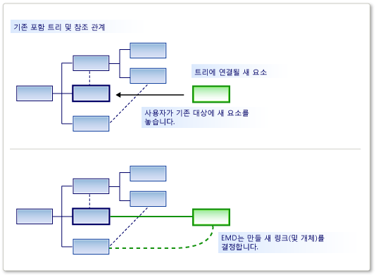
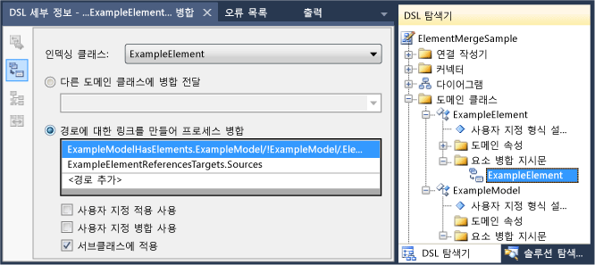

# <a name="customizing-element-creation-and-movement"></a>요소 만들기 및 이동 사용자 지정
요소를 도구 상자 또는 붙여넣기 후에 다른 끌어 놓을 수 또는 이동 작업을 허용할 수 있습니다. 지정한 관계를 사용 하 여 대상 요소에 연결 하는 이동된 된 요소를 포함할 수 있습니다.

 요소 병합 지시문 (EMD) 하나의 모델 요소를 처리 하는 방식을 지정 *병합 된* 다른 모델 요소에 있습니다. 이런 경우:

-   사용자 도구 상자 셰이프나 다이어그램으로 끌어 놓습니다.

-   사용자는 탐색기 또는 구획 모양에는 추가 메뉴를 사용 하 여 요소를 만듭니다.

-   항목 하나 스윔 레인에서 다른 위치로 이동 하는 사용자입니다.

-   사용자는 요소를 붙여 넣습니다.

-   프로그램 코드 요소 병합 지시문을 호출합니다.

 만들기 작업의 복사 작업 다르게 보이지만 실제로 같은 방식으로 작동 합니다. 요소를 추가 하는 예를 들어 도구 상자에서 그의 프로토타입을 복제 됩니다. 프로토타입에 모델의 다른 부분에서 복사 된 요소와 같은 방식으로 모델에 병합 됩니다.

 EMD의 책임 모델의 특정 위치에 개체 또는 개체 그룹 해야 병합 하는 방법을 결정 하는 것입니다. 특히, 모델으로 병합 된 그룹을 연결 하기 위해 어떤 관계는 인스턴스화할 수를 결정 합니다. 속성을 설정 하 고 다른 개체를 만들을 지정할 수 있습니다.

  요소 병합 지시문의 역할

 EMD 포함 관계를 정의할 때 자동으로 생성 됩니다. 사용자가 부모에 새 자식 인스턴스를 추가할 때이 기본 EMD 관계의 인스턴스를 만듭니다. 예를 들어에 사용자 지정 코드를 추가 하 여 이러한 기본 EMDs 수정할 수 있습니다.

 또한 병합 된 소켓과 받는 클래스의 다양 한 조합을 해당 사용자가 있도록 DSL 정의에 고유한 EMDs를 추가할 수 있습니다.

## <a name="defining-an-element-merge-directive"></a>정의 요소 병합 지시문
 도메인 클래스, 도메인 관계, 셰이프, 커넥터 및 다이어그램을 병합 지시문 요소를 추가할 수 있습니다. 추가 하거나 수신 도메인 클래스 아래 DSL 탐색기에서 찾을 수 있습니다. 받는 클래스는 이미 및 새 또는 복사 된 요소의 병합할 수에 모델에 있는 요소의 도메인 클래스입니다.

 

 **인덱싱 클래스** 도메인 클래스 받는 클래스의 구성원으로 병합 될 수 있는 요소입니다. 설정 하지 않으면 인덱싱 클래스의 서브 클래스의 인스턴스에서이 EMD로 병합 될 수도 **하위 클래스에 적용 됩니다.** False로 합니다.

 병합 지시문의 두 종류가 있습니다.

-   A **프로세스 병합** 지시문 기준인 트리에 새 요소를 연결 하는 관계를 지정 합니다.

-   A **앞으로 병합** 지시문 다른 수신 요소, 일반적으로 부모에 새 요소를 리디렉션합니다.

 지시문을 병합 하는 사용자 지정 코드를 추가할 수 있습니다.

-   설정 **사용 하 여 사용자 지정 허용** 대상 요소에 인덱싱 요소의 특정 인스턴스를 병합 해야 하는지 여부를 확인 하는 사용자 고유의 코드를 추가 합니다. 도구 상자에서 사용자가 끌, "잘못 된" 포인터 코드 병합 허용 하지 않는 경우에 표시 됩니다.

     예를 들어 받는 요소 하나의 특정 상태에 있을 때만 병합을 허용할 수 있습니다.

-   설정 **사용 하 여 사용자 지정 병합** 추가할 자체 코드 병합을 수행할 때 모델에 적용 된 변경 사항이 정의를 제공 합니다.

     예를 들어 모델에 새 위치에서 데이터를 사용 하 여 병합 된 요소에 속성을 설정할 수 있습니다.

> [!NOTE]
>  병합을 사용자 지정 코드를 작성 하는 경우이 EMD를 사용 하 여 수행 하는 유일한 병합을 영향을 줍니다. 동일한 유형의 개체를 병합 하는 다른 EMDs 있거나는 EMD 사용 하지 않고 이러한 개체를 만드는 다른 사용자 지정 코드가 있는 경우 다음은 영향 받지 않으며 코드에서는 사용자 지정 병합 합니다.
>
>  사용자 지정 코드에서 새 요소 또는 새 관계를 항상 처리 것 있는지 확인 하려는 경우 고려해는 `AddRule` 포함 관계에 및 `DeleteRule` 요소의 도메인 클래스에 있습니다. 자세한 내용은 참조 [규칙 전파 변경 내에서 모델](../modeling/rules-propagate-changes-within-the-model.md)합니다.

## <a name="example-defining-an-emd-without-custom-code"></a>예제: 사용자 지정 코드 없이 EMD 정의
 다음 예에서는 기존 도형 도구 상자에서 끌어서 동시에 요소와 커넥터를 만들 수 있도록 합니다. 이 예제 DSL 정의에 EMD를 추가합니다. 이 수정 하기 전에 사용자가 끌어 놓을 수 도구를 다이어그램으로 하지만 기존 셰이프로 끌어다 되지 않습니다.

 사용자가 다른 요소는 요소를 붙여 넣을 수도 있습니다.

#### <a name="to-let-users-create-an-element-and-a-connector-at-the-same-time"></a>사용자가 동시에 요소와 커넥터를 만들 수 있도록 하려면

1.  사용 하 여 새 DSL 만들기는 **최소 언어** 솔루션 템플릿을 합니다.

     이 DSL이를 실행 하면 셰이프 및 셰이프 사이의 커넥터를 만들 수 있습니다. 새 끌면 **ExampleElement** 기존 도형 도구 상자의 셰이프.

2.  사용자가 요소를 병합할 수 있도록 `ExampleElement` 도형에 새 EMD 만듭니다는 `ExampleElement` 도메인 클래스:

    1.  **DSL 탐색기**를 확장 하 고 **도메인 클래스**합니다. 마우스 오른쪽 단추로 클릭 `ExampleElement` 클릭 하 고 **새 요소 병합 지시문 추가**합니다.

    2.  다음 사항을 확인는 **DSL 세부 정보** 창은 열릴 새 EMD의 세부 정보를 볼 수 있도록 합니다. (메뉴: **보기**, **다른 창**, **DSL 세부 정보**.)

3.  설정의 **클래스 인덱싱** 요소의 클래스에 병합할 수를 정의 하는 DSL 세부 정보 창에서 `ExampleElement` 개체입니다.

     이 예에서는 선택 `ExampleElements`사용자 기존 요소에 새 요소를 끌 수 있도록 합니다.

     인덱싱 클래스 DSL 탐색기에서 EMD 요소의 이름이 됩니다 있는지를 확인 합니다.

4.  아래 **연결을 만들어 프로세스 병합**, 두 개의 경로 추가 합니다.

    1.  한 path 부모 모델에 새 요소를 연결합니다. 입력 해야 하는 경로 식에서에서 이동는 기존 요소를 포함 하는 관계를 통해 부모 모델 합니다. 마지막으로, 새 요소가 할당 하 고 새 링크에는 역할을 지정 합니다. 경로 다음과 같습니다.

         `ExampleModelHasElements.ExampleModel/!ExampleModel/.Elements`

    2.  다른 경로 기존 요소에 새 요소를 연결합니다. 경로 식은 참조 관계 및 새 요소가 할당 역할을 지정 합니다. 이 경로 다음과 같습니다.

         `ExampleElementReferencesTargets.Sources`

     각 경로를 만들지 경로 탐색 도구를 사용할 수 있습니다.

    1.  아래 **경로에 연결을 만들어 프로세스 병합**, 클릭  **\<경로 추가 >** 합니다.

    2.  목록 항목의 오른쪽에 있는 드롭다운 화살표를 클릭 합니다. 트리 뷰가 나타납니다.

    3.  지정 하려면 경로를 구성 트리에서 노드를 확장 합니다.

5.  DSL 테스트:

    1.  F5 키를 눌러 솔루션을 실행 하 고 다시 작성 합니다.

         새 DSL 정의에 맞게 텍스트 템플릿에서 생성된 된 코드를 업데이트할 수는 다시 작성 하면 평소 보다 시간이 소요 됩니다.

    2.  때의 실험적 인스턴스에서 [!INCLUDE[vsprvs](../code-quality/includes/vsprvs_md.md)] 가 DSL의 모델 파일을 열기 시작 합니다. 일부 예제에서는 요소를 만듭니다.

    3.  끌어는 **예제 요소** 기존 셰이프로 끌어다 도구입니다.

         새 셰이프에 나타나고는 커넥터와 함께 기존 셰이프에 연결 됩니다.

    4.  기존 셰이프를 복사 합니다. 다른 셰이프를 선택 하 고 붙여 넣습니다.

         첫 번째 셰이프의 복사본이 만들어집니다.  새 이름을 고 두 번째 셰이프 연결선에 연결 됩니다.

 이 절차에서 다음 사항을 참고 하세요.

-   지시문을 병합 하는 요소를 만들어 다른 모든을 허용 하도록 요소의 모든 클래스를 허용할 수 있습니다. 수신 도메인 클래스에는 EMD 만들어지고 허용된 도메인 클래스에 지정 된 된 **Index 클래스** 필드입니다.

-   경로 정의 하 여 지정할 수 있습니다 링크 해야 기존 모델에 새 요소를 연결 하는 데 사용할 수 있습니다.

     지정 하는 링크는 하나의 포함 관계를 포함 해야 합니다.

-   EMD 모두 만들기를를 선택 하 고 또한 붙여넣기 작업에 영향을 줍니다.

     EMD를 사용 하 여 명시적으로 호출할 수 새 요소를 만드는 사용자 지정 코드를 작성 하는 경우는 `ElementOperations.Merge` 메서드. 코드의에서 링크는 새 요소를 모델에 동일한 방식으로 다른 작업이 되도록 합니다. 자세한 내용은 참조 [복사 동작을 사용자 지정](../modeling/customizing-copy-behavior.md)합니다.

## <a name="example-adding-custom-accept-code-to-an-emd"></a>예: 프로그램 EMD 수락 하는 사용자 지정 코드 추가
 사용자 지정 코드에는 EMD를 추가 하면 보다 복잡 한 병합 동작을 정의할 수 있습니다. 이 간단한 예제에서 다이어그램으로 고정 요소 수보다 더 많은 추가 사용자 수 없습니다. 이 예제에서는 EMD 포함 관계를 함께 제공 되는 기본값을 수정 합니다.

#### <a name="to-write-custom-accept-code-to-restrict-what-the-user-can-add"></a>추가할 수 있는 사용자 제한할를 수락 하는 사용자 지정 코드를 작성 하려면

1.  사용 하 여 DSL 만들기는 **최소 언어** 솔루션 템플릿을 합니다. DSL 정의 다이어그램을 엽니다.

2.  DSL 탐색기에서 확장 **도메인 클래스**, `ExampleModel`, **요소 병합 지시문**합니다. 명명 된 요소 병합 지시문 선택 `ExampleElement`합니다.

     이 EMD 어떻게 사용자 새로 만들 수 제어 `ExampleElement` 으로 도구 상자에서 끌어 예를 들어 모델의 개체입니다.

3.  에 **DSL 세부 정보** 창에서 **사용 하 여 사용자 지정 허용**합니다.

4.  솔루션을 다시 빌드합니다. 모델에서 생성된 된 코드를 업데이트할 수는 없으므로 평소 보다 시간이 오래 걸립니다.

     빌드 오류가 보고 된, 비슷합니다 됩니다: "Company.ElementMergeSample.ExampleElement 않습니다 정의 포함 하지 CanMergeExampleElement에 대 한..."

     메서드를 구현 해야 `CanMergeExampleElement`합니다.

5.  새 코드 파일을 만듭니다는 **Dsl** 프로젝트. 해당 콘텐츠를 다음 코드로 바꿉니다 하 고 프로젝트의 네임 스페이스의 네임 스페이스를 변경 합니다.

    ```csharp
    using Microsoft.VisualStudio.Modeling;

    namespace Company.ElementMergeSample // EDIT.
    {
      partial class ExampleModel
      {
        /// <summary>
        /// Called whenever an ExampleElement is to be merged into this ExampleModel.
        /// This happens when the user pastes an ExampleElement
        /// or drags from the toolbox.
        /// Determines whether the merge is allowed.
        /// </summary>
        /// <param name="rootElement">The root element in the merging EGP.</param>
        /// <param name="elementGroupPrototype">The EGP that the user wants to merge.</param>
        /// <returns>True if the merge is allowed</returns>
        private bool CanMergeExampleElement(ProtoElementBase rootElement, ElementGroupPrototype elementGroupPrototype)
        {
          // Allow no more than 4 elements to be added:
          return this.Elements.Count < 4;
        }
      }
    }

    ```

     이 간단한 예제는 부모 모델에 병합할 수 있는 요소의 수를 제한 합니다. 메서드는 더 흥미로운 조건에 대 한 속성 및 수신 개체의 링크를 조사할 수 있습니다. 제공 되는 병합 요소의 속성을 검사할 수도 있습니다는 <xref:Microsoft.VisualStudio.Modeling.ElementGroupPrototype>합니다. 에 대 한 자세한 내용은 `ElementGroupPrototypes`, 참조 [복사 동작을 사용자 지정](../modeling/customizing-copy-behavior.md)합니다. 모델을 읽을 수 있는 코드를 작성 하는 방법에 대 한 자세한 내용은 참조 [탐색 및 프로그램 코드에서 모델 업데이트](../modeling/navigating-and-updating-a-model-in-program-code.md)합니다.

6.  DSL 테스트:

    1.  F5 키를 눌러 솔루션을 다시 빌드해야 합니다. 때의 실험적 인스턴스에서 [!INCLUDE[vsprvs](../code-quality/includes/vsprvs_md.md)] 열리고 DSL의 인스턴스를 엽니다.

    2.  여러 가지 방법으로 새 요소를 만듭니다.

        1.  끌어는 **예제 요소** 다이어그램으로 도구입니다.

        2.  에 **예제 모델 탐색기**, 루트 노드를 마우스 오른쪽 단추로 클릭 하 고 클릭 **새 예제 요소 추가**합니다.

        3.  복사한 다이어그램의 요소를 붙여 넣습니다.

    3.  요소를 추가 하려면 5 개 이상의 모델에 이러한 방법으로 사용할 수 없음을 확인 합니다. 모두 요소 병합 지시문을 사용 하는 때문입니다.

## <a name="example-adding-custom-merge-code-to-an-emd"></a>예: 프로그램 EMD 병합 하는 사용자 지정 코드 추가
 병합 사용자 지정 코드에서 사용자는 도구를 끌어 요소에 붙여 넣는 때 수행할 작업을 정의할 수 있습니다. 병합을 사용자 지정을 정의 하는 방법은 두 가지가 있습니다.

1.  설정 **사용 하 여 사용자 지정 병합** 필요한 코드를 제공 합니다. 코드 생성 된 병합 코드를 대체 합니다. 완전히 병합이 수행 하는 작업을 재정의 하려면이 옵션을 사용 합니다.

2.  재정의 `MergeRelate` 메서드를 선택적으로 `MergeDisconnect` 메서드. 이 작업을 수행 하려면 설정 해야는 **Double 파생 생성** 도메인 클래스의 속성입니다. 코드는 기본 클래스에서 생성 된 병합 코드를 호출할 수 있습니다. 병합이 수행 된 후 추가 작업을 수행 하려는 경우이 옵션을 사용 합니다.

 이러한 접근 방식은이 EMD를 사용 하 여 수행 하는 병합을만 영향을 줍니다. 정의 하는 대체 항목은 병합 된 요소를 만들 수 있는 모든 방법에 영향을 하려는 경우는 `AddRule` 포함 관계에는 및 `DeleteRule` 병합 된 도메인 클래스에 있습니다. 자세한 내용은 참조 [규칙 전파 변경 내에서 모델](../modeling/rules-propagate-changes-within-the-model.md)합니다.

#### <a name="to-override-mergerelate"></a>MergeRelate 재정의 하려면

1.  DSL 정의 코드를 추가 하려면 원하는 EMD를 정의 했다고 있는지 확인 합니다. 원할 경우 경로 추가 하 고 정의할 수는 이전 섹션에 설명 된 대로 사용자 지정 코드를 허용 합니다.

2.  DslDefinition 다이어그램에서 병합의 받는 클래스를 선택 합니다. 일반적으로 포함 관계의 소스 끝에 클래스입니다.

     예를 들어 최소 언어 솔루션에서 생성 된 DSL에서 선택 `ExampleModel`합니다.

3.  에 **속성** 창의 설정 **Double 파생 생성** 를 **true**합니다.

4.  솔루션을 다시 빌드합니다.

5.  내용을 검사 **Dsl\Generated Files\DomainClasses.cs**합니다. 명명 된 메서드에 대 한 검색 `MergeRelate` 해당 내용을 검사 합니다. 사용자가 자체 버전을 작성 하는 데 도움이 됩니다.

6.  새 코드 파일에서 받는 클래스에 대 한 partial 클래스를 작성 한 재정의 `MergeRelate` 메서드. 기본 메서드를 호출 해야 합니다. 예를 들어:

    ```csharp
    partial class ExampleModel
    {
      /// <summary>
      /// Called when the user drags or pastes an ExampleElement onto the diagram.
      /// Sets the time of day as the name.
      /// </summary>
      /// <param name="sourceElement">Element to be added</param>
      /// <param name="elementGroup">Elements to be merged</param>
      protected override void MergeRelate(ModelElement sourceElement, ElementGroup elementGroup)
      {
        // Connect the element according to the EMD:
        base.MergeRelate(sourceElement, elementGroup);

        // Custom actions:
        ExampleElement mergingElement = sourceElement as ExampleElement;
        if (mergingElement != null)
        {
          mergingElement.Name = DateTime.Now.ToLongTimeString();
        }
      }
    }

    ```

#### <a name="to-write-custom-merge-code"></a>병합 하는 사용자 지정 코드를 작성 하려면

1.  **Dsl\Generated Code\DomainClasses.cs**, 명명 된 메서드에 검사 `MergeRelate`합니다. 이러한 메서드는 새 요소와 기존 모델 간의 링크를 만듭니다.

     또한를 검사 하는 명명 된 메서드에 `MergeDisconnect`합니다. 이러한 메서드 연결 삭제 될 때 모델의 요소를 해제 합니다.

2.  **DSL 탐색기**를 선택 하거나 사용자 지정 하려는 요소 병합 지시문을 만듭니다. 에 **DSL 세부 정보** 창의 설정 **사용 하 여 사용자 지정 병합**합니다.

     이 옵션을 설정 하는 경우는 **프로세스 병합** 및 **앞으로 병합** 옵션은 무시 됩니다. 코드 대신 사용 됩니다.

3.  솔루션을 다시 빌드합니다. 모델에서 생성 된 코드 파일을 업데이트할 수는 평소 보다 시간이 오래 걸립니다.

     오류 메시지가 표시 됩니다. 생성된 된 코드에 대 한 지침을 보려면 오류 메시지를 두 번 클릭 합니다. 이러한 지침은 두 개의 메서드를 제공 하 라는 `MergeRelate` *YourDomainClass* 및 `MergeDisconnect` *YourDomainClass*

4.  별도 코드 파일의 partial 클래스 정의에 메서드를 작성 합니다. 이전에 검사 예제 필요한 권장 해야 합니다.

 개체 및 관계를 직접 만드는 코드를 병합 사용자 지정 코드가 영향을 미치지 하 고 다른 EMDs 영향을 주지 않습니다. 에 하기 위해 추가 변경 내용을 요소를 만든 방법에 관계 없이 구현 되는 것이 좋습니다 쓰기는 `AddRule` 및 `DeleteRule` 대신 합니다. 자세한 내용은 참조 [규칙 전파 변경 내에서 모델](../modeling/rules-propagate-changes-within-the-model.md)합니다.

## <a name="redirecting-a-merge-operation"></a>병합 작업 리디렉션
 병합 작업의 대상을 정방향 병합 지시문을 리디렉션합니다. 일반적으로 새 대상이 초기 대상의 포함 부모입니다.

 예를 들어 구성 요소 다이어그램 템플릿을 사용 하 여 생성 된 DSL의 포트 구성 요소에 포함 됩니다. 포트의 구성 요소 셰이프 가장자리에 작은 모양으로 표시 됩니다. 사용자는 포트 도구 구성 요소 셰이프를 끌어 포트를 만듭니다. 하지만 경우에 따라서는 실수로 끌어서 포트 도구는 구성 요소 대신 기존 포트 하 고 작업이 실패 합니다. 기존 포트가 몇 가지 경우는 간단한 실수입니다. 이 불법을 방지 하기 위해 사용자를 위해 기존 포트를 끌어 놓을 수 있지만 부모 구성으로 리디렉션 작업 포트를 허용할 수 있습니다. 작업 대상 요소는 구성 요소와 마치 처럼 작동 합니다.

 구성 요소 모델 솔루션에는 앞으로 병합 지시문을 만들 수 있습니다. 컴파일하고 원래 솔루션을 실행 하는 경우 사용자가 개수에 관계 없이 끌어 수 표시 됩니다 **입력 포트** 또는 **출력 포트** 에서 요소는 **도구 상자** 는 를**구성 요소** 요소입니다. 그러나 기존 포트 포트를 끌 수 없습니다. 사용할 수 없는 포인터이 이동이 활성화 되지 않은 상태임을 경고 합니다. 그러나 포트 하는 의도 하지 않게 되도록 정방향 병합 지시문 만들 수 있습니다 기존 삭제 **입력 포트** 를 전달 되는 **구성 요소** 요소입니다.

#### <a name="to-create-a-forward-merge-directive"></a>정방향 병합 지시문을 만들려면

1.  만들기는 [!INCLUDE[dsl](../modeling/includes/dsl_md.md)] 구성 요소 모델 템플릿을 사용 하 여 솔루션입니다.

2.  표시는 **DSL 탐색기** DslDefinition.dsl 열어 합니다.

3.  에 **DSL 탐색기**를 확장 하 고 **도메인 클래스**합니다.

4.  **ComponentPort** 추상 도메인 클래스는 둘 다의 기본 클래스 **InPort** 및 **OutPort**합니다. 마우스 오른쪽 단추로 클릭 **ComponentPort** 클릭 하 고 **새 요소 병합 지시문 추가**합니다.

     새 **요소 병합 지시문** 노드가 아래에 표시는 **병합 지시문 요소** 노드.

5.  선택 된 **병합 지시문 요소** 노드는 **DSL 세부 정보** 창.

6.  인덱싱 클래스 목록에서 선택 **ComponentPort**합니다.

7.  선택 **다른 도메인 클래스에는 병합 전달**합니다.

8.  경로 선택 목록에서 확장 **ComponentPort**를 확장 하 고 **ComponentHasPorts**를 선택한 후 **구성 요소**합니다.

     새 경로는이 이와 유사 해야 합니다.

     **ComponentHasPorts.Component/!Component**

9. 솔루션을 저장 한 다음 오른쪽에 있는 단추를 클릭 하 여 서식 파일은 **솔루션 탐색기** 도구 모음입니다.

10. 솔루션을 빌드하고 실행합니다. 새 인스턴스 [!INCLUDE[vsprvs](../code-quality/includes/vsprvs_md.md)] 나타납니다.

11. **솔루션 탐색기**, Sample.mydsl를 엽니다. 다이어그램 및 **ComponentLanguage 도구 상자** 나타납니다.

12. 끌어서는 **입력 포트** 에서 **도구 상자** 다른 **입력 포트입니다.** 다음으로 끌어는 **OutputPort** 에 **InputPort** 다음에 또 다른 **OutputPort**합니다.

     사용할 수 없는 포인터 보아서는 안 하 고 새 수 있어야 **입력 포트** 기존 템플릿을 합니다. 새 **입력 포트** 의 다른 위치로 끌어옵니다는 **구성 요소**합니다.

## <a name="see-also"></a>참고 항목

- [프로그램 코드에서 모델 탐색 및 업데이트](../modeling/navigating-and-updating-a-model-in-program-code.md)
- [도구 및 도구 상자 사용자 지정](../modeling/customizing-tools-and-the-toolbox.md)
- [회로 다이어그램 예제 DSL](http://code.msdn.microsoft.com/Visualization-Modeling-SDK-763778e8)