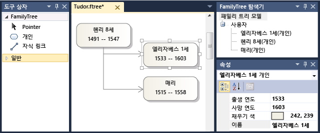

# 파일 저장소 및 XML Serialization 사용자 지정
[!INCLUDE[vs2017banner](../code-quality/includes/vs2017banner.md)]

사용자 인스턴스를 저장할 때 또는 *모델*, 에 도메인 관련 언어 (DSL)의 [!INCLUDE[vsprvs](../code-quality/includes/vsprvs_md.md)], 는 XML 파일을 만들거나 업데이트 합니다. 파일을 저장소에서 모델을 다시 다시 로드 될 수 있습니다.  
  
 아래의 설정을 조정 하 여 serialization 체계를 사용자 지정할 수 있습니다 **Xml Serialization 동작** DSL 탐색기에서. 아래의 노드가 **Xml Serialization 동작** 모든 도메인 클래스, 속성 및 관계에 대 한 합니다. 관계의 소스 클래스 아래에 있습니다. 모양과 연결선, 다이어그램 클래스에 해당 하는 노드가 있습니다.  
  
 고급 사용자 지정에 대 한 프로그램 코드를 작성할 수 있습니다.  
  
> [!NOTE]
>  특정 형식으로 모델을 저장 하려면 해당 폼에서 다시 로드할 필요가 없습니다 표시 되지만 텍스트 템플릿을 사용 하 여 사용자 지정 serialization 체계 대신이 모델에서 출력을 생성 하는 것이 좋습니다. 자세한 내용은 참조 [도메인별 언어에서 코드 생성](../modeling/generating-code-from-a-domain-specific-language.md)합니다.  
  
## <a name="model-and-diagram-files"></a>모델 및 다이어그램 파일  
 각 모델은 일반적으로 두 개의 파일에 저장 됩니다.  
  
-   모델 파일에 이름이 같은 **Model1.mydsl**합니다. 모델 요소 및 관계 및 해당 속성을 저장합니다. 와 같은 파일 확장명 **.mydsl** 에 의해 결정 됩니다는 **FileExtension** 의 속성은 **편집기** DSL 정의의 노드.  
  
-   다이어그램 파일에 이름이 같은 **Model1.mydsl.diagram**합니다. 셰이프, 커넥터 및 해당 위치, 색, 선 두께 및 다이어그램의 모양 기타 세부 정보를 저장합니다. 사용자 삭제는 **.diagram** 파일을 모델에는 중요 한 정보가 손실 되지 않습니다. 다이어그램의 레이아웃만 손실 됩니다. 모델 파일을 열면 도형의 기본 설정과 커넥터 생성 됩니다.  
  
#### <a name="to-change-the-file-extension-of-a-dsl"></a>DSL의 파일 확장명을 변경 하려면  
  
1.  DSL 정을 엽니다. DSL 탐색기에서 편집기 노드를 클릭 합니다.  
  
2.  속성 창에서 편집 된 **FileExtension** 속성입니다. 초기 포함 되지 않습니다 "."의 파일 이름 확장명입니다.  
  
3.  솔루션 탐색기에서에서 두 개의 항목 템플릿 파일의 이름을 변경 **DslPackage\ProjectItemTemplates**합니다. 이러한 파일에 다음과 같은이 형식 이름이 있습니다.  
  
     `myDsl.diagram`  
  
     `myDsl.myDsl`  
  
## <a name="the-default-serialization-scheme"></a>기본 Serialization 체계  
 이 항목에 대 한 예를 만들려면 다음 DSL 정의 사용 되었습니다.  
  
   
  
 다음 화면에서 모양이 있는 모델을 만드는이 DSL 사용 되었습니다.  
  
   
  
 이 모델은 저장 하 고 XML 텍스트 편집기에서 다시 열 수 있습니다.  
  
```  
<?xml version="1.0" encoding="utf-8"?>  
<familyTreeModel xmlns:dm0="http://schemas.microsoft.com/VisualStudio/2008/DslTools/Core" dslVersion="1.0.0.0" Id="f817b728-e920-458e-bb99-98edc469d78f" xmlns="http://schemas.microsoft.com/dsltools/FamilyTree">  
  <people>  
    <person name="Henry VIII" birthYear="1491" deathYear="1547" age="519">  
      <children>  
        <personMoniker name="/f817b728-e920-458e-bb99-98edc469d78f/Elizabeth I" />  
        <personMoniker name="/f817b728-e920-458e-bb99-98edc469d78f/Mary" />  
      </children>  
    </person>  
    <person name="Elizabeth I" birthYear="1533" deathYear="1603" age="477" />  
    <person name="Mary" birthYear="1515" deathYear="1558" age="495" />  
  </people>  
</familyTreeModel>  
  
```  
  
 Serialize 된 모델에 대 한 다음 사항을 확인 합니다.  
  
-   각 XML 노드 이름이 도메인 클래스 이름으로 일치 하는 첫 글자는 소문자로 표시 된다는입니다. 예를 들어 `familyTreeModel` 및 `person`합니다.  
  
-   도메인 속성 이름 및 생 년 같은 XML 노드에서 특성으로 serialize 됩니다. 마찬가지로 속성 이름의 시작 문자를 소문자로 변환 됩니다.  
  
-   각 관계는 관계의 원본 끝 내에 중첩 된 XML 노드도 serialize 됩니다. 노드 이름과 동일 하지만 소문자 초기 문자로 소스 역할 속성에 있습니다.  
  
     DSL 정의 라고 하는 역할의 예를 들어 **사람들이** 를 소스로 **FamilyTree** 클래스입니다.  XML에 표시 되 라는 노드가 `people` 안에 중첩 되어는 `familyTreeModel` 노드.  
  
-   각 포함 관계의 대상 끝 관계 아래에 중첩 노드도 serialize 됩니다. 예를 들어는 `people` 몇 가지 노드에 들어 `person` 노드.  
  
-   각 참조 관계의 대상 끝으로 serialize 되는 *모니커*, 대상 요소에 대 한 참조를 인코딩하는 합니다.  
  
     예를 들어 아래는 `person` 노드를 있을 수는 `children` 관계입니다. 이 노드에 같은 모니커를 포함 합니다.  
  
    ```  
    <personMoniker name="/f817b728-e920-458e-bb99-98edc469d78f/Elizabeth I" />  
    ```  
  
## <a name="understanding-monikers"></a>모니커 이해  
 모니커는 모델 및 다이어그램 파일의 다른 부분 사이의 상호 참조를 나타내는 데 사용 됩니다. 에 사용 되는 `.diagram` 모델 파일에 대 한 노드를 참조 하는 파일입니다. 모니커는 다음과 같은 두 가지 있습니다.  
  
-   *Id 모니커* 대상 요소의 GUID를 인용 합니다. 예:  
  
    ```  
    <personShapeMoniker Id="f79734c0-3da1-4d72-9514-848fa9e75157" />  
  
    ```  
  
-   *키 모니커 한정* 모니커 키 라는 지정 된 도메인 속성의 값에 의해 대상 요소를 식별 합니다. 모니커가 포함 관계의 트리에서 부모 요소의 대상 요소의 모니커 접두사로 추가 됩니다.  
  
     다음 예제는 DSL 있습니다은 명명 된 Song 클래스 도메인 포함 관계가 있는 같이 Album 이라는 도메인 클래스에서 가져옵니다.  
  
    ```  
    <albumMoniker title="/My Favorites/Jazz after Teatime" />  
    <songMoniker title="/My Favorites/Jazz after Teatime/Hot tea" />  
  
    ```  
  
     정규화 된 키 모니커는 사용할 대상 클래스에 있는 경우 도메인 속성을 옵션 **모니커 키가** 로 설정 된 `true` 에서 **Xml Serialization 동작**합니다. 예제에서는이 옵션은 도메인 클래스 "앨범" 및 "노래"에서 "Title" 이라는 도메인 속성에 대해 설정 됩니다.  
  
 정규화 된 키 모니커는 ID 모니커 보다 쉽게 읽을 수 있습니다. 모델 파일의 XML을 사람이 읽을 수를 지 원하는 경우에 정규화 된 키 모니커를 사용 하는 것이 좋습니다. 그러나 동일한 모니커 키가 있어야 둘 이상의 요소를 설정 하는 사용자에 대 한 것이 같습니다. 중복 된 키 파일이 올바르게 다시 로드 하지 발생할 수 있습니다. 따라서 정규화 된 키 모니커를 사용 하 여 참조 되는 도메인 클래스를 정의 하는 경우 사용자 중복 모니커를 가진 파일을 저장 하는 것을 방지 하는 방법을 고려해 야.  
  
#### <a name="to-set-a-domain-class-to-be-referenced-by-id-monikers"></a>도메인 클래스 ID 모니커를 참조할 수를 설정 하려면  
  
1.  다음 사항을 확인 **모니커 키가** 는 `false` 클래스 및 해당 기본 클래스의 모든 도메인 속성에 대 한 합니다.  
  
    1.  DSL 탐색기에서 **Xml Serialization Behavior\Class 데이터\\***\< 도메인 클래스>***\Element 데이터**합니다.  
  
    2.  확인 **모니커 키가** 는 `false` 모든 도메인 속성에 대 한 합니다.  
  
    3.  도메인 클래스에 있는 경우 기본 클래스를 해당 클래스의 절차를 반복 합니다.  
  
2.  설정 **Id Serialize** = `true` 도메인 클래스에 대 한 합니다.  
  
     이 속성을 확인할 수 있습니다 **Xml Serialization 동작**합니다.  
  
#### <a name="to-set-a-domain-class-to-be-referenced-by-qualified-key-monikers"></a>정규화 된 키 모니커 참조 하는 도메인 클래스를 설정 하려면  
  
-   설정 **모니커 키가** 기존 도메인 클래스의 도메인 속성에 대 한 합니다. 속성의 형식 이어야 합니다 `string`합니다.  
  
    1.  DSL 탐색기에서 **Xml Serialization Behavior\Class 데이터\\***\< 도메인 클래스>***\Element 데이터**, 한 다음 도메인 속성을 선택 합니다.  
  
    2.  속성 창에서 설정 **모니커 키가** 를 `true`합니다.  
  
-   \- 또는-  
  
     사용 하 여 새 도메인 클래스를 만들기는 **명명 된 도메인 클래스** 도구입니다.  
  
     이 도구는 Name 이라는 도메인 속성을 가진 새 클래스를 만듭니다.  **Is Element Name** 및 **모니커 키가** 이 도메인 속성의 속성으로 초기화 됩니다 `true`합니다.  
  
-   \- 또는-  
  
     모니커 키 속성이 있는 다른 클래스에는 도메인 클래스에서 상속 관계를 만듭니다.  
  
### <a name="avoiding-duplicate-monikers"></a>중복 된 모니커를 방지합니다.  
 정규화 된 키 모니커를 사용 하는 경우 불가능 두 요소는 사용자의 모델의 키 속성에 동일한 값을 가질 수 있습니다. 예를 들어 DSL 클래스 속성 이름을 가진 사용자가 있으면 사용자 동일한 것으로 두 요소의 이름을 설정 수 있습니다. 모델 가능할 수도 있지만 파일에 저장 하는 다시 로드 하지 올바르게 합니다.  
  
 이러한 상황을 방지 하는 데 도움이 되는 방법은 여러 가지가 있습니다.  
  
-   설정 **Is Element Name** = `true` 주요 도메인 속성에 대 한 합니다. DSL 정의 다이어그램에서 도메인 속성을 선택 하 고 속성 창에서 값을 설정 합니다.  
  
     사용자 클래스의 새 인스턴스를 만드는 경우이 값은 도메인 속성을 다른 값을 자동으로 할당 합니다. 기본 동작은 클래스 이름의 끝에 숫자를 추가합니다. 이렇게 해도 사용자 이름을 변경 하는 복제에만 도움이 됩니다 경우에서 사용자는 모델을 저장 하기 전에 값을 설정 하지 않습니다.  
  
-   DSL에 대 한 유효성 검사를 설정 합니다. DSL 탐색기에서 Editor\Validation를 선택 하 고 설정 된 **... 사용 하 여** 속성을 `true`합니다.  
  
     모호성에 대 한 확인 하는 자동으로 생성 된 유효성 검사 메서드가 있습니다. 이 메서드를는 `Load` 유효성 검사 범주입니다. 이제는 사용자 열라는 경고가 표시 됩니다 다시 파일을 열 수도 없습니다.  
  
     자세한 내용은 참조 [도메인별 언어에서 유효성 검사](../modeling/validation-in-a-domain-specific-language.md)합니다.  
  
### <a name="moniker-paths-and-qualifiers"></a>모니커 경로 및 한정자  
 정규화 된 키 모니커 모니커 키도 끝나며 모니커가 포함 트리에서 부모 접두사가 추가 됩니다. 예를 들어 앨범 모니커가:  
  
```  
<albumMoniker title="/My Favorites/Jazz after Teatime" />  
  
```  
  
 그런 다음 해당 앨범의 노래 일 수 있습니다.  
  
```  
<songMoniker title="/My Favorites/Jazz after Teatime/Hot tea" />  
```  
  
 그러나 앨범 대신 ID로 참조 되는 경우 다음 모니커는 다음과 같이 됩니다.  
  
```  
<albumMoniker Id="77472c3a-9bf9-4085-976a-d97a4745237c" />  
<songMoniker title="/77472c3a-9bf9-4085-976a-d97a4745237c/Hot tea" />  
```  
  
 GUID가 고유 하므로 그 되지 옵니다 부모의 모니커를 확인 합니다.  
  
 설정할 수는 특정 도메인 속성에 항상 있다고 모델 내에서 고유한 값을 알고 있는 경우 **모니커 한정자는** 를 `true` 해당 속성에 있습니다. 그러면 부모의 모니커를 사용 하지 않고 한정자로 사용할 수 있습니다. 예를 들어, 모두 설정 하면 **모니커 한정자는** 및 **모니커 키가** 앨범 클래스의 Title 도메인 속성에 대 한 모델의 이름이 나 식별자 사용 되지 않습니다 모니커에 앨범 및 포함 된 자식 노드:  
  
```  
<albumMoniker name="Jazz after Teatime" />  
<songMoniker title="/Jazz after Teatime/Hot tea" />  
  
```  
  
## <a name="customizing-the-structure-of-the-xml"></a>XML의 구조를 사용자 지정  
 다음 사용자 지정을 설정 하려면 확장 된 **Xml Serialization 동작** DSL 탐색기의 노드. 도메인 클래스에서 속성은이 클래스에서 발생 해야 하는 관계의 목록을 보려면 요소 데이터 노드를 확장 합니다. 관계를 선택 하 고 속성 창에서 해당 옵션을 조정 합니다.  
  
-   설정 **생략 요소** 를 대상 요소 목록을 유지 하 고 원본 역할 노드를 생략 하려면 true입니다. 원본 및 대상 클래스 간의 관계가 둘 이상 있으면 하 고이 옵션을 설정 해야 합니다.  
  
    ```  
  
    <familyTreeModel ...>  
      <!-- The following node is omitted by using Omit Element: -->  
      <!-- <people> -->  
        <person name="Henry VIII" .../>  
        <person name="Elizabeth I" .../>  
      <!-- </people> -->  
    </familyTreeModel>  
  
    ```  
  
-   설정 **전체 양식 사용** 관계 인스턴스를 나타내는 노드에 대상 노드를 포함할 수 있습니다. 이 옵션은 도메인 관계에 도메인 속성을 추가할 때 자동으로 설정 됩니다.  
  
    ```  
  
    <familyTreeModel ...>  
      <people>  
        <!-- The following node is inserted by using Use Full Form: -->  
        <familyTreeModelHasPeople myRelationshipProperty="x1">  
          <person name="Henry VIII" .../>  
        </familyTreeModelHasPeople>  
        <familyTreeModelHasPeople myRelationshipProperty="x2">  
          <person name="Elizabeth I" .../>  
        </familyTreeModelHasPeople>  
      </people>  
    </familyTreeModel>  
  
    ```  
  
-   설정 **표현** = **요소** 특성 값으로 대신는 요소로 저장 하는 도메인 속성입니다.  
  
    ```  
    <person name="Elizabeth I" birthYear="1533">  
      <deathYear>1603</deathYear>  
    </person>  
    ```  
  
-   특성 및 관계 serialize 되는 순서를 변경 하려면 요소 데이터에서 항목을 마우스 오른쪽 단추로 클릭 하 고 사용 하 여는 **위로 이동** 또는 **아래로 이동** 메뉴 명령입니다.  
  
## <a name="major-customization-using-program-code"></a>프로그램 코드를 사용 하 여 주요 사용자 지정  
 Serialization 알고리즘의 일부 또는 전체를 바꿀 수 있습니다.  
  
 코드를 연구 하는 것이 좋습니다 **Dsl\Generated Code\Serializer.cs** 및 **SerializationHelper.cs**합니다.  
  
#### <a name="to-customize-the-serialization-of-a-particular-class"></a>특정 클래스의 serialization을 사용자 지정 하려면  
  
1.  설정 **는 사용자 지정** 아래에서 해당 클래스 노드에 **Xml Serialization 동작**합니다.  
  
2.  모든 템플릿 변환 하 고 솔루션을 빌드하고 결과 컴파일 오류를 조사 합니다. 각 오류 근처는 주석은 제공 해야 할 어떤 코드를 설명 합니다.  
  
#### <a name="to-provide-your-own-serialization-for-the-whole-model"></a>전체 모델에 대 한 고유한 serialization을 제공 하려면  
  
1.  Dsl\GeneratedCode\SerializationHelper.cs에서 메서드를 재정의  
  
## <a name="options-in-xml-serialization-behavior"></a>Xml Serialization 동작에 대 한 옵션  
 DSL 탐색기의 Xml Serialization 동작 노드는 각 도메인 클래스, 관계, 모양, 연결선 및 다이어그램 클래스에 대 한 자식 노드를 포함 합니다. 이러한 각 노드에서 속성 및 해당 요소에서 발생 해야 하는 관계의 목록이 있습니다. 관계는 그 자체로 해당 소스 클래스 아래에 표시 됩니다.  
  
 다음 표에서 DSL 정의의이 섹션에 설정할 수 있는 옵션을 보여 줍니다. 각각의 경우에서 DSL 탐색기에서 요소를 선택 하 고 속성 창에서 옵션을 설정 합니다.  
  
### <a name="xml-class-data"></a>Xml 클래스 데이터  
 이러한 요소는 DSL 탐색기의 아래에 있습니다 **Xml Serialization Behavior\Class 데이터**합니다.  
  
|||  
|-|-|  
|속성|설명|  
|에 스키마가 사용자 지정 요소|True 이면 도메인 클래스에는 사용자 지정 요소 스키마|  
|사용자 지정|으로 설정 합니다. **True** 이 도메인 클래스에 대 한 고유한 serialization 및 deserialization 코드를 작성 하려는 경우.<br /><br /> 솔루션을 빌드하고 자세한 지침을 검색 하려면 오류를 조사 합니다.|  
|도메인 클래스|이 클래스 데이터 노드에 적용 되는 도메인 클래스입니다. 읽기 전용입니다.|  
|요소 이름|이 클래스의 요소에 대 한 Xml 노드 이름입니다. 기본값은 도메인 클래스 이름의 소문자 버전입니다.|  
|모니커 특성 이름|참조를 포함 하도록 모니커 요소에 사용 되는 특성의 이름입니다. 공백인 경우에 키 속성이 나 id의 이름이 사용 됩니다.<br /><br /> 이 예제에서 "name"입니다.  `<personMoniker name="/Mike Nash"/>`|  
|모니커 요소 이름|이 클래스의 요소를 참조 하는 모니커에 사용 되는 xml 요소의 이름입니다.<br /><br /> 기본값은 "모니커" 접미사는 클래스 이름의 소문자 버전입니다. 예를 들어, `personMoniker`을 입력합니다.|  
|모니커 형식 이름|이 클래스의 요소에는 모니커에 대해 생성 된 xsd 형식의 이름입니다. XSD에는 **Dsl\Generated 코드\\\*Schema.xsd**|  
|Id를 serialize 합니다.|True 이면 요소 GUID 파일에 포함 됩니다. 표시 된 속성이 없을 경우 true 여야 **모니커 키가** DSL이이 클래스에 참조 관계를 정의 합니다.|  
|형식 이름|지정 된 도메인 클래스에서 xsd에서 생성 된 xml 형식의 이름입니다.|  
|노트|이 요소와 관련 된 비공식적인 참고 사항|  
  
### <a name="xml-property-data"></a>Xml 속성 데이터  
 Xml 속성 노드 클래스 노드 아래에 나와 있는 합니다.  
  
|||  
|-|-|  
|속성|설명|  
|도메인 속성|Xml serialization 구성 데이터가 적용 되는 속성입니다. 읽기 전용입니다.|  
|모니커 키|True 이면 속성은이 도메인 클래스의 인스턴스를 참조 하는 모니커를 만들기 위한 키로 사용 됩니다.|  
|모니커 한정자|True 이면 속성의 모니커 한정자를 만들기 위한 사용 됩니다. False 인 경우와 다음과 같은이 도메인 클래스에 대해 true가 아니면 모니커 모니커가 포함 트리에서 부모 요소의 정규화 됩니다.|  
|표현|특성, 속성, xml 특성으로 serialize 될 경우 요소의 경우; 요소로 serialize 무시 되지 않았으면 직렬화 합니다.|  
|Xml 이름|Xml 특성 또는 속성을 나타내는 요소에 사용 되는 이름입니다. 기본적으로 도메인 속성 이름의 소문자 버전입니다.|  
|노트|이 요소와 관련 된 비공식적인 참고 사항|  
  
### <a name="xml-role-data"></a>Xml 역할 데이터  
 역할 데이터 노드는 원본 클래스 노드 아래에서 찾을 수 있습니다.  
  
|속성|설명|  
|--------------|-----------------|  
|사용자 지정 모니커는|이 생성 하 고이 관계를 탐색 하는 모니커를 해결 하기 위한 사용자 고유의 코드를 제공 하려는 경우 true로 설정 합니다.<br /><br /> 자세한 지침은, 솔루션을 빌드하고 오류 메시지를 두 번 클릭 합니다.|  
|도메인 관계|이 옵션을 적용 하는 관계를 지정 합니다. 읽기 전용입니다.|  
|요소를 생략 합니다.|True 이면 스키마에서 원본 역할에 해당 하는 XML 노드는 생략 됩니다.<br /><br /> 원본 및 대상 클래스 간의 관계가 하나 이상 없는 경우이 역할 노드는 두 개의 관계에 속해 있는 링크를 구분 합니다. 따라서는 설정 하지 않으면이 옵션 여기는 것이 좋습니다.|  
|역할 요소 이름|소스 역할에서 파생 되는 XML 요소의 이름을 지정 합니다. 기본값은 역할 속성 이름입니다.|  
|전체 폼을 사용 하 여|True 인 경우, 각 대상 요소 또는 모니커 관계를 나타내는 XML 노드에 묶여 있습니다. 이 경우 관계는 자체 도메인 속성이 true로 설정 해야 합니다.|  
  
## <a name="see-also"></a>참고 항목  
 [탐색 및 프로그램 코드에서 모델 업데이트](../modeling/navigating-and-updating-a-model-in-program-code.md)   
 [도메인별 언어에서 코드를 생성합니다.](../modeling/generating-code-from-a-domain-specific-language.md)