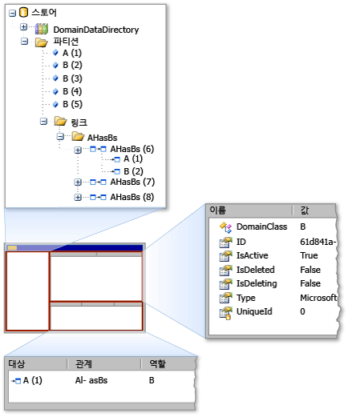

# <a name="debugging-by-using-the-store-viewer"></a>저장소 뷰어를 사용하여 디버깅
저장 뷰어로 상태를 검사할 수는 *저장* 에서 사용 하는 [!INCLUDE[dsl](../modeling/includes/dsl_md.md)]합니다. 저장 뷰어는 모든 요소 속성 및 요소 간의 링크와 함께 특정 저장소에 있는 도메인 모델 요소를 표시 합니다.

## <a name="opening-store-viewer"></a>저장소를 열지 뷰어
 에 있는 경우는 [!INCLUDE[vsprvs](../code-quality/includes/vsprvs_md.md)] 실험적 빌드, 저장소의 인스턴스 모델 정보에 포함 된 코드 중단점에서 중지 합니다. 그런 다음에 다음 명령을 입력 하 여 저장소 뷰어를 열어는 **직접 실행** 창:

```
Microsoft.VisualStudio.Modeling.Diagnostics.StoreViewer.Show(mystore);
```

> [!NOTE]
>  바꾸어야 `mystore` 저장소 인스턴스 이름을 사용 합니다. 또한 코드에 네임 스페이스를 추가 하는 경우에 정규화 된 네임 스페이스 없이 저장소 뷰어를 표시 하기 위한 명령을 입력할 수 있습니다.
>
>  `using Microsoft.VisualStudio.Modeling.Diagnostics;`
>
>  `...`
>
>  `StoreViewer.Show(mystore);`

 `Show` 메서드에 여러 오버 로드가 있습니다. 매개 변수로 파티션 또는 저장소의 인스턴스를 지정할 수 있습니다.

 대신 코드의 아무 곳 이나 저장소 뷰어를 표시 하는 코드 줄을 넣을 수 있습니다를 전달 하는 매개 변수는 `Show` 방법은 범위에 있습니다. 이 작업 저장소의 내용의 스냅숏으로 코드 줄을 실행 하는 경우 저장 뷰어를 표시 합니다.

### <a name="using-store-viewer"></a>저장소 뷰어를 사용 하 여
 저장소 뷰어를 열면 모덜리스 Windows Forms 창이 나타납니다 다음 그림과 같이 합니다.

  저장소 뷰어

 저장소 뷰어에 세 개의 창이: 왼쪽 창과 오른쪽 창에서 오른쪽 아래 창. 왼쪽된 창에 있는 형식의 트리 뷰입니다는 `DomainDataDirectory` 저장소의 구성원입니다. 파티션 노드를 확장 하 고 요소를 클릭 하면 오른쪽 창에서 요소의 속성이 나타납니다. 요소가 다른 요소에 들어 연결 된 경우 추가 요소 오른쪽 아래 창에 나타납니다. 오른쪽 아래 창에서에서 요소를 두 번 클릭 하면 요소가 왼쪽된 창에서 강조 표시 됩니다.

## <a name="see-also"></a>참고 항목

- [프로그램 코드에서 모델 탐색 및 업데이트](../modeling/navigating-and-updating-a-model-in-program-code.md)