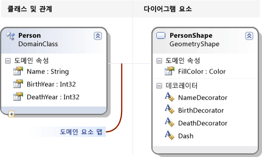
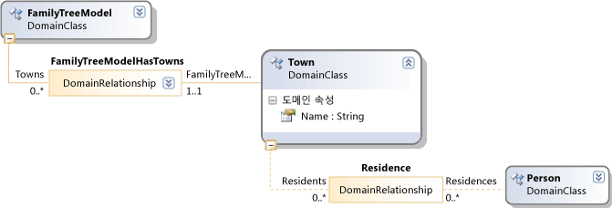
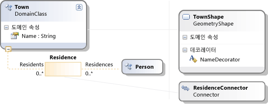

# <a name="getting-started-with-domain-specific-languages"></a>도메인별 언어 시작
이 항목에서는 정의 하 고 Visual Studio 용 모델링 SDK를 사용 하 여 만든 도메인별 언어 (DSL)를 사용 하 여 기본 개념을 설명 합니다.  


[!INCLUDE[modeling_sdk_info](includes/modeling_sdk_info.md)]

  
 Dsl을 처음 접하는 경우를 통해 작업 하는 것이 좋습니다는 **DSL 도구 Lab**,이 사이트에서 찾을 수 있는: [사용 및 모델링 SDK](http://go.microsoft.com/fwlink/?LinkID=186128)  
  
## <a name="what-can-you-do-with-a-domain-specific-language"></a>도메인별 언어를 사용 합니까?  
 도메인별 언어는 노테이션 대개 그래픽 특정 목적에 사용 하도록 설계 된입니다. 반대로, UML과 같은 언어는 범용입니다. DSL의 모델 요소와 해당 관계 및 화면에 표시 되는 방식을의 종류를 정의할 수 있습니다.  
  
 DSL을 디자인할 때 Visual Studio 통합 확장 (VSIX) 패키지의 일부로 배포할 수 있습니다. 사용자가 작업에서 DSL을 [!INCLUDE[vsprvs](../code-quality/includes/vsprvs_md.md)]:  
  
   
  
 표기법은 DSL의 일부일 뿐입니다. 표기법을 함께 VSIX 패키지에 사용자를 편집 하 고 해당 모델에서 자료를 생성 하는 데 도움이 적용할 수 있는 도구가 포함 되어 있습니다.  
  
 Dsl의 주 응용 프로그램 중 하나가 프로그램 코드, 구성 파일 및 기타 아티팩트를 생성 하는 것입니다. 특히 대규모 프로젝트 및 제품 라인, 제품의 여러 변형을 만들어지는에서 Dsl에서 생성 하는 다양 한 가변 측면에서 제공할 수 크게 증가 안정성 및 요구 사항 변경에 대 한 매우 빠른 응답.  
  
 이 개요의 나머지 부분은 기본 작업을 만들고 도메인 관련 언어를 사용 하는 방법을 소개 하는 연습 [!INCLUDE[vsprvs](../code-quality/includes/vsprvs_md.md)]합니다.  
  
## <a name="prerequisites"></a>필수 구성 요소  
 DSL을 정의하려면 다음 구성 요소를 설치해야 합니다.  
  
|||  
|-|-|  
|[!INCLUDE[vsprvs](../code-quality/includes/vsprvs_md.md)]|[http://go.microsoft.com/fwlink/?LinkId=185579](http://go.microsoft.com/fwlink/?LinkId=185579)|  
|[!INCLUDE[vssdk_current_short](../modeling/includes/vssdk_current_short_md.md)]|[http://go.microsoft.com/fwlink/?LinkId=185580](http://go.microsoft.com/fwlink/?LinkId=185580)|  
|Visual Studio 용 모델링 SDK||  


[!INCLUDE[modeling_sdk_info](includes/modeling_sdk_info.md)]

  
## <a name="creating-a-dsl-solution"></a>DSL 솔루션 만들기  
 새로 만들고 새 도메인별 언어를 만들려면 [!INCLUDE[vsprvs](../code-quality/includes/vsprvs_md.md)] 도메인별 언어 프로젝트 템플릿을 사용 하 여 솔루션입니다.  
  
#### <a name="to-create-a-dsl-solution"></a>DSL 솔루션을 만들려면  
  
1.  **파일** 메뉴에서 **새로 만들기**를 가리킨 다음 **프로젝트**를 클릭합니다.  
  
2.  **프로젝트 형식**를 확장 하 고는 **기타 프로젝트 형식** 노드를 차례로 클릭 하 여 **확장성**합니다.  
  
3.  클릭 **도메인별 언어 디자이너**합니다.  
  
       
  
4.  에 **이름** 상자에 입력 합니다 **FamilyTree**합니다. **확인**을 클릭합니다.  
  
     **도메인별 언어 마법사** 열리고 템플릿 DSL 솔루션 목록이 표시 됩니다.  
  
     각 템플릿에 대 한 설명을 보려면 클릭  
  
     서식 파일은 유용한 시작점입니다. 각각의 제공 하는 전체 작업 DSL을 필요에 맞게 편집할 수 있습니다. 일반적으로를 만들려는 가장 가까운 서식 파일을 선택 합니다.  
  
5.  이 연습에서는 선택 된 **최소 언어** 템플릿.  
  
6.  해당하는 마법사 페이지에서 DSL의 파일 이름 확장명을 입력합니다. 이 확장명은 DSL의 인스턴스가 포함된 파일에 사용됩니다.  
  
    -   DSL을 설치 하려는 모든 컴퓨터 또는 사용자의 컴퓨터에 모든 응용 프로그램에 연결 되지 않은 확장을 선택 합니다. 예를 들어 **docx** 및 **htm** 허용 되지 않는 파일 이름 확장명을 수 있습니다.  
  
    -   입력한 확장명이 DSL로 사용되고 있으면 경고가 표시됩니다. 이 경우 다른 파일 이름 확장명을 사용해야 합니다. Visual Studio SDK 실험적 인스턴스를 다시 설정하여 오래된 실험적 디자이너를 지울 수도 있습니다. 클릭 **시작**를 클릭 하 여 **모든 프로그램**, **Microsoft Visual Studio 2010 SDK**, **도구**, 차례로 **Microsoft Visual Studio 2010 실험적 인스턴스 다시 설정**합니다.  
  
7.  다른 페이지를 검사 하 고 클릭 한 다음 **마침**합니다.  
  
     두 개의 프로젝트가 포함 된 솔루션이 생성 됩니다. Dsl 및 DslPackage 라고 합니다. 다이어그램 파일 즉 명명 된 DslDefinition.dsl를 엽니다.  
  
    > [!NOTE]
    >  대부분의 두 프로젝트의 폴더에서 찾을 수 있는 코드는 DslDefinition.dsl에서 생성 됩니다. 이러한 이유로 대부분의 수정 사항은 DSL에이 파일에 작성 합니다.  
  
 이제 사용자 인터페이스는 다음 그림과 같이 표시됩니다.  
  
   
  
 이 솔루션은 DSL을 정의합니다. 자세한 내용은 참조 [도메인별 언어 도구 사용자 인터페이스 개요](../modeling/overview-of-the-domain-specific-language-tools-user-interface.md)합니다.  
  
## <a name="the-important-parts-of-the-dsl-solution"></a>DSL 솔루션의 중요 한 부분  
 새 솔루션의 다음과 같은 측면을 확인 합니다.  
  
-   **Dsl\DslDefinition.dsl** DSL 솔루션을 만들 때 표시 되는 파일입니다. 솔루션의 거의 모든 코드를이 파일에서 생성 하 고 대부분의 DSL 정의에 수행한 변경 내용이 여기입니다. 자세한 내용은 작업을 참조는 [DSL 정의 다이어그램 작업](../modeling/working-with-the-dsl-definition-diagram.md)합니다.  
  
-   **Dsl 프로젝트** 이 프로젝트는 도메인별 언어를 정의 하는 코드를 포함 합니다.  
  
-   **DslPackage 프로젝트** 이 프로젝트를 열고 편집할 수는 DSL의 인스턴스를 허용 하는 코드가 들어 있는 [!INCLUDE[vsprvs](../code-quality/includes/vsprvs_md.md)]합니다.  
  
##  <a name="a-namedebugginga-running-the-dsl"></a><a name="Debugging"></a>DSL을 실행합니다.  
 만든 즉시 DSL 솔루션을 실행할 수 있습니다. 나중에 수정할 수 있습니다 DSL 정의 점차적으로 각 변경 후에 다시 솔루션을 실행 합니다.  
  
#### <a name="to-experiment-with-the-dsl"></a>DSL를 실험 하려면  
  
1.  클릭 **모든 템플릿 변환** 솔루션 탐색기 도구 모음에서입니다. 이 다시 DslDefinition.dsl에서 소스 코드의 대부분을 생성합니다.  
  
    > [!NOTE]
    >  클릭 해야 DslDefinition.dsl을 변경할 때마다 **모든 템플릿 변환** 솔루션을 다시 작성 하기 전에 합니다. 이 단계는 자동화할 수 있습니다. 자세한 내용은 참조 [모든 템플릿 변환 자동화 하는 방법을](http://msdn.microsoft.com/en-us/b63cfe20-fe5e-47cc-9506-59b29bca768a)합니다.  
  
2.  F5 키를 또는 **디버그** 메뉴를 클릭 하 여 **디버깅 시작**합니다.  
  
     DSL을 빌드하고 실험적 인스턴스의 설치 [!INCLUDE[vsprvs](../code-quality/includes/vsprvs_md.md)]합니다.  
  
     [!INCLUDE[vsprvs](../code-quality/includes/vsprvs_md.md)]의 실험적 인스턴스가 시작됩니다. 실험적 인스턴스는 레지스트리, 별도 하위 트리에서 설정을 여기서 [!INCLUDE[vsprvs](../code-quality/includes/vsprvs_md.md)] 확장 디버깅을 위해 등록 됩니다. 일반적인 인스턴스 [!INCLUDE[vsprvs](../code-quality/includes/vsprvs_md.md)] 그곳에 등록 된 확장에 대 한 액세스 권한이 없습니다.  
  
3.  실험적 인스턴스에서 [!INCLUDE[vsprvs](../code-quality/includes/vsprvs_md.md)], 모델 파일을 엽니다 **테스트** 에서 **솔루션 탐색기**합니다.  
  
     \- 또는 -  
  
     디버깅 프로젝트를 마우스 오른쪽 **추가**를 클릭 하 고 **항목**합니다. 에 **항목 추가** 대화 상자에서 DSL의 파일을 입력 합니다.  
  
     모델 파일에 빈 다이어그램이 열립니다.  
  
     도구 상자가 열리고 다이어그램 형식에 적합 한 도구를 표시 합니다.  
  
4.  다이어그램에서 모양 및 연결선을 만들려면 도구를 사용 합니다.  
  
    1.  셰이프를 만들려면 다이어그램 예제에서는 모양 도구에서 끕니다.  
  
    2.  두 셰이프를 연결 하려면 예제 연결선 도구를 클릭 하 고 첫 번째 셰이프를 다음 두 번째 셰이프를 클릭 합니다.  
  
5.  자격 증명을 변경할 셰이프의 레이블을 클릭 합니다.  
  
 실험적 [!INCLUDE[vsprvs](../code-quality/includes/vsprvs_md.md)] 다음 예와 비슷하게 표시 됩니다.  
  
   
  
### <a name="the-content-of-a-model"></a>모델의 콘텐츠  
 DSL의 인스턴스인 파일의 내용을 라고는 *모델*합니다. 모델에 포함 된 *모델**요소* 및 *링크* 요소 사이 있습니다. DSL 정의의 모델 요소 유형을 지정 하 고 링크 된 모델에 존재할 수 있습니다. 예를 들어 최소 언어 서식 파일에서 만든 DSL의 한 가지 유형의 모델 요소 및가 한 가지 유형의 링크  
  
 DSL 정의 다이어그램에 모델을 표시 하는 방법을 지정할 수 있습니다. 다양 한 모양과 연결선의 스타일에서에서 선택할 수 있습니다. 다른 셰이프 안에 일부 셰이프에 나타나도록 지정할 수 있습니다.  
  
 에 트리 모델을 볼 수는 **탐색기** 모델을 편집 하는 보기입니다. 다이어그램에 셰이프를 추가 하면 모델 요소는 또한 탐색기에 나타납니다. 탐색기는 다이어그램 없는 경우에 사용할 수 있습니다.  
  
 탐색기의 디버깅 인스턴스를 볼 수 없는 경우 [!INCLUDE[vsprvs](../code-quality/includes/vsprvs_md.md)]의 **보기** 메뉴 **다른 창**, 클릭 하 고 * \<Your 언어 >* **탐색기**합니다.  
  
### <a name="the-api-of-your-dsl"></a>DSL의 API  
 DSL을 읽고 인스턴스인 DSL의 모델을 업데이트할 수 있는 API를 생성 합니다. API의 한 응용 프로그램 모델에서 텍스트 파일을 생성 하는 것입니다. 자세한 내용은 참조 [T4 텍스트 템플릿을 사용 하 여 디자인 타임 코드 생성](../modeling/design-time-code-generation-by-using-t4-text-templates.md)합니다.  
  
 디버깅 솔루션에서 확장명이 ".tt" 템플릿 파일을 엽니다. 이러한 샘플에는 모델에서 텍스트를 생성 및 DSL의 API를 테스트할 수 있도록 하는 방법을 보여 줍니다. 샘플 중 하나는 작성 된 [!INCLUDE[vbprvb](../code-quality/includes/vbprvb_md.md)]면에서 다른 [!INCLUDE[csprcs](../data-tools/includes/csprcs_md.md)]합니다.  
  
 각 서식 파일에서 파일은 생성 하는 파일. 솔루션 탐색기에서 템플릿 파일을 확장 하 고 생성된 된 파일을 엽니다.  
  
 템플릿 파일에는 모델의 모든 요소를 나열 하는 코드의 짧은 세그먼트 포함 되어 있습니다.  
  
 생성된 된 파일의 결과 포함합니다.  
  
 모델 파일을 변경 하면 파일을 다시 생성 한 후 생성 된 파일의 해당 변경 내용을 표시 됩니다.  
  
##### <a name="to-regenerate-text-files-after-you-change-the-model-file"></a>모델 파일을 변경한 후 텍스트 파일을 다시 생성 하려면  
  
1.  실험적 인스턴스에서 [!INCLUDE[vsprvs](../code-quality/includes/vsprvs_md.md)], 모델 파일을 저장 합니다.  
  
2.  실험에는 사용 하는 모델 파일에 각.tt 파일의 파일 이름 매개 변수를 참조 하 고 있는지 확인 합니다. .Tt 파일을 저장 합니다.  
  
3.  클릭 **모든 템플릿 변환** 의 도구 모음에서 **솔루션 탐색기**합니다.  
  
     \- 또는 -  
  
     다시 생성을 클릭 한 다음 원하는 서식 파일을 마우스 오른쪽 단추로 클릭 **사용자 지정 도구 실행**합니다.  
  
 텍스트 템플릿 파일의 여러 프로젝트에 추가할 수 있습니다. 각 템플릿에 하나의 결과 파일을 생성 합니다.  
  
> [!NOTE]
>  DSL 정의 변경 하면 샘플 텍스트 템플릿 코드가 작동 하지 않습니다, 이러한 업데이트를 하지 않는 한 합니다.  
  
 자세한 내용은 참조 [도메인별 언어에서 코드 생성](../modeling/generating-code-from-a-domain-specific-language.md) 및 [도메인별 언어 사용자 지정 하는 코드 작성](../modeling/writing-code-to-customise-a-domain-specific-language.md)합니다.  
  
## <a name="customizing-the-dsl"></a>DSL 사용자 지정  
 DSL 정의 수정 하려는 경우 실험적 인스턴스를 닫고 기본에서 정의 업데이트 [!INCLUDE[vsprvs](../code-quality/includes/vsprvs_md.md)] 인스턴스.  
  
> [!NOTE]
>  DSL 정의 수정한 후에 이전 버전을 사용 하 여 만든 테스트 모델의 정보를 손실 될 수 있습니다.  예를 들어 디버깅 솔루션 일부 셰이프 및 연결선이 포함 된 샘플을 옵션 이라고 하는 파일을 포함 합니다. DSL 정의 개발 하기 시작 하면 표시 됩니다 하 고 파일을 저장 하는 경우 손실 됩니다.  
  
 DSL에 다양 한 확장을 만들 수 있습니다. 다음 예제에서는 같은 느낌이 가능성을 제공 합니다.  
  
 DSL 정의 저장 각 변경 후 클릭 **모든 템플릿 변환** 에서 **솔루션 탐색기**, 누릅니다 **F5** 변경 된 DSL을 시험해 합니다.  
  
### <a name="rename-the-types-and-tools"></a>형식 및 도구를 이름을 바꿉니다.  
 기존 도메인 클래스 및 관계의 이름을 바꿉니다. 예를 들어 최소 언어 서식 파일에서 만든 Dsl 정의에서 부터는 가계 트리를 나타내는 DSL 수 있도록 다음 이름 바꾸기 작업을 수행할 수 있습니다.  
  
##### <a name="to-rename-domain-classes-relationships-and-tools"></a>도메인 클래스, 관계 및 도구 이름을 바꾸려면  
  
1.  DslDefinition 다이어그램 이름 바꾸기 **ExampleModel** 를 **FamilyTreeModel**, **ExampleElement** 를 **사람**, **대상** 를 **부모**, 및 **소스** 를 **자식**합니다. 각 레이블을 변경 하려면 클릭 수 있습니다.  
  
       
  
2.  요소 및 연결선 도구를 이름을 바꿉니다.  
  
    1.  솔루션 탐색기에서 탭을 클릭 하 여 DSL 탐색기 창을 엽니다. 이 볼 수 없는 경우는 **보기** 메뉴 **다른 창** 클릭 하 고 **DSL 탐색기**합니다. DSL 탐색기에서 DSL 정의 다이어그램 활성 창 일 경우에 표시 됩니다.  
  
    2.  속성 창을 열고 동시에 DSL 탐색기 및 속성을 볼 수 있도록 배치 합니다.  
  
    3.  DSL 탐색기에서 **편집기**, **도구 상자 탭**, * \<DSL >*, 차례로 **도구**합니다.  
  
    4.  클릭 **ExampleElement**합니다. 요소를 만드는 데 사용 되는 도구 상자 항목입니다.  
  
    5.  속성 창에서 변경 된 **이름** 속성을 **사람**합니다.  
  
         다음에 유의 **캡션** 속성도 변경 합니다.  
  
    6.  이름을 변경 같은 방식으로 **ExampleConnector** 도구를 **ParentLink**합니다. Alter는 **캡션** 한다는 이름 속성은 복사 되지 않으므로 속성입니다. 예를 들어 입력 **부모 링크**합니다.  
  
3.  DSL을 다시 빌드하십시오.  
  
    1.  DSL 정의 파일을 저장 합니다.  
  
    2.  클릭 **모든 템플릿 변환** 솔루션 탐색기의 도구 모음  
  
    3.  F5 키를 누릅니다. 실험적 인스턴스에서 될 때까지 기다렸다가 [!INCLUDE[vsprvs](../code-quality/includes/vsprvs_md.md)] 나타납니다.  
  
4.  실험적 인스턴스에서 디버깅 솔루션에서 [!INCLUDE[vsprvs](../code-quality/includes/vsprvs_md.md)], 테스트 모델 파일을 엽니다. 요소를 도구 상자에서 것으로 끌어 옵니다. 도구 캡션 및 DSL 탐색기의 형식 이름 변경 되었다는 것을 확인 합니다.  
  
5.  모델 파일을 저장 합니다.  
  
6.  .Tt 파일을 열고 이전 형식 및 속성 이름을 새 이름으로 바꿀 합니다.  
  
7.  테스트 모델.tt 파일에 지정 된 파일 이름을 지정 했는지 확인 합니다.  
  
8.  .Tt 파일을 저장 합니다. .Tt 파일의 코드를 실행의 결과 확인 하려면 생성 된 파일을 엽니다. 정확한 지 확인 합니다.  
  
### <a name="add-domain-properties-to-classes"></a>클래스에 도메인 속성을 추가 합니다.  
 예를 들어 출생 연도 나타내고 사람의 죽음의 도메인 클래스에 속성을 추가 합니다.  
  
 새 속성에 표시 되도록 다이어그램을 추가 해야 *데코레이터* 모양으로 모델 요소를 표시 합니다. 또한는 decorator를 속성 매핑해야 합니다.  
  
##### <a name="to-add-properties-and-display-them"></a>속성을 추가 하 고 표시 하려면  
  
1.  속성을 추가 합니다.  
  
    1.  DSL 정의 다이어그램에서 마우스 오른쪽 단추로 클릭는 **사람** 도메인 클래스를 가리키는 **추가**를 클릭 하 고 **도메인 속성**합니다.  
  
    2.  와 같은 새 속성 이름 목록을 입력 **출생** 및 **죽음**합니다. 키를 눌러 **Enter** 후 각각.  
  
2.  모양에 속성을 표시 하는 decorator를 추가 합니다.  
  
    1.  다이어그램의 다른 쪽 Person 도메인 클래스에서 확장 하는 회색 선을 따릅니다. 다이어그램 요소 맵을입니다. 도메인 클래스 모양 클래스에 연결합니다.  
  
    2.  이 모양 클래스를 마우스 오른쪽 **추가**를 클릭 하 고 **텍스트 Decorator**합니다.  
  
    3.  와 같은 이름 가진 두 명의 데코레이터를 추가 **BirthDecorator** 및 **DeathDecorator**합니다.  
  
    4.  각 새 데코레이터를 선택 하 고 속성 창에서 설정 된 **위치** 필드입니다. 이 셰이프에 도메인 속성 값은 표시 하는 위치를 결정 합니다. 예를 들어 설정 **InnerBottomLeft** 및 **InnerBottomRight**합니다.  
  
           
  
3.  속성에는 decorator를 매핑하십시오.  
  
    1.  DSL 세부 정보 창을 엽니다. 일반적으로 출력 창 옆에 있는 탭입니다. 이 볼 수 없는 경우는 **보기** 메뉴에서 **다른 창**를 클릭 하 고 **DSL 정보**.  
  
    2.  DSL 정의 다이어그램에서 연결 하는 선을 클릭는 **사람** shape 클래스에 도메인 클래스입니다.  
  
    3.  **DSL 정보**에 **Decorator 맵** 탭에서 매핑되지 않은 decorator에 있는 확인란을 클릭 합니다. **표시 속성**를 부여할 매핑되어 도메인 속성을 선택 합니다. 예를 들어 매핑할 **BirthDecorator** 를 **출생**합니다.  
  
4.  DSL을 저장 하 고 모든 템플릿 변환을 클릭 한 다음 F5 키를 눌러 키를 누릅니다.  
  
5.  샘플 모델 다이어그램에서 지금 선택한 위치를 클릭 하 고 수 있는 값에 데이터를 입력을 확인 합니다. 또한 선택 하면 한 **사람** 탄생과 죽음 새 속성을 표시 하는 셰이프를 속성 창.  
  
6.  .Tt 파일을 각 사용자의 속성을 가져오는 코드를 추가할 수 있습니다.  
  
   
  
### <a name="define-new-classes"></a>새 클래스를 정의 합니다.  
 모델에는 도메인 클래스 및 관계를 추가할 수 있습니다. 예를 들어 마을과 사람을 바꾸어에서 수명이 있는지를 나타내는 새 관계를 나타내는 새 클래스를 만들 수 있습니다.  
  
 모델 다이어그램에는 다양 한 종류를 고유 하 도메인 클래스에 여러 기 하 도형 및 색이 하나 또는 서로 다른 종류의 셰이프를 매핑할 수 있습니다.  
  
##### <a name="to-add-and-display-a-new-domain-class"></a>추가 하 고 새 도메인 클래스를 표시 합니다.  
  
1.  도메인 클래스를 추가 하 고 모델 루트의 자식으로 만듭니다.  
  
    1.  DSL 정의 다이어그램에서 클릭 하는 **포함 관계** 도구를 루트 클래스를 클릭 **FamilyTreeModel**, 다이어그램의 빈 부분에서 다음을 클릭 합니다.  
  
         새 도메인 클래스가 나타납니다 포함 관계와 FamilyTreeModel에 연결 됩니다.  
  
         예를 들어 해당 이름을 설정 **마을**합니다.  
  
        > [!NOTE]
        >  모델의 루트를 제외한 모든 도메인 클래스 하나 이상 포함 관계의 대상 이거나 포함의 대상이 되는 클래스에서 상속 해야 합니다. 이러한 이유로 것 자주 하는 포함 관계 도구를 사용 하 여 도메인 클래스를 만듭니다.  
  
    2.  예를 들어 새 클래스에 도메인 속성에 추가 **이름**합니다.  
  
2.  Person 및 Town 간에 참조 관계를 추가 합니다.  
  
    1.  클릭 하 고 **참조 관계** 도구, 개인을 클릭 한 다음 마을 클릭 합니다.  
  
           
  
        > [!NOTE]
        >  참조 관계를 다른 모델 트리의 한 부분에서 상호 참조를 나타냅니다.  
  
3.  모델 다이어그램에서 도시를 나타내는 셰이프를 추가 합니다.  
  
    1.  끌기는 **기 하 도형** 다이어그램 도구 상자에서 예를 들어, 이름 바꾸기 및 **TownShape**합니다.  
  
    2.  속성 창에서 채우기 색 및 Geometry와 같은 새 도형의 모양을 필드를 설정 합니다.  
  
    3.  동의 이름을 표시 하려면 데코레이터를 추가 하 고 NameDecorator 바꿉니다. 위치 속성을 설정 합니다.  
  
4.  동 도메인 클래스는 TownShape 매핑됩니다.  
  
    1.  클릭 된 **다이어그램 요소 맵을** 마 도메인 클래스 및 TownShape 모양 클래스를 클릭 한 다음 도구를 합니다.  
  
    2.  에 **Decorator 맵** 탭은 **DSL 세부 정보** 선택한 지도 커넥터와 창을 NameDecorator를 선택 하 고 설정 **표시 속성** 이름.  
  
5.  도심지 개인 간 관계를 표시 하려면 커넥터를 만듭니다.  
  
    1.  도구 상자에서 다이어그램에 연결선을 끕니다. 이름을 변경 하 고 모양 속성을 설정 합니다.  
  
    2.  사용 된 **다이어그램 요소 맵을** Person 및 Town 간의 관계에 새 커넥터를 연결 하는 도구입니다.  
  
           
  
6.  새로운 지역 걸기 요소 도구를 만듭니다.  
  
    1.  **DSL 탐색기**를 확장 하 고 **편집기** 다음 **도구 상자 탭**합니다.  
  
    2.  마우스 오른쪽 단추로 클릭 * \<DSL >* 클릭 하 고 **새 요소 도구 추가**합니다.  
  
    3.  설정의 **이름** 새로운 도구 및 설정의 속성의 **클래스** 속성 동을 합니다.  
  
    4.  설정의 **도구 상자 아이콘** 속성입니다. Click **[...] ** 및는 **파일 이름** 필드에서 아이콘 파일을 선택 합니다.  
  
7.  도시와 사람 간의 링크를 만들기 위한 연결선 도구를 만듭니다.  
  
    1.  마우스 오른쪽 단추로 클릭 * \<DSL >* 클릭 하 고 **새 연결선 도구 추가**합니다.  
  
    2.  새 도구의 Name 속성을 설정 합니다.  
  
    3.  에 **ConnectionBuilder** 속성을 사용자 대 지역 관계의 이름을 포함 하 여 작성기를 선택 합니다.  
  
    4.  설정의 **도구 상자 아이콘**합니다.  
  
8.  DSL 정의 저장, 클릭 **모든 템플릿 변환**, 누릅니다 **F5**합니다.  
  
9. 실험적 인스턴스에서 [!INCLUDE[vsprvs](../code-quality/includes/vsprvs_md.md)], 테스트 모델 파일을 엽니다. 마을과 도시와 사람 간의 링크를 만들려면 새로운 도구를 사용 합니다. 공지만 올바른 형식의 요소 간의 링크 만들 수 있습니다.  
  
10. 각 사용자 거주 하는 동을 나열 하는 코드를 만듭니다. 텍스트 템플릿은 해당 코드를 실행할 수 있는 위치 중 하나입니다. 예를 들어 다음 코드를 포함 하는 디버깅 솔루션에 기존 Sample.tt 파일을 수정할 수 있습니다.  
  
    ```  
    <#@ template inherits="Microsoft.VisualStudio.TextTemplating.VSHost.ModelingTextTransformation" debug="true" #>  
    <#@ output extension=".txt" #>  
    <#@ FamilyTree processor="FamilyTreeDirectiveProcessor" requires="fileName='Sample.ftree'" #>  
  
    <#  
      foreach (Person person in this.FamilyTreeModel.People)  
      {  
    #>  
        <#= person.Name #><#if (person.Town != null) {#> of <#= person.Town.Name #> <#}#>  
  
    <#  
          foreach (Person child in person.Children)  
      {  
    #>  
                <#= child.Name #>  
    <#  
      }  
      }  
    #>  
  
    ```  
  
     *.Tt 파일을 저장 하면 사용자 및 해당 residences의 목록을 포함 하는 보조 파일이 만들어집니다. 자세한 내용은 참조 [도메인별 언어에서 코드 생성](../modeling/generating-code-from-a-domain-specific-language.md)합니다.  
  
## <a name="validation-and-commands"></a>유효성 검사 및 명령  
 유효성 검사 제약 조건을 추가 하 여이 DSL을 추가로 개발할 수 있습니다. 이러한 제약 조건은 모델 올바른 상태에서 인지 확인 하는 메서드를 정의할 수 있습니다. 예를 들어 정의할 수 있습니다 있는지 확인 하는 제약 조건을 자식의 생년월일 부모 보다 최신인입니다. 유효성 검사 기능은 DSL 사용자 제약 조건 중 하나를 중단 하는 모델을 저장 하려고 하는 경우 경고를 표시 합니다. 자세한 내용은 참조 [도메인별 언어에서 유효성 검사](../modeling/validation-in-a-domain-specific-language.md)합니다.  
  
 또한 사용자가 호출할 수 있는 메뉴 명령을 정의할 수 있습니다. 명령 모델을 수정할 수 있습니다. 다른 모델과 상호 작용할 수도 있습니다 [!INCLUDE[vsprvs](../code-quality/includes/vsprvs_md.md)] 및 외부 리소스와 함께 합니다. 자세한 내용은 참조 [하는 방법: 표준 메뉴 명령 수정](../modeling/how-to-modify-a-standard-menu-command-in-a-domain-specific-language.md)합니다.  
  
## <a name="deploying-the-dsl"></a>DSL 배포  
 도메인별 언어를 사용 하 여 다른 사용자를 허용 하려면 배포는 [!INCLUDE[vsprvs](../code-quality/includes/vsprvs_md.md)] 확장 (VSIX) 파일입니다. DSL 솔루션을 빌드할 때 만들어집니다.  
  
 솔루션의 bin 폴더에서.vsix 파일을 찾습니다. 설치 하려는 컴퓨터에 복사 합니다. 해당 컴퓨터에서 VSIX 파일을 두 번 클릭 합니다. DSL의 모든 인스턴스에서 사용할 수 있습니다 [!INCLUDE[vsprvs](../code-quality/includes/vsprvs_md.md)] 해당 컴퓨터에 있습니다.  
  
 동일한 절차를 사용 하 여 DSL을 설치할 컴퓨터에서의 실험적 인스턴스를 사용할 필요가 없도록 [!INCLUDE[vsprvs](../code-quality/includes/vsprvs_md.md)]합니다.  
  
 자세한 내용은 참조 [도메인별 언어 솔루션 배포](../modeling/deploying-domain-specific-language-solutions.md)합니다.  
  
##  <a name="a-namereseta-removing-old-experimental-dsls"></a><a name="Reset"></a>오래 된 실험적 Dsl을 제거합니다.  
 만든 경우 실험적 Dsl는 더 이상 원하는 다시 설정 하 여 컴퓨터에서 제거할 수 없습니다는 [!INCLUDE[vsprvs](../code-quality/includes/vsprvs_md.md)] 실험적 인스턴스.  
  
 이 모든 실험 Dsl 및 실험적 다른 컴퓨터에서 제거 됩니다 [!INCLUDE[vsprvs](../code-quality/includes/vsprvs_md.md)] 확장 합니다. 이 디버그 모드에서 실행 된 확장입니다.  
  
 이 절차가 완료 된 Dsl 또는 기타 [!INCLUDE[vsprvs](../code-quality/includes/vsprvs_md.md)] VSIX 파일을 실행 하 여 완벽 하 게 설치 된 확장 합니다.  
  
#### <a name="to-reset-the-visual-studio-experimental-instance"></a>Visual Studio 실험적 인스턴스 다시 설정 하려면  
  
1.  클릭 **시작**를 클릭 하 여 **모든 프로그램**, **Microsoft Visual Studio 2010 SDK**, **도구**, 차례로 **Microsoft Visual Studio 2010 실험적 인스턴스 다시 설정**합니다.  
  
2.  모든 실험 Dsl 또는 다른 실험을 다시 작성 [!INCLUDE[vsprvs](../code-quality/includes/vsprvs_md.md)] 사용 하려면 확장 합니다.  
  
## <a name="see-also"></a>참고 항목  
 [이해 모델, 클래스 및 관계](../modeling/understanding-models-classes-and-relationships.md)   
 [도메인별 언어 정의 방법](../modeling/how-to-define-a-domain-specific-language.md)   

[!INCLUDE[modeling_sdk_info](includes/modeling_sdk_info.md)]


