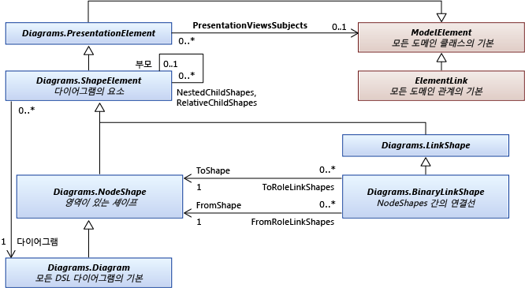
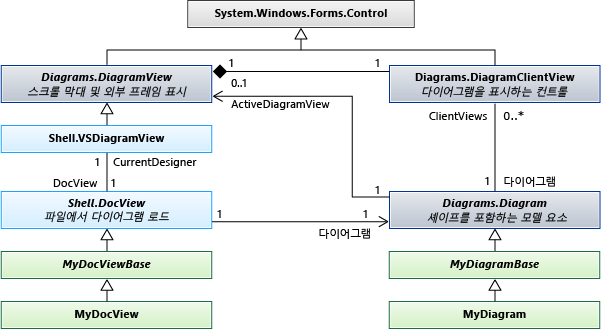

# <a name="navigating-and-updating-a-model-in-program-code"></a>프로그램 코드에서 모델 탐색 및 업데이트
및 모델 요소를 삭제, 해당 속성을 설정 하 고 및 요소 간에 링크를 삭제 하는 코드를 작성할 수 있습니다. 트랜잭션 내에서 모든 변경 해야 합니다. 다이어그램에서 요소를 보고, 다이어그램 "문제가 해결 됩니다" 자동으로 트랜잭션이 끝날 때.  
  
## <a name="in-this-topic"></a>이 항목의 내용  
 [DSL 정의 예제](#example)  
  
 [모델 탐색](#navigation)  
  
 [클래스 정보 액세스](#metadata)  
  
 [트랜잭션 내 변경 수행](#transaction)  
  
 [모델 요소 만들기](#elements)  
  
 [관계 링크 만들기](#links)  
  
 [요소 삭제](#deleteelements)  
  
 [관계 링크 삭제](#deletelinks)  
  
 [관계의 링크를 다시 정렬](#reorder)  
  
 [잠금](#locks)  
  
 [복사 및 붙여넣기](#copy)  
  
 [탐색 및 다이어그램 업데이트](#diagrams)  
  
 [도형 및 요소 간 이동](#views)  
  
 [모양 및 연결선의 속성](#shapeProperties)  
  
 [DocView 및 DocData](#docdata)  
  
##  <a name="a-nameexamplea-an-example-dsl-definition"></a><a name="example"></a>DSL 정의 예제  
 이 항목의 예제에 대 한 DslDefinition.dsl의 주요 부분입니다.  
  
   
  
 이 모델은이 DSL의 인스턴스:  
  
   
  
### <a name="references-and-namespaces"></a>참조 및 네임 스페이스  
 이 항목의 코드를 실행 하려면 다음이 참조 해야 합니다.  
  
 `Microsoft.VisualStudio.Modeling.Sdk.11.0.dll`  
  
 코드는이 네임 스페이스를 사용 합니다.  
  
 `using Microsoft.VisualStudio.Modeling;`  
  
 또한 DSL 정의에서 다른 프로젝트에 코드를 작성 하는 경우는 Dsl 프로젝트에서 빌드한 어셈블리를 가져와야 합니다.  
  
##  <a name="a-namenavigationa-navigating-the-model"></a><a name="navigation"></a>모델 탐색  
  
### <a name="properties"></a>속성  
 DSL 정의에서 정의 하는 도메인 속성에는 프로그램 코드에서 액세스할 수 있는 속성 수 있습니다.  
  
 `Person henry = ...;`  
  
 `if (henry.BirthDate < 1500) ...`  
  
 `if (henry.Name.EndsWith("VIII")) ...`  
  
 속성을 설정 하려는 경우 수행 해야 내는 [트랜잭션](#transaction):  
  
 `henry.Name = "Henry VIII";`  
  
 DSL 정의에서 속성의 경우 **종류** 는 **계산**를 설정할 수는 없습니다. 자세한 내용은 참조 [계산 및 사용자 지정 저장소 속성](../modeling/calculated-and-custom-storage-properties.md)합니다.  
  
### <a name="relationships"></a>관계  
 DSL 정의에서 정의 하는 도메인 관계 속성의 클래스 관계의 양쪽 끝에 하나의 쌍이 됩니다. 속성의 이름을 관계의 양쪽에서 역할에 대 한 레이블이 DslDefinition 다이어그램에 표시 됩니다. 역할의 복합성에 따라 형식의 속성은 관계의 다른 쪽 end에 있는 클래스 또는 해당 클래스의 컬렉션입니다.  
  
 `foreach (Person child in henry.Children) { ... }`  
  
 `FamilyTreeModel ftree = henry.FamilyTreeModel;`  
  
 관계의 반대쪽 끝에 있는 속성은 항상 역입니다. 링크를 만들거나 삭제 하는 경우에 두 요소에서 역할 속성 업데이트 됩니다. 다음 식은 (의 확장을 사용 하 여 `System.Linq`)은 항상 true 예제에서 ParentsHaveChildren 관계에 대해:  
  
 `(Person p) => p.Children.All(child => child.Parents.Contains(p))`  
  
 `&& p.Parents.All(parent => parent.Children.Contains(p));`  
  
 **ElementLinks**합니다. 또한 관계는 라는 모델 요소에 의해 표시 되는 *링크*, 도메인 관계 유형의 인스턴스인 합니다. 링크는 항상 하나의 원본 요소와 하나의 대상 요소에 있습니다. 소스 요소와 대상 요소는 같을 수 있습니다.  
  
 링크와 해당 속성에 액세스할 수 있습니다.  
  
 `ParentsHaveChildren link = ParentsHaveChildren.GetLink(henry, edward);`  
  
 `// This is now true:`  
  
 `link == null || link.Parent == henry && link.Child == edward`  
  
 기본적으로 관계의 인스턴스를 둘 이상의 모델 요소 쌍을 연결할 허용 됩니다. 하지만 DSL 정의 있는 경우는 `Allow Duplicates` 플래그는 true이 고 관계에 대 한 다음 여러 개의 링크 사용 될 수 있으며 사용 해야 `GetLinks`:  
  
 `foreach (ParentsHaveChildren link in ParentsHaveChildren.GetLinks(henry, edward)) { ... }`  
  
 링크에 액세스 하기 위한 다른 방법 있습니다. 예:  
  
 `foreach (ParentsHaveChildren link in     ParentsHaveChildren.GetLinksToChildren(henry)) { ... }`  
  
 **숨겨진된 역할입니다.** DSL 정의 있는 경우 **속성이 생성은** 는 **false** 는 특정 역할에 대 한 다음 속성이 생성 됩니다 해당 역할에 해당 하는 합니다. 그러나 링크에 액세스 하 고 수 있습니다 이동할 관계의 메서드를 사용 하 여 링크:  
  
 `foreach (Person p in ParentsHaveChildren.GetChildren(henry)) { ... }`  
  
 가장 자주 사용 하는 예제는 <xref:Microsoft.VisualStudio.Modeling.Diagrams.PresentationViewsSubject>관계 다이어그램에 표시 하는 셰이프를 모델 요소에 연결:</xref:Microsoft.VisualStudio.Modeling.Diagrams.PresentationViewsSubject>  
  
 `PresentationViewsSubject.GetPresentation(henry)[0] as PersonShape`  
  
### <a name="the-element-directory"></a>요소 디렉터리  
 요소 디렉터리를 사용 하 여 저장소의 모든 요소에 액세스할 수 있습니다.  
  
 `store.ElementDirectory.AllElements`  
  
 다음과 같은 요소를 찾기 위한 메서드 있습니다.  
  
 `store.ElementDirectory.FindElements(Person.DomainClassId);`  
  
 `store.ElementDirectory.GetElement(elementId);`  
  
##  <a name="a-namemetadataa-accessing-class-information"></a><a name="metadata"></a>클래스 정보 액세스  
 클래스, 관계 및 DSL 정의의 다른 측면에 대 한 정보를 얻을 수 있습니다. 예:  
  
 `DomainClassInfo personClass = henry.GetDomainClass();`  
  
 `DomainPropertyInfo birthProperty =`  
  
 `personClass.FindDomainProperty("BirthDate")`  
  
 `DomainRelationshipInfo relationship =`  
  
 `link.GetDomainRelationship();`  
  
 `DomainRoleInfo sourceRole = relationship.DomainRole[0];`  
  
 모델 요소의 상위 클래스는 다음과 같습니다.  
  
-   모델 요소-모든 요소 및 관계는 모델 요소  
  
-   ElementLink-모든 관계는 ElementLinks  
  
##  <a name="a-nametransactiona-perform-changes-inside-a-transaction"></a><a name="transaction"></a>트랜잭션 내 변경 수행  
 프로그램 코드는 저장소에 아무 것도 변경 될 때마다 하나의 트랜잭션으로 수행 해야 하기. 이 모든 모델 요소, 관계, 모양, 다이어그램 및 해당 속성에 적용 됩니다. 자세한 내용은 <xref:Microsoft.VisualStudio.Modeling.Transaction>.</xref:Microsoft.VisualStudio.Modeling.Transaction> 을 참조 하십시오.  
  
 가장 편리한 방법은 트랜잭션 관리는 한 `using` 문 안에 `try...catch` 문:  
  
```  
Store store; ...  
try  
{  
  using (Transaction transaction =  
    store.TransactionManager.BeginTransaction("update model"))  
    // Outermost transaction must always have a name.  
  {  
    // Make several changes in Store:  
    Person p = new Person(store);  
    p.FamilyTreeModel = familyTree;  
    p.Name = "Edward VI";  
    // end of changes to Store  
  
    transaction.Commit(); // Don't forget this!  
  } // transaction disposed here  
}  
catch (Exception ex)  
{  
  // If an exception occurs, the Store will be   
  // rolled back to its previous state.  
}  
```  
  
 한 트랜잭션 내에서 원하는 만큼을 만들 수 있습니다. 새 트랜잭션이 활성화 된 트랜잭션 내부를 열 수 있습니다.  
  
 변경 내용을 영구적, 해야 `Commit` 삭제 하기 전에 트랜잭션. 예외가 발생 하는 트랜잭션 내의 잡히지 않는 경우 저장소 변경 되기 전에 해당 상태로 다시 설정 됩니다.  
  
##  <a name="a-nameelementsa-creating-model-elements"></a><a name="elements"></a>모델 요소 만들기  
 이 예제에서는 기존 모델에 요소를 추가 합니다.  
  
```  
FamilyTreeModel familyTree = ...; // The root of the model.         
using (Transaction t =  
    familyTree.Store.TransactionManager  
    .BeginTransaction("update model"))  
{  
  // Create a new model element   
  // in the same partition as the model root:  
  Person edward = new Person(familyTree.Partition);  
  // Set its embedding relationship:  
  edward.FamilyTreeModel = familyTree;  
          // same as: familyTree.People.Add(edward);  
  // Set its properties:  
  edward.Name = "Edward VII";  
  t.Commit(); // Don't forget this!  
}  
```  
  
 이 예제는 요소를 만들기에 대 한 이러한 필수 사항입니다.  
  
-   특정 파티션의 저장소의 새 요소를 만듭니다. 및에 대 한 모델 요소 관계, 모양은 만들 수 없습니다, 이것이 일반적으로 기본 파티션에입니다.  
  
-   포함 관계의 대상으로 확인 합니다. 이 예제의 DslDefinition에서 각 사용자는 포함 관계 FamilyTreeHasPeople의 대상 이어야 합니다. 이를 위해 우리 Person 개체의 FamilyTreeModel 역할 속성을 설정 하거나 FamilyTreeModel 개체의 사용자 역할 속성에는 사용자를 추가 합니다.  
  
-   새 요소, 특히 속성의 속성을 설정 `IsName` 는 DslDefinition에 유용 합니다. 이 플래그는 해당 소유자 내에서 고유 요소를 식별 하는 데 사용 되는 속성을 표시 합니다. 이 경우 Name 속성에 해당 플래그가 있습니다.  
  
-   이 DSL의 DSL 정의 저장소에 로드 되었습니다. 예: 메뉴 명령 확장을 작성 하는 경우 일반적으로 됩니다 이미 true입니다. 다른 경우에 명시적으로 로드 하거나 수 있습니다 모델, 저장소로 사용 하 여 <xref:Microsoft.VisualStudio.Modeling.Integration.ModelBus>로드 합니다.</xref:Microsoft.VisualStudio.Modeling.Integration.ModelBus> 자세한 내용은 참조 [하는 방법: 프로그램 코드 파일에서 모델 열기](../modeling/how-to-open-a-model-from-file-in-program-code.md)합니다.  
  
 이러한 방식으로 요소를 만들 때 (DSL 다이어그램에) 하는 경우 셰이프는 자동으로 만들어집니다. 기본 모양, 색 및 기타 기능으로는 자동으로 할당 된 위치에 나타납니다. 참조 하십시오 관련된 셰이프가 표시 되는 위치 및 방법을 제어 하려면 [요소 및 모양을 만들기](#merge)합니다.  
  
##  <a name="a-namelinksa-creating-relationship-links"></a><a name="links"></a>관계 링크 만들기  
 예제 DSL 정의에 정의 된 두 개의 관계가 있습니다. 각 관계 정의 *역할 속성* 클래스 관계의 양쪽 끝에 있습니다.  
  
 세 가지 방법으로 관계의 인스턴스를 만들 수 있습니다. 이러한 세 가지 방법의 각 같은 효과가 있습니다.  
  
-   소스 역할 수행자의 속성을 설정 합니다. 예:  
  
    -   `familyTree.People.Add(edward);`  
  
    -   `edward.Parents.Add(henry);`  
  
-   대상 역할 수행자의 속성을 설정 합니다. 예:  
  
    -   `edward.familyTreeModel = familyTree;`  
  
         이 역할의 다중성이 `1..1`이므로 라는 값을 할당 합니다.  
  
    -   `henry.Children.Add(edward);`  
  
         이 역할의 다중성이 `0..*`, 컬렉션에 추가 합니다.  
  
-   관계의 인스턴스를 명시적으로 생성 합니다. 예:  
  
    -   `FamilyTreeHasPeople edwardLink = new FamilyTreeHasPeople(familyTreeModel, edward);`  
  
    -   `ParentsHaveChildren edwardHenryLink = new ParentsHaveChildren(henry, edward);`  
  
 마지막 방법은 관계 자체의 속성을 설정 하려는 경우에 유용 합니다.  
  
 이러한 방식으로 요소를 만들 때 커넥터 다이어그램에 자동으로 만들어집니다 했으나 기본 모양, 색 및 기타 기능입니다. 참조에 관련된 된 커넥터를 만드는 방법을 제어 하려면 [요소 및 모양을 만들기](#merge)합니다.  
  
##  <a name="a-namedeleteelementsa-deleting-elements"></a><a name="deleteelements"></a>요소 삭제  
 호출 하 여 요소를 삭제 `Delete()`:  
  
 `henry.Delete();`  
  
 이 작업은 또한 삭제 됩니다.  
  
-   관계 링크 요소를 송수신 합니다. 예를 들어 `edward.Parents` 더 이상 포함 됩니다 `henry`합니다.  
  
-   요소를 역할에는 `PropagatesDelete` 플래그는 true입니다. 예를 들어 모양은 요소를 표시 하는 삭제 됩니다.  
  
 기본적으로 모든 포함 관계는 `PropagatesDelete` 대상 역할에서 true입니다. 삭제 `henry` 삭제 되지 않습니다는 `familyTree`, 하지만 `familyTree.Delete()` 모두 삭제 합니다는 `Persons`합니다. 자세한 내용은 참조 [삭제 동작 사용자 지정](../modeling/customizing-deletion-behavior.md)합니다.  
  
 기본적으로 `PropagatesDelete` 참조 관계의 역할에 대 한 적용 되지 않습니다.  
  
 개체를 삭제 하는 경우 특정 전파를 생략 하 삭제 규칙을 발생할 수 있습니다. 다른 한 요소를 대체 하는 경우에 유용 합니다. 사용자는 대 한 삭제 전파 되지 않아야 하는 하나 이상의 역할의 GUID를 제공 합니다. 관계 클래스에서 GUID는 가져올 수 있습니다.  
  
 `henry.Delete(ParentsHaveChildren.SourceDomainRoleId);`  
  
 (이 예는 아무런 영향이 때문에 `PropagatesDelete` 는 `false` 의 역할에 대 한는 `ParentsHaveChildren` 관계입니다.)  
  
 경우에 따라 삭제 전파 하 여 삭제 하려는 요소 또는 요소에 한 잠금이 있는지 여부에 의해 금지 됩니다. 사용할 수 있습니다 `element.CanDelete()` 하는 요소를 삭제할 수 있는지 여부를 확인 합니다.  
  
##  <a name="a-namedeletelinksa-deleting-relationship-links"></a><a name="deletelinks"></a>관계 링크 삭제  
 역할 속성에서 요소를 제거 하 여 관계 링크를 삭제할 수 있습니다.  
  
 `henry.Children.Remove(edward); // or:`  
  
 `edward.Parents.Remove(henry);  // or:`  
  
 링크를 명시적으로 삭제할 수도 있습니다.  
  
 `edwardHenryLink.Delete();`  
  
 이 세 가지 메서드 모두 동일한 효과가 있습니다. 그 중 하나를 사용 하기만 하면 됩니다.  
  
 역할의 다중성이 0..1 또는 1..1 있으면 설정할 수 있습니다 `null`, 또는 다른 값으로:  
  
 `edward.FamilyTreeModel = null;`또는:  
  
 `edward.FamilyTreeModel = anotherFamilyTree;`  
  
##  <a name="a-namereordera-re-ordering-the-links-of-a-relationship"></a><a name="reorder"></a>관계의 링크를 순서 바꾸기  
 링크의 원본 또는 대상으로 특정 모델 요소는 특정 관계를 특정 순서가 있어야 합니다. 추가 된 순서 대로 표시 합니다. 예를 들어이 문은 순서 대로 자식은 항상 생성 됩니다.  
  
 `foreach (Person child in henry.Children) ...`  
  
 연결의 순서를 변경할 수 있습니다.  
  
 `ParentsHaveChildren link = GetLink(henry,edward);`  
  
 `ParentsHaveChildren nextLink = GetLink(henry, elizabeth);`  
  
 `DomainRoleInfo role =`  
  
 `link.GetDomainRelationship().DomainRoles[0];`  
  
 `link.MoveBefore(role, nextLink);`  
  
##  <a name="a-namelocksa-locks"></a><a name="locks"></a>잠금  
 변경 내용을 잠금으로 방지할 수 있습니다. 잠금은 개별 요소, 파티션 및 저장소에 설정할 수 있습니다. 만들려는 변경의 종류를 방지 하는 잠금을 보유 한 모든 수준의 것을 시도할 때 예외가 throw 될 수 있습니다. 요소를 사용 하 여 잠금이 설정 되어 있는지를 확인할 수 있습니다. GetLocks() <xref:Microsoft.VisualStudio.Modeling.Immutability>.</xref:Microsoft.VisualStudio.Modeling.Immutability> 네임 스페이스에 정의 된 확장 메서드인  
  
 자세한 내용은 참조 [잠금 정책을 정의 하는 읽기 전용 세그먼트 만들기를](../modeling/defining-a-locking-policy-to-create-read-only-segments.md)합니다.  
  
##  <a name="a-namecopya-copy-and-paste"></a><a name="copy"></a>복사 및 붙여넣기  
 <xref:System.Windows.Forms.IDataObject>::</xref:System.Windows.Forms.IDataObject> 에 요소 또는 요소 그룹을 복사할 수 있습니다.  
  
```  
Person person = personShape.ModelElement as Person;  
Person adopter = adopterShape.ModelElement as Person;  
IDataObject data = new DataObject();  
personShape.Diagram.ElementOperations  
      .Copy(data, person.Children.ToList<ModelElement>());  
```  
  
 요소는 직렬화 된 요소 그룹으로 저장 됩니다.  
  
 모델을 IDataObject에서 요소를 병합할 수 있습니다.  
  
```  
using (Transaction t = targetDiagram.Store.  
        TransactionManager.BeginTransaction("paste"))  
{  
  adopterShape.Diagram.ElementOperations.Merge(adopter, data);  
}  
```  
  
 `Merge ()`중 하나를 사용할 수는 `PresentationElement` 또는 `ModelElement`합니다. 지정 하는 경우는 `PresentationElement`, 세 번째 매개 변수로 대상 다이어그램에서 위치를 지정할 수도 있습니다.  
  
##  <a name="a-namediagramsa-navigating-and-updating-diagrams"></a><a name="diagrams"></a>탐색 및 다이어그램 업데이트  
 DSL의 사람 또는 노래와 같은 개념을 나타내는 도메인 모델 요소를 다이어그램에 표시 된 내용을 나타내는 도형 요소가 분리 됩니다. 도메인 모델 요소에는 중요 한 속성 및 관계의 개념을 저장합니다. 도형 요소는 크기, 위치 및 해당 구성 요소 파트의 레이아웃 및 색을 다이어그램에서 개체의 뷰를 저장합니다.  
  
### <a name="presentation-elements"></a>프레젠테이션 요소  
   
  
 DSL 정의 지정 하는 각 요소는 다음 표준 클래스 중 하나에서 파생 된 클래스를 만듭니다.  
  
|요소의 종류|기본 클래스|  
|---------------------|----------------|  
|도메인 클래스|<xref:Microsoft.VisualStudio.Modeling.ModelElement></xref:Microsoft.VisualStudio.Modeling.ModelElement>|  
|도메인 관계|<xref:Microsoft.VisualStudio.Modeling.ElementLink></xref:Microsoft.VisualStudio.Modeling.ElementLink>|  
|모양|<xref:Microsoft.VisualStudio.Modeling.Diagrams.NodeShape></xref:Microsoft.VisualStudio.Modeling.Diagrams.NodeShape>|  
|연결선|<xref:Microsoft.VisualStudio.Modeling.Diagrams.BinaryLinkShape></xref:Microsoft.VisualStudio.Modeling.Diagrams.BinaryLinkShape>|  
|다이어그램|<xref:Microsoft.VisualStudio.Modeling.Diagrams.Diagram></xref:Microsoft.VisualStudio.Modeling.Diagrams.Diagram>|  
  
 다이어그램의 요소를 일반적으로 모델 요소를 나타냅니다. 일반적으로 (항상 그렇지는 않지만), 한 <xref:Microsoft.VisualStudio.Modeling.Diagrams.NodeShape>도메인 클래스 인스턴스를 나타내는 및 <xref:Microsoft.VisualStudio.Modeling.Diagrams.BinaryLinkShape>도메인 관계 인스턴스를 나타냅니다.</xref:Microsoft.VisualStudio.Modeling.Diagrams.BinaryLinkShape> </xref:Microsoft.VisualStudio.Modeling.Diagrams.NodeShape> <xref:Microsoft.VisualStudio.Modeling.Diagrams.PresentationViewsSubject>관계 노드 또는 링크 셰이프를 나타내는 모델 요소에 연결 합니다.</xref:Microsoft.VisualStudio.Modeling.Diagrams.PresentationViewsSubject>  
  
 모든 노드 또는 링크 셰이프는 하나의 다이어그램에 속합니다. 이진 link 셰이프는 두 노드 셰이프를 연결 합니다.  
  
 셰이프는 두 집합의 자식 셰이프를 가질 수 있습니다. 셰이프는 `NestedChildShapes` 집합은 해당 부모의 경계 상자에만 적용 됩니다. 셰이프는 `RelativeChildShapes` 목록에 외부 또는 부분적으로 부모-예: 레이블 또는 포트의 범위를 벗어난 나타날 수 있습니다. 다이어그램에 아무런 `RelativeChildShapes` 및 no `Parent`합니다.  
  
###  <a name="a-nameviewsa-navigating-between-shapes-and-elements"></a><a name="views"></a>도형 및 요소 간 이동  
 도메인 모델 요소와 도형 요소로 관련 된 <xref:Microsoft.VisualStudio.Modeling.Diagrams.PresentationViewsSubject>관계.</xref:Microsoft.VisualStudio.Modeling.Diagrams.PresentationViewsSubject>  
  
```c#  
// using Microsoft.VisualStudio.Modeling;  
// using Microsoft.VisualStudio.Modeling.Diagrams;  
// using System.Linq;  
Person henry = ...;  
PersonShape henryShape =   
  PresentationViewsSubject.GetPresentation(henry)  
    .FirstOrDefault() as PersonShape;  
```  
  
 동일한 관계 다이어그램에서 연결선에 관계를 연결 합니다.  
  
```  
Descendants link = Descendants.GetLink(henry, edward);  
DescendantConnector dc =  
   PresentationViewsSubject.GetPresentation(link)  
     .FirstOrDefault() as DescendantConnector;  
// dc.FromShape == henryShape && dc.ToShape == edwardShape  
```  
  
 이 관계 다이어그램에 모델의 루트를 링크도 있습니다.  
  
```  
FamilyTreeDiagram diagram =   
   PresentationViewsSubject.GetPresentation(familyTree)  
      .FirstOrDefault() as FamilyTreeDiagram;  
```  
  
 모양이 나타내는 모델 요소를 가져오려면 다음을 사용 합니다.  
  
 `henryShape.ModelElement as Person`  
  
 `diagram.ModelElement as FamilyTreeModel`  
  
### <a name="navigating-around-the-diagram"></a>다이어그램 주변 탐색  
 일반적 다이어그램에서 모양 및 연결선을 탐색할 수 있도록 바람직하지 않습니다. 다이어그램의 모양에 작동 하는 데 필요한 경우에 모양 및 연결선 간에 이동 하는 모델에서 관계를 탐색 하는 것이 좋습니다. 이러한 메서드 양쪽 끝에서 셰이프 연결선 링크:  
  
 `personShape.FromRoleLinkShapes, personShape.ToRoleLinkShapes`  
  
 `connector.FromShape, connector.ToShape`  
  
 셰이프에 합성 합니다. 부모 모양 및 자식의 하나 이상의 계층의 구성 됩니다. 에 다른 모양에 상대적으로 배치 된 셰이프를 있다고 해당 *자식*합니다. 부모 셰이프를 이동 하는 경우 자식 함께 이동 합니다.  
  
 *상대 하위* 부모 모양의 경계 상자 외부에 나타날 수 있습니다. *중첩 된* 자식이 부모 경계 내에 엄격 하 게 표시 합니다.  
  
 다이어그램에 모양의 상위 집합을 가져오려면 다음을 사용 합니다.  
  
 `Diagram.NestedChildShapes`  
  
 모양 및 연결선의 상위 클래스는입니다.  
  
 <xref:Microsoft.VisualStudio.Modeling.ModelElement></xref:Microsoft.VisualStudio.Modeling.ModelElement>  
  
 --<xref:Microsoft.VisualStudio.Modeling.Diagrams.PresentationElement></xref:Microsoft.VisualStudio.Modeling.Diagrams.PresentationElement>  
  
 --<xref:Microsoft.VisualStudio.Modeling.Diagrams.ShapeElement></xref:Microsoft.VisualStudio.Modeling.Diagrams.ShapeElement>  
  
 -----<xref:Microsoft.VisualStudio.Modeling.Diagrams.NodeShape></xref:Microsoft.VisualStudio.Modeling.Diagrams.NodeShape>  
  
 -------<xref:Microsoft.VisualStudio.Modeling.Diagrams.Diagram></xref:Microsoft.VisualStudio.Modeling.Diagrams.Diagram>  
  
 ------- *YourShape*  
  
 -----<xref:Microsoft.VisualStudio.Modeling.Diagrams.LinkShape></xref:Microsoft.VisualStudio.Modeling.Diagrams.LinkShape>  
  
 -------<xref:Microsoft.VisualStudio.Modeling.Diagrams.BinaryLinkShape></xref:Microsoft.VisualStudio.Modeling.Diagrams.BinaryLinkShape>  
  
 --------- *YourConnector*  
  
###  <a name="a-nameshapepropertiesa-properties-of-shapes-and-connectors"></a><a name="shapeProperties"></a>모양 및 연결선의 속성  
 대부분의 경우에서 도형에 명시적으로 변경 하는 데 필요한있지 않습니다. 모델 요소를 변경한 경우 "수정" 규칙 모양 및 연결선을 업데이트 합니다. 자세한 내용은 참조 [에 응답 하 고 변경 내용을 전파](../modeling/responding-to-and-propagating-changes.md)합니다.  
  
 그러나 도형 독립적인 모델 요소의 속성에 명시적 일부 변경할 수 있도록 유용 합니다. 예를 들어 이러한 속성을 변경할 수 있습니다.  
  
-   <xref:Microsoft.VisualStudio.Modeling.Diagrams.NodeShape.Size%2A>-도형의 너비와 높이 결정 합니다.</xref:Microsoft.VisualStudio.Modeling.Diagrams.NodeShape.Size%2A>  
  
-   <xref:Microsoft.VisualStudio.Modeling.Diagrams.NodeShape.Location%2A>-위치를 기준으로 부모 모양 또는 다이어그램</xref:Microsoft.VisualStudio.Modeling.Diagrams.NodeShape.Location%2A>  
  
-   <xref:Microsoft.VisualStudio.Modeling.Diagrams.ShapeElement.StyleSet%2A>-집합이 펜과 브러시는 모양 또는 커넥터를 그리는 데 사용</xref:Microsoft.VisualStudio.Modeling.Diagrams.ShapeElement.StyleSet%2A>  
  
-   <xref:Microsoft.VisualStudio.Modeling.Diagrams.ShapeElement.Hide%2A>-하면 모양을 표시 되지 않습니다</xref:Microsoft.VisualStudio.Modeling.Diagrams.ShapeElement.Hide%2A>  
  
-   <xref:Microsoft.VisualStudio.Modeling.Diagrams.ShapeElement.Show%2A>-셰이프 후 보이도록는`Hide()`</xref:Microsoft.VisualStudio.Modeling.Diagrams.ShapeElement.Show%2A>  
  
###  <a name="a-namemergea-creating-an-element-and-its-shape"></a><a name="merge"></a>요소 및 모양을 만들기  
 요소를 만들고 포함 관계 트리의에 연결 하는 경우 셰이프가 자동으로 만들어지고 연결 되어 있습니다. 이 트랜잭션이 끝날 때 실행 하는 "수정" 규칙에 의해 이루어집니다. 그러나 셰이프는 자동으로 할당 된 위치에 나타나고 모양, 색 및 기타 기능 기본 값을 포함 합니다. 셰이프를 만드는 방법을 제어 하기 위해 병합 기능을 사용할 수 있습니다. 먼저는 ElementGroup에 추가 하려는 요소를 추가 하 고 다이어그램에는 그룹을 병합 해야 합니다.  
  
 이 방법:  
  
-   요소 이름으로 속성을 할당 한 경우, 이름을 설정 합니다.  
  
-   DSL 정의에 지정 된 모든 요소 병합 지시문을 관찰 합니다.  
  
 이 예제에서는 다이어그램을 두 번 클릭할 때 마우스 위치에 셰이프를 만듭니다. 이 샘플에 대 한 DSL 정의에 `FillColor` 속성 `ExampleShape` 노출 된 합니다.  
  
```  
  
using Microsoft.VisualStudio.Modeling;  
using Microsoft.VisualStudio.Modeling.Diagrams;  
partial class MyDiagram  
{  
  public override void OnDoubleClick(DiagramPointEventArgs e)  
  {  
    base.OnDoubleClick(e);  
  
    using (Transaction t = this.Store.TransactionManager  
        .BeginTransaction("double click"))  
    {  
      ExampleElement element = new ExampleElement(this.Store);  
      ElementGroup group = new ElementGroup(element);  
  
      { // To use a shape of a default size and color, omit this block.  
        ExampleShape shape = new ExampleShape(this.Partition);  
        shape.ModelElement = element;  
        shape.AbsoluteBounds = new RectangleD(0, 0, 1.5, 1.0);  
        shape.FillColor = System.Drawing.Color.Azure;  
        group.Add(shape);  
      }  
  
      this.ElementOperations.MergeElementGroupPrototype(  
        this,  
        group.CreatePrototype(),  
        PointD.ToPointF(e.MousePosition));  
      t.Commit();  
    }  
  }  
}  
  
```  
  
 하나 이상의 셰이프를 제공 하는 경우의 상대적인 위치를 사용 하 여 설정 된 `AbsoluteBounds`합니다.  
  
 색 및이 메서드를 사용 하 여 커넥터의 다른 노출 된 속성을 설정할 수 있습니다.  
  
### <a name="use-transactions"></a>트랜잭션 사용  
 모양, 연결선 및 다이어그램의 하위 형식을 <xref:Microsoft.VisualStudio.Modeling.ModelElement>및 저장소에 라이브.</xref:Microsoft.VisualStudio.Modeling.ModelElement> 따라서 변경 해야 할 트랜잭션 내에 있습니다. 자세한 내용은 참조 [하는 방법: 모델을 업데이트 하려면 트랜잭션을 사용 하 여](../modeling/how-to-use-transactions-to-update-the-model.md)합니다.  
  
##  <a name="a-namedocdataa-document-view-and-document-data"></a><a name="docdata"></a>문서 데이터와 문서 보기  
   
  
## <a name="store-partitions"></a>파티션을 저장합니다  
 모델을 로드 하면 해당 다이어그램 동시에 로드 됩니다. 일반적으로 모델 Store.DefaultPartition를 로드 하 고 다이어그램 내용을 다른 파티션으로 로드 됩니다. 일반적으로 각 파티션의 콘텐츠 로드 되 고 별도 파일에 저장 합니다.  
  
## <a name="see-also"></a>참고 항목  
 <xref:Microsoft.VisualStudio.Modeling.ModelElement></xref:Microsoft.VisualStudio.Modeling.ModelElement>   
 [도메인별 언어에서 유효성 검사](../modeling/validation-in-a-domain-specific-language.md)   
 [도메인별 언어에서 코드를 생성합니다.](../modeling/generating-code-from-a-domain-specific-language.md)   
 [방법: 트랜잭션을 사용 하 여 모델 업데이트](../modeling/how-to-use-transactions-to-update-the-model.md)   
 [Visual Studio Modelbus를 사용 하 여 모델 통합](../modeling/integrating-models-by-using-visual-studio-modelbus.md)   
 [변경 내용에 대한 대응 및 전파](../modeling/responding-to-and-propagating-changes.md)

