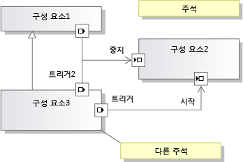

# <a name="understanding-the-dsl-code"></a>DSL 코드 이해
DSL(Domain-Specific Language) 솔루션은 [!INCLUDE[vsprvs](../code-quality/includes/vsprvs_md.md)]에서 DSL 인스턴스를 읽고 업데이트하는 데 사용할 수 있는 API를 생성합니다. 이 API는 DSL 정의에서 생성되는 코드에서 정의됩니다. 이 항목에서는 생성되는 API에 대해 설명합니다.

## <a name="the-example-solution-component-diagrams"></a>예제 솔루션: 구성 요소 다이어그램
 이 항목의 예제에서는 대부분의 원본인 솔루션을 만들려면에서 DSL 만들기는 **구성 요소 모델** 솔루션 템플릿을 합니다. 이 템플릿은 새 DSL 솔루션을 만들 때 표시되는 표준 템플릿 중 하나입니다.

> [!NOTE]
>  구성 요소 다이어그램 DSL 템플릿은 Visual Studio에서 아키텍처 메뉴를 사용 하 여 만들 수 있는 UML 구성 요소 다이어그램에 관련 되지 않았습니다. 에 **새 프로젝트** 대화 상자에서 **다른 프로젝트 Types\Extensibility** 클릭 하 고 **도메인 특정 언어 디자이너**합니다.

 이 솔루션 템플릿을 사용해 본 적이 없다면 F5 키를 누르고 해당 기능을 사용해 봅니다. 특히 구성 요소로 포트 도구를 끌어 포트를 만들고 포트를 연결할 수 있는지 확인합니다.

 

## <a name="the-structure-of-the-dsl-solution"></a>DSL 솔루션의 구조
 **Dsl** DSL에 대 한 API를 정의 하는 프로젝트입니다. **DslPackage** 와 통합 하는 방법 정의 하는 프로젝트 [!INCLUDE[vsprvs](../code-quality/includes/vsprvs_md.md)]합니다. 모델에서 생성되는 코드를 포함할 수도 있는 프로젝트를 직접 추가할 수도 있습니다.

### <a name="the-code-directories"></a>코드 디렉터리
 이들 각이 프로젝트에 있는 코드의 대부분에서 생성 되 **Dsl\DslDefinition.dsl**합니다. 생성 된 코드는는 **생성 된 코드** 폴더입니다. 생성된 된 파일을 보려면 클릭 **[+]** 생성 옆에 있는 **.tt** 파일입니다.

 생성된 코드를 검사하여 DSL을 파악하는 것이 좋습니다. 생성된 파일을 확인하려면 솔루션 탐색기에서 *.tt 파일을 확장합니다.

 \*.tt 파일 생성 하는 매우 적은 코드를 포함 합니다. 대신 `<#include>` 지시문을 사용하여 공유 템플릿 파일을 포함합니다. 공유 파일에서 찾을 수 있습니다 **files\microsoft Visual Studio 10.0\Common7\IDE\Extensions\Microsoft\DSL SDK\DSL Designer\11.0\TextTemplates**

 고유한 프로그램 코드를 DSL 솔루션에 추가할 때는 Generated Code 폴더 외부에 있는 별도의 파일에 추가합니다. 만들 수도 있습니다는 **사용자 지정 코드** 폴더입니다. 사용자 지정 폴더에 새 코드 파일을 추가할 때는 초기 코드 골격에서 네임스페이스를 수정해야 합니다.

 생성된 코드는 직접 편집하지 않는 것이 좋습니다. 솔루션을 다시 빌드하면 편집 내용이 손실되기 때문입니다. 대신 다음 작업을 수행하여 DSL을 사용자 지정합니다.

-   DSL 정의의 여러 매개 변수를 조정합니다.

-   별도의 코드 파일에 partial 클래스를 작성하여 생성된 클래스에 정의되어 있거나 해당 클래스에서 상속되는 메서드를 재정의합니다. 설정 해야 할 경우에 따라는 **Double 파생 생성** 옵션 DSL 정의에서 클래스의 생성 된 메서드를 재정의할 수 있도록 합니다.

-   생성 된 코드가 사용자 고유의 코드에 대 한 '후크'를 제공 하는 DSL 정의에서 옵션을 설정 합니다.

     예를 들어, 설정 하는 경우는 **사용자 정의 생성자가** 도메인 클래스의 옵션 및 다음 솔루션을 빌드할 오류 메시지가 표시 됩니다. 이러한 오류 메시지 중 하나를 두 번 클릭하면 사용자 지정 코드가 제공해야 하는 항목을 설명하는 주석이 생성된 코드에 표시됩니다.

-   텍스트 템플릿을 직접 작성하여 응용 프로그램에 맞는 코드를 생성합니다. 포함 파일을 사용하여 여러 프로젝트에서 공통적으로 사용되는 템플릿 부분을 공유할 수 있으며 [!INCLUDE[vsprvs](../code-quality/includes/vsprvs_md.md)] 프로젝트 템플릿을 만들어 고유한 파일 구조로 초기화되는 프로젝트를 설정할 수 있습니다.

## <a name="generated-files-in-dsl"></a>DSL의 생성된 파일
 다음 생성 된 파일에 표시 된 **Dsl** 프로젝트.

 *YourDsl* `Schema.xsd`

 DSL 인스턴스를 포함하는 파일의 스키마입니다. 이 파일은 컴파일에 복사 (**bin**) 디렉터리입니다. DSL를 설치할 때이 파일을 복사할 수 있습니다 **files\microsoft Visual Studio 11.0\Xml\Schemas** 모델 파일의 유효성을 검사할 수 있도록 합니다. 자세한 내용은 참조 [도메인별 언어 솔루션 배포](../modeling/deploying-domain-specific-language-solutions.md)합니다.

 DSL 탐색기에서 옵션을 설정하여 serialization을 사용자 지정하면 스키마도 그에 따라 변경됩니다. 그러나 serialization 코드를 직접 작성하면 이 파일이 실제 스키마를 더 이상 나타내지 않을 수 있습니다. 자세한 내용은 참조 [사용자 지정 파일 저장소 및 XML Serialization](../modeling/customizing-file-storage-and-xml-serialization.md)합니다.

 `ConnectionBuilders.cs`

 연결 작성기는 관계를 만드는 클래스로, 연결 도구를 작동하게 만드는 코드입니다. 이 파일에는 각 연결 도구의 클래스 쌍이 포함됩니다. 해당 이름은 도메인 관계 및 연결 도구 이름에서 파생 됩니다: *관계*작성기를 사용 하 고 *ConnectorTool*ConnectAction 합니다.

 구성 요소 솔루션 예제에서는 연결 작성기 중 하나의 이름이 ConnectionBuilder입니다. 도메인 관계의 이름이 Connection이므로 이는 우연의 일치입니다.

 관계에서 만든는 *관계* `Builder.Connect()` 메서드. 기본 버전은 소스 및 대상 모델 요소가 적절한지 확인한 다음 관계를 인스턴스화합니다. 예를 들어:

 `CommentReferencesSubject(sourceAccepted, targetAccepted);`

 각 작성기 클래스가의 노드에서 생성 되는 **연결 작성기** DSL 탐색기에서 섹션. `Connect` 메서드 하나가 도메인 클래스 쌍 하나 이상 간의 관계를 만들 수 있습니다. 각 쌍은 DSL 탐색기의 작성기 노드에서 확인할 수 있는 링크 연결 지시문을 통해 정의됩니다.

 예를 들어 샘플 DSL의 3가지 관계 형식에 대해 각각 연결 작성기 링크 연결 지시문을 하나씩 추가할 수 있습니다. 그러면 사용자에게 연결 도구 하나가 제공됩니다. 인스턴스화되는 관계 형식은 사용자가 선택한 소스 및 대상 요소의 형식에 따라 달라집니다.  링크 연결 지시문을 추가하려면 DSL 탐색기에서 작성기를 마우스 오른쪽 단추로 클릭합니다.

 특정 도메인 관계 형식을 만들 때 실행되는 사용자 지정 코드를 작성하려면 작성기 노드에서 해당하는 링크 연결 지시문을 선택합니다. 속성 창에서 설정 **사용 하 여 사용자 지정 연결**합니다. 솔루션을 다시 작성하고 코드를 입력하여 발생하는 오류를 해결합니다.

 사용자는이 연결 도구를 사용할 때마다 실행 되는 사용자 지정 코드를 작성 하려면 설정는 **사용자 지정은** 연결 작성기의 속성입니다. 소스 요소 허용 여부, 특정 소스 및 대상 조합 허용 여부 그리고 연결 설정 시 모델에 대해 수행해야 하는 업데이트를 결정하는 코드를 입력할 수 있습니다. 예를 들어 다이어그램에서 루프를 만들지 않는 경우에만 연결을 허용할 수 있습니다. 단일 관계 링크 대신 소스와 대상 간에 서로 관련된 여러 요소의 보다 복잡한 패턴을 인스턴스화할 수 있습니다.

 `Connectors.cs`

 보통 참조 관계를 나타내는 다이어그램 요소인 연결선의 클래스를 포함합니다. 각 클래스는 DSL 정의의 연결선 하나에서 생성됩니다. 모든 연결선 클래스는 <xref:Microsoft.VisualStudio.Modeling.Diagrams.BinaryLinkShape>에서 파생됩니다.

 런타임 시 몇 가지 다른 스타일 기능 변수의 색을 하려면 DSL 정의 다이어그램에 클래스를 마우스 오른쪽 단추로 클릭 하 고 가리킨 **노출 추가**합니다.

 런타임에 추가 스타일 기능을 변경할 수 있도록 하려면 <xref:Microsoft.VisualStudio.Modeling.Diagrams.TextField> 및 <xref:Microsoft.VisualStudio.Modeling.Diagrams.ShapeElement> 예제를 참조하세요.

 `Diagram.cs`

 다이어그램을 정의하는 클래스를 포함하며, <xref:Microsoft.VisualStudio.Modeling.Diagrams.Diagram>에서 파생됩니다.

 런타임 시 몇 가지 다른 스타일 기능 변수의 색을 하려면 DSL 정의 다이어그램에 클래스를 마우스 오른쪽 단추로 클릭 하 고 가리킨 **노출 추가**합니다.

 이 파일은 모델에 새 요소를 추가할 때 응답하는 `FixupDiagram` 규칙도 포함합니다. 해당 규칙은 새 모양을 추가하고 모델 요소에 모양을 연결합니다.

 `DirectiveProcessor.cs`

 이 지시문 프로세서를 통해 사용자는 DSL 인스턴스를 읽는 텍스트 템플릿을 작성할 수 있습니다. 지시문 프로세서는 DSL의 어셈블리(DLL)를 로드하고 네임스페이스에 대해 `using` 문을 삽입합니다. 따라서 텍스트 템플릿의 코드가 DSL에 정의된 클래스 및 관계를 사용할 수 있습니다.

 자세한 내용은 참조 [도메인 특정 언어에서 코드 생성](../modeling/generating-code-from-a-domain-specific-language.md) 및 [사용자 지정 T4 텍스트 템플릿 지시문 프로세서 만들기](../modeling/creating-custom-t4-text-template-directive-processors.md)합니다.

 `DomainClasses.cs`

 추상 클래스 및 모델 루트 클래스를 비롯하여 정의된 도메인 클래스의 구현으로, <xref:Microsoft.VisualStudio.Modeling.ModelElement>에서 파생됩니다.

 각 도메인 클래스는 다음 항목을 포함합니다.

-   각 도메인 속성에 대한 속성 정의 및 중첩 처리기 클래스. OnValueChanging() 및 OnValueChanged()를 재정의할 수 있습니다. 자세한 내용은 참조 [도메인 속성 값 변경 처리기](../modeling/domain-property-value-change-handlers.md)합니다.

     예제 DSL에서 `Comment` 클래스에는 `Text` 속성과 `TextPropertyHandler` 처리기 클래스가 포함되어 있습니다.

-   이 도메인 클래스가 참가하는 관계의 접근자 속성입니다. 역할 속성에 대한 중첩 클래스는 없습니다.

     예제 DSL에서 `Comment` 클래스에는 포함 관계 `ComponentModelHasComments`를 통해 부모 모델에 액세스하는 접근자가 있습니다.

-   생성자. 이러한 재정의 하려는 경우 설정 **사용자 정의 생성자가** 도메인 클래스에 있습니다.

-   EGP(Element Group Prototype) 처리기 메서드. 다음은 필요한 사용자 수 있는 경우 *병합* (추가)이이 클래스의 인스턴스를 다른 요소입니다. 사용자는 일반적으로 요소 도구나 다른 모양에서 끌기 또는 붙여넣기를 통해 이 작업을 수행합니다.

     예제 DSL에서는 Input Port 또는 Output Port를 Component에 병합할 수 있습니다. 또한 Component와 Comment를 모델에 병합할 수도 있습니다. Component

     클래스의 EGP 처리기 메서드를 사용하면 Component가 Port는 수락하되 Comment는 수락하지 않도록 지정할 수 있습니다. 루트 모델 클래스의 EGP 처리기는 Comment와 Component는 수락하지만 Port는 수락하지 않습니다.

 `DomainModel.cs`

 도메인 모델을 나타내는 클래스. <xref:Microsoft.VisualStudio.Modeling.DomainModel>에서 파생됩니다.

> [!NOTE]
>  이 클래스는 모델의 루트 클래스와는 다릅니다.

 Copy 및 Delete Closure는 요소를 복사하거나 삭제할 때 포함해야 하는 다른 요소를 정의합니다. 설정 하 여이 동작을 제어할 수는 **전파 복사** 및 **삭제 전파** 모든 관계의 양쪽에 있는 역할의 속성입니다. 값이 동적으로 결정되도록 하려면 Closure 클래스의 메서드를 재정의하는 코드를 작성할 수 있습니다.

 `DomainModelResx.resx`

 이 파일에는 도메인 클래스와 속성의 설명, 속성 이름, 도구 상자 레이블, 표준 오류 메시지, 사용자에게 표시될 수 있는 기타 문자열 등의 문자열이 포함됩니다. 또한 이미지 모양의 이미지와 도구 아이콘도 포함됩니다.

 이 파일은 작성된 어셈블리로 바인딩되며 이러한 리소스의 기본값을 제공합니다. 리소스의 지역화된 버전을 포함하는 위성 어셈블리를 만들어 DSL을 지역화할 수 있습니다. 해당 버전은 지역화된 리소스와 일치하는 문화권에서 DSL을 설치할 때 사용됩니다. 자세한 내용은 참조 [도메인별 언어 솔루션 배포](../modeling/deploying-domain-specific-language-solutions.md)합니다.

 `DomainRelationships.cs`

 모델에서 두 요소 간의 각 링크는 도메인 관계 클래스의 인스턴스로 표시됩니다. 모든 관계 클래스는 <xref:Microsoft.VisualStudio.Modeling.ElementLink>에서 파생되며 이 클래스는 <xref:Microsoft.VisualStudio.Modeling.ModelElement>에서 파생됩니다. 이 클래스는 ModelElement이므로 관계 인스턴스가 속성을 포함할 수 있으며 관계의 소스 또는 대상이 될 수 있습니다.

 `HelpKeywordHelper.cs`

 사용자가 F1 키를 누르면 사용되는 기능을 제공합니다.

 `MultiplicityValidation.cs`

 다중성을 1..1 또는 1..*로 지정하는 관계 역할에서는 관계 인스턴스 하나 이상이 필요하다는 경고를 사용자에게 표시해야 합니다. 이 파일은 해당 경고를 구현하는 유효성 검사 제약 조건을 제공합니다. 포함 부모에 대한 1..1 링크는 확인되지 않습니다.

 실행할 이러한 제약 조건의 설정 해야 중 하나는 **사용...**  옵션에 **Editor\Validation** DSL 탐색기에서 노드. 자세한 내용은 참조 [도메인 특정 언어의 유효성 검사](../modeling/validation-in-a-domain-specific-language.md)합니다.

 `PropertiesGrid.cs`

 이 파일은 도메인 속성에 사용자 지정 형식 설명자를 연결한 경우에만 코드를 포함합니다. 자세한 내용은 참조 [속성 창을 사용자 지정](../modeling/customizing-the-properties-window.md)합니다.

 `SerializationHelper.cs`

-   같은 모니커가 두 요소를 참조하지 않는지를 확인하는 유효성 검사 메서드입니다. 자세한 내용은 참조 [사용자 지정 파일 저장소 및 XML Serialization](../modeling/customizing-file-storage-and-xml-serialization.md)합니다.

-   여러 serialization 클래스에서 공통적으로 사용하는 기능을 제공하는 SerializationHelper 클래스입니다.

 `Serializer.cs`

 각 도메인 클래스, 관계, 모양, 연결선, 다이어그램 및 모델의 serializer 클래스입니다.

 DSL 탐색기의 설정으로 제어할 수 있습니다 이러한 클래스의 기능을 많이 **Xml Serialization 동작**합니다.

 `Shapes.cs`

 DSL 정의의 모든 모양 클래스에 대한 클래스입니다. 모양은 <xref:Microsoft.VisualStudio.Modeling.Diagrams.NodeShape>에서 파생됩니다. 자세한 내용은 참조 [사용자 지정 파일 저장소 및 XML Serialization](../modeling/customizing-file-storage-and-xml-serialization.md)합니다.

 Partial 클래스에 메서드를와 생성된 된 메서드를 재정의 하려면 설정 **Double 파생 생성** DSL 정의에서 커넥터에 대 한 합니다. 사용자 고유의 코드도 생성자를 바꾸려면, **사용자 정의 생성자가**합니다.

 런타임 시 몇 가지 다른 스타일 기능 변수의 색을 하려면 DSL 정의 다이어그램에 클래스를 마우스 오른쪽 단추로 클릭 하 고 가리킨 **노출 추가**합니다.

 런타임 시 추가 스타일 기능이 변경되도록 하려면 <xref:Microsoft.VisualStudio.Modeling.Diagrams.TextField> 및 <xref:Microsoft.VisualStudio.Modeling.Diagrams.ShapeElement> 예제를 참조하세요.

 `ToolboxHelper.cs`

 요소 도구에 요소 그룹 프로토타입을 설치하여 도구 상자를 설정합니다. 사용자가 도구를 실행하면 이러한 프로토타입의 복사본이 대상 요소와 병합됩니다.

 `CreateElementPrototype()`을 재정의하여 여러 개체의 그룹을 만드는 도구 상자 항목을 정의할 수 있습니다. 예를 들어 하위 구성 요소가 포함된 개체를 나타내는 항목을 정의할 수 있습니다. 코드를 변경한 후에는 실험적 [!INCLUDE[vsprvs](../code-quality/includes/vsprvs_md.md)] 인스턴스를 다시 설정하여 도구 상자 캐시를 지웁니다.

## <a name="generated-files-in-the-dslpackage-project"></a>DslPackage 프로젝트의 생성된 파일
 DslPackage는 DSL 모델을 [!INCLUDE[vsprvs](../code-quality/includes/vsprvs_md.md)] 셸에 연결하여 창, 도구 상자 및 메뉴 명령을 관리합니다. 대부분의 클래스는 double에서 파생되었으므로 이러한 메서드를 모두 재정의할 수 있습니다.

 `CommandSet.cs`

 다이어그램에 표시되는 컨텍스트 메뉴 명령입니다. 이 집합을 조정하거나 집합에 원하는 명령을 추가할 수 있습니다. 이 파일은 명령의 코드를 포함합니다. 메뉴에서 명령의 위치는 Commands.vsct 파일에 의해 결정됩니다. 자세한 내용은 참조 [쓰기 사용자 명령 및 작업](../modeling/writing-user-commands-and-actions.md)합니다.

 `Constants.cs`

 GUID입니다.

 `DocData.cs`

 *YourDsl* `DocData` 로드 하 고 모델을 저장할 경우 파일을 관리 하 고 저장소 인스턴스를 만듭니다.

 예를 들어 파일이 아닌 데이터베이스에 DSL을 저장하려면 `Load` 및 `Save` 메서드를 재정의할 수 있습니다.

 `DocView.cs`

 *YourDsl* `DocView` 다이어그램 나타나는 창의 관리 합니다. 예를 들어 Windows Form 내부에 다이어그램을 포함할 수 있습니다.

 DslPackage 프로젝트에 사용자 정의 컨트롤 파일, 다이어그램을 표시할 수 있는 패널 그리고 단추 및 기타 컨트롤을 추가합니다. 이렇게 하려면 Form의 코드 보기에서 다음 코드를 추가하고 DSL에 맞게 이름을 조정합니다.

```
using System;
using System.Collections.Generic;
using System.ComponentModel;
using System.Drawing;
using System.Data;
using System.Linq;
using System.Text;
using System.Windows.Forms;
using Microsoft.VisualStudio.Modeling;
using Microsoft.VisualStudio.Modeling.Shell;

namespace Company.EmbedInForm
{
  public partial class UserControl1 : UserControl
  {
    public UserControl1()
    {
      InitializeComponent();
    }

    private DiagramDocView docView;

    public UserControl1(DiagramDocView docView, Control content)
      : this()
    {
      this.docView = docView;
      panel1.Controls.Add(content);
    }

    private void button1_Click(object sender, EventArgs e)
    {
      ExampleModel modelRoot = this.docView.CurrentDiagram.ModelElement as ExampleModel;
      foreach (ExampleElement element in modelRoot.Elements)
      {
       listBox1.Items.Add(element.Name);
      }
    }
  }
  internal partial class EmbedInFormDocView
  {

    private ContainerControl container;

    /// <summary>
    /// Return a User Control instead of the DSL window.
    /// The user control will contain the DSL window.
    /// </summary>

    public override System.Windows.Forms.IWin32Window Window
    {
      get
      {
        if (container == null)
        {
          // Put the normal DSL Window inside our control
          container = new UserControl1(this, (Control)base.Window);
        }
        return container;
      }
    }
  }

}

```

 `EditorFactory.cs`

 `DocData` 및 `DocView`를 인스턴스화합니다. 이 파일은 DSL 패키지 시작 시 [!INCLUDE[vsprvs](../code-quality/includes/vsprvs_md.md)]에서 편집기를 여는 데 사용하는 표준 인터페이스를 제공하며, Package.cs의 `ProvideEditorFactory` 특성에서 참조됩니다.

 `GeneratedVSCT.vsct`

 다이어그램 상황에 맞는 메뉴와 같은 메뉴에 표준 메뉴 명령을 찾습니다는 **편집** 메뉴 및 기타 등등. 명령의 코드는 CommandSet.cs에 있습니다. 표준 명령을 다시 배치하거나 수정할 수 있으며 원하는 명령을 추가할 수도 있습니다. 자세한 내용은 참조 [쓰기 사용자 명령 및 작업](../modeling/writing-user-commands-and-actions.md)합니다.

 `ModelExplorer.cs`

 DSL의 모델 탐색기를 정의합니다. 이 파일은 사용자에게 다이어그램과 함께 표시되는 모델의 트리 뷰입니다.

 예를 들어 `InsertTreeView()`를 재정의해 모델 탐색기에서 요소가 표시되는 순서를 변경할 수 있습니다.

 모델 탐색기에서 선택한 항목이 다이어그램 선택 항목과 계속 동기화되도록 하려는 경우 다음 코드를 사용할 수 있습니다.

```
protected override void OnSelectionChanged(global::System.EventArgs e)
{
base.OnSelectionChanged(e);
// get the selected element
DslModeling::ModelElement selectedElement =
this.PrimarySelection as DslModeling::ModelElement;
// Select in the model explorer
SelectInModelExplorer<YOURLANGUAGEExplorerToolWindow>(selectedElement);
}
private void SelectInModelExplorer<T>(DslModeling::ModelElement modelElement)
where T : DslShell.ModelExplorerToolWindow
{
DslShell::ModelingPackage package =
this.GetService(typeof(VSShell.Package)) as DslShell::ModelingPackage;

if (package != null)
{
// find the model explorer window
T explorerWindow = package.GetToolWindow(typeof(T), true) as T;
if (explorerWindow != null)
{
// get the tree container
DslShell.ModelExplorerTreeContainer treeContainer =
explorerWindow.TreeContainer;
// find the tree node
DslShell.ExplorerTreeNode treeNode =
treeContainer.FindNodeForElement(modelElement);
// select the node
explorerWindow.TreeContainer.ObjectModelBrowser.SelectedNode = treeNode;
}
}
}

```

 `ModelExplorerToolWindow.cs`

 모델 탐색기가 표시되는 창을 정의하고 탐색기의 항목 선택을 처리합니다.

 `Package.cs`

 이 파일은 DSL이 [!INCLUDE[vsprvs](../code-quality/includes/vsprvs_md.md)]에 통합되는 방식을 정의합니다. 패키지 클래스의 특성은 파일 확장명이 지정된 파일의 처리기로 DSL을 등록하고 해당 도구 상자를 정의하며 새 창을 열 방식을 정의합니다. 첫 번째 DSL을 [!INCLUDE[vsprvs](../code-quality/includes/vsprvs_md.md)] 인스턴스로 로드할 때 Initialize() 메서드가 한 번 호출됩니다.

 `Source.extension.vsixmanifest`

 이 파일을 사용자 지정하려면 `.tt` 파일을 편집합니다.

> [!WARNING]
>  아이콘, 이미지 등의 리소스를 포함하도록 .tt 파일을 편집하는 경우에는 VSIX 빌드에 리소스가 포함되는지 확인해야 합니다. 솔루션 탐색기에서 파일을 선택 하 고 있는지 확인은 **VSIX에 포함** 속성은 `True`합니다.

 이 파일은 DSL을 VSIX(Visual Studio Integration Extension)로 패키징하는 방식을 제어합니다. 자세한 내용은 참조 [도메인별 언어 솔루션 배포](../modeling/deploying-domain-specific-language-solutions.md)합니다.

## <a name="see-also"></a>참고 항목

- [도메인별 언어 정의 방법](../modeling/how-to-define-a-domain-specific-language.md)
- [모델, 클래스 및 관계 이해](../modeling/understanding-models-classes-and-relationships.md)
- [도메인별 언어 사용자 지정 및 확장](../modeling/customizing-and-extending-a-domain-specific-language.md)
- [도메인별 언어를 사용자 지정하는 코드 작성](../modeling/writing-code-to-customise-a-domain-specific-language.md)
