# 코드 맵을 사용하여 응용 프로그램 디버그
코드 맵을 사용하면 많은 코드베이스, 익숙하지 않은 코드 또는 레거시 코드에서 길을 잃는 것을 방지할 수 있습니다. 예를 들어, 디버깅 하는 경우에 여러 파일 및 프로젝트에서 코드를 확인 할 수도 있습니다. 코드 맵을 사용하여 코드를 탐색하고 코드 조각 간의 관계를 확인할 수 있습니다. 이렇게 하면 머릿속에서 이 코드를 추적하거나 별도 다이어그램을 그리지 않아도 됩니다. 따라서 작업이 중단된 경우 코드 맵을 통해 작업 중인 코드에 대한 기억을 상기시킬 수 있습니다.

 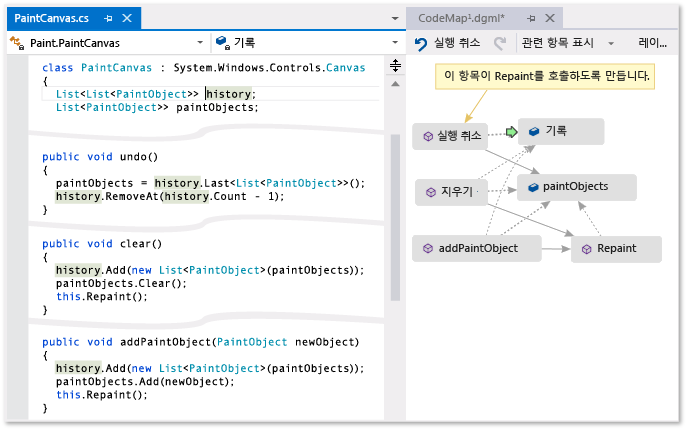

 **편집기에서 커서 나타나는 녹색 화살표가 표시**

 명령 및 코드 맵에서 작업할 때 사용할 수 있는 작업의 세부 정보를 참조 하십시오. [찾아보기 및 다시 정렬 코드 맵](../modeling/browse-and-rearrange-code-maps.md)합니다.

## 문제 이해
 작업 중인 드로잉 프로그램에 버그가 있다고 가정합니다. 버그를 재현 하려면 Visual Studio와 키를 눌러 솔루션을 열 **F5** 디버깅을 시작 합니다.

 선을 그리고 선택 **마지막 획 실행 취소**, 다음 줄을 그릴 때까지 아무 작업도 수행 합니다.

 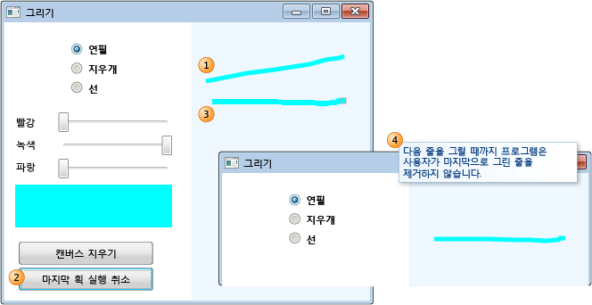

 따라서 `Undo` 메서드를 검색하여 조사를 시작합니다. `PaintCanvas` 클래스에서 찾습니다.

 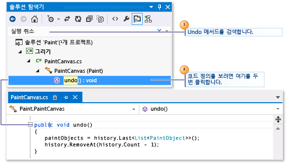

## 코드 매핑 시작
 이제 `undo` 메서드 및 관계 매핑을 시작합니다. 코드 편집기에서 새 코드 맵을 참조하는 `undo` 메서드와 필드를 추가합니다. 새 맵을 만들 경우 코드를 인덱싱하는 데 약간의 시간이 걸립니다. 이렇게 하면 이후 작업 실행이 빨라집니다.

 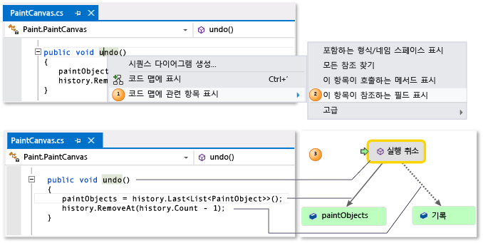

> [!TIP]
>  녹색 강조 표시에는 맵에 마지막으로 추가된 항목이 표시됩니다. 녹색 화살표는 코드에서 커서의 위치를 보여 줍니다. 항목 사이의 화살표는 다양한 관계를 나타냅니다. 마우스로 가리키고 도구 설명을 검토하여 맵에서 항목에 대한 더 자세한 정보를 얻을 수 있습니다.

 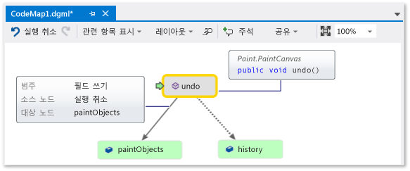

## 맵에서 코드 탐색 및 검사
 각 필드에 대 한 코드 정의 보려면 지도에 필드를 두 번 클릭 하거나 필드 및 키를 눌러 선택 **F12**합니다. 녹색 화살표를 누르면 맵의 항목 사이에서 이동합니다. 코드 편집기의 커서를 눌러도 자동으로 이동할 수 있습니다.

 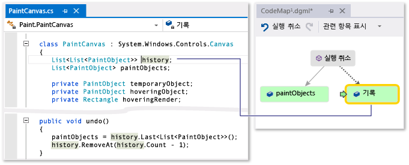

 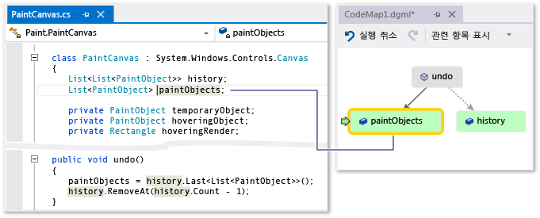

> [!TIP]
>  코드 편집기에서 커서를 이동하여 맵의 녹색 화살표를 이동할 수도 있습니다.

## 코드 조각 간의 관계 이해
 이제 `history` 및 `paintObjects` 필드와 상호 작용하는 다른 코드에 대해 알아 보려고 합니다. 이러한 필드를 참조하는 모든 메서드를 맵에 추가할 수 있습니다. 이 작업은 맵이나 코드 편집기에서 수행할 수 있습니다.

 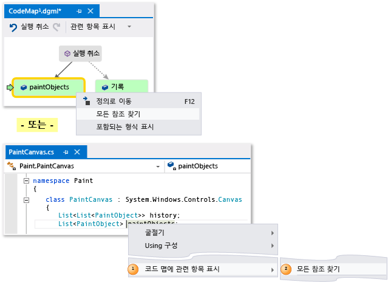

 

> [!NOTE]
>  Windows Phone 또는 Windows 스토어와 같은 여러 앱에 공유되는 프로젝트에서 항목을 추가할 경우 해당 항목은 항상 현재 활성화된 앱 프로젝트와 함께 맵에 나타납니다. 따라서 컨텍스트를 다른 앱 프로젝트로 변경하는 경우 맵의 컨텍스트도 공유 프로젝트에서 새로 추가된 항목에 대해 변경됩니다. 맵의 항목에 수행하는 작업은 동일한 컨텍스트를 공유하는 항목에만 적용됩니다.

 레이아웃을 변경하여 관계 흐름을 재정렬하고 맵을 읽기 쉽도록 만듭니다. 또한 항목을 끌어서 항목을 맵 주위로 이동할 수도 있습니다.

 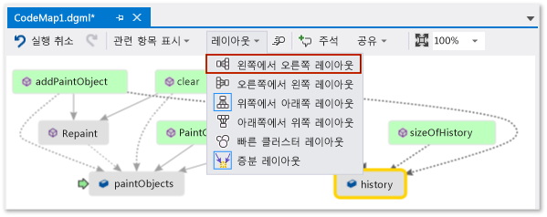

> [!TIP]
>  기본적으로 **증분 레이아웃** 켜져 있습니다. 이 설정은 새 항목을 추가할 때 맵을 가능한 적게 다시 정렬합니다. 새 항목을 추가할 때마다 전체 맵을 다시 정렬 하려면 해제 **증분 레이아웃**합니다.

 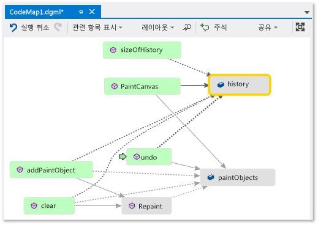

 이러한 메서드를 살펴보겠습니다. 지도 두 번 클릭은 **PaintCanvas** 메서드를이 방법과 키를 눌러 선택 또는 **F12**합니다. 이 메서드가 빈 목록으로 `history` 및 `paintObjects`를 만드는 것을 볼 수 있습니다.

 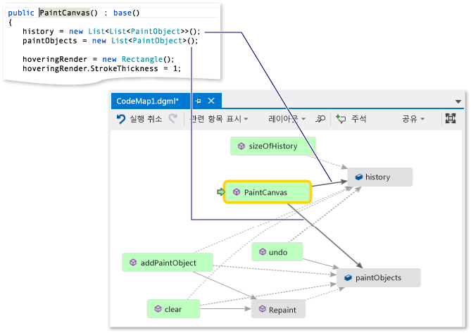

 이제 같은 단계를 반복하여 `clear` 메서드 정의를 검사합니다. `clear`가 `paintObjects` 및 `history`와 함께 몇 가지 작업을 수행하는 것을 볼 수 있습니다. 그런 다음 `Repaint` 메서드를 호출합니다.

 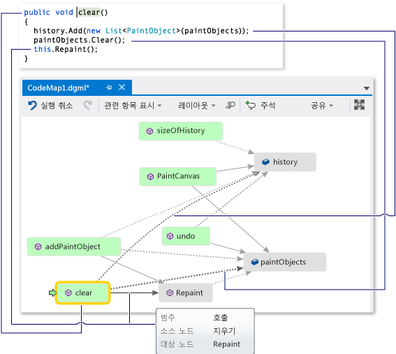

 이제 `addPaintObject` 메서드 정의를 검사합니다. 또한 `history` 및 `paintObjects`도 사용하여 일부 작업을 수행합니다. `Repaint`도 호출합니다.

 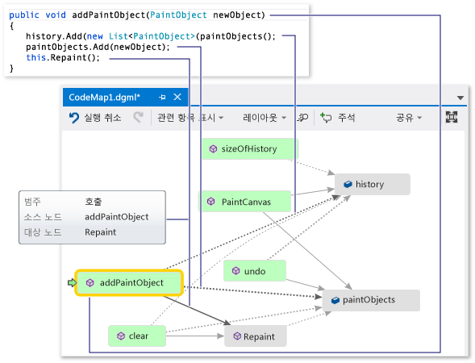

## 맵을 검토하여 문제 찾기
 `history` 및 `paintObjects`를 수정하는 모든 메서드가 `Repaint`를 호출하는 것 같습니다. `undo`가 동일한 필드를 수정함에도 불구하고 `Repaint` 메서드는 아직 `undo`를 호출하지 않습니다. 따라서 `Repaint`에서 `undo`를 호출하여 이 문제를 해결할 수 있다고 생각합니다.

 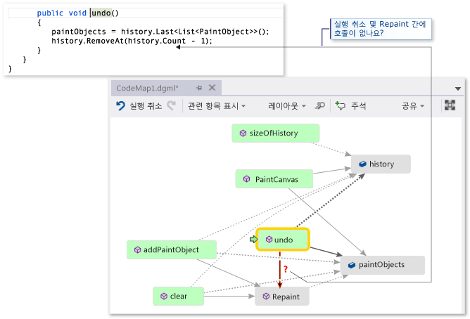

 누락된 호출을 표시하는 맵이 없는 경우 특히 코드가 복잡한 경우 해당 문제는 찾기 더 어려울 수 있습니다.

## 검색 및 다음 단계 공유
 사용자 또는 다른 작업자가 버그를 수정하기 전에 문제 해결 방법을 보여주는 맵에 메모를 만들 수 있습니다.

 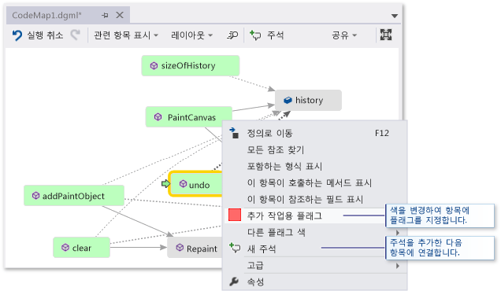

 예를 들어 맵에 주석을 추가하고 색을 사용하여 항목에 플래그를 지정할 수 있습니다.

 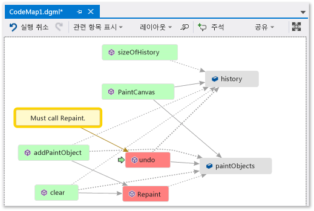

 Microsoft Outlook이 설치되어 있으면 맵을 다른 사람에게 전자 메일로 보낼 수 있습니다. 또한 맵을 이미지 또는 다른 형식으로 내보낼 수도 있습니다.

 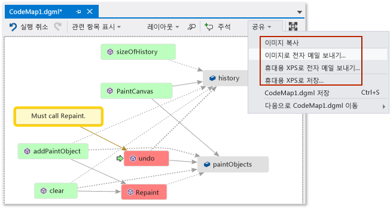

## 문제를 해결하고 수행했던 작업 표시
 이 버그를 해결하려면 `Repaint`에 대한 호출을 `undo`에 추가합니다.

 

 수정을 확인하려면 디버깅 세션을 다시 시작하고 버그를 재현해 봅니다. 이제 선택 **마지막 획 실행 취소** 예상 대로 작동 하 고 확인 하며 올바로 수정 합니다.

 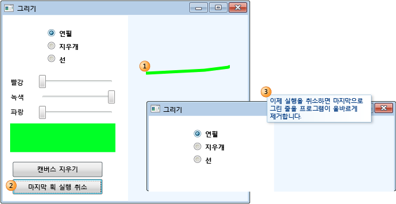

 맵을 업데이트하여 수정 내용을 보여줄 수 있습니다.

 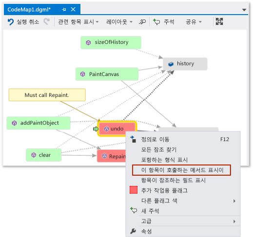

 지도는 이제 간의 링크가 표시 **실행 취소** 및 **다시 그리기**합니다.

 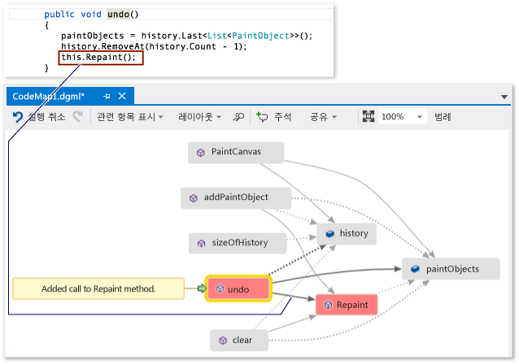

> [!NOTE]
>  맵을 업데이트하면 맵을 만드는 데 사용한 코드 인덱스가 업데이트되었음을 나타내는 메시지가 나타날 수 있습니다. 누군가가 코드를 변경하여 맵이 현재 코드와 일치하지 않음을 의미합니다. 이 경우 맵을 업데이트할 수 없는 것은 아니지만 맵을 다시 만들어서 코드와 일치하는지 확인해야 할 수 있습니다.

 이제 조사가 완료 것입니다. 코드를 매핑하여 문제를 성공적으로 발견하고 해결했습니다. 코드 주위를 탐색하고 배운 내용을 기억하는 데 도움이 되며 문제를 해결하는 단계를 보여 주는 맵도 있습니다.

## 참고 항목

- [디버깅 하는 동안 호출 스택의 맵 메서드](../debugger/map-methods-on-the-call-stack-while-debugging-in-visual-studio.md)
- [코드 시각화](../modeling/visualize-code.md)
