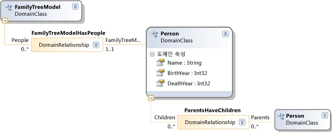

# <a name="validation-in-a-domain-specific-language"></a>도메인별 언어에서 유효성 검사
DSL(Domain-Specific Language) 작성자는 사용자가 만든 모델이 적절한지를 확인하는 유효성 검사 제약 조건을 정의할 수 있습니다. 예를 들어 DSL에서 여러 세대를 포함하는 가족 구성도 그리기를 허용하는 경우 자녀의 생년월일을 부모의 생년월일 이후로 지정하도록 하는 제약 조건을 작성할 수 있습니다.

 유효성 검사 제약 조건, 열릴 때 모델을 저장 하는 때와 사용자가 명시적으로 실행할 때 실행을 할 수 있습니다는 **유효성 검사** 메뉴 명령입니다. 프로그램 제어 하에서 유효성 검사를 실행할 수도 있습니다. 예를 들어 속성 값 또는 관계 변경에 대한 응답으로 유효성 검사를 실행할 수 있습니다.

 유효성 검사는 텍스트 템플릿 또는 사용자의 모델을 처리 하는 다른 도구를 작성 하는 경우에 특히 중요 합니다. 유효성 검사를 수행하면 이러한 도구에서 가정하는 사전 조건을 모델이 충족하는지를 확인할 수 있습니다.

> [!WARNING]
>  확장 메뉴 명령 및 제스처 처리기와 함께 DSL에 대한 별도의 확장에서 유효성 검사 제약 조건을 정의하도록 허용할 수도 있습니다. 사용자는 DSL과 함께 이러한 확장을 설치하도록 선택할 수 있습니다. 자세한 내용은 참조 [MEF를 사용 하 여 DSL 확장](../modeling/extend-your-dsl-by-using-mef.md)합니다.

## <a name="running-validation"></a>유효성 검사 실행
 사용자는 모델, 즉 DSL 인스턴스를 편집할 때 다음 작업을 통해 유효성 검사를 실행할 수 있습니다.

-   다이어그램을 마우스 오른쪽 단추로 클릭 하 고 선택 **모든 유효성 검사**합니다.

-   DSL 선택의 탐색기에서 최상위 노드를 마우스 오른쪽 단추로 클릭 **모든 유효성 검사**

-   모델을 저장합니다.

-   모델을 엽니다.

-   또한 메뉴 명령의 일부분이나 변경에 대한 응답 등으로 유효성 검사를 실행하는 프로그램 코드를 작성할 수도 있습니다.

 유효성 검사 오류에 표시 됩니다는 **오류 목록** 창. 사용자는 오류 메시지를 두 번 클릭하여 오류의 원인인 모델 요소를 선택할 수 있습니다.

## <a name="defining-validation-constraints"></a>유효성 검사 제약 조건 정의
 DSL 관계 또는 도메인 클래스에 유효성 검사 메서드를 추가하여 유효성 검사 제약 조건을 정의합니다. 유효성 검사가 사용자에 의해 또는 프로그램 제어 하에서 실행되면 일부 또는 전체 유효성 검사 메서드가 실행됩니다. 각 메서드는 해당 클래스의 각 인스턴스에 적용되며 각 클래스에는 여러 유효성 검사 메서드가 있을 수 있습니다.

 각 유효성 검사 메서드는 발견되는 오류를 보고합니다.

> [!NOTE]
>  유효성 검사 메서드는 오류를 보고만 하며 모델을 변경하지는 않습니다. 조정 또는 특정 변경 되지 않도록, 참조 하려는 경우 [유효성 검사에 대 한 대안](#alternatives)합니다.

#### <a name="to-define-a-validation-constraint"></a>유효성 검사 제약 조건을 정의하려면

1.  유효성 검사를 사용 하도록 설정 된 **Editor\Validation** 노드:

    1.  열기 **Dsl\DslDefinition.dsl**합니다.

    2.  DSL 탐색기에서 확장 된 **편집기** 노드 선택한 **유효성 검사**합니다.

    3.  속성 창에서 설정 된 **사용 하 여** 속성을 `true`합니다. 이러한 속성을 모두 설정하는 것이 가장 편리합니다.

    4.  클릭 **모든 템플릿 변형** 솔루션 탐색기 도구 모음에서입니다.

2.  도메인 클래스 또는 도메인 관계 하나 이상에 대해 부분 클래스 정의를 작성합니다. 이러한 정의에서 새 코드 파일에 쓰기는 **Dsl** 프로젝트.

3.  각 클래스에 다음 특성을 접두사로 추가합니다.

    ```csharp
    [ValidationState(ValidationState.Enabled)]
    ```

    -   기본적으로 이 특성을 추가하면 파생된 클래스에 대해서도 유효성 검사가 사용하도록 설정됩니다. 특정 파생된 클래스에 대해 유효성 검사를 사용하지 않도록 설정하려는 경우에는 `ValidationState.Disabled`를 사용하면 됩니다.

4.  클래스에 유효성 검사 메서드를 추가합니다. 각 유효성 검사 메서드의 이름은 원하는 대로 지정할 수 있지만 <xref:Microsoft.VisualStudio.Modeling.Validation.ValidationContext>는 하나 포함되어야 합니다.

     또한 하나 이상의 `ValidationMethod` 특성을 접두사로 추가해야 합니다.

    ```csharp
    [ValidationMethod (ValidationCategories.Open | ValidationCategories.Save | ValidationCategories.Menu ) ]
    ```

     ValidationCategories는 메서드가 실행되는 시기를 지정합니다.

 예를 들면 다음과 같습니다.

```csharp
using Microsoft.VisualStudio.Modeling;
using Microsoft.VisualStudio.Modeling.Validation;

// Allow validation methods in this class:
[ValidationState(ValidationState.Enabled)]
// In this DSL, ParentsHaveChildren is a domain relationship
// from Person to Person:
public partial class ParentsHaveChildren
{
  // Identify the method as a validation method:
  [ValidationMethod
  ( // Specify which events cause the method to be invoked:
    ValidationCategories.Open // On file load.
  | ValidationCategories.Save // On save to file.
  | ValidationCategories.Menu // On user menu command.
  )]
  // This method is applied to each instance of the
  // type (and its subtypes) in a model:
  private void ValidateParentBirth(ValidationContext context)
  {
    // In this DSL, the role names of this relationship
    // are "Child" and "Parent":
     if (this.Child.BirthYear < this.Parent.BirthYear
        // Allow user to leave the year unset:
        && this.Child.BirthYear != 0)
      {
        context.LogError(
             // Description:
                       "Child must be born after Parent",
             // Unique code for this error:
                       "FAB001ParentBirthError",
              // Objects to select when user double-clicks error:
                       this.Child,
                       this.Parent);
    }
  }
```

 이 코드에서는 다음 사항에 주의하세요.

-   도메인 클래스나 도메인 관계에 유효성 검사 메서드를 추가할 수 있습니다. 이러한 형식에 대 한 코드는 **Dsl\Generated Code\Domain\*.cs**합니다.

-   각 유효성 검사 메서드는 해당 클래스와 하위 클래스의 모든 인스턴스에 적용됩니다. 도메인 관계의 경우 각 인스턴스는 두 모델 요소 간의 링크입니다.

-   유효성 검사 메서드는 지정된 순서로 적용되지 않으며 각 메서드는 예측 가능한 순서로 해당 클래스 인스턴스에 적용되지 않습니다.

-   일반적으로는 유효성 검사 메서드를 통해 저장소 콘텐츠를 업데이트하지 않는 것이 좋습니다. 이렇게 하면 결과가 일치하지 않기 때문입니다. 대신 메서드가 `context.LogError`, `LogWarning` 또는 `LogInfo`를 호출하여 오류를 보고해야 합니다.

-   LogError 호출에서는 사용자가 오류 메시지를 두 번 클릭하면 선택되는 모델 요소 또는 관계 링크 목록을 제공할 수 있습니다.

-   프로그램 코드에서 모델을 읽을 수는 방법에 대 한 정보를 참조 하십시오. [탐색 및 프로그램 코드에서 모델 업데이트](../modeling/navigating-and-updating-a-model-in-program-code.md)합니다.

 아래 예는 다음 도메인 모델에 적용됩니다. ParentsHaveChildren 관계에는 Child와 Parent라는 역할이 있습니다.

 

## <a name="validation-categories"></a>유효성 검사 범주
 <xref:Microsoft.VisualStudio.Modeling.Validation.ValidationMethodAttribute> 특성에서는 유효성 검사 메서드를 실행할 시기를 지정합니다.

|범주|실행|
|--------------|---------------|
|<xref:Microsoft.VisualStudio.Modeling.Validation.ValidationCategories>|사용자가 유효성 검사 메뉴 명령을 호출할 때|
|<xref:Microsoft.VisualStudio.Modeling.Validation.ValidationCategories>|모델 파일을 열 때|
|<xref:Microsoft.VisualStudio.Modeling.Validation.ValidationCategories>|파일을 저장할 때. 유효성 검사 오류가 발생하면 사용자에게 저장 작업 취소 옵션이 제공됩니다.|
|<xref:Microsoft.VisualStudio.Modeling.Validation.ValidationCategories>|파일을 저장할 때. 이 범주의 메서드에서 오류가 발생하면 사용자에게 파일을 다시 열지 못할 수도 있다는 경고가 표시됩니다.<br /><br /> 중복된 이름 또는 ID나 로드 오류의 원인이 될 수 있는 기타 조건을 테스트하는 유효성 검사 메서드에 대해 이 범주를 사용합니다.|
|<xref:Microsoft.VisualStudio.Modeling.Validation.ValidationCategories>|ValidateCustom 메서드를 호출할 때. 이 범주의 유효성 검사는 프로그램 코드에서만 호출할 수 있습니다.<br /><br /> 자세한 내용은 참조 [사용자 지정 유효성 검사 범주](#custom)합니다.|

## <a name="where-to-place-validation-methods"></a>유효성 검사 메서드를 배치하는 위치
 다른 형식에 유효성 검사 메서드를 배치하여 같은 효과를 얻을 수 있는 경우가 많습니다. 예를 들어 ParentsHaveChildren 관계 대신 Person 클래스에 메서드를 추가하고 링크에서 반복되도록 지정할 수 있습니다.

```
[ValidationState(ValidationState.Enabled)]
public partial class Person
{[ValidationMethod
 ( ValidationCategories.Open
 | ValidationCategories.Save
 | ValidationCategories.Menu
 )
]
  private void ValidateParentBirth(ValidationContext context)
  {
    // Iterate through ParentHasChildren links:
    foreach (Person parent in this.Parents)
    {
        if (this.BirthYear <= parent.BirthYear)
        { ...

```

 **유효성 검사 제약 조건의 집계 합니다.** 예측 가능한 순서에 따라 유효성 검사를 적용 하려면 소유자 클래스, 모델의 해당 루트 요소에는 단일 유효성 검사 메서드를 정의 합니다. 이 기술을 사용하면 여러 오류 보고서를 단일 메시지에 집계할 수도 있습니다.

 그러나 메서드를 결합하면 관리하기가 더 어렵고 모든 제약 조건의 `ValidationCategories`가 같아야 한다는 단점이 있습니다. 그러므로 가능한 경우에는 각 제약 조건을 별도의 메서드에 포함하는 것이 좋습니다.

 **컨텍스트 캐시의 값을 전달 합니다.** 컨텍스트 매개 변수는 임의의 값을 넣을 수 있는 사전을 있습니다. 사전은 유효성 검사 실행 기간 동안 유지됩니다. 예를 들어 특정 유효성 검사 메서드는 컨텍스트에 오류 수를 저장한 다음 반복되는 메시지가 오류 창에 과다하게 표시되는 현상을 방지하는 데 사용할 수 있습니다. 예를 들면 다음과 같습니다.

```csharp
List<ParentsHaveChildren> erroneousLinks;
if (!context.TryGetCacheValue("erroneousLinks", out erroneousLinks))
erroneousLinks = new List<ParentsHaveChildren>();
erroneousLinks.Add(this);
context.SetCacheValue("erroneousLinks", erroneousLinks);
if (erroneousLinks.Count < 5) { context.LogError( ... ); }

```

## <a name="validation-of-multiplicities"></a>복합성 유효성 검사
 최소 복합성 확인을 위한 유효성 검사 메서드는 DSL에 대해 자동으로 생성됩니다. 코드를 작성 **Dsl\Generated Code\MultiplicityValidation.cs**합니다. 유효성 검사를 사용 하도록 설정 하면 내용이 적용 이러한 메서드는 **Editor\Validation** DSL 탐색기에서 노드.

 도메인 관계 역할의 복합성을 1..* 또는 1..1로 설정했는데 사용자가 이 관계의 링크를 만들지 않으면 유효성 검사 오류 메시지가 표시됩니다.

 예를 들어 DSL 있으면 클래스 사람 및 도시에 대 한 관계와 관계 PersonLivesInTown **1..\***  동 역할에서 다음 없는 한 도시에 있는 각 사용자에 대 한 오류 메시지가 표시 됩니다.

## <a name="running-validation-from-program-code"></a>프로그램 코드에서 유효성 검사 실행
 ValidationController를 만들거나 액세스하여 유효성 검사를 실행할 수 있습니다. 오류가 오류 창에 사용자에 게 표시 됩니다 다이어그램의 DocData에 연결 된 ValidationController을 사용 합니다. 예를 들어 메뉴 명령을 작성하는 경우에는 명령 집합 클래스에서 `CurrentDocData.ValidationController`를 사용할 수 있습니다.

```csharp
using Microsoft.VisualStudio.Modeling;
using Microsoft.VisualStudio.Modeling.Validation;
using Microsoft.VisualStudio.Modeling.Shell;
...
partial class MyLanguageCommandSet
{
  private void OnMenuMyContextMenuCommand(object sender, EventArgs e)
  {
   ValidationController controller = this.CurrentDocData.ValidationController;
...

```

 자세한 내용은 참조 [하는 방법: 바로 가기 메뉴에 명령을 추가](../modeling/how-to-add-a-command-to-the-shortcut-menu.md)합니다.

 별도의 유효성 검사 컨트롤러를 만들어 오류를 직접 관리할 수도 있습니다. 예를 들면 다음과 같습니다.

```csharp
using Microsoft.VisualStudio.Modeling;
using Microsoft.VisualStudio.Modeling.Validation;
using Microsoft.VisualStudio.Modeling.Shell;
...
Store store = ...;
VsValidationController validator = new VsValidationController(s);
// Validate all elements in the Store:
if (!validator.Validate(store, ValidationCategories.Save))
{
  // Deal with errors:
  foreach (ValidationMessage message in validator.ValidationMessages) { ... }
}

```

## <a name="running-validation-when-a-change-occurs"></a>변경 수행 시 유효성 검사 실행
 모델이 올바르지 않은 상태가 되는 즉시 사용자에게 경고를 표시하려는 경우 유효성 검사를 실행하는 저장소 이벤트를 정의할 수 있습니다. 이벤트 저장소에 대 한 자세한 내용은 참조 [이벤트 처리기 전파 변경 내용을 바깥쪽 the 모델](../modeling/event-handlers-propagate-changes-outside-the-model.md)합니다.

 유효성 검사 코드 외에도 사용자 지정 코드 파일을 추가 하면 **DslPackage** 다음 예제와 비슷한 콘텐츠로 프로젝트. 이 코드는 문서에 연결된 `ValidationController`를 사용합니다. 이 컨트롤러는 [!INCLUDE[vsprvs](../code-quality/includes/vsprvs_md.md)] 오류 목록에 유효성 검사 오류를 표시합니다.

```csharp
using System;
using System.Linq;
using Microsoft.VisualStudio.Modeling;
using Microsoft.VisualStudio.Modeling.Validation;
namespace Company.FamilyTree
{
  partial class FamilyTreeDocData // Change name to your DocData.
  {
    // Register the store event handler:
    protected override void OnDocumentLoaded()
    {
      base.OnDocumentLoaded();
      DomainClassInfo observedLinkInfo = this.Store.DomainDataDirectory
         .FindDomainClass(typeof(ParentsHaveChildren));
      DomainClassInfo observedClassInfo = this.Store.DomainDataDirectory
         .FindDomainClass(typeof(Person));
      EventManagerDirectory events = this.Store.EventManagerDirectory;
      events.ElementAdded
         .Add(observedLinkInfo, new EventHandler<ElementAddedEventArgs>(ParentLinkAddedHandler));
      events.ElementDeleted.Add(observedLinkInfo, new EventHandler<ElementDeletedEventArgs>(ParentLinkDeletedHandler));
      events.ElementPropertyChanged.Add(observedClassInfo, new EventHandler<ElementPropertyChangedEventArgs>(BirthDateChangedHandler));
    }
    // Handler will be called after transaction that creates a link:
    private void ParentLinkAddedHandler(object sender,
                                ElementAddedEventArgs e)
    {
      this.ValidationController.Validate(e.ModelElement,
           ValidationCategories.Save);
    }
    // Called when a link is deleted:
    private void ParentLinkDeletedHandler(object sender,
                                ElementDeletedEventArgs e)
    {
      // Don't apply validation to a deleted item!
      // - Validate store to refresh the error list.
      this.ValidationController.Validate(this.Store,
           ValidationCategories.Save);
    }
    // Called when any property of a Person element changes:
    private void BirthDateChangedHandler(object sender,
                      ElementPropertyChangedEventArgs e)
    {
      Person person = e.ModelElement as Person;
      // Not interested in changes in other properties:
      if (e.DomainProperty.Id != Person.BirthYearDomainPropertyId)
          return;

      // Validate all parent links to and from the person:
      this.ValidationController.Validate(
        ParentsHaveChildren.GetLinksToParents(person)
        .Concat(ParentsHaveChildren.GetLinksToChildren(person))
        , ValidationCategories.Save);
    }
  }
}

```

 링크나 요소에 영향을 주는 실행 취소 또는 다시 실행 작업 후에도 처리기가 호출됩니다.

##  <a name="custom"></a> 사용자 지정 유효성 검사 범주
 메뉴, 열기 등의 표준 유효성 검사 범주 외에 원하는 범주를 직접 정의할 수 있습니다. 이러한 범주는 프로그램 코드에서 호출할 수 있으며 사용자가 범주를 직접 호출할 수는 없습니다.

 사용자 지정 범주는 일반적으로 모델이 특정 도구의 사전 조건을 충족하는지를 테스트하는 범주를 정의하는 데 사용됩니다.

 특정 범주에 유효성 검사 메서드를 추가하려면 해당 범주에 다음과 같은 특성을 접두사로 추가합니다.

```csharp
[ValidationMethod(CustomCategory = "PreconditionsForGeneratePartsList")]
[ValidationMethod(ValidationCategory.Menu)]
private void TestForCircularLinks(ValidationContext context)
{...}

```

> [!NOTE]
>  원하는 수의 `[ValidationMethod()]` 특성을 메서드에 접두사로 추가할 수 있습니다. 사용자 지정 범주와 표준 범주 둘 다에 메서드를 추가할 수 있습니다.

 사용자 지정 유효성 검사를 호출하려면

```csharp

// Invoke all validation methods in a custom category:
validationController.ValidateCustom
  (store, // or a list of model elements
   "PreconditionsForGeneratePartsList");
```

##  <a name="alternatives"></a> 유효성 검사에 대 한 대안
 유효성 검사 제약 조건은 오류를 보고만 하며 모델을 변경하지는 않습니다. 모델이 잘못된 상태가 되지 않도록 하려면 다른 기술을 대신 사용할 수 있습니다.

 그러나 이러한 기술은 사용하지 않는 것이 좋습니다. 일반적으로는 사용자가 잘못된 모델을 수정하는 방법을 결정하도록 하는 것이 더 효율적입니다.

 **모델 유효성을 복원 하 여 변경 내용을 조정 합니다.** 예를 들어 사용자 허용 되는 최대 위에 속성을 설정 하는 경우 속성을 다시 설정할 최대 값 수 있습니다. 이렇게 하려면 규칙을 정의해야 합니다. 자세한 내용은 참조 [규칙 전파 변경 내에서 모델](../modeling/rules-propagate-changes-within-the-model.md)합니다.

 **트랜잭션을 롤백할 경우 잘못 된 변경 하려고 합니다.** 이 위해 규칙을 정의할 수도 수 있지만 속성 처리기를 재정의할 수는 경우에 따라 **OnValueChanging()**, 또는 메서드를 재정의 하는 등 `OnDeleted().` 트랜잭션을 롤백하려면를 사용 하 여 `this.Store.TransactionManager.CurrentTransaction.Rollback().` 더 정보를 참조 [도메인 속성 값 변경 처리기](../modeling/domain-property-value-change-handlers.md)합니다.

> [!WARNING]
> 변경 내용이 조정되었거나 롤백되었음을 사용자에게 알려야 합니다. 예를 들어 `System.Windows.Forms.MessageBox.Show("message").`를 사용합니다.

## <a name="see-also"></a>참고 항목

- [프로그램 코드에서 모델 탐색 및 업데이트](../modeling/navigating-and-updating-a-model-in-program-code.md)
- [이벤트 처리기로 모델 외부의 변경 내용 전파](../modeling/event-handlers-propagate-changes-outside-the-model.md)