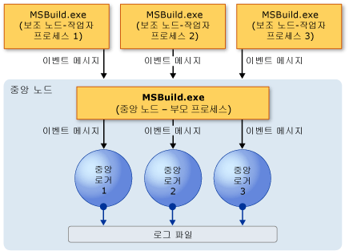
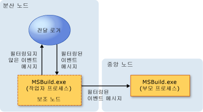

# <a name="writing-multi-processor-aware-loggers"></a>다중 프로세서 인식 로거 작성
[!INCLUDE[vstecmsbuild](../extensibility/internals/includes/vstecmsbuild_md.md)]에서는 다중 프로세서를 사용할 수 있기 때문에 프로젝트 빌드 시간을 줄일 수 있는 반면 이벤트 로깅 빌드 과정이 복잡해집니다. 단일 프로세서 환경에서 이벤트, 메시지, 경고 및 오류는 예측 가능하고 순차적인 방식으로 로거에 도착합니다. 그러나 다중 프로세서 환경에서 여러 원본의 이벤트는 동시에 또는 순서 없이 도착할 수 있습니다. 이러한 문제를 방지하기 위해 [!INCLUDE[vstecmsbuild](../extensibility/internals/includes/vstecmsbuild_md.md)]에서는 다중 프로세서 인식 로거와 새 로깅 모델이 제공되며, 사용자 지정 "전달 로거"를 만들 수 있습니다.  
  
## <a name="multi-processor-logging-challenges"></a>다중 프로세서 로깅 문제  
 다중 프로세서 또는 다중 핵심 프로세서에서 하나 이상의 프로젝트를 빌드하면 모든 프로젝트에 대한 [!INCLUDE[vstecmsbuild](../extensibility/internals/includes/vstecmsbuild_md.md)] 빌드 이벤트가 동시에 생성됩니다. 따라서 많은 이벤트 메시지가 로거에 동시에 또는 순서 없이 도착할 수 있습니다. [!INCLUDE[vstecmsbuild](../extensibility/internals/includes/vstecmsbuild_md.md)] 2.0 로거는 이 상황을 처리하도록 설계되지 않았으므로 로거에 과부하가 걸리고 빌드 시간이 늘어나거나 로거 출력이 잘못되거나 심지어 빌드가 손상될 수 있습니다. 이러한 문제를 해결하기 위해 로거([!INCLUDE[vstecmsbuild](../extensibility/internals/includes/vstecmsbuild_md.md)] 3.5부터 시작)를 사용하면 순서 없는 이벤트를 처리하고 이벤트와 해당 소스를 서로 연결할 수 있습니다.  
  
 사용자 지정 전달 로거를 만들어 로깅 효율성을 더욱 향상시킬 수 있습니다. 사용자 지정 전달 로거는 빌드하기 전에 모니터링하려는 이벤트를 선택하도록 하여 필터의 역할을 합니다. 사용자 지정 전달 로거를 사용하여 원하지 않는 이벤트는 로거에 과부하가 걸리지 않도록 하고, 로그를 복잡하게 하거나 빌드 시간을 느리게 하지 않을 수 있습니다.  
  
## <a name="multi-processor-logging-models"></a>다중 프로세서 로깅 모델  
 다중 프로세서 관련 빌드 문제를 방지하기 위해 [!INCLUDE[vstecmsbuild](../extensibility/internals/includes/vstecmsbuild_md.md)]에서는 두 개의 로깅 모델, 중앙 로깅 모델 및 분산 로깅 모델을 지원합니다.  
  
### <a name="central-logging-model"></a>중앙 로깅 모델  
 중앙 로깅 모델에서 MSBuild.exe의 단일 인스턴스는 "중앙 노드"의 역할을 하며 중앙 노드의 자식 인스턴스("보조 노드")는 빌드 작업을 수행할 수 있도록 중앙 노드에 연결합니다.  
  
   
  
 중앙 노드에 연결하는 다양한 종류의 로거는 "중앙 로거"라고 합니다. 각 로거 형식의 인스턴스 하나만 중앙 노드에 동시에 연결될 수 있습니다.  
  
 빌드가 발생하면 보조 노드는 해당 빌드 이벤트를 중앙 노드에 라우팅합니다. 중앙 노드는 모든 이벤트뿐 아니라 보조 노드를 하나 이상의 연결된 중앙 로거에 라우팅합니다. 그런 다음 로거는 들어오는 데이터를 기반으로 하는 로그 파일을 만듭니다.  
  
 <xref:Microsoft.Build.Framework.ILogger>는 중앙 로거에 의해 구현되어야 하지만 중앙 로거에서 빌드에 참여하는 노드 수로 초기화할 수 있도록 <xref:Microsoft.Build.Framework.INodeLogger>도 구현하는 것이 좋습니다. 다음 <xref:Microsoft.Build.Framework.ILogger.Initialize%2A> 메서드의 오버로드는 엔진이 로거를 초기화할 때 호출됩니다.  
  
```csharp
public interface INodeLogger: ILogger  
{  
    public void Initialize(IEventSource eventSource, int nodeCount);  
}  
```  
  
 기존 <xref:Microsoft.Build.Framework.ILogger> 기반 로거는 중앙 로거의 역할을 할 수 있으며 빌드에 연결할 수 있습니다. 그러나 다중 프로세서 로깅 시나리오 및 비순차 이벤트에 대한 명시적 지원 없이 작성된 중앙 로거는 빌드를 손상시키거나 의미 없는 출력을 생성할 수 있습니다.  
  
### <a name="distributed-logging-model"></a>분산 로깅 모델  
 중앙 로깅 모델에서 너무 많이 들어오는 메시지 트래픽은 중앙 노드에 과부하를 줄 수 있습니다. 예를 들어 많은 프로젝트가 동시에 빌드되는 경우입니다. 시스템 리소스에 과부하가 걸리고 빌드 성능이 저하될 수 있습니다. 이러한 문제를 해결하기 위해 [!INCLUDE[vstecmsbuild](../extensibility/internals/includes/vstecmsbuild_md.md)]에서는 분산 로깅 모델을 지원합니다.  
  
   
  
 분산 로깅 모델은 전달 로거를 만들 수 있도록 하여 중앙 로깅 모델을 확장합니다.  
  
#### <a name="forwarding-loggers"></a>전달 로거  
 전달 로거는 보조 노드에 연결하고 해당 노드에서 들어오는 빌드 이벤트를 수신하는 이벤트 필터가 있는 보조, 경량 로거입니다. 들어오는 이벤트를 필터링하고 중앙 노드로 지정하는 이벤트만 전달합니다. 이렇게 하면 중앙 노드로 전송되는 메시지 트래픽을 줄이고 전반적인 빌드 성능을 향상시킵니다.  
  
 다음과 같이 분산 로깅을 사용하는 방법은 두 가지가 있습니다.  
  
-   <xref:Microsoft.Build.BuildEngine.ConfigurableForwardingLogger>라는 미리 작성된 전달 로거를 사용자 지정합니다.  
  
-   사용자 고유의 사용자 지정 전달 로거를 작성합니다.  
  
 요구 사항에 맞게 ConfigurableForwardingLogger를 수정할 수 있습니다. 이렇게 하려면 MSBuild.exe를 사용하여 명령줄에서 로거를 호출하고 로거에서 중앙 노드로 전달하려는 빌드 이벤트를 나열합니다.  
  
 대신 사용자 지정 전달 로거를 만들 수 있습니다. 사용자 지정 전달 로거를 만들어 로거의 동작을 미세 조정할 수 있습니다. 그러나 사용자 지정 전달 로거를 만드는 것은 ConfigurableForwardingLogger를 사용자 지정하는 것보다 더 복잡합니다. 자세한 내용은 [전달 로거 만들기](../msbuild/creating-forwarding-loggers.md)를 참조하세요.  
  
## <a name="using-the-configurableforwardinglogger-for-simple-distributed-logging"></a>단순 분산 로깅에 ConfigurableForwardingLogger 사용  
 ConfigurableForwardingLogger 또는 사용자 지정 전달 로거를 연결하려면 MSBuild.exe 명령줄 빌드에서 `/distributedlogger` 스위치(간단하게 `/dl`)를 사용합니다. 로거 형식 및 클래스의 이름을 지정하기 위한 형식은 분산 로거가 항상 하나 대신 두 개의 로깅 클래스(전달 로거 및 중앙 로거)를 가진 것을 제외하고 `/logger` 스위치에 대한 것과 동일합니다. 다음은 XMLForwardingLogger라는 사용자 지정 전달 로거를 연결하는 방법의 예입니다.  
  
```  
msbuild.exe myproj.proj/distributedlogger:XMLCentralLogger,MyLogger,Version=1.0.2,Culture=neutral*XMLForwardingLogger,MyLogger,Version=1.0.2,Culture=neutral  
```  
  
> [!NOTE]
>  별표(*)는 `/dl` 스위치에서 두 개의 로거 이름을 구분해야 합니다.  
  
 ConfigurableForwardingLogger를 사용하는 것은 일반 [!INCLUDE[vstecmsbuild](../extensibility/internals/includes/vstecmsbuild_md.md)] 로거 대신 ConfigurableForwardingLogger 로거를 연결하고 매개 변수로 ConfigurableForwardingLogger에서 중앙 노드에 전달하려는 이벤트를 지정하는 것을 제외하고 다른 로거를 사용하는 것과 비슷합니다([빌드 로그 가져오기](../msbuild/obtaining-build-logs-with-msbuild.md)에 설명된 대로).  
  
 예를 들어 빌드가 시작하거나 끝날 때 및 오류가 발생할 때 알림을 받으려는 경우 매개 변수로 `BUILDSTARTEDEVENT`, `BUILDFINISHEDEVENT` 및 `ERROREVENT`를 전달합니다. 세미콜론으로 구분하여 여러 매개 변수를 전달할 수 있습니다. 다음은 ConfigurableForwardingLogger를 사용하여 `BUILDSTARTEDEVENT`, `BUILDFINISHEDEVENT` 및 `ERROREVENT` 이벤트만 전달하는 방법의 예입니다.  
  
```  
msbuild.exe myproj.proj /distributedlogger:XMLCentralLogger,MyLogger,Version=1.0.2,Culture=neutral*ConfigureableForwardingLogger,C:\My.dll;BUILDSTARTEDEVENT; BUILDFINISHEDEVENT;ERROREVENT  
```  
  
 다음은 사용 가능한 ConfigurableForwardingLogger 매개 변수 목록입니다.  
  
|ConfigurableForwardingLogger 매개 변수|  
|---------------------------------------------|  
|BUILDSTARTEDEVENT|  
|BUILDFINISHEDEVENT|  
|PROJECTSTARTEDEVENT|  
|PROJECTFINISHEDEVENT|  
|TARGETSTARTEDEVENT|  
|TARGETFINISHEDEVENT|  
|TASKSTARTEDEVENT|  
|TASKFINISHEDEVENT|  
|ERROREVENT|  
|WARNINGEVENT|  
|HIGHMESSAGEEVENT|  
|NORMALMESSAGEEVENT|  
|LOWMESSAGEEVENT|  
|CUSTOMEVENT|  
|COMMANDLINE|  
|PERFORMANCESUMMARY|  
|NOSUMMARY|  
|SHOWCOMMANDLINE|  
  
## <a name="see-also"></a>참고 항목  
 [전달 로거 만들기](../msbuild/creating-forwarding-loggers.md)