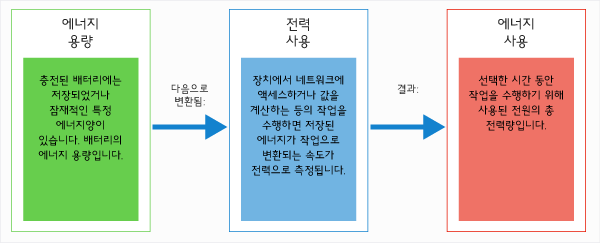
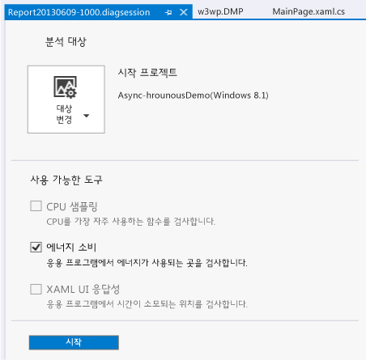
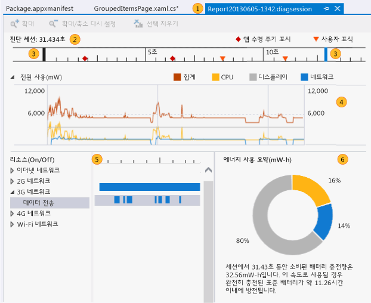
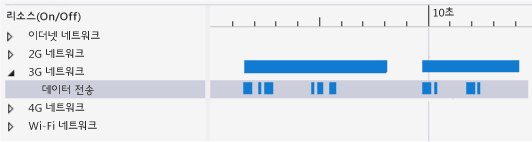
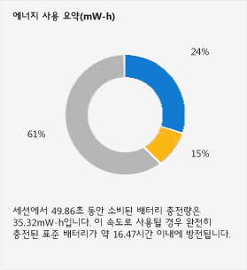

# <a name="analyze-energy-use-in-store-apps"></a>스토어 앱의 에너지 사용 분석
Visual Studio **에너지 소비** 프로파일러를 사용하면 자체 배터리로 전부 또는 일부의 시간 동안 실행하는 저전력 태블릿 장치의 Windows 스토어 앱의 전력 및 에너지 소비를 분석할 수 있습니다. 배터리로 구동하는 장치에서 앱이 너무 많은 에너지를 사용할 경우 고객 불만족을 일으킬 수 있고, 결과적으로 고객이 설치를 제거할 수도 있습니다. 에너지 사용을 최적화하면 고객이 앱을 채택하고 사용하는 사례가 증가할 수 있습니다.  
  
##  <a name="BKMK_What_the_Energy_Consumption_tool_is__how_it_works__and_what_it_measures"></a> 에너지 소비 프로파일러 소개, 작동 방법 및 측정 대상  
 에너지 소비 프로파일러는 세션을 프로파일링하는 중 장치의 디스플레이, CPU, 네트워크 연결 활동을 캡처합니다. 그런 다음 그러한 활동에 사용된 전력과 세션 프로파일링의 총 에너지량의 추정치를 생성합니다.  
  
> [!NOTE]
>  에너지 프로파일러는 표준 참조 장치 하드웨어를 사용하여 응용 프로그램을 실행하는 저전력 태블릿 장치의 대표적 전력 및 에너지 사용을 추정합니다. 가장 정확한 추정치를 제공하려면 저전력 태블릿 장치에서 프로파일 데이터를 수집하는 것이 좋습니다.  
>   
>  이 모델은 다양한 저전력 장치에 대해 상당히 정확한 추정치를 제공하지만 프로파일링하는 장치의 실제 값은 달라질 가능성이 높습니다. 이러한 값을 사용하여 다른 리소스 사용에 비해 많은 에너지를 사용하고 있어서 최적화해야 할 디스플레이, CPU, 네트워크 활동을 찾습니다.  
  
 에너지 소비 프로파일러는 이러한 *전원* 및 *에너지*에 대한 정의를 사용합니다.  
  
-   *전원* 은 일정 시간 동안 일을 수행하는 데 사용된 힘의 효율을 측정합니다. 전기 과학에서 전력의 표준 단위는 *와트*입니다. 와트는 1암페어의 전류가 1볼트의 전위 차이를 통해 흐를 때 작업이 수행되는 속도로 정의됩니다. **전원 사용** 그래프에서 단위가 **mW** (밀리와트)로 표시되고 1mW는 1W의 1/1000에 해당합니다.  
  
     전력은 속도이므로 방향(일정 시간 동안 작업이 증가하거나 감소할 수 있음)과 속도(작업이 증가하거나 감소하는 양)가 있습니다.  
  
-   *에너지* 는 배터리의 전력 용량과 같이 총 전력량을 용량 또는 전위로 측정하거나 일정 기간 동안 사용된 총 전력량으로 측정합니다. 에너지 단위는 1시간 동안 1와트가 일정하게 적용된 전력량인 와트-시간입니다. **에너지 요약**에서 단위가 **mW-h**(밀리와트시)로 표시됩니다.  
  
   
  
 예를 들어, 태블릿의 완전히 충전된 배터리에는 저장된 에너지가 상당히 많습니다. 네트워크 통신, 값 계산, 그래픽 표시 등의 작업을 수행하는 데 에너지를 사용하므로 다른 속도로 배터리 전력이 소실됩니다. 특정 기간 동안 소비된 총 전력도 에너지로 측정합니다.  
  
##  <a name="BKMK_Identify_scenarios_with_user_marks"></a> 사용자 표시로 시나리오 식별  
 프로파일링 데이터에 *사용자 표시* 를 추가하여 타임라인 눈금자의 영역을 식별할 수 있습니다.  
  
   
  
 이 표시는 메서드 실행 시 타임라인에 주황색 삼각형으로 표시됩니다. 이 표시를 마우스로 가리키면 메시지와 시간이 도구 설명으로 표시됩니다. 두 개 이상의 사용자 표시가 서로 가까이 있으면 표시가 병합되고 도구 설명 데이터가 결합됩니다. 타임라인을 확대하면 표시가 분리되어 표시됩니다.  
  
 **C#, Visual Basic, C++ 코드에 표시 추가**  
  
 C#, Visual Basic, C++ 코드에 사용자 표시를 추가하려면 먼저 [Windows.Foundation.Diagnostics LoggingChannel](http://msdn.microsoft.com/library/windows/apps/windows.foundation.diagnostics.loggingchannel.aspx) 개체를 만듭니다. 그런 다음 [LoggingChannel.LogMessage](http://msdn.microsoft.com/library/windows/apps/dn264210.aspx) 메서드의 표시할 코드의 지점에 호출을 삽입합니다. 호출에 [LoggingLevel.Information](http://msdn.microsoft.com/library/windows/apps/windows.foundation.diagnostics.logginglevel.aspx) 을 사용합니다.  
  
 메서드가 실행되면 프로파일링 데이터에 사용자 표시와 메시지가 추가됩니다.  
  
> [!NOTE]
>  -   Windows.Foundation.Diagnostics LoggingChannel은 [Windows.Foundation.IClosable](http://msdn.microsoft.com/library/windows/apps/windows.foundation.iclosable.aspx) 인터페이스를 구현합니다(C# 및 VB에서 [System.IDisposable](http://msdn.microsoft.com/library/System.IDisposable.aspx) 로 프로젝션됨). 운영 체제 리소스 누수를 방지하려면 로깅 채널이 완료될 때 [LoggingChannel.Close](http://msdn.microsoft.com/library/windows/apps/windows.foundation.diagnostics.loggingchannel.close.aspx)(C# 및 VB에서는 [Windows.Foundation.Diagnostics.LoggingChannel.Dispose](https://msdn.microsoft.com/en-us/library/windows/apps/windows.foundation.diagnostics.loggingchannel.dispose.aspx))를 호출합니다.  
> -   열린 각 로깅 채널의 이름은 고유해야 합니다. 동일한 이름의 새 로깅 채널을 삭제되지 않은 채널로 만들려고 하면 예외가 발생합니다.  
  
 예제는 Windows SDK 샘플 [LoggingSession 샘플](http://code.msdn.microsoft.com/windowsapps/LoggingSession-Sample-ccd52336) 을 참조하세요.  
  
 **JavaScript 코드에 표시 추가**  
  
 사용자 표시를 추가하려면 표시할 코드의 지점에 다음 코드를 추가합니다.  
  
```  
if (performance && performance.mark) {  
    performance.mark(markDescription);  
}  
```  
  
 *markDescription* 은 사용자 표시 도구 설명에 표시할 메시지가 포함되는 문자열입니다.  
  
##  <a name="BKMK_Configure_your_environment_for_profiling"></a> 프로파일링을 위한 환경 구성  
 더 정확하게 예측하려면 배터리 전원을 사용하는 저전력 장치에서 앱의 에너지 사용을 프로파일링합니다. Visual Studio는 이러한 장치에서 대부분 실행되지 않으므로 Visual Studio 원격 도구를 사용하여 장치에 Visual Studio 컴퓨터를 연결해야 합니다. 원격 장치에 연결하려면 Visual Studio 프로젝트와 원격 장치를 모두 구성해야 합니다. 자세한 내용은 [원격 컴퓨터에서 Windows 스토어 앱 실행](../debugger/run-windows-store-apps-on-a-remote-machine.md)을 참조하세요.  
  
> [!TIP]
>  -   Windows 스토어 시뮬레이터 또는 Visual Studio 컴퓨터에서 에너지 프로파일링이 권장되지 않습니다. 실제 장치에서 프로파일링할 경우 실제에 훨씬 더 가까운 데이터가 제공됩니다.  
> -   대상 장치에 배터리 전원을 연결한 상태에서 프로파일링합니다.  
> -   동일한 리소스(네트워크, CPU 또는 디스플레이)를 사용할 수 있는 다른 앱을 닫습니다.  
  
##  <a name="BKMK_Collect_energy_profile_data_for_your_app"></a> 앱의 에너지 프로파일 데이터 수집  
  
1.  **디버그** 메뉴에서 **디버그하지 않고 진단 시작**을 선택합니다.  
  
       
  
2.  **에너지 소비** 를 선택한 다음 **시작**을 선택합니다.  
  
    > [!NOTE]
    >  **에너지 소비** 프로파일러를 시작하면 VsEtwCollector.exe 실행 권한을 요청하는 **사용자 계정 제어** 창이 나타날 수 있습니다. **예**를 선택합니다.  
  
3.  데이터를 수집하려면 앱을 실행합니다.  
  
4.  프로파일링을 중지하려면 Visual Studio로 다시 전환하고(Alt + Tab) 진단 허브 페이지에서 **수집 중지** 를 선택합니다.  
  
       
  
     Visual Studio에서 수집된 데이터를 분석하고 결과를 표시합니다.  
  
##  <a name="BKMK_Collect_energy_profile_data_for_an_installed_app"></a> 설치된 에너지 프로파일 데이터 수집  
 에너지 소비 도구는 Visual Studio 솔루션에서 시작하거나 Windows 스토어에서 설치하는 Windows 스토어 8.1 앱에서만 실행할 수 있습니다. 솔루션을 Visual Studio에서 열 경우 기본 대상은 **시작 프로젝트**입니다. 설치된 앱을 대상으로 하려면  
  
1.  **대상 변경** 을 선택한 다음 **설치된 응용 프로그램**을 선택합니다.  
  
2.  **설치된 응용 프로그램 패키지 선택** 목록에서 대상을 선택합니다.  
  
3.  진단 허브 페이지에서 **에너지 소비** 를 선택합니다.  
  
4.  프로파일링을 시작하려면 **시작** 을 선택합니다.  
  
 프로파일링을 중지하려면 Visual Studio로 다시 전환하고(Alt + Tab) 진단 허브 페이지에서 **수집 중지** 를 선택합니다.  
  
##  <a name="BKMK_Analyze_energy_profile_data"></a> 에너지 프로파일 데이터 분석  
 에너지 프로필 데이터가 Visual Studio 문서 창에 표시됩니다.  
  
   
  
|||  
|-|-|  
||보고서 파일의 이름은 Report*YYYYMMDD-HHMM*.diagsession입니다. 보고서를 저장할 경우 이름을 변경할 수 있습니다.|  
||타임라인에는 프로파일링 세션 길이, 응용 프로그램 수명 주기 시작 이벤트 및 사용자 표시가 표시됩니다.|  
||파란색 막대를 끌어 타임라인의 부분의 선택하여 보고서를 타임라인의 일부분으로 제한할 수 있습니다.|  
||**전원 사용** 그래프는 프로파일링 세션 동안 장치 리소스로 발생하는 전원 출력의 변화를 나타내는 다중선형 차트입니다. 에너지 소비 프로파일러는 CPU, 네트워크 작업 및 화면 디스플레이에서 사용하는 전력을 추적합니다.|  
||**리소스(설정/해제)**  그래프는 네트워크 에너지 소비에 대한 자세한 정보를 제공합니다. **네트워크** 표시줄은 네트워크 연결이 열려 있던 시간을 나타냅니다. **데이터 전송** 하위 막대는 앱에서 네트워크를 통해 데이터를 수신하거나 송신하는 시간을 나타냅니다.|  
||**에너지 사용 요약** 에서는 선택한 타임라인에서 CPU, 네트워크 작업 및 화면 디스플레이 사용에 비례하는 총 에너지양을 보여 줍니다.|  
  
 **에너지 프로필 데이터를 분석하려면**  
  
 리소스 전력이 가장 많이 사용되는 부분을 찾습니다. 최고 영역을 앱의 기능에 연결합니다. 그런 다음 타임라인에서 타임라인 제어 막대를 사용하여 영역을 확대합니다. 네트워크 사용에 초점을 두는 경우 **리소스(설정/해제)** 그래프에서 **네트워크**  노드를 확장하여 앱이 연결을 통해 데이터를 수신하거나 전송하는 시간에 대해 네트워크 연결이 열리는 시간을 비교합니다. 네트워크가 불필요하게 열리는 시간을 줄이는 것은 매우 효과적인 최적화입니다.  
  
##  <a name="BKMK_Optimize_energy_use"></a> 에너지 사용 최적화  
 네트워크 연결에서는 데이터 전송 이외에 연결 초기화, 유지, 종료의 에너지 비용이 발생합니다. 일부 네트워크는 단일 연결에서 더 많은 데이터를 전송할 수 있도록 데이터가 전송 또는 수신된 후 일정 기간 동안 연결을 유지합니다. **리소스(설정/해제)** 창을 사용하여 앱이 연결과 상호 작용하는 방법을 검사할 수 있습니다.  
  
   
  
 **네트워크** 및 **데이터 전송** 막대에서 일련의 작은 데이터 패킷을 가끔 전송하기 위해 오랜 시간 동안 연결이 열려 있다고 표시되는 경우, 데이터를 한번에 전송하도록 일괄 처리하여 네트워크가 열려 있는 시간을 줄이고 에너지 소비도 절약할 수 있습니다.  
  
   
  
 디스플레이의 에너지 비용에 대한 제어 권한이 적습니다. 대부분의 화면은 어두운 색을 표시할 때보다 밝은 색을 표시할 때 더 많은 에너지를 필요로 하므로 어두운 배경을 사용하는 것은 비용을 줄이는 한 가지 방법입니다.  
  
##  <a name="BKMK_Other_resources"></a> 기타 리소스  
  
-   Windows 개발자 센터에 나와 있는 **C#/VB/C++ 및 XAML** 및 [JavaScript 및 HTML](http://msdn.microsoft.com/en-us/0ee0b706-8432-4d49-9801-306ed90764e1) 의 [연결 상태 및 원가 관리](http://msdn.microsoft.com/en-us/372afa6a-1c7c-4657-967d-03a77cd8e933) 섹션에서는 앱이 네트워크 트래픽 비용을 최소화하는 데 사용할 수 있는 네트워크 연결 정보를 제공하는 Windows API에 대해 설명합니다.  
  
     Windows 스토어 앱에 대한 Visual Studio 시뮬레이터를 사용하여 네트워크 정보 API의 데이터 연결 속성을 시뮬레이트할 수 있습니다. [Run Windows Store apps in the simulator](../debugger/run-windows-store-apps-in-the-simulator.md)을 참조하십시오.  
  
-   **JavaScript 함수 타이밍** 및 **CPU 사용** 도구를 사용하면 비효율적 함수 때문에 발생하는 CPU 로드를 줄일 수 있습니다. [CPU 사용 분석](../profiling/analyze-cpu-usage-in-a-windows-universal-app.md)을 참조하세요.
