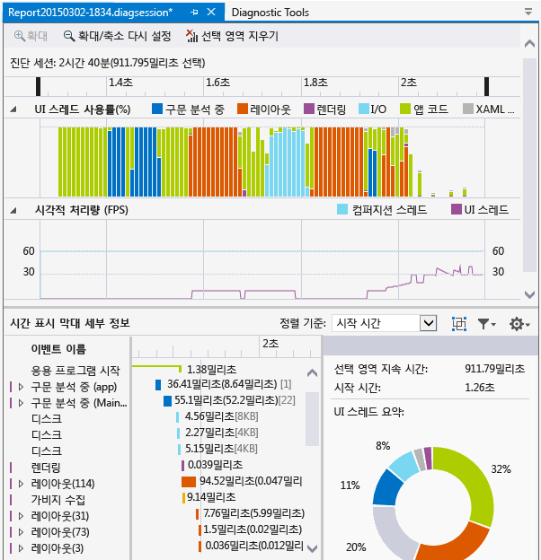
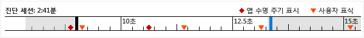
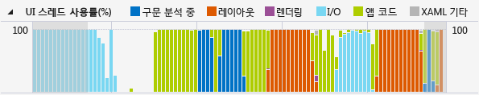
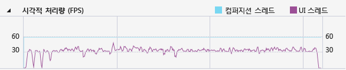

# 리소스 소비량 및 UI 스레드 활동 분석(XAML)
**응용 프로그램 타임라인** 프로파일러를 사용하여 XAML 응용 프로그램에서 응용 프로그램 상호 작용 관련 성능 문제를 찾으세요. 이 도구를 사용하면 응용 프로그램의 리소스 소비에 대해 자세히 알 수 있어서 XAML 응용 프로그램의 성능을 개선하는 데 도움이 됩니다. 응용 프로그램 UI 프레임(레이아웃 및 렌더링)을 준비하고, 네트워크 및 디스크 요청을 처리하여, 응용 프로그램 시작, 페이지 로드 및 창 크기 조정과 같은 시나리오에서 응용 프로그램이 보낸 시간을 분석할 수 있습니다.  
  
 **응용 프로그램 타임라인**은 **디버그 / 성능 프로파일러...** 명령으로 시작할 수 있는 도구 중 하나입니다.  
  
 이 도구는 Visual Studio 2013용 진단 도구 집합에 속하는 **XAML UI 응답성** 도구를 대체합니다.  
  
 다음 플랫폼에서 이 도구를 사용할 수 있습니다.  
  
1.  유니버설 Windows 앱(Windows 10에서)  
  
2.  Windows 스토어 8.1  
  
3.  Windows Phone 8.1(공통 XAML 플랫폼)  
  
4.  Windows Presentation Foundation(.NET 4.0 이상)  
  
5.  Windows 7  
  
> [!NOTE]
>  **응용 프로그램 타임라인** 데이터와 함께 CPU 사용량 데이터 및 에너지 소비량 데이터를 수집하고 분석할 수 있습니다. [디버그를 사용하거나 사용하지 않고 프로파일링 도구 실행](../profiling/running-profiling-tools-with-or-without-the-debugger.md)을 참조하세요.
  
##   응용 프로그램 타임라인 데이터 수집  
 로컬 시스템, 연결된 장치, Visual Studio 시뮬레이터 또는 에뮬레이터, 또는 원격 장치에서 앱 응답성을 프로파일링할 수 있습니다. [디버그를 사용하거나 사용하지 않고 프로파일링 도구 실행](../profiling/running-profiling-tools-with-or-without-the-debugger.md)을 참조하세요.
  
> [!TIP]
>  가능한 경우 장치에서 앱을 직접 실행합니다. 시뮬레이터에서 또는 원격 데스크톱 연결을 통해 관찰한 응용 프로그램 성능은 장치의 실제 성능과 다를 수 있습니다. 반면에 Visual Studio 원격 도구를 사용하여 데이터를 수집하면 성능 데이터에 영향을 주지 않습니다.  
  
 기본 단계는 다음과 같습니다.  
  
1.  XAML 앱을 엽니다.  
  
2.  **디버그 / 성능 프로파일러...**를 클릭합니다. diagsession 창에 프로파일링 도구 목록이 표시되어야 합니다.  
  
3.  **응용 프로그램 타임라인** 을 선택한 다음 창 하단의 **시작** 을 클릭합니다.  
  
    > [!NOTE]
    >  VsEtwCollector.exe 실행 권한을 요청하는 사용자 계정 컨트롤 창이 나타날 수 있습니다. **예**를 클릭합니다.  
  
4.  성능 데이터를 수집하는 앱에서 프로파일링에 관심 있는 시나리오를 실행합니다.  
  
5.  프로파일링을 중지하려면 .diagsession 창으로 다시 전환하고 창 상단의 **중지** 를 클릭하세요.  
  
     Visual Studio에서 수집된 데이터를 분석하고 결과를 표시합니다.  
  
       
  
##   타임라인 프로파일링 데이터 분석  
 프로파일링 데이터를 수집한 후 이러한 단계를 이용하여 분석을 시작할 수 있습니다.  
  
1.  **UI 스레드 사용률** 과 **시각적 처리량(FPS)** 그래프의 정보를 검사한 다음 타임라인 탐색 모음을 사용하여 분석할 시간 범위를 선택합니다.  
  
2.  응답성이 떨어지는 분명한 원인이 있는지 알아보려면 **UI 스레드 사용률** 또는 **시각적 처리량(FPS)** 그래프의 정보를 사용하여 **타임라인 세부 정보** 뷰에서 세부 정보를 살펴봅니다.  
  
###   시나리오, 범주 및 이벤트 보고  
 **응용 프로그램 타임라인** 도구는 XAML 성능과 관련된 시나리오, 범주 및 이벤트에 대한 타이밍 데이터를 표시합니다.  
  
###   진단 세션 타임라인  
   
  
 페이지 상단에 있는 눈금자는 프로파일링된 정보의 타임라인을 보여 줍니다. 이 타임라인은 **UI 스레드 사용량** 그래프와 **시각적 처리량** 그래프에 적용됩니다. 타임라인의 탐색 모음을 끌어 보고서의 범위를 좁혀서 타임라인의 세그먼트를 선택할 수 있습니다.  
  
 타임라인에는 사용자가 삽입한 사용자 표시와 앱의 활성화 수명 주기 이벤트가 표시됩니다.  
  
###   UI 스레드 사용률 그래프  
   
  
 **UI 스레드 사용률(%)** 그래프는 컬렉션 범위 도중에 대한 범주에서 소요된 시간의 상대 크기를 표시하는 막대형 차트입니다.  
  
###   시각적 처리량(FPS) 그래프  
   
  
 **시각적 처리량(FPS)** 선 그래프는 응용 프로그램에 대한 UI 및 컴퍼지션 스레드의 초당 프레임(FPS)을 보여 줍니다.  
  
###   타임라인 세부 정보  
 세부 정보 보기는 대부분의 시간을 보고서를 분석하는 데 사용하게 될 곳입니다. UI 프레임워크 하위 시스템 또는 CPU를 소비하는 시스템 구성 요소에 따라 분류되는 응용 프로그램의 CPU 사용률에 대한 세부 정보 보기가 표시됩니다.  
  
 다음과 같은 이벤트가 지원됩니다.  
  
|||  
|-|-|  
|**구문 분석**|XAML 파일을 구문 분석하고 개체를 만드는 데 걸린 시간입니다.   **타임라인 세부 정보** 에서 **구문 분석** 노드를 확장하면 루트 이벤트의 결과로 구문 분석된 모든 XAML 파일의 종속성 체인이 표시됩니다. 이렇게 하면 성능이 중요한 시나리오에서 불필요한 파일 구문 분석 및 개체 만들기를 식별하고 최적화할 수 있습니다.|  
|**레이아웃**|큰 응용 프로그램에서는 수천 개의 요소가 동시에 화면에 표시될 수 있습니다. 이로 인해 UI 프레임 속도가 느려지고 응용 프로그램의 응답성이 나빠질 수 있습니다. 레이아웃 이벤트는 각 요소의 레이아웃을 지정하는 비용(즉, Arrange, Measure, ApplyTemplate, ArrangeOverride 및 ArrangeOverride에서 보내는 시간)을 정확하게 결정하고 레이아웃 단계에 참여하는 시각적 트리를 빌드합니다. 이 시각화를 사용하여 잘라내야 할 논리 트리를 결정하거나 다른 지연 메커니즘을 평가하여 레이아웃 단계를 최적화할 수 있습니다.|  
|**렌더링**|화면에 XAML 요소를 그리는 데 소요된 시간입니다.|  
|**I/0**|로컬 디스크 또는 [Microsoft Windows 인터넷(WinINet) API](https://msdn.microsoft.com/en-us/library/windows/desktop/aa385331.aspx)를 통해 액세스된 네트워크 리소스에서 데이터를 검색하는 데 소요된 시간입니다.|  
|**앱 코드**|구문 분석 또는 레이아웃과 관련이 없는 응용 프로그램(사용자) 코드를 실행하는 데 소요된 시간입니다.|  
|**XAML 기타**|XAML 런타임 코드를 실행하는 데 소요되는 시간입니다.|  
  
> [!TIP]
>  UI 스레드에서 실행하는 앱 메서드를 보기 위해 프로파일링을 시작하는 경우 **CPU 사용량** 도구를 **응용 프로그램 타임라인** 도구와 함께 선택합니다. 장기 실행 앱 코드를 백그라운드 스레드로 이동하면 UI 응답성을 향상할 수 있습니다.  
  
####   타임라인 세부 정보 사용자 지정  
 **타임라인 세부 정보** 도구 모음을 사용하여 **타임라인 세부 정보** 뷰 항목의 주석을 정렬, 필터링 및 지정합니다.  
  
|||  
|-|-|  
|**정렬 기준**|시작 시간 또는 이벤트의 길이로 정렬합니다.|  
||프레임으로 이벤트를 그룹화하는 최상위 **프레임** 범주를 추가하거나 제거합니다.|  
||선택한 범주와 이벤트의 길이를 기준으로 목록을 필터링합니다.|  
||이벤트에 대한 주석을 지정할 수 있습니다.|  
  
## 참고 항목  
 [WPF 팀 블로그: WPF 응용 프로그램의 새로운 UI 성능 분석 도구](http://blogs.msdn.com/b/wpf/archive/2015/01/16/new-ui-performance-analysis-tool-for-wpf-applications.aspx)   
 [C++, C# 및 Visual Basic을 사용하는 Windows 스토어 앱의 성능 모범 사례](http://msdn.microsoft.com/en-us/567bcefa-5da5-4e42-a4b8-1358c71adfa2)   
 [WPF 응용 프로그램 성능 최적화](http://msdn.microsoft.com/Library/ac8c6aa3-3c68-4a24-9827-3b6c829c1ebf)
