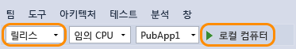

# CPU 사용량
앱 성능 문제를 검토해야 하는 경우 앱에서 CPU를 사용하는 방식을 파악하는 것부터 시작하는 것이 좋습니다. **CPU 사용량** 도구는 CPU에서 Visual C++, Visual C#/Visual Basic 및 JavaScript 코드 실행에 시간을 소모하는 상황을 보여 줍니다.  
  
 Visual Studio 2015 업데이트 1부터 디버거를 종료하지 않고 CPU 사용의 기능별 분석 결과를 볼 수 있습니다. 디버그하는 동안 CPU 프로파일링을 켜고 끌 수 있으며, 실행이 중지되면(예: 중단점에서) 결과를 볼 수 있습니다. 자세한 내용은 [Visual Studio 2015의 디버거에서 CPU 프로파일링](http://blogs.msdn.com/b/visualstudioalm/archive/2015/10/29/profile-your-cpu-in-the-debugger-in-visual-studio-2015.aspx)을 참조하세요.  
  
 Windows 스토어 앱의 성능 분석하기에 대한 설명은 [스토어 앱에서 CPU 사용 분석](https://msdn.microsoft.com/en-us/library/windows/apps/dn641982.aspx)을 참조하세요.  
  
 성능 및 진단 허브에서는 진단 세션을 실행하고 관리할 수 있는 여러 가지 다른 옵션을 제공합니다. 예를 들어 로컬이나 원격 컴퓨터에서 또는 시뮬레이터나 에뮬레이터에서 **CPU 사용량** 도구를 실행할 수 있습니다. 실행 중인 앱에 연결되고 Visual Studio에서 열려 있는 프로젝트의 성능을 분석하거나 Windows 스토어에서 설치된 앱을 시작할 수 있습니다. 자세한 내용은 [디버거를 사용하거나 사용하지 않고 프로파일링 도구 실행](../profiling/running-profiling-tools-with-or-without-the-debugger.md)을 참조하세요.
  
##   CPU 사용량 데이터 수집  
  
1.  Visual Studio에서 솔루션 구성을 **릴리스** 으로 설정하고 배포 대상을 선택합니다.  
  
       
  
    -   **릴리스** 모드에서 앱을 실행하면 앱의 실제 성능을 더 잘 파악할 수 있습니다.  
  
    -   로컬 컴퓨터에서 앱을 실행하면 설치된 앱의 실행을 가장 잘 복제합니다.  
  
    -   원격 장치에서 데이터를 수집하는 경우 원격 데스크톱 연결을 사용하는 것이 아니라 장치에서 직접 앱을 실행합니다.  
  
    -   Windows Phone 앱의 경우 **장치** 에서 직접 데이터를 수집하면 가장 정확한 데이터가 제공됩니다.  
  
2.  **디버그** 메뉴에서 **성능 프로파일러...**를 선택합니다.  
  
3.  **CPU 사용량** 을 선택한 다음 **시작**을 선택합니다.  
  
       
  
4.  앱이 시작되면 **최대 수 가져오기**를 클릭합니다. 출력이 표시되면 약&1;초간 기다린 다음 **Get Max Number Async**(비동기적으로 최대 수 가져오기)를 선택합니다. 단추를 클릭하는 시간 사이에 대기하면 진단 보고서에서 단추 클릭 루틴을 좀 더 쉽게 격리할 수 있습니다.  
  
5.  두 번째 출력 줄이 나타나면 성능 및 진단 허브에서 **수집 중지** 를 선택합니다.  
  
   
  
 CPU 사용량 도구에서 데이터를 분석하고 보고서를 표시합니다.  
  
   
  
## CPU 사용량 보고서 분석  
  
###   CPU 사용량 호출 트리  
 호출 트리 정보 파악을 시작하려면 `GetMaxNumberButton_Click` 세그먼트를 다시 선택하고 호출 트리 세부 정보를 확인합니다.  
  
####   호출 트리 구조  
   
  
|||  
|-|-|  
||CPU 사용량 호출 트리의 최상위 노드는 의사 노드입니다.|  
||대다수 앱에서 **외부 코드 포시** 옵션이 사용하지 않도록 설정되어 있는 경우 두 번째 수준 노드는 앱을 시작/중지하고, UI를 그리며, 스레드 일정을 제어하고, 앱에 다른 낮은 수준 서비스를 제공하는 시스템과 프레임워크 코드가 포함된 **[External Code]** 노드입니다.|  
||두 번째 수준 노드의 자식은 두 번째 수준 시스템과 프레임워크 코드가 호출하거나 만드는 사용자 코드 메서드 및 비동기 루틴입니다.|  
||메서드의 자식 노드에는 부모 메서드 호출에 대한 데이터만 포함되어 있습니다. **외부 코드 표시** 가 사용하지 않도록 설정되어 있으면 앱 메서드에 **[External Code]** 노드를 포함할 수 있습니다.|  
  
####   외부 코드  
 외부 코드는 사용자가 작성한 코드에서 실행된 시스템 및 프레임워크 구성 요소의 함수입니다. 외부 코드에는 앱을 시작 및 중지하고, UI를 그리며, 스레딩을 제어하고, 앱에 다른 낮은 수준 서비스를 제공하는 함수가 포함되어 있습니다. 대부분의 경우 외부 코드에 관심이 없으므로 CPU 사용량 호출 트리에서 사용자 메서드의 외부 함수를 하나의 **[External Code]** 노드로 수집합니다.  
  
 외부 코드의 호출 경로를 보려면 **필터 뷰** 목록에서 **외부 코드 보기** 를 선택한 다음 **적용**을 선택합니다.  
  
   
  
 여러 외부 코드 호출 체인은 깊이 중첩되어 있으므로 함수 이름 열의 너비가 컴퓨터 모니터의 거의 최대 화면 너비를 초과할 수 있습니다. 이런 경우 함수 이름은 다음과 같이 **[…]**로 표시됩니다.  
  
   
  
 검색 상자를 사용하여 검색 중인 노드를 찾은 다음, 가로 스크롤 막대를 사용하여 데이터를 뷰로 가져옵니다.  
  
   
  
###   호출 트리 데이터 열  
  
|||  
|-|-|  
|**총 CPU(%)**|   함수 호출 및 함수가 호출한 함수에 사용된 선택한 시간 범위의 앱 CPU 활동에 대한 백분율입니다. 이 값은 시간 범위에서 앱의 총 활동을 사용 가능한 총 CPU 용량과 비교하는 **CPU 사용률** 타임라인 그래프와 다릅니다.|  
|**셀프 CPU(%)**|   함수 호출에 사용된 선택한 시간 범위의 앱 CPU 활동에 대한 백분율로, 함수가 호출한 함수의 활동은 제외됩니다.|  
|**총 CPU(밀리초)**|선택한 시간 범위에서의 함수 호출과 함수가 호출한 함수에 소요된 시간(밀리초)입니다.|  
|**셀프 CPU(밀리초)**|선택한 시간 범위에서의 함수 호출과 함수가 호출한 함수에 소요된 시간(밀리초)입니다.|  
|**모듈**|함수가 포함된 모듈의 이름 또는 [External Code] 노드에 함수가 포함된 모듈의 수입니다.|  
  
###   CPU 사용량 호출 트리의 비동기 함수  
 컴파일러에서 비동기 메서드가 발생하면 메서드 실행을 제어하는 숨겨진 클래스를 만듭니다. 개념적으로 클래스는 원래 메서드의 연산을 비동기적으로 호출하고, 이러한 연산에 필요한 콜백, 스케줄러 및 반복기를 올바르게 호출하는 컴파일러 생성 함수 목록을 포함하는 상태 시스템입니다. 부모 메서드가 원래 메서드를 호출하면 런타임에서 부모의 실행 컨텍스트에서 메서드를 제거하고, 앱의 실행을 제어하는 시스템과 프레임워크 코드의 컨텍스트에서 숨겨진 클래스의 메서드를 실행합니다. 비동기 메서드는 일반적으로 하나 이상의 서로 다른 스레드에서 실행되지만 항상 그렇지는 않습니다. 이 코드는 트리의 상단 노드 바로 아래의 **[External Code]** 노드의 자식으로 CPU 사용량 호출 트리에 표시됩니다.  
  
 이 예제에서 이 코드를 보려면 타임라인에서 `GetMaxNumberAsyncButton_Click` 세그먼트를 다시 선택합니다.  
  
   
  
 **[External Code]** 아래에 있는 처음 두 노드는 상태 시스템 클래스의 컴파일러 생성 메서드입니다. 세 번째 노드는 원래 메서드에 대한 호출입니다. 생성된 메서드를 확장하면 진행 상황이 표시됩니다.  
  
   
  
-   `MainPage::GetMaxNumberAsyncButton_Click`는 아주 작은 기능만을 수행합니다. 이 메서드는 작업 값 목록을 관리하고, 결과의 최대값을 계산하고, 출력을 표시합니다.  
  
-   `MainPage+<GetMaxNumberAsyncButton_Click>d__3::MoveNext`는 `GetNumberAsync`에 대한 호출을 래핑하는 48개 작업을 예약 및 시작하는 데 필요한 활동을 보여 줍니다.  
  
-   `MainPage::<GetNumberAsync>b__b`는 `GetNumber`를 호출하는 작업의 활동을 보여 줍니다.

<!--HONumber=Feb17_HO4-->

