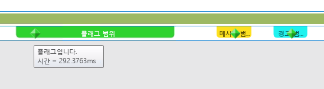
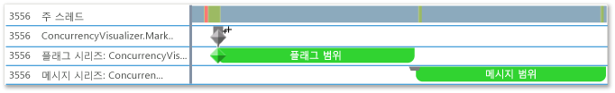

# <a name="how-to-use-the-concurrency-visualizer-markers-sdk"></a>방법: 동시성 시각화 도우미 표식 SDK 사용
이 항목에서는 동시성 시각화 SDK를 사용하여 범위를 만들고 플래그, 메시지 및 경고를 쓰는 방법을 보여 줍니다.  
  
### <a name="to-use-c"></a>C++를 사용하려면  
  
1.  동시성 시각화 SDK 지원을 응용 프로그램에 추가합니다. 자세한 내용은 [동시성 시각화 SDK](../profiling/concurrency-visualizer-sdk.md)를 참조하세요.  
  
2.  SDK에 대한 `include` 문과 `using` 문을 추가합니다.  
  
    ```C++  
  
    #include <cvmarkersobj.h>  
    using namespace Concurrency::diagnostic;  
  
    ```  
  
3.  기본 표식 시리즈에서 세 개의 범위를 만들고 플래그, 메시지 및 경고를 하나씩 각 범위에 씁니다. 플래그, 메시지 및 경고를 쓰는 메서드는 [marker_series](../profiling/marker-series-class.md) 클래스의 멤버입니다. [span](../profiling/span-class.md) 클래스의 생성자에는 `marker_series` 개체가 필요하므로 각 범위가 특정 표식 시리즈와 연결됩니다. `span`은 삭제될 때 종료됩니다.  
  
    ```C++  
  
    marker_series series;  
    span *flagSpan = new span(series, 1, _T("flag span"));  
    series.write_flag(_T("Here is the flag."));  
    delete flagSpan;  
  
    span *messageSpan = new span(series, 2, _T("message span"));  
    series.write_flag(_T("Here is the message."));  
    delete messageSpan;  
  
    span *alertSpan = new span(series, 3, _T("alert span"));  
    series.write_flag(_T("Here is the alert."));  
    delete alertSpan;  
  
    ```  
  
4.  메뉴 모음에서 **분석**, **동시성 시각화 도우미**, **현재 프로젝트에서 시작**을 선택하여 앱을 실행하고 동시성 시각화를 표시합니다. 다음 그림은 동시성 시각화에 있는 범위 3개 및 표식 3개를 보여 줍니다.  
  
       
  
5.  표식 시리즈의 문자열 이름을 사용하는 `marker_series`이 생성자를 호출하여 사용자 지정 표식 시리즈를 추가로 만드는 코드를 추가합니다.  
  
    ```C++  
  
    marker_series flagSeries(_T("flag series"));  
    span *flagSeriesSpan = new span(flagSeries, 1, _T("flag span"));  
    flagSeries.write_flag(1, _T("flag"));  
    // Sleep to even out the display in the Concurrency Visualizer.  
    Sleep(50);  
    delete flagSeriesSpan;  
  
    marker_series messageSeries(_T("message series"));  
    span *messageSeriesSpan = new span(messageSeries, 1, _T("message span"));  
    messageSeries.write_message(1, _T("message"));  
    // Sleep to even out the display in the Concurrency Visualizer.  
    Sleep(50);  
    delete messageSeriesSpan;  
  
    ```  
  
6.  현재 프로젝트를 시작하여 동시성 시각화를 표시합니다. 스레드 뷰의 자체 레인에 두 개의 표식 시리즈가 나타납니다. 다음 그림은 두 개의 새 범위를 보여 줍니다.  
  
       
  
### <a name="to-use-visual-basic-or-c"></a>Visual Basic 또는 C#을 사용하려면 #
  
1.  동시성 시각화 SDK 지원을 응용 프로그램에 추가합니다. 자세한 내용은 [동시성 시각화 SDK](../profiling/concurrency-visualizer-sdk.md)를 참조하세요.  
  
2.  SDK에 대한 `using` 또는 `Imports` 문을 추가합니다.  
  
    ```VB  
    Imports Microsoft.ConcurrencyVisualizer.Instrumentation  
  
    ```  
  
    ```csharp  
    using Microsoft.ConcurrencyVisualizer.Instrumentation;  
    ```  
  
3.  기본 표식 시리즈에서 세 개의 범위를 만들고 플래그, 메시지 및 경고를 하나씩 각 범위에 씁니다. 정적 `EnterSpan` 메서드를 호출하여 <xref:Microsoft.ConcurrencyVisualizer.Instrumentation.Span> 개체를 만듭니다. 기본 시리즈에 쓰려면 <xref:Microsoft.ConcurrencyVisualizer.Instrumentation.Markers> 클래스의 static 쓰기 메서드를 사용합니다.  
  
    ```VB  
  
    Dim flagSpan As Span = Markers.EnterSpan("flag span")  
    Markers.WriteFlag("Here is the flag.")  
    flagSpan.Leave()  
  
    Dim messageSpan As Span = Markers.EnterSpan("message span")  
    ' Sleep for a millisecond to even out the display in the Concurrency Visualizer.  
    System.Threading.Thread.Sleep(1)  
    Markers.WriteMessage("Here is a message")  
    messageSpan.Leave()  
  
    Dim alertSpan As Span = Markers.EnterSpan("alert span")  
    ' Sleep for a millisecond to even out the display in the Concurrency Visualizer.  
    System.Threading.Thread.Sleep(1)  
    Markers.WriteAlert("Here is an alert")  
    alertSpan.Leave()  
  
    ```  
  
    ```csharp  
  
    Span flagSpan = Markers.EnterSpan("flag span");  
    Markers.WriteFlag("Here is the flag.");  
    flagSpan.Leave();  
  
    Span messageSpan = Markers.EnterSpan("message span");  
    // Sleep for a millisecond to even out the display in the Concurrency Visualizer.  
    System.Threading.Thread.Sleep(1);  
    Markers.WriteMessage("Here is a message");  
    messageSpan.Leave();  
  
    Span alertSpan = Markers.EnterSpan("alert span");  
    // Sleep for a millisecond to even out the display in the Concurrency Visualizer.  
    System.Threading.Thread.Sleep(1);  
    Markers.WriteAlert("Here is an alert");  
    alertSpan.Leave();  
    ```  
  
4.  메뉴 모음에서 **분석**, **동시성 시각화 도우미**, **현재 프로젝트에서 시작**을 선택하여 앱을 실행하고 동시성 시각화를 표시합니다. 다음 그림은 동시성 시각화의 스레드 뷰에 있는 범위 3개 및 표식 3개를 보여 줍니다.  
  
       
  
5.  static <xref:Microsoft.ConcurrencyVisualizer.Instrumentation.Markers.CreateMarkerSeries%2A> 메서드를 사용하여 고객 표식 시리즈를 만드는 코드를 추가합니다. <xref:Microsoft.ConcurrencyVisualizer.Instrumentation.MarkerSeries> 클래스에는 범위를 만들고 플래그, 메시지 및 경고를 쓸 수 있는 메서드가 포함됩니다.  
  
    ```VB  
  
    Dim flagSeries As MarkerSeries = Markers.DefaultWriter.CreateMarkerSeries("flag series")  
    Dim flagSeriesSpan As Span = flagSeries.EnterSpan("flag span")  
    System.Threading.Thread.Sleep(1)  
    flagSeries.WriteFlag(1, "flag")  
    System.Threading.Thread.Sleep(1)  
    flagSeriesSpan.Leave()  
  
    Dim messageSeries As MarkerSeries = Markers.DefaultWriter.CreateMarkerSeries("message series")  
    Dim messageSeriesSpan As Span = messageSeries.EnterSpan("message span")  
    messageSeries.WriteMessage("message")  
    System.Threading.Thread.Sleep(1)  
    messageSeriesSpan.Leave()  
    ```  
  
    ```csharp  
  
    MarkerSeries flagSeries = Markers.DefaultWriter.CreateMarkerSeries("flag series");  
    Span flagSeriesSpan = flagSeries.EnterSpan("flag span");  
    System.Threading.Thread.Sleep(1);  
    flagSeries.WriteFlag(1, "flag");  
    System.Threading.Thread.Sleep(1);  
    flagSeriesSpan.Leave();  
  
    MarkerSeries messageSeries = Markers.DefaultWriter.CreateMarkerSeries("message series");  
    Span messageSeriesSpan = messageSeries.EnterSpan("message span");  
    messageSeries.WriteMessage("message");  
    System.Threading.Thread.Sleep(1);  
    messageSeriesSpan.Leave();  
    ```  
  
6.  현재 프로젝트를 시작하여 동시성 시각화를 표시합니다. 스레드 뷰의 자체 레인에 세 개의 표식 시리즈가 나타납니다. 다음 그림은 세 개의 새 범위를 보여 줍니다.  
  
       
  
## <a name="see-also"></a>참고 항목  
 [동시성 시각화 도우미 SDK](../profiling/concurrency-visualizer-sdk.md)
