# 디버거 없이 메모리 사용
디버그하지 않고 **메모리 사용량** 도구를 사용하여 다음을 수행할 수 있습니다.  
  
-   시나리오를 개발하는 동안 Visual Studio에서 직접 앱의 메모리 사용 권한을 모니터링합니다.  
  
-   앱의 메모리 상태에 대한 자세한 스냅숏을 만듭니다.  
  
-   스냅숏을 비교하여 메모리 문제의 근본 원인을 찾습니다.  
  
 이 항목에서는 메모리 사용량 도구를 사용하여 Windows 유니버설 XAML 앱을 분석하는 방법에 대해 설명합니다. JavaScript 및 HTML을 사용하는 Windows 유니버설 앱에서 메모리 사용을 분석하려는 경우 [메모리 사용 분석(JavaScript)](http://msdn.microsoft.com/library/windows/apps/jj819176.aspx)을 참조하세요.  
  
##   메모리 사용량 진단 세션 시작  
  
1.  Visual Studio에서 C# 유니버설 Windows 프로젝트를 엽니다.  
  
2.  메뉴 모음에서 **디버그 / 성능 프로파일러...**를 선택합니다.  
  
3.  **메모리 사용량**을 선택한 다음 페이지 맨 아래에서 **시작** 단추를 선택합니다.  
  
     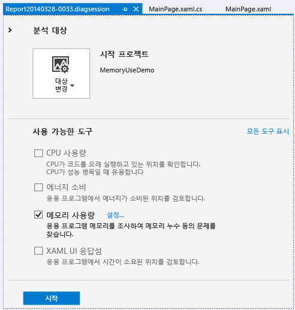  
  
##   메모리 사용 모니터링  
 **메모리 사용량** 도구로 문제를 찾아서 해결할 수 있는 상세 보고서를 생성할 수 있지만, 이 도구를 사용하여 적극적으로 개발 중인 시나리오에 대한 실시간 메모리 영향을 연구할 수도 있습니다.  
  
 진단 세션을 시작하면 앱이 시작되고 **진단 도구** 창에 앱의 메모리 사용에 대한 타임라인 그래프가 표시됩니다.  
  
 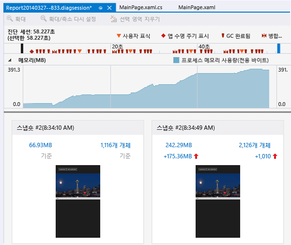  
  
 이 타임라인 그래프에는 앱을 실행할 때 앱의 메모리 변동 사항이 표시됩니다. 그래프에 스파이크가 있으면 일반적으로 일부 코드에서 데이터를 수집하거나 생성한 다음 처리가 완료되면 삭제함을 나타냅니다. 큰 스파이크는 최적화할 수 있는 영역을 나타냅니다. 비효율적인 메모리 사용량 또는 메모리 누수를 나타낼 수 있기 때문에 더욱 걱정스러운 점은 되돌릴 수 없는 메모리 사용량이 증가하는 문제입니다.  
  
###   모니터링 세션 닫기  
 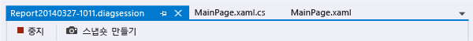  
  
 보고서를 생성하지 않고 모니터링 세션을 중지하려면 진단 창을 닫기만 하면 됩니다. 메모리 스냅숏을 만들 때 보고서를 생성하려면 **중지**를 선택합니다.  
  
##   앱의 메모리 상태 스냅숏 만들기  
 조사할 메모리 관련 문제를 발견하면 진단 세션이 진행되는 동안 스냅숏을 만들어서 특정 순간의 메모리 개체를 캡처할 수 있습니다. 앱에서 무수히 많은 개체 유형을 사용하므로 시나리오 하나에 대한 분석에 집중하려고 할 수 있습니다. 또한 메모리 문제가 나타나기 전 앱의 기본 스냅숏을 만들거나, 첫 번째 문제가 발생한 이후의 다른 스냅숏을 만들거나, 시나리오를 반복할 수 있는 경우 하나 이상의 추가 스냅숏을 만드는 것도 좋습니다.  
  
 스냅숏을 수집하려면 새로운 진단 세션을 시작합니다. 메모리 데이터를 캡처하려는 경우 **스냅숏 만들기**를 선택합니다. 보고서를 생성하려면 **중지**를 선택합니다.  
  
##   메모리 사용량 개요 페이지  
 데이터 컬렉션을 중지한 후 메모리 사용량 도구에서 앱을 중지하고 개요 보고서를 표시합니다.  
  
   
  
###   메모리 사용량 스냅숏 뷰  
 스냅숏 뷰를 사용하여 새 Visual Studio 창에서 자세한 보고서를 엽니다. 다음과 같은 두 종류의 스냅숏 뷰가 있습니다.  
  
-   [스냅숏 정보 보고서](../profiling/memory-usage-without-debugging2.md#BKMK_Snapshot_details_reports)에서는 한 스냅숏의 형식 및 인스턴스를 보여 줍니다.  
  
-   [스냅숏 차이(diff) 보고서](../profiling/memory-usage-without-debugging2.md#BKMK_Snapshot_difference__diff__reports)에서는 두 스냅숏의 형식 및 인스턴스를 비교합니다.  
  
 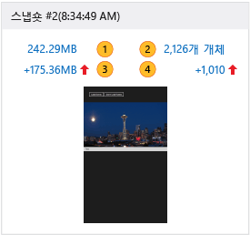  
  
 스냅숏 뷰 그림에서 번호가 있는 항목은 메모리 사용량 보고서 뷰를 여는 링크입니다.  
  
|||  
|-|-|  
||링크 텍스트는 스냅숏을 만들 때 메모리의 총 바이트 수를 보여 줍니다.   이 링크를 선택하면 유형 인스턴스의 총 크기별로 정렬된 스냅숏 정보 보고서가 표시됩니다.|  
||링크 텍스트는 스냅숏을 만들었을 때의 총 메모리 개체 수를 보여 줍니다.   이 링크를 선택하면 유형 인스턴스의 개수별로 정렬된 스냅숏 정보 보고서가 표시됩니다.|  
||링크 텍스트는 현재 이 스냅숏의 총 메모리 개체 크기와 이전 스냅숏의 총 크기 간의 차이를 보여 줍니다.   이 스냅숏의 메모리 크기가 이전 스냅숏보다 크면 링크 텍스트는 양수이고 작으면 음수입니다. 링크 텍스트 **기본**은 이 스냅숏이 진단 세션의 첫 번째 스냅숏임을 나타냅니다. **차이 없음**은 차이가&0;임을 나타냅니다.   이 링크를 선택하면 유형 인스턴스의 총 크기 차이별로 정렬된 스냅숏 차이 보고서가 표시됩니다.|  
||링크 텍스트는 이 스냅숏의 총 메모리 개체 수와 이전 스냅숏의 개체 수 간의 차이를 보여 줍니다.   이 링크를 선택하면 유형 인스턴스의 총 개수 차이별로 정렬된 스냅숏 차이 보고서가 표시됩니다.|  
  
##   스냅숏 보고서  
 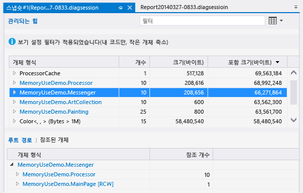  
  
###   스냅숏 보고서 트리  
  
####   관리되는 힙  
 관리되는 힙 트리 [관리되는 힙 트리(스냅숏 정보)](../profiling/memory-usage-without-debugging2.md#BKMK_Managed_Heap_tree__Snapshot_details_) 및 [관리되는 힙 트리(스냅숏 차이)](../profiling/memory-usage-without-debugging2.md#BKMK_Managed_Heap_tree__Snapshot_diff_)에서는 보고서의 형식 및 인스턴스를 보여 줍니다. 형식 또는 인스턴스를 선택하면 선택한 항목에 대한 **루트 경로** 및 **참조 개체** 트리가 표시됩니다.  
  
####   루트 경로  
 [루트 경로 트리(스냅숏 정보)](../profiling/memory-usage-without-debugging2.md#BKMK_Paths_to_Root_tree__Snapshot_details_) 및 [루트 경로 트리(스냅숏 차이)](../profiling/memory-usage-without-debugging2.md#BKMK_Paths_to_Root_tree__Snapshot_diff_)에서는 형식 또는 인스턴스를 참조하는 개체의 체인을 보여 줍니다. .NET Framework 가비지 수집기는 개체에 대한 모든 참조가 해제된 경우에만 개체에 대한 메모리를 정리합니다.  
  
####   참조된 개체  
 [참조된 개체 트리(스냅숏 정보)](../profiling/memory-usage-without-debugging2.md#BKMK_Referenced_Objects_tree__Snapshot_details_) 및 [참조된 개체 트리(스냅숏 차이)](../profiling/memory-usage-without-debugging2.md#BKMK_Referenced_Objects_tree__Snapshot_diff_)에서는 선택한 형식 또는 인스턴스가 참조하는 개체를 보여 줍니다.  
  
###   개체 형식 및 인스턴스 필드  
 **개체 형식** 항목에 자식 항목이 있으면 화살표 아이콘을 선택하여 표시할 수 있습니다. **개체 형식** 텍스트의 색상이 파란색이면 해당 항목을 선택하여 소스 코드 파일에서 해당 개체로 이동할 수 있습니다. 소스 파일은 별도의 창에서 열립니다.  
  
 인스턴스 이름은 메모리 사용량 도구에서 생성하는 고유한 ID입니다.  
  
 쉽게 식별할 수 없는 형식이 있거나 이러한 형식이 코드와 어떻게 관련되는지 모르는 경우 개체의 소유권 체인과 관련되어 있기 때문에 메모리 사용량 도구에서 표시하는 .NET 프레임워크, 운영 체제 또는 컴파일러의 개체일 수 있습니다.  
  
###   보고서 트리 필터  
 대다수 앱에는 굉장히 다양한 유형이 있는데, 이 중 대부분의 유형에는 앱 개발자가 거의 관심을 두지 않습니다. **메모리 사용량** 도구는 **관리되는 힙**과 **루트 경로** 트리에서 이러한 형식을 대부분 숨기는 데 사용할 수 있는 필터 두 개를 정의합니다. 또한 유형 이름별로 트리를 필터링할 수도 있습니다.  
  
 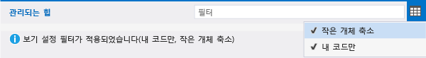  
  
####   필터  
 **필터** 상자에 문자열을 입력하여 지정한 텍스트가 포함된 형식으로 트리 표시를 제한합니다. 필터는 대/소문자를 구분하지 않고 유형 이름의 모든 부분에서 지정한 문자열을 인식합니다.  
  
####   작은 개체 축소  
 이 필터를 적용하면 **크기(바이트)**가 총 스냅숏 메모리 크기의 0.5%보다 작은 형식이 **관리되는 힙** 목록에서 숨겨집니다.  
  
####   내 코드만  
 **내 코드만** 필터는 외부 코드로 생성된 인스턴스를 대부분 숨깁니다. 외부 유형은 운영 체제 또는 프레임워크 구성 요소에서 소유하거나 컴파일러에서 생성합니다.  
  
##   스냅숏 정보 보고서  
 스냅숏 정보 보고서를 사용하여 진단 세션에서 스냅숏 하나에만 집중합니다. 정보 보고서를 열려면 다음 그림과 같이 스냅숏 뷰에서 링크 중 하나를 선택합니다. 두 링크 모두 동일한 보고서를 열지만, 보고서에서 **관리되는 힙** 트리의 시작 정렬 순서만 다릅니다. 두 경우 모두 보고서를 열고 나서 정렬 순서를 변경할 수 있습니다.  
  
   
  
-   **MB** 링크는 **포함 크기(바이트)** 열을 기준으로 보고서를 정렬합니다.  
  
-   **개체** 링크는 **개수** 열을 기준으로 보고서를 정렬합니다.  
  
###   관리되는 힙 트리(스냅숏 정보)  
 **관리되는 힙** 트리에는 메모리에 보관된 개체의 형식이 나열됩니다. 유형에서 가장 큰 인스턴스&10;개를 크기별로 정렬해서 볼 수 있도록 유형 이름을 확장할 수 있습니다. 형식 또는 인스턴스를 선택하면 선택한 항목에 대한 **루트 경로** 및 **참조 개체** 트리가 표시됩니다.  
  
 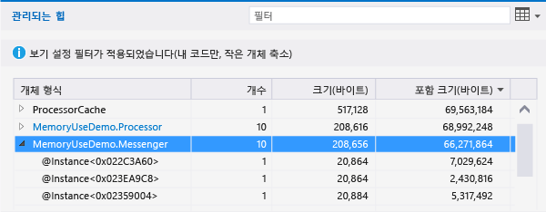  
  
|||  
|-|-|  
|**개체 형식**|유형 이름 또는 개체 인스턴스입니다.|  
|**개수**|유형의 개체 인스턴스 수입니다. 인스턴스의 경우 이 숫자는 항상 1입니다.|  
|**크기(바이트)**|유형의 경우 인스턴스에 포함된 개체 크기를 제외한 메모리 스냅숏 유형의 모든 인스턴스 크기입니다.   인스턴스의 경우 인스턴스에 포함된 개체 크기를 제외한 개체 크기입니다.|  
|**포함 크기(바이트)**|포함된 개체 크기를 비롯한 유형의 인스턴스 크기 또는 단일 인스턴스 크기입니다.|  
  
###   루트 경로 트리(스냅숏 정보)  
 **루트 경로 트리**는 형식 또는 인스턴스를 참조하는 개체의 체인을 보여 줍니다. .NET Framework 가비지 수집기는 개체에 대한 모든 참조가 해제된 경우에만 개체에 대한 메모리를 정리합니다.  
  
 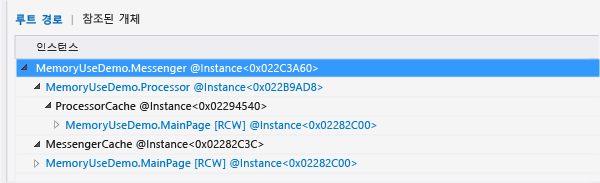  
  
 **루트 경로** 트리에서 형식을 보면 해당 형식을 참조하는 형식의 개체 수가 **참조 개수** 열에 표시됩니다. 인스턴스를 분석할 때에는 이 열이 나타나지 않습니다.  
  
###   참조된 개체 트리(스냅숏 정보)  
 **참조된 개체** 트리는 선택한 형식 또는 인스턴스가 참조하는 개체를 보여 줍니다.  
  
 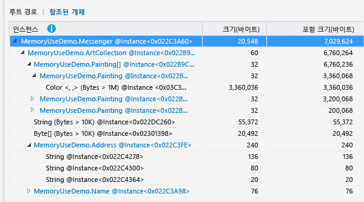  
  
|||  
|-|-|  
|**개체 형식/인스턴스**|유형 이름 또는 개체 인스턴스입니다.|  
|**크기(바이트)**|유형의 경우 유형에 포함된 개체 크기를 제외한 유형의 모든 인스턴스 크기입니다.   인스턴스의 경우 개체에 포함된 개체 크기를 제외한 개체 크기입니다.|  
|**포함 크기(바이트)**|포함된 개체의 크기를 비롯한 유형의 총 인스턴스 크기 또는 단일 인스턴스 크기입니다.|  
  
##   스냅숏 차이(diff) 보고서  
 스냅숏 차이(diff) 보고서는 기본 스냅숏과 기본 스냅숏 바로 직전에 만든 스냅숏 간의 변경 사항을 보여 줍니다. 차이 보고서를 열려면 다음 그림과 같이 스냅숏 뷰에서 링크 중 하나를 선택합니다. 두 링크 모두 동일한 보고서를 열지만, 보고서에서 **관리되는 힙** 트리의 시작 정렬 순서만 다릅니다. 보고서를 연 후 정렬 순서를 변경할 수 있습니다.  
  
 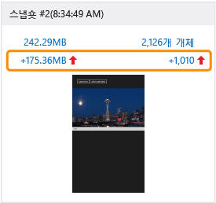  
  
-   **MB** 링크는 **포함 크기(바이트)** 열을 기준으로 보고서를 정렬합니다.  
  
-   **개체** 링크는 **개수** 열을 기준으로 보고서를 정렬합니다.  
  
###   관리되는 힙 트리(스냅숏 차이)  
 **관리되는 힙** 트리에는 메모리에 보관된 개체의 형식이 나열됩니다. 유형에서 가장 큰 인스턴스&10;개를 크기별로 정렬해서 볼 수 있도록 유형 이름을 확장할 수 있습니다. 형식 또는 인스턴스를 선택하면 선택한 항목에 대한 **루트 경로** 및 **참조 개체** 트리가 표시됩니다.  
  
 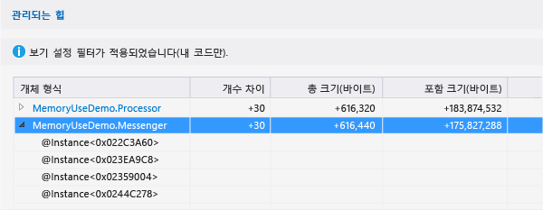  
  
 그림에서 **개수**, **크기(바이트)** 및 **포함 크기(바이트)** 열은 축소되어 있습니다.  
  
|||  
|-|-|  
|**개체 형식**|유형 이름 또는 개체 인스턴스입니다.|  
|**개수**|기본 스냅숏에 있는 유형의 인스턴스 수입니다. 인스턴스의 경우 **개수**는 항상 1입니다.|  
|**개수 차이**|유형의 경우 기본 스냅숏과 이전 스냅숏 간 유형의 인스턴스 수 차이입니다. 인스턴스의 경우 이 필드는 비어 있습니다.|  
|**크기(바이트)**|개체에 포함된 개체의 크기를 제외한 기본 스냅숏의 개체 크기입니다. 형식의 경우 **크기(바이트)** 및 **포함 크기(바이트)**는 형식 인스턴스의 총 크기입니다.|  
|**총 크기 차이(바이트)**|유형의 경우 인스턴스에 포함된 개체 크기를 제외한 기본 스냅숏과 이전 스냅숏 간 유형의 총 인스턴스 크기의 차이를 나타냅니다. 인스턴스의 경우 이 필드는 비어 있습니다.|  
|**포함 크기(바이트)**|개체에 포함된 개체의 크기를 비롯한 기본 스냅숏의 개체 크기입니다.|  
|**포함 크기 차이(바이트)**|유형의 경우 개체에 포함된 개체 크기를 비롯한 기본 스냅숏과 이전 스냅숏 간 유형의 모든 인스턴스 크기 차이를 나타냅니다. 인스턴스의 경우 이 필드는 비어 있습니다.|  
  
###   루트 경로 트리(스냅숏 차이)  
 **루트 경로 트리**는 형식 또는 인스턴스를 참조하는 개체의 체인을 보여 줍니다. .NET Framework 가비지 수집기는 개체에 대한 모든 참조가 해제된 경우에만 개체에 대한 메모리를 정리합니다.  
  
 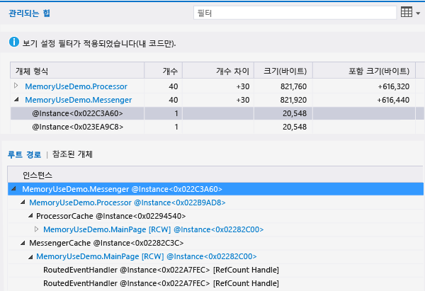  
  
###   참조된 개체 트리(스냅숏 차이)  
 **참조된 개체** 트리는 기본 형식 또는 인스턴스가 참조하는 개체를 보여 줍니다.  
  
   
  
|||  
|-|-|  
|**개체 형식/인스턴스**|유형 이름 또는 개체 인스턴스입니다.|  
|**크기(바이트)**|인스턴스의 경우 인스턴스에 포함된 개체 크기를 제외한 기본 스냅숏의 개체 크기입니다.   유형의 경우 인스턴스에 포함된 개체 크기를 제외한 기본 스냅숏에 있는 유형의 총 인스턴스 크기입니다.|  
|**포함 크기(바이트)**|개체에 포함된 개체의 크기를 비롯한 기본 스냅숏의 개체 크기입니다.|  
  
## 참고 항목  
 [JavaScript 메모리](../profiling/javascript-memory.md)
 [프로파일링 도구](../profiling/profiling-tools.md)
 [C++, C# 및 Visual Basic으로 작성한 Windows 스토어 앱의 성능 모범 사례](http://msdn.microsoft.com/library/windows/apps/hh750313.aspx)   
 [Diagnosing memory issues with the new Memory Usage Tool in Visual Studio](http://go.microsoft.com/fwlink/p/?LinkId=394706)(Visual Studio에서 새 메모리 사용량 도구로 메모리 문제 진단)
