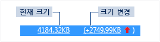

# 메모리 사용량
[!INCLUDE[vs2017banner](../code-quality/includes/vs2017banner.md)]

디버거 통합 **메모리 사용량** 진단 도구를 사용하여 디버그하는 동안 메모리 누수 및 비효율적인 메모리를 찾습니다. 메모리 사용량 도구를 통해 관리되는 메모리 및 네이티브 메모리 힙의 *스냅숏*을 하나 이상 만들 수 있습니다. .NET, 네이티브 또는 혼합 모드\(.NET 및 네이티브\) 앱의 스냅숏을 수집할 수 있습니다.  
  
-   단일 스냅숏을 분석하여 메모리 사용에 대한 개체 형식의 상대적 영향을 파악하고 앱에서 메모리를 비효율적으로 사용하는 코드를 찾을 수 있습니다.  
  
-   또한 앱의 스냅숏 두 개를 비교\(diff\)하여 코드에서 시간에 따라 메모리 사용이 늘어나는 영역을 찾을 수 있습니다.  
  
 다음 그림에서는 Visual Studio 2015 업데이트 1의 **진단 도구** 창을 보여 줍니다.  
  
   
  
 언제든지 **메모리 사용량** 도구에서 메모리 스냅숏을 수집할 수 있지만 Visual Studio 디버거를 사용하여 성능 문제를 조사하는 동안 응용 프로그램이 실행되는 방식을 제어할 수 있습니다. 중단점 설정, 단계별 실행, 모두 중단 및 기타 디버거 작업은 가장 관련된 코드 경로를 중심으로 성능 조사를 수행하는 데 도움이 됩니다. 앱이 실행되는 동안 이러한 작업을 수행하면 불필요한 노이즈를 코드에서 제거하고 문제 진단에 걸리는 시간을 크게 줄일 수 있습니다.  
  
 디버거 외부에서 메모리 도구를 사용할 수도 있습니다.[디버깅하지 않고 메모리 사용 분석](../Topic/Memory%20Usage%20without%20Debugging1.md)을 참조하세요.  
  
> [!NOTE]
>  **사용자 지정 할당자 지원** 기본 메모리 프로파일러는 런타임 중 내보낸 할당 [ETW](https://msdn.microsoft.com/en-us/library/windows/desktop/bb968803\(v=vs.85\).aspx) 이벤트 데이터를 수집하여 작동합니다.  CRT 및 Windows SDK의 할당자가 해당 할당 데이터를 캡처할 수 있도록 원본 수준에서 주석이 추가되었습니다.  고유한 할당자를 작성하는 경우 myMalloc에 대한 다음 예제처럼 새로 할당된 힙 메모리에 대한 포인터를 반환하는 모든 함수를 [\_\_declspec](/visual-cpp/cpp/declspec)\(allocator\)로 데코레이트할 수 있습니다.  
>   
>  `__declspec(allocator) void* myMalloc(size_t size)`  
  
## 디버거를 사용하여 메모리 사용 분석  
  
> [!NOTE]
>  메모리 데이터를 수집할 경우 네이티브 또는 혼합 모드 앱의 디버깅 성능에 영향을 줄 수 있으므로 메모리 스냅숏은 기본적으로 사용되지 않습니다. 스냅숏 네이티브 또는 혼합 모드 앱을 사용하도록 설정하려면 디버깅 세션을 시작합니다\(바로 가기 키: **F5**\).**진단 도구** 창이 나타나면 메모리 사용량 탭을 선택한 다음 **스냅숏 사용**을 선택합니다.  
>   
>    
>   
>  디버깅을 중지\(바로 가기 키: **Shift \+ F5**\)하고 다시 시작합니다.  
  
 메모리 상태를 캡처할 때마다 **메모리 사용량** 요약 도구 모음에서 **스냅숏 만들기**를 선택합니다.  
  
   
  
> [!TIP]
>  -   메모리 비교 기준을 만들려면 디버깅 세션을 시작할 때 스냅숏을 만드는 것이 좋습니다.  
> -   앱이 메모리를 자주 할당 및 할당 취소하는 경우 관심 있는 작업의 메모리 프로필을 캡처하는 것이 어려울 수 있으므로 작업의 시작 및 끝에 중단점을 설정하거나 작업을 단계별로 실행하여 메모리가 변경된 정확한 지점을 찾습니다.  
  
## 메모리 스냅숏 정보 보기  
 메모리 사용량 요약 테이블의 행에는 디버깅 세션 중에 만든 스냅숏이 나열됩니다.  
  
 행의 열은 프로젝트 속성에서 선택한 디버깅 모드\(.NET, 네이티브 또는 혼합\(.NET 및 네이티브\)\)에 따라 달라집니다.  
  
-   **관리되는 개체** 및 **네이티브 할당** 열에는 스냅숏을 만들 때 .NET 및 네이티브 메모리의 개체 수가 표시됩니다.  
  
-   **관리되는 힙 크기** 및 **네이티브 힙 크기** 열에는 .NET 및 네이티브 힙의 바이트 수가 표시됩니다.  
  
-   여러 스냅숏을 만든 경우 요약 테이블의 셀에 행 스냅숏과 이전 스냅숏 간의 값 변경 내용이 포함됩니다.  
  
       
  
 **세부 정보 보고서를 보려면**  
  
-   선택한 스냅숏의 세부 정보만 보려면 현재 링크를 선택합니다.  
  
-   현재 스냅숏과 이전 스냅숏 간의 차이 정보를 보려면 변경 링크를 선택합니다.  
  
 보고서는 별도의 창에 나타납니다.  
  
## 메모리 사용량 정보 보고서  
  
### 관리되는 형식 보고서  
 메모리 사용량 요약 테이블에서 **관리되는 개체** 또는 **관리되는 힙 크기** 셀의 현재 링크를 선택합니다.  
  
   
  
 위쪽 창에는 형식에서 참조되는 모든 개체의 크기\(**포함 크기**\)를 포함하여 스냅숏의 형식 개수 및 크기가 표시됩니다.  
  
 아래쪽 창의 **루트 경로** 트리에는 위쪽 창에서 선택한 형식을 참조하는 개체가 표시됩니다. .NET Framework 가비지 수집기는 개체를 참조하는 마지막 형식이 해제된 경우에만 개체에 대한 메모리를 정리합니다.  
  
 **참조 된 형식** 트리에는 위쪽 창에서 선택한 형식이 보유하고 있는 참조가 표시됩니다.  
  
   
  
 위쪽 창에서 선택한 형식의 인스턴스를 표시하려면  아이콘을 선택합니다.  
  
   
  
 **인스턴스** 뷰에는 위쪽 창의 스냅숏에서 선택한 개체의 인스턴스가 표시됩니다. 루트 경로 및 참조된 개체 창에는 선택한 인스턴스를 참조하는 개체 및 선택한 인스턴스가 참조하는 형식이 표시됩니다. 스냅숏이 만들어진 지점에서 디버거가 중지되면 값 셀을 마우스로 가리켜 도구 설명에 개체 값을 표시할 수 있습니다.  
  
### 네이티브 형식 보고서  
 **진단 도구** 창의 메모리 사용량 요약 테이블에서 **네이티브 할당** 또는 **네이티브 힙 크기** 셀의 현재 링크를 선택합니다.  
  
   
  
 **형식 뷰**에는 스냅숏의 형식 수와 크기가 표시됩니다.  
  
-   선택한 형식의 인스턴스 아이콘\(\)을 선택하여 스냅숏에서 선택한 형식의 개체에 대한 정보를 표시합니다.  
  
     **인스턴스** 뷰에는 선택한 형식의 각 인스턴스가 표시됩니다. 인스턴스를 선택하면 **할당 호출 스택** 창에 인스턴스를 만든 호출 스택이 표시됩니다.  
  
       
  
-   **뷰 모드**에서 **스택 뷰**를 선택하여 선택한 형식에 대한 할당 스택을 확인합니다.  
  
       
  
### 변경\(차이\) 보고서  
  
-   **진단 도구** 창의 **메모리 사용량** 탭에서 요약 테이블 셀의 변경 링크를 선택합니다.  
  
       
  
-   관리되는 보고서 또는 네이티브 보고서의 **비교 대상** 목록에서 스냅숏을 선택합니다.  
  
       
  
 변경 보고서는 기본 스냅숏 값과 비교 스냅숏 간의 차이를 표시하는 열\(**\(차이\)**로 표시됨\)을 기본 보고서에 추가합니다. 네이티브 형식 뷰 차이 보고서가 표시되는 모양은 다음과 같습니다.  
  
   
  
## 블로그 및 동영상  
 [Visual Studio 2015의 진단 도구 디버거 창](http://blogs.msdn.com/b/visualstudioalm/archive/2015/01/16/diagnostic-tools-debugger-window-in-visual-studio-2015.aspx)  
  
 [블로그: Visual Studio 2015에서 디버그하는 동안 메모리 사용 도구](http://blogs.msdn.com/b/visualstudioalm/archive/2014/11/13/memory-usage-tool-while-debugging-in-visual-studio-2015.aspx)  
  
 [Visual C\+\+ 블로그: VS2015 Preview의 기본 메모리 진단](http://blogs.msdn.com/b/vcblog/archive/2014/11/21/native-memory-diagnostics-in-vs2015-preview.aspx)  
  
 [Visual C\+\+ 블로그: Visual Studio 2015 CTP용 기본 메모리 진단 도구](http://blogs.msdn.com/b/vcblog/archive/2014/06/04/native-memory-diagnostic-tools-for-visual-studio-14-ctp1.aspx)