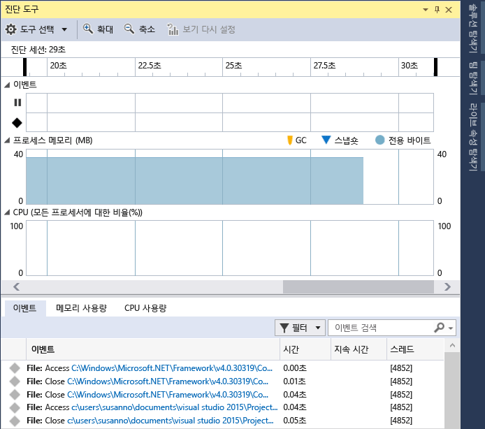

# PerfTips
Visual Studio 디버거 *PerfTips* 및 디버거 통합 **진단 도구** 는 디버그하는 동안 앱의 성능을 모니터링 및 분석하는 데 도움이 됩니다.  
  
 디버거 통합 진단 도구는 개발하는 동안 성능 문제를 인식할 수 있는 효율적인 방법이지만 디버거가 앱 성능에 상당한 영향을 미칠 수도 있습니다. 보다 정확한 성능 데이터를 수집하려면 성능 조사의 추가 부분으로 디버거 도구 외부에서 실행되는 Visual Studio 진단 도구를 사용하는 것이 좋습니다. [디버거를 사용하거나 사용하지 않고 프로파일링 도구 실행](../profiling/running-profiling-tools-with-or-without-the-debugger.md)을 참조하세요.  
  
## PerfTips  
 디버거가 중단점 또는 단계별 실행 작업에서 실행을 중지하는 경우 중단점과 이전 중단점 사이의 경과 시간이 편집기 창에 팁으로 표시됩니다. 자세한 내용은 [성능 팁: Visual Studio를 사용하여 디버그하는 동안 성능 정보 요약](http://blogs.msdn.com/b/visualstudioalm/archive/2014/08/18/perftips-performance-information-at-a-glance-while-debugging-with-visual-studio.aspx)을 참조하세요.  
  
   
  
## 진단 도구 창  
 중단점 및 관련된 타이밍 데이터가 [진단 도구] 창에 기록됩니다.  
  
 다음 그림은 Visual Studio 2015 업데이트 1의 진단 도구 창을 보여 줍니다.  
  
   
  
-   **중단 이벤트** 타임라인은 디버깅 세션에서 적중된 중단점을 표시합니다. 이벤트를 클릭하여 **디버거** 세부 정보 목록에서 선택합니다.  
  
-   **CPU 사용률** 그래프는 디버깅 세션에서 모든 프로세서 코어의 CPU 사용 변경 내용을 보여 줍니다.  
  
-   **디버거** 세부 정보 창의 **이벤트** 목록에는 각 중단 이벤트에 대한 항목이 포함됩니다.  
  
-   중단 이벤트의 **기간** 열에는 이벤트와 이전 중단점 사이의 경과 시간이 표시됩니다.  
  
## PerfTips 켜기 또는 끄기  
 PerfTips를 사용하거나 사용하지 않도록 설정하려면  
  
1.  **디버그** 메뉴에서 **옵션**을 선택합니다.  
  
2.  **디버깅 중에 경과한 시간 성능 팁 표시**를 선택하거나 선택 취소합니다.  
  
## 진단 도구 창 켜기 또는 끄기  
 진단 도구 창을 사용하거나 사용하지 않도록 설정하려면  
  
1.  **디버그** 메뉴에서 **옵션**을 선택합니다.  
  
2.  **디버그하는 동안 진단 도구 사용**을 선택하거나 선택 취소합니다.

## 참고 항목
 [Visual Studio의 프로파일링](../profiling/index.md)  
 [프로파일링 기능 둘러보기](../profiling/profiling-feature-tour.md)
