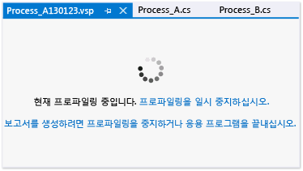

# 일반 성능 세션 옵션 설정
성능 세션에 대한 속성 대화 상자의 **일반** 페이지에서 [!INCLUDE[vsprvs](../code-quality/includes/vsprvs_md.md)] 프로파일링 도구 성능 세션에 대한 수집 방법 및 프로파일링 데이터 명명 규칙을 설정할 수 있습니다. **성능 탐색기**에서 이 대화 상자를 열려면 성능 세션을 마우스 오른쪽 단추로 클릭한 다음 **속성**을 클릭합니다.  
  
 **요구 사항**  
  
-   [!INCLUDE[vsUltLong](../code-quality/includes/vsultlong_md.md)], [!INCLUDE[vsPreLong](../code-quality/includes/vsprelong_md.md)], [!INCLUDE[vsPro](../code-quality/includes/vspro_md.md)]  
  
## 데이터 수집 메서드 선택  
 **프로파일링 수집** 아래의 옵션 중 하나를 선택하여 기본 수집 방법을 설정합니다. 다음 표에서는 이러한 옵션에 대해 설명합니다.  
  
|||  
|-|-|  
|**샘플링** 샘플링 방법은 정기적으로 프로파일링 정보를 수집합니다. 이 방법은 프로세서 사용률 문제를 찾는 데 유용하며, 대부분의 성능 조사를 시작할 수 있는 방법으로 제안됩니다.|-   [샘플링을 사용하여 성능 통계 수집](../profiling/collecting-performance-statistics-by-using-sampling.md)|  
|**계측** 계측 방법은 프로파일링 실행 중 모듈에 각 시작, 종료 및 함수의 함수 호출을 기록하는 모듈 프로파일링 코드의 복사본에 삽입합니다. 이 방법은 코드의 한 섹션에 대한 자세한 타이밍 정보를 수집하고 입력 및 출력 작업이 응용 프로그램 성능에 미치는 영향을 이해하는 데 유용합니다.|-   [계측을 사용하여 자세한 타이밍 데이터 수집](../profiling/collecting-detailed-timing-data-by-using-instrumentation.md)|  
|**동시성** 동시성 방법은 스레드가 해제될 응용 프로그램 리소스에 대한 잠긴 액세스에 대해 대기하는 경우와 같은 코드의 실행을 차단하는 각 이벤트에 대한 데이터를 수집합니다. 이 메서드는 다중 스레드 응용 프로그램을 분석하는 데 유용합니다.|-   [스레드 및 프로세스 동시성 데이터 수집](../profiling/collecting-thread-and-process-concurrency-data.md)|  
  
 샘플링 또는 계측 방법을 사용하여 .NET 메모리 데이터를 수집할 수 있습니다. **.NET 메모리 프로파일링** 아래에서 데이터의 형식을 선택합니다.  
  
|||  
|-|-|  
|**.NET 개체 할당 정보를 수집합니다**. 기본적으로 데이터에 할당된 개체의 크기와 수가 포함됩니다. 이 확인란을 선택하거나 선택을 취소하여 .NET 메모리 데이터 수집을 활성화하거나 비활성화합니다.   **또한 .NET 개체 수명 정보도 수집합니다**. 이 확인란을 선택하여 메모리 개체를 회수하는 데 사용된 가비지 수집 세대에 대한 데이터를 포함합니다.|-   [.NET 메모리 할당 및 수명 데이터 수집](../profiling/collecting-dotnet-memory-allocation-and-lifetime-data.md)|  
  
 프로파일링 세션 페이지는 응용 프로그램에 대한 프로파일링을 시작할 때 나타납니다. 여기에서는 프로파일링을 일시 중지, 다시 시작 및 중지할 수 있습니다.  
  
   
  
## 프로파일링 데이터 파일 옵션 설정  
  
|||  
|-|-|  
|**보고서** 기본적으로 프로파일링 데이터(.vsp) 파일에 프로파일링된 응용 프로그램의 이름이 지정되고 솔루션 또는 프로젝트 폴더에 위치됩니다. 날짜 문자열도 이름에 추가되고 중복된 번호가 데이터 파일에 추가됩니다. 그렇지 않은 경우 중복된 이름을 갖습니다. 이러한 옵션을 변경할 수 있습니다.|-   [방법: 성능 데이터 파일 이름 옵션 설정](../profiling/how-to-set-performance-data-file-name-options.md)|