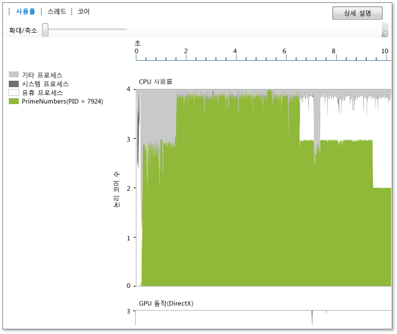

# 사용률 뷰
**사용률 뷰**에는 현재 프로세스에 사용되는 CPU, GPU 및 기타 시스템 리소스에 대한 정보가 표시됩니다(**분석** > **동시성 시각화 도우미**를 선택하여 동시성 시각화 도우미 시작). 이 뷰에서는 분석된 프로세스, 유휴 프로세스, 시스템 프로세스 및 시스템에서 실행되고 있는 기타 프로세스의 시간별 평균 코어 사용률을 보여 줍니다. 지정된 시간에 활성 상태인 특정 코어는 표시되지 않습니다. 예를 들어 특정 시간 동안 두 개의 코어가 각각 50% 용량으로 실행되는 경우 이 뷰에서는 하나의 논리 코어가 사용되고 있는 것으로 표시됩니다. 이 뷰는 프로파일링 시간을 짧은 시간 세그먼트 여러 개로 구분하는 방식으로 생성됩니다. 각 세그먼트에 대해 그래프에는 해당 간격 동안 논리 코어에서 실행 중인 프로세스 스레드의 평균 수가 그려집니다.  
  
   
  
 그래프의 대상 프로세스/유휴 프로세스/시스템 프로세스에서 사용하는 평균 논리 코어와 시간(x축)이 표시됩니다. 유휴 프로세스는 유휴 코어를 표시합니다. 시스템 프로세스는 다른 프로세스 대신 작업을 수행할 수 있는 Windows의 프로세스입니다. 시스템에서 실행 중인 나머지 프로세스는 나머지 코어의 사용률 계산에 포함됩니다.  
  
 논리 코어 수는 y축에 표시됩니다. Windows는 하이퍼스레딩과 같은 하드웨어의 동시 멀티스레딩 지원을 논리 코어로 처리합니다. 따라서 코어당 2개 하드웨어 스레드를 지원하는 쿼드 코어 프로세서가 포함된 시스템은 논리 코어가 8개인 시스템으로 표시됩니다. 이 규칙은 코어 뷰에도 적용됩니다. 자세한 내용은 [코어 뷰](../profiling/cores-view.md)를 참조하세요.  
  
 GPU 활동 차트에는 시간별로 사용된 DirectX 엔진의 수가 표시됩니다.  엔진은 DMA 패킷을 처리 중인 경우 사용 중인 것입니다.  3D 엔진, 비디오 엔진 등의 특정 DirectX 엔진은 차트에 표시되지 않습니다.  
  
## 용도  
 Concurrency 시각화를 사용하는 경우 사용률 뷰에서 성능 조사를 시작하는 것이 좋습니다. 사용률 뷰는 앱의 시간별 동시성 개요를 제공하므로 이 뷰를 통해 성능 조정 또는 병렬 처리가 필요한 영역을 빠르게 파악할 수 있습니다.  
  
 성능 튜닝을 수행하려는 경우 기대치를 충족하지 않는 동작을 확인할 수 있습니다. 또한 논리 CPU 코어 사용률이 낮은 영역의 유무 및 그 원인도 확인해 볼 수 있습니다. CPU와 GPU 간의 사용 패턴도 살펴볼 수 있습니다.  
  
 앱을 병렬 처리하려는 경우에는 실행의 CPU 바인딩 영역 또는 CPU를 사용하지 않는 영역을 찾아볼 수 있습니다.  
  
 CPU 바인딩 영역은 녹색으로 표시됩니다. 앱이 직렬인 경우 그래프에는 코어 하나가 사용되는 것으로 표시됩니다.  
  
 CPU를 사용하지 않는 영역은 회색으로 표시됩니다. 이러한 영역은 앱이 유휴 상태이거나 I/O 차단을 수행 중이며, 다른 CPU 바인딩 작업과의 중첩을 통해 병렬 처리할 수 있는 지점을 나타낼 수 있습니다.  
  
 관심 동작이 확인되면 해당 영역을 선택하여 확대할 수 있습니다. 확대한 후에는 스레드 뷰 또는 코어 뷰로 전환하여 보다 자세한 분석을 수행할 수 있습니다.  
  
 C++ AMP 또는 DirectX를 통해 GPU를 사용 중이라면 GPU가 예기치 않게 유휴 상태가 된 영역 또는 사용 중인 GPU 엔진 수를 파악할 수 있습니다.  
  
## 확대/축소  
 CPU 사용률 그래프 또는 GPU 활동 그래프에서 확대하려면 특정 섹션을 선택하거나 그래프 위쪽에 있는 확대/축소 슬라이더 도구를 사용합니다. 확대/축소 설정은 다른 뷰로 전환해도 유지됩니다. 다시 축소하려면 확대/축소 슬라이더 도구를 사용합니다. Ctrl 키를 누른 상태로 스크롤하여 확대/축소할 수도 있습니다.  
  
## 참고 항목  
 [동시성 시각화 도우미](../profiling/concurrency-visualizer.md)   
 [코어 뷰](../profiling/cores-view.md)