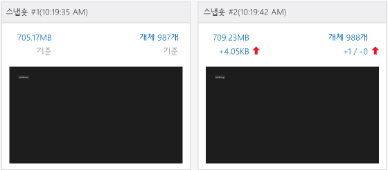
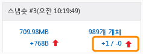
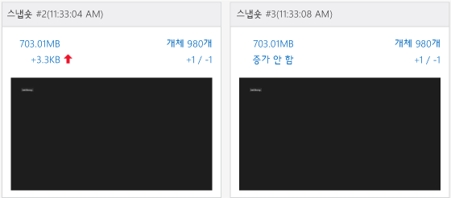

# <a name="walkthrough-find-a-memory-leak-javascript"></a>연습: 메모리 누수 찾기(JavaScript)
  
  
 이 연습에서는 JavaScript 메모리 분석기를 사용하여 간단한 메모리 문제를 식별하고 수정하는 과정을 안내합니다. JavaScript 메모리 분석기는 JavaScript를 사용하여 Windows용으로 작성된 Visual Studio for Windows 스토어 앱에서 사용할 수 있습니다. 이 시나리오에서는 DOM 요소를 만들어질 때와 같은 속도로 삭제하지 않고 메모리에 잘못 유지하는 앱을 만듭니다.  
  
 이 앱의 메모리 누수 원인은 매우 구체적이지만 여기에 나와 있는 단계에서는 메모리가 누수되는 개체를 격리하는 데 일반적으로 효과적인 워크플로를 보여줍니다.  
  
### <a name="running-the-javascript-memory-analyzer-test-app"></a>JavaScript 메모리 분석기 테스트 앱 실행  
  
1.  Visual Studio에서 **파일**, **새로 만들기**, **프로젝트**를 선택합니다.  
  
2.  왼쪽 창에서 **JavaScript** 를 선택하고 **Windows**, **Windows 8**을 선택한 다음 **유니버설** 또는 **Windows Phone 앱**을 선택합니다.  
  
    > [!IMPORTANT]
    >  이 항목에 표시된 메모리 사용 결과는 Windows 8 앱에 대해 테스트됩니다.  
  
3.  가운데 창에서 **새 앱** 프로젝트 템플릿을 선택합니다.  
  
4.  **이름** 상자에 `JS_Mem_Tester`와 같은 이름을 지정한 다음 **확인**을 선택합니다.  
  
5.  **솔루션 탐색기**에서 default.html을 열고 \<body> 태그 사이에 다음 코드를 붙여 넣습니다.  
  
    ```html  
    <div class="wrapper">  
        <div id="item"></div>  
        <button class="memleak" style="display: block" >Leak Memory</button>  
    </div>  
    ```  
  
    > [!IMPORTANT]
    >  Windows 8.1유니버설 앱 템플릿을 사용하는 경우 .Windows 프로젝트와 .WindowsPhone 프로젝트 모두에서 HTML 및 CSS 코드를 업데이트해야 합니다.  
  
6.  default.css를 열고 다음 CSS 코드를 추가합니다.  
  
    ```css  
    .memleak {  
        position: absolute; top: 100px; left: 100px;  
    }  
    ```  
  
7.  default.js를 열고 모든 코드를 이 코드로 바꿉니다.  
  
    ```javascript  
    (function () {  
        "use strict";  
  
        var app = WinJS.Application;  
        var activation = Windows.ApplicationModel.Activation;  
  
        var wrapper;  
        var elem;  
  
        app.onactivated = function (args) {  
            if (args.detail.kind === activation.ActivationKind.launch) {  
                if (args.detail.previousExecutionState !== activation.ApplicationExecutionState.terminated) {  
                } else {  
                }  
                args.setPromise(WinJS.UI.processAll());  
  
                elem = document.getElementById("item");  
                wrapper = document.querySelector(".wrapper");  
                var btn = document.querySelector(".memleak");  
                btn.addEventListener("click", btnHandler);  
                run();  
            }  
        };  
  
        app.oncheckpoint = function (args) {  
        };  
  
        app.start();  
  
        function run() {  
            initialize();  
            load();  
        }  
  
        function initialize() {  
  
            if (wrapper != null) {  
                elem.removeNode(true);  
            }  
        }  
  
        function load() {  
  
            var newDiv = document.createElement("div");  
  
            newDiv.style.zIndex = "-1";  
            newDiv.id = "item";  
  
            wrapper.appendChild(newDiv);  
        }  
  
        function btnHandler(args) {  
            run();  
        }  
  
    })();  
    ```  
  
8.  F5 키를 선택하여 디버깅을 시작합니다. 페이지에 **메모리 누수** 단추가 나타나는지 확인합니다.  
  
9. Alt+Tab을 눌러 Visual Studio로 다시 전환하고 Shift+F5를 눌러 디버깅을 중지합니다.  
  
     앱 작동을 확인했으므로 메모리 사용을 검사할 수 있습니다.  
  
### <a name="analyzing-the-memory-usage"></a>메모리 사용 분석  
  
1.  **디버그** 도구 모음의 **디버깅 시작** 목록에서 업데이트된 프로젝트의 디버그 대상을 Windows Phone 에뮬레이터 또는 **시뮬레이터**중에 선택합니다.  
  
    > [!TIP]
    >  Windows 스토어 앱의 경우 이 목록에서 **로컬 컴퓨터** 또는 **원격 컴퓨터** 를 선택할 수도 있습니다. 그러나 에뮬레이터 또는 시뮬레이터를 사용하면 Visual Studio 옆에 두고 실행 중인 앱과 JavaScript 메모리 분석기 간을 쉽게 전환할 수 있습니다. 자세한 내용은 [Visual Studio에서 앱 실행](../debugger/run-store-apps-from-visual-studio.md) 및 [원격 컴퓨터에서 Windows 스토어 앱 실행](../debugger/run-windows-store-apps-on-a-remote-machine.md)을 참조하세요.  
  
2.  **디버그** 메뉴에서 **성능 프로파일러...**를 선택합니다.  
  
3.  **사용 가능한 도구**에서 **JavaScript 메모리**를 선택한 다음 **시작**을 선택합니다.  
  
     이 자습서에서는 시작 프로젝트에 메모리 분석기를 연결합니다. 설치된 앱에 메모리 분석기 연결 등의 기타 옵션에 대한 자세한 내용은 [JavaScript 메모리](../profiling/javascript-memory.md)를 참조하세요.  
  
     메모리 분석기를 시작하면 VsEtwCollector.exe 실행 권한을 요청하는 사용자 계정 컨트롤이 표시될 수 있습니다. **예**를 선택합니다.  
  
4.  **메모리 누수** 단추를 연속해서 네 번 선택합니다.  
  
     단추를 선택하면 default.js의 이벤트 처리 코드가 메모리 누수를 발생시킵니다. 이것을 진단 용도로 사용합니다.  
  
    > [!TIP]
    >  메모리 누수가 있는지 테스트할 시나리오를 반복하면 앱 초기화 중 또는 페이지를 로드할 때 힙에 추가되는 개체 등 필요하지 않은 정보를 더 쉽게 필터링할 수 있습니다.  
  
5.  Alt+Tab을 눌러 실행 중인 응용 프로그램에서 Visual Studio로 전환합니다.  
  
     Visual Studio 새 탭에 JavaScript 메모리 분석기가 표시됩니다.  
  
     이 요약 뷰의 메모리 그래프는 시간별 프로세스 메모리 사용을 보여 줍니다. 뷰에서는 **힙 스냅숏 만들기**와 같은 명령도 제공합니다. 스냅숏은 특정 시간의 메모리 사용에 대한 자세한 정보를 제공합니다. 자세한 내용은 [JavaScript 메모리](../profiling/javascript-memory.md)를 참조하세요.  
  
6.  **힙 스냅숏 만들기**를 클릭합니다.  
  
7.  앱으로 전환하고 **메모리 누수**를 선택합니다.  
  
8.  Visual Studio로 전환하고 **힙 스냅숏 만들기** 를 다시 선택합니다.  
  
     이 그림에서는 기본 스냅숏(#1)과 스냅숏 #2를 보여 줍니다.  
  
       
  
    > [!NOTE]
    >  Windows Phone 에뮬레이터는 스냅숏이 만들어진 때의 앱 스냅숏을 보여 주지 않습니다.  
  
9. 앱으로 전환하고 **메모리 누수** 단추를 다시 선택합니다.  
  
10. Visual Studio로 전환하고 세 번째 **힙 스냅숏 만들기** 를 선택합니다.  
  
    > [!TIP]
    >  이 워크플로의 세 번째 스냅숏을 작성하면 기본 스냅숏을 기준으로 메모리 누수와 연결되지 않은 두 번째 스냅숏에서 변경된 사항을 필터링할 수 있습니다. 예를 들어 페이지에서 머리글 및 바닥글 업데이트와 같이 메모리 사용량을 변경하지만 메모리 누수와는 관련이 없을 수 있는 변경 사항이 예상될 수 있습니다.  
  
     이 그림에서는 스냅숏 #2와 스냅숏 #3을 보여 줍니다.  
  
       
  
11. Visual Studio에서 **중지** 를 선택하여 프로파일링을 중지합니다.  
  
12. Visual Studio에서 스냅숏을 비교합니다. 스냅숏 #2는 다음을 보여 줍니다.  
  
    -   스냅숏 #1에 비해 힙 크기(왼쪽에 표시된 빨간색 위쪽 화살표)가 몇 KB 증가했습니다.  
  
        > [!IMPORTANT]
        >  힙 크기에 대한 정확한 메모리 사용량 값은 디버그 대상에 따라 달라집니다.  
  
    -   스냅숏 #1에 비해 힙의 개체 수(오른쪽에 표시된 빨간색 위쪽 화살표)가 증가했습니다. 개체&1;개가 추가되고(+1) 제거된 개체는 없습니다(-0).  
  
     스냅숏 #3는 다음을 보여 줍니다.  
  
    -   힙 크기가 스냅샷 #2에 비해 다시 몇 백 바이트 이상 증가했습니다.  
  
    -   힙의 개체 수가 스냅샷 #2에 비해 다시 증가했습니다. 개체&1;개가 추가되고(+1) 제거된 개체는 없습니다(-0).  
  
13. 스냅샷 #3에서 빨간색 위쪽 화살표 옆에 +1/-0 값이 있는 오른쪽 링크 텍스트를 선택합니다.  
  
       
  
     기본적으로 표시되는 형식 뷰와 함께 힙에 있는 개체에 대한 차이 뷰( **스냅숏 #3 - 스냅숏 #2**)가 열립니다. 기본적으로 스냅숏 #2와 스냅숏 #3 사이의 힙에 추가된 개체의 목록이 표시됩니다.  
  
14. **범위** 필터에서 **스냅숏 #2에서 남은 개체**를 선택합니다.  
  
15. 다음과 같이 개체 트리의 맨위에 있는 HTMLDivElement 개체를 엽니다.  
  
       
  
     이 뷰에서는 다음과 같이 메모리 누수에 대한 유용한 정보를 보여 줍니다.  
  
    -   이 뷰에서는 ID가 `item`인 DIV 요소를 보여주고 개체의 보존 크기는 몇 백 바이트입니다(정확한 값은 다를 수 있음).  
  
    -   이 개체는 스냅숏 #2에서 남겨진 개체이고 잠재적인 메모리 누수를 나타냅니다.  
  
     이 시점에서 앱에 대한 약간의 지식이 도움이 됩니다. **메모리 누수** 단추를 선택하면 DIV 요소가 제거되고 요소가 추가되므로 코드가 제대로 작동하지 않습니다(즉, 메모리가 누수됨). 다음 섹션에서는 이 문제를 해결하는 방법을 설명합니다.  
  
    > [!TIP]
    >  경우에 따라 `Global` 개체와 관련하여 개체를 찾으면 해당 개체를 쉽게 확인할 수 있습니다. 이렇게 하려면 식별자에 대한 바로 가기 메뉴를 열고 **루트 뷰에서 보기**를 선택합니다.  
  
##  <a name="a-namefixingmemorya-fixing-the-memory-issue"></a><a name="FixingMemory"></a> 메모리 문제 수정  
  
1.  프로파일러에 의해 표시된 데이터를 사용하여 ID가 "item"인 DOM 요소 제거를 담당하는 코드를 검사합니다. 이 작업은 `initialize()` 함수에서 수행됩니다.  
  
    ```javascript  
    function initialize() {  
  
        if (wrapper != null) {  
            elem.removeNode(true);  
        }  
    }  
    ```  
  
     '`elem.removeNode(true)`는 올바르게 작동하지 않을 것입니다. 코드가 DOM 요소를 어떻게 캐시하는지 검사하고 문제를 찾습니다. 캐시된 요소에 대한 참조는 업데이트되지 않습니다.  
  
2.  default.js에서 `appendChild`호출 직전에 다음 코드 줄을 load 함수에 추가합니다.  
  
    ```javascript  
    elem = newDiv;  
    ```  
  
     이 코드는 단추를 선택할 때 **메모리 누수** 요소가 올바르게 제거되도록 캐시된 요소에 대한 참조를 업데이트합니다. load 함수에 대한 전체 코드는 다음과 같이 나타납니다.  
  
    ```javascript  
    function load() {  
  
        wrapper = document.querySelector(".wrapper");  
  
        var newDiv = document.createElement("div");  
  
        newDiv.style.zIndex = "-1";  
        newDiv.id = "item";  
        elem = newDiv;  
  
        wrapper.appendChild(newDiv);  
    }  
    ```  
  
3.  **디버그** 메뉴에서 **성능 및 진단**을 선택합니다.  
  
4.  **사용 가능한 도구**에서 **JavaScript 메모리**를 선택한 다음 **시작**을 선택합니다.  
  
5.  앞에서와 동일한 절차에 따라 세 개의 스냅샷을 만듭니다. 단계는 여기에 요약되어 있습니다.  
  
    1.  앱에서 **메모리 누수** 단추를 연속해서 네 번 선택합니다.  
  
    2.  Visual Studio로 전환하고 기본 스냅숏에 대한 **힙 스냅숏 만들기** 를 선택합니다.  
  
    3.  앱에서 **메모리 누수** 단추를 선택합니다.  
  
    4.  Visual Studio로 전환하고 두 번째 스냅숏에 대한 **힙 스냅숏 만들기** 를 선택합니다.  
  
    5.  앱에서 **메모리 누수** 단추를 선택합니다.  
  
    6.  Visual Studio로 전환하고 세 번째 스냅숏에 대한 **힙 스냅숏 만들기** 를 선택합니다.  
  
     스냅숏 #3의 힙 크기는 이제 스냅숏 #2에 비해 **증가 안 함** 으로 나타나고 개체 수는 +2/-2로 표시됩니다. 이는 한 개의 개체가 추가되고 한 개의 개체가 제거되었다는 의미입니다. 이러한 동작이 발생해야 합니다.  
  
     다음 그림에서는 스냅숏 #2와 스냅숏 #3을 보여 줍니다.  
  
       
  
## <a name="see-also"></a>참고 항목  
 [JavaScript 메모리](../profiling/javascript-memory.md)
