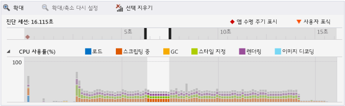
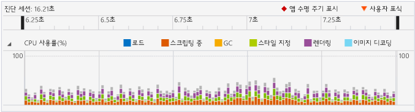
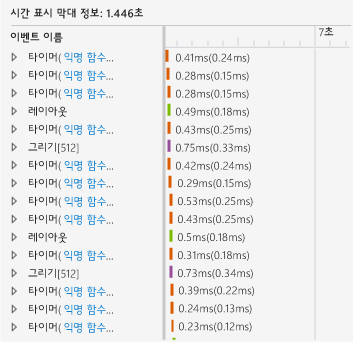
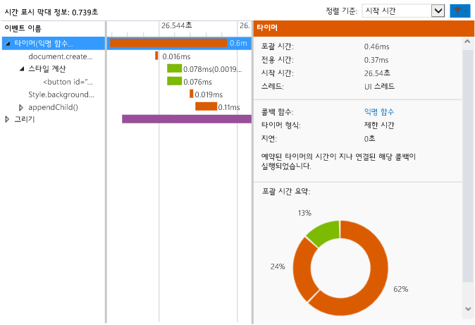

# <a name="walkthrough-improving-ui-responsiveness-html"></a>연습: UI 응답성 개선(HTML)
이 연습에서는 [HTML UI 응답성 프로파일러](../profiling/html-ui-responsiveness.md)를 사용하여 간단한 성능 문제를 식별하고 해결하는 과정을 안내합니다. 프로파일러는 JavaScript를 사용하는 UWP 앱용 Visual Studio에서 사용 가능합니다. 이 시나리오에서는 DOM 요소를 너무 자주 업데이트하는 성능 테스트 앱을 만들고 프로파일러를 사용하여 이 문제를 식별 및 수정합니다.  
  
### <a name="creating-and-running-the-performance-test-app"></a>성능 테스트 앱 만들기 및 실행  
  
1.  Visual Studio에서 새 Windows 유니버설 JavaScript 프로젝트를 만듭니다. (**파일 > 새로 만들기 > 프로젝트** 선택) 왼쪽 창에서 **JavaScript**를 선택한 다음 **Windows**, **Windows 10**을 선택하고 **유니버설** 또는 **Windows Phone**을 선택합니다.  
  
2.  > [!IMPORTANT]
    >  이 항목에 나와 있는 진단 결과가 Windows 8 앱에 대해 표시됩니다.  
  
3.  가운데 창에서 **비어 있는 앱** 등 빈 프로젝트 템플릿 중 하나를 선택합니다.  
  
4.  **이름** 상자에 `JS_Perf_Tester`와 같은 이름을 지정한 다음 **확인**을 선택합니다.  
  
5.  **솔루션 탐색기**에서 default.html을 열고 \<body> 태그 사이에 다음 코드를 붙여 넣습니다.  
  
    ```html  
    <div class="wrapper">  
        <button id="content">Waiting for values</button>  
    </div>  
    ```  
  
6.  default.css를 열고 다음 CSS 코드를 추가합니다.  
  
    ```css  
    #content {  
        margin-left: 100px;  
        margin-top: 100px;  
    }  
    ```  
  
7.  default.js를 열고 모든 코드를 이 코드로 바꿉니다.  
  
    ```javascript  
    (function () {  
        "use strict";  
  
        var app = WinJS.Application;  
        var activation = Windows.ApplicationModel.Activation;  
  
        var content;  
        var wrapper;  
  
        app.onactivated = function (args) {  
            if (args.detail.kind === activation.ActivationKind.launch) {  
                if (args.detail.previousExecutionState !== activation.ApplicationExecutionState.terminated) {  
  
                    content = document.getElementById("content");  
                    wrapper = document.querySelector(".wrapper");  
  
                    content.addEventListener("click", handler);  
  
                } else {  
                }  
  
                args.setPromise(WinJS.UI.processAll());  
            }  
        };  
  
        app.oncheckpoint = function (args) {  
        };  
  
        app.start();  
  
        var idx = 0;  
        var count = 0;  
        var max = 5000;  
        var text = ["what", "is", "the", "Matrix?"];  
        var color = ["red", "crimson", "maroon", "purple"];  
  
        function increment() {  
  
            setTimeout(function () {  
  
                idx++;  
                count++;  
  
                if (idx > 3) { idx = 0; }  
                if (count < max) { increment(); }  
  
            }, 1000);  
        }  
  
        function setValues() {  
  
            content = document.getElementById("content");  
            content.removeNode(true);  
  
            var newNode = document.createElement("button");  
            newNode.id = "content";  
            newNode.textContent = text[idx];  
            //newNode.textContent = getData();  
            newNode.style.backgroundColor = color[idx];  
            //newNode.style.animationName = "move";  
            //count++;  
  
            wrapper.appendChild(newNode);  
  
        }  
  
        function update() {  
  
            setTimeout(function () {  
  
                setValues();  
                if (count < max) { update(); }  
            });  
        }  
  
        function handler(args) {  
  
            content.textContent = "eenie";  
            increment();  
            update();  
        }  
  
    })();  
  
    ```  
  
8.  F5 키를 선택하여 디버깅을 시작합니다. 페이지에 **값 대기** 단추가 나타나는지 확인합니다.  
  
9. **값 대기**를 선택하고 약 1초에 한 번씩 단추 텍스트 및 색이 업데이트됨을 확인합니다. 이것은 의도적인 것입니다.  
  
10. Alt+Tab을 눌러 Visual Studio로 다시 전환하고 Shift+F5를 눌러 디버깅을 중지합니다.  
  
     앱이 제대로 작동하는지 확인했으므로 프로파일러를 사용하여 성능을 검사할 수 있습니다.  
  
### <a name="analyzing-performance-data"></a>성능 데이터 분석  
  
1.  **디버그** 도구 모음의 **디버깅 시작** 목록에서 Windows Phone 에뮬레이터 중 하나 또는 **시뮬레이터**를 선택합니다.  
  
2.  **디버그** 메뉴에서 **성능 및 진단**을 선택합니다.  
  
3.  **사용 가능한 도구**에서 **HTML UI 응답성**을 선택하고 **시작**을 선택합니다.  
  
     이 자습서에서는 시작 프로젝트에 프로파일러를 연결합니다. 설치된 앱에 프로파일러를 연결하는 등 기타 옵션에 대한 자세한 내용은 [HTML UI 응답성](../profiling/html-ui-responsiveness.md)을 참조하세요.  
  
     프로파일러를 시작하면 VsEtwCollector.exe 실행 권한을 요청하는 사용자 계정 컨트롤이 표시될 수 있습니다. **예**를 선택합니다.  
  
4.  실행 중인 앱의 경우 **값 대기**를 선택하고 10초 정도 기다립니다. 약 1초에 한 번씩 단추 텍스트 및 색상 업데이트를 확인합니다.  
  
5.  Alt+Tab을 눌러 실행 중인 응용 프로그램에서 Visual Studio로 전환합니다.  
  
6.  **컬렉션 중지**를 선택합니다.  
  
     Visual Studio 새 탭에 정보가 표시됩니다. CPU 사용률 및 시각적 처리량(FPS) 데이터를 보면 몇 가지 추세를 쉽게 식별할 수 있습니다.  
  
    -   **값 대기** 단추를 누르면 약 3초 후에 CPU 사용률이 크게 증가하며 이 시점부터 이벤트의 명백한 패턴(스크립팅, 스타일 및 렌더링 이벤트의 일관성 있는 혼합)이 나타납니다.  
  
    -   시각적 처리량에 영향을 주지 않고 FPS의 처리량은 60으로 그대로 유지됩니다(즉, 프레임이 떨어지지 않음).  
  
     CPU 사용률 그래프의 일반적인 섹션에서 작업량이 많은 이 주기 동안 앱에서 무엇을 수행하는지 살펴보겠습니다.  
  
7.  CPU 사용률 그래프의 중간에서 첫 번째와 두 번째 부분을 선택합니다(클릭하여 끌기 기능을 사용하거나 누른 후 화살표 키 사용). 다음 그림에서는 선택 후의 CPU 사용률 그래프를 보여 줍니다. 공유되지 않은 영역이 선택 영역입니다.  
  
       
  
8.  **확대**를 선택합니다.  
  
     그래프에 선택한 기간이 더 자세히 표시됩니다. 다음 그림에서는 확대 후의 CPU 사용률 그래프를 보여 줍니다. 그래프의 특정 데이터가 다를 수는 있지만, 일반적인 패턴은 확인할 수 있습니다.  
  
       
  
     아래쪽 창의 시간 표시 막대 정보에 선택한 기간에 대한 세부 정보의 예제가 표시됩니다.  
  
       
  
     시간 표시 막대 정보의 이벤트에서 CPU 사용률 그래프의 시각적 추세를 확인합니다. 짧은 기간 동안 많은 이벤트가 발생합니다. 시간 표시 막대 정보 뷰에 `Timer`, `Layout` 및 `Paint` 이벤트가 표시됩니다.  
  
9. 상황에 맞는 메뉴를 사용하거나 아래쪽 창에서 `Timer` 이벤트 중 하나를 오른쪽 단추로 클릭하고 **이벤트 필터**를 선택합니다. 다음 그림에서는 이 테스트 응용 프로그램의 `Timer` 이벤트 중 하나에 일반적으로 사용하는 세부 정보의 예제를 보여 줍니다.  
  
       
  
     데이터를 통해 다양한 정보를 수집할 수 있습니다. 예:  
  
    -   스크립팅 이벤트로 식별하기 위해 색으로 구분된 각 `Timer` 이벤트에는 `document.createElement`에 대한 호출과 스타일 계산 및 `style.backgroundColor`와 `appendChild()`에 대한 호출이 포함됩니다.  
  
    -   선택한 약 1-2초 정도의 짧은 시간 동안 수많은 `Timer`, `Layout` 및 `Paint` 이벤트가 발생합니다. `Timer` 이벤트는 앱을 실행한 후 **값 대기** 단추를 선택할 때 시각적으로 표시되는 초당 한 번의 업데이트보다 훨씬 자주 발생합니다.  
  
10. 조사하려면 왼쪽 아래 창에서 `Timer` 이벤트 중 하나에 대한 익명 함수 링크를 선택합니다. 다음 함수는 default.js에서 열립니다.  
  
    ```javascript  
    function update() {  
  
        setTimeout(function () {  
  
            setValues();  
            if (count < max) { update(); }  
        });  
    }  
    ```  
  
     이 재귀 함수는 UI의 단추를 업데이트하는 `setValues()` 함수를 호출하는 루프를 설정합니다. 프로파일러에서 다른 타이머 이벤트를 검사해 이 코드에서 모든 또는 대부분의 타이머 이벤트 결과가 너무 자주 실행되어 여기서 문제가 발생하는 것처럼 나타난다는 사실을 발견했습니다.  
  
### <a name="fixing-the-performance-issue"></a>성능 문제 해결  
  
1.  `update()` 함수를 다음 코드로 바꿉니다.  
  
    ```javascript  
    function update() {  
  
        setTimeout(function () {  
  
            setValues();  
            if (count < max) { update(); }  
        }, 1000 );  
    }  
    ```  
  
     이 수정된 버전의 코드에는 이전 버전의 코드에서 누락된 1000밀리초의 지연이 포함되어 있으므로 기본 지연 값이 사용됩니다. 프로파일러 데이터에서 기본값은 0밀리초로 표시되는데, 이 때문에 `setValues()` 기능이 너무 자주 실행됩니다.  
  
2.  HTML UI 응답성 프로파일러를 다시 실행하고 CPU 사용률 그래프를 확인합니다. 과도한 이벤트가 사라지고 CPU 사용률이 0 가까이 떨어진 것을 알 수 있습니다. 수정된 것입니다.  
  
## <a name="see-also"></a>참고 항목  
 [HTML UI 응답성](../profiling/html-ui-responsiveness.md)