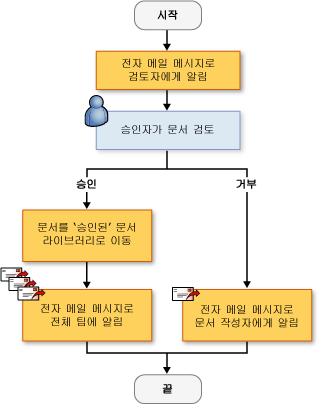
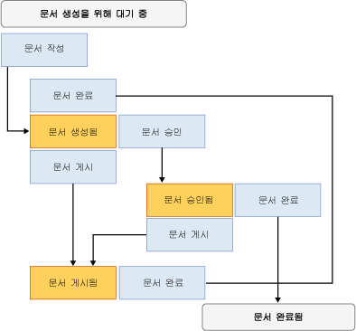

# SharePoint 워크플로 솔루션 만들기
  [!INCLUDE[vsprvs](../sharepoint/includes/vsprvs-md.md)]에서는 SharePoint 웹 사이트의 문서 및 목록 항목의 수명 주기를 관리하는 사용자 지정 워크플로를 만드는 데 유용한 도구를 제공합니다.  제공되는 항목으로는 디자이너, 작업 컨트롤 집합, 필수 어셈블리 참조가 있습니다.  [!INCLUDE[vsprvs](../sharepoint/includes/vsprvs-md.md)]에는 워크플로를 만들고 구성하는 데 도움이 되는 **SharePoint 사용자 지정 마법사**도 포함되어 있습니다.  
  
 [!INCLUDE[vsprvs](../sharepoint/includes/vsprvs-md.md)]에서 SharePoint 프로젝트를 만드는 데 필요한 필수 구성 요소 목록은 [SharePoint 솔루션 개발 요구 사항](../sharepoint/requirements-for-developing-sharepoint-solutions.md)을 참조하십시오.  SharePoint에 대한 자세한 내용은 [Microsoft SharePoint 제품 및 기술](http://go.microsoft.com/fwlink/?LinkId=178470) 을 참조하십시오.  
  
## SharePoint의 워크플로  
 SharePoint 라이브러리 또는 목록에 워크플로를 추가하면 해당 라이브러리 또는 목록의 모든 항목에 비즈니스 프로세스가 적용됩니다.  워크플로는 편집 후 검토할 항목을 보내는 등 시스템 또는 사용자가 각 항목에 대해 수행해야 하는 작업을 설명합니다.  이러한 *작업*은 워크플로를 구성하는 문서 블록입니다.  
  
 [!INCLUDE[vsprvs](../sharepoint/includes/vsprvs-md.md)]에서 SharePoint 워크플로를 만들어 SharePoint 웹 사이트에 배포할 수 있습니다.  워크플로가 SharePoint에 배포된 후 라이브러리나 목록에 연결합니다.  그런 다음 프로세스에서 자동으로 또는 사용자가 수동으로 워크플로를 시작할 수 있습니다.  워크플로 작업에 대 한 자세한 내용은 [워크플로를 이용한 프로세스 관리](http://go.microsoft.com/fwlink/?LinkId=79757) 을 참조하십시오.  
  
## 사용자 지정 SharePoint 워크플로 만들기  
 [!INCLUDE[vsprvs](../sharepoint/includes/vsprvs-md.md)]에서는 **순차 워크플로** 및 **상태 시스템 워크플로**의 두 가지 SharePoint 워크플로 프로젝트를 사용할 수 있습니다.  
  
 *순차 워크플로*는 일련의 단계를 나타냅니다.  마지막 작업이 완료될 때까지 단계가 차례대로 수행됩니다.  순차 워크플로는 항상 순서대로 실행됩니다.  외부 이벤트를 수신하고 병렬 논리 흐름을 포함할 수 있으므로 정확한 실행 순서는 달라질 수 있습니다.  다음 그림에서는 순차 워크플로의 예를 보여 줍니다.  
  
   
  
 *상태 시스템 워크플로*는 상태, 전환 및 작업 집합으로 구성된 워크플로를 나타냅니다.  상태 시스템 워크플로의 단계는 비동기적으로 실행됩니다.  즉, 차례대로 수행되는 대신 작업과 상태에 의해 트리거됩니다.  한 상태가 시작 상태로 할당된 다음 이벤트에 따라 다른 상태로 전환됩니다.  상태 시스템에 워크플로의 끝을 결정하는 최종 상태를 지정할 수 있습니다.  다음 다이어그램에서는 상태 시스템 워크플로의 예를 보여 줍니다.  
  
   
  
 워크플로 유형에 대한 자세한 내용은 [워크플로 유형](http://go.microsoft.com/fwlink/?LinkId=178995) 을 참조하십시오.  
  
### 마법사 사용  
 [!INCLUDE[vsprvs](../sharepoint/includes/vsprvs-md.md)]에서 SharePoint 워크플로 프로젝트를 만드는 경우 먼저 **SharePoint 사용자 지정 마법사**에서 해당 설정을 지정합니다.  마법사에서는 이러한 설정을 사용하여 **솔루션 탐색기**에 프로젝트를 만듭니다.  이 프로젝트에는 코드 파일, 워크플로를 배포하는 데 사용되는 여러 파일 및 사용자 지정 SharePoint 워크플로를 만드는 데 필요한 어셈블리 참조가 포함됩니다.  
  
 워크플로를 만든 후 속성 창에서 해당 속성을 수정할 수 있습니다.  대부분의 워크플로 속성은 속성 창에서 직접 변경할 수 있지만 일부 속성은 줄임표 단추\(\)를 클릭해야 값을 변경할 수 있습니다.  이 단추를 클릭하면 **SharePoint 사용자 지정 마법사**가 다시 시작됩니다.  속성 값을 변경한 후 **마침** 버튼을 선택하여 종료합니다.  
  
> [!NOTE]  
>  **워크플로 유형** 속성은 읽기 전용이므로 변경할 수 없습니다.  워크플로 유형을 변경하려면 다른 워크플로를 만들어야 합니다.  
  
## SharePoint 워크플로 디자인  
 비즈니스 프로세스의 모든 단계를 정의한 후 [!INCLUDE[vsprvs](../sharepoint/includes/vsprvs-md.md)] 워크플로 디자이너를 사용하여 SharePoint 워크플로를 디자인합니다.  디자이너를 열려면, **솔루션 탐색기** 에서 Workflow1.cs 또는 Workflow1.vb 을 더블클릭 하거나, 이러한 파일 중 하나에 대한 바로 가기 메뉴를 열고 **열기** 를 선택합니다.  
  
### 작업  
 워크플로를 디자인하려면 **도구 상자**의 작업을 디자이너의 *워크플로 일정*에 추가합니다.  워크플로 일정에는 일련의 작업이 수행해야 하는 순서대로 포함되어 있습니다.  
  
 두 가지 유형의 작업이 있습니다.  
  
-   *단순 작업*에서는 "1일 지연" 또는 "웹 서비스 시작"과 같은 단일 작업 단위를 수행합니다.  
  
-   *복합 작업*에는 다른 작업이 포함됩니다. 예를 들어 조건부 작업에는 두 개의 분기가 포함될 수 있습니다.  
  
 두 작업 유형 모두 **도구 상자**에서 사용할 수 있습니다.  
  
 작업에는 속성, 메서드 및 이벤트가 포함될 수 있습니다.  작업의 속성을 설정하려면 **속성** 창을 사용합니다.  
  
 사용자 지정 작업을 만들 수도 있습니다.  자세한 내용은 [연습: 사용자 지정 사이트 워크플로 작업 만들기](../sharepoint/walkthrough-create-a-custom-site-workflow-activity.md)을 참조하십시오.  
  
 작업은 **도구 상자**에 있는 다음 탭에 구성되어 있습니다.  
  
-   **SharePoint 워크플로**  
  
-   **Windows Workflow v3.0**  
  
-   **Windows Workflow v3.5**  
  
 SharePoint에서 모든 핵심 워크플로 작업이 지원되는 것은 아닙니다.  자세한 내용은 [Windows SharePoint Services에 대한 워크플로 작업 개요](http://go.microsoft.com/fwlink/?LinkID=156094) 을 참조하십시오.  
  
#### SharePoint 워크플로 작업  
 **SharePoint 워크플로** 탭에는 [!INCLUDE[wss_14_long](../sharepoint/includes/wss-14-long-md.md)]에서 사용할 수 있는 특수 작업이 포함됩니다.  이러한 작업을 통해 문서 수명 주기 워크플로를 간단하고 효율적으로 개발할 수 있습니다.  **SharePoint 워크플로** 탭에 나열된 작업에 대한 자세한 내용은 [Windows SharePoint Services에 대한 워크플로 작업 개요](http://go.microsoft.com/fwlink/?LinkID=156094) 를 참조하십시오.  
  
#### Windows 워크플로 작업  
 **Windows 워크플로** 탭에는 [!INCLUDE[TLA#tla_workflow](../sharepoint/includes/tlasharptla-workflow-md.md)]에서 제공하는 작업이 포함됩니다.  이러한 작업을 사용하여 모든 종류의 Windows 워크플로 응용 프로그램에 대한 워크플로 일정을 만들 수 있습니다.  
  
 **Windows 워크플로** 탭에 나열된 작업에 대한 자세한 내용은 [Windows Workflow Foundation 작업](http://go.microsoft.com/fwlink/?LinkID=156096) 을 참조하십시오.  Windows Workflow Foundation에 대한 자세한 내용은 [Windows Workflow Foundation 개요](http://go.microsoft.com/fwlink/?LinkID=128632) 을 참조하십시오.  
  
### 디자이너에서의 작업  
 워크플로 일정에는 Windows 워크플로 작업과 SharePoint 워크플로 작업의 조합을 포함할 수 있습니다.  
  
 디자이너에는 작업을 올바르게 배치하고 구성하는 데 유용한 시각적 신호가 표시됩니다.  작업을 워크플로 일정으로 끌거나 복사하면 워크플로에서 해당 작업의 올바른 위치를 보여 주는 녹색 더하기 기호\(\+\) 아이콘이 디자이너에 표시됩니다.  올바르지 않은 위치에는 작업을 배치할 수 없습니다.  예를 들어 Listen 작업 분기에 Send 작업을 첫 번째 작업으로 배치할 수 없습니다.  자세한 내용은 [SharePoint 디자이너 개발자 센터](http://go.microsoft.com/fwlink/?LinkId=178476)를 참조하십시오.  
  
## 워크플로 도중 정보 수집  
 워크플로에서 미리 정의된 시간에 사용자로부터 정보를 수집할 수 있습니다.  정보는 양식 또는 항목 속성을 사용하여 수집할 수 있습니다.  
  
### 폼  
 폼은 대화 상자와 비슷하게 질문을 포함하고 사용자가 이에 대답할 수 있는 방법을 제공합니다.  
  
 워크플로에서 사용할 수 있는 폼에는 다음 네 가지 유형이 있습니다.  
  
-   연결  
  
-   시작  
  
-   수정  
  
-   Task  
  
 이 중에서 [!INCLUDE[vsprvs](../sharepoint/includes/vsprvs-md.md)]에는 연결 폼과 시작 폼에 대한 항목 템플릿이 포함되어 있습니다.  *연결 폼*의 예로는 워크플로를 설치하는 관리자가 비용 워크플로의 비용 한도와 같은 워크플로 관련 매개 변수를 입력할 수 있는 폼이 있습니다.  *초기화 폼* 의 예로 비용 워크플로의 사용자가 워크플로에 지출하는 금액을 입력하도록 하는 것이 있습니다.  이러한 폼 형식에 대한 자세한 내용은 [SharePoint 프로젝트 및 프로젝트 항목 템플릿](../sharepoint/sharepoint-project-and-project-item-templates.md)를 참조하십시오.  
  
### 항목 속성  
 SharePoint 라이브러리 또는 목록의 항목 속성을 사용하여 사용자로부터 정보를 수집할 수도 있습니다.  주 코드 파일\(Workflow1.cs 또는 Workflow1.vb\)에서는 `workflowProperties`라는 Microsoft.SharePoint.Workflow.SPWorkflowActivationProperties.WorkflowProperties 클래스의 인스턴스를 선언합니다.  코드에서 `workflowProperties` 개체를 사용하여 라이브러리 또는 목록의 속성에 액세스합니다.  예제를 보려면 [연습: SharePoint 워크플로 솔루션 만들기 및 디버깅](../sharepoint/walkthrough-creating-and-debugging-a-sharepoint-workflow-solution.md)를 참조하십시오.  
  
## SharePoint 워크플로 템플릿 디버깅  
 다른 [!INCLUDE[vsprvs](../sharepoint/includes/vsprvs-md.md)] 웹 기반 프로젝트를 디버깅할 때와 같은 방법으로 SharePoint 워크플로 프로젝트를 디버깅할 수 있습니다.  [!INCLUDE[vsprvs](../sharepoint/includes/vsprvs-md.md)] 디버거를 시작하면 [!INCLUDE[vsprvs](../sharepoint/includes/vsprvs-md.md)]에서는 **SharePoint 사용자 지정 마법사**에서 지정한 설정을 사용하여 적절한 SharePoint 웹 사이트를 열고 워크플로 템플릿을 적절한 라이브러리나 목록에 자동으로 연결합니다.  또한 [!INCLUDE[vsprvs](../sharepoint/includes/vsprvs-md.md)]에서는 [!INCLUDE[vsprvs](../sharepoint/includes/vsprvs-md.md)] 디버거를 w3wp.exe라는 [!INCLUDE[wss_14_long](../sharepoint/includes/wss-14-long-md.md)] 프로세스에 연결합니다.  
  
 워크플로를 테스트하려면 워크플로를 수동으로 시작해야 합니다.  자세한 내용은 [SharePoint 솔루션 디버깅](../sharepoint/debugging-sharepoint-solutions.md)의 "워크플로 디버깅" 단원을 참조하십시오.  [!INCLUDE[vsprvs](../sharepoint/includes/vsprvs-md.md)] 웹 응용 프로그램 디버깅에 대한 자세한 내용은 [웹 응용 프로그램 및 스크립트 디버깅](../debugger/debugging-web-applications-and-script.md)을 참조하십시오.  
  
## SharePoint 워크플로 템플릿 배포  
 [!INCLUDE[vsprvs](../sharepoint/includes/vsprvs-md.md)] SharePoint 워크플로 프로젝트는 다른 [!INCLUDE[vsprvs](../sharepoint/includes/vsprvs-md.md)] SharePoint 프로젝트와 같은 방식으로 배포됩니다.  자세한 내용은 [SharePoint 솔루션 패키징 및 배포](../sharepoint/packaging-and-deploying-sharepoint-solutions.md)을 참조하십시오.  
  
## 전역적으로 다시 사용할 수 있는 워크플로 가져오기  
 SharePoint Designer에서는 다시 사용할 수 있는 워크플로를 사이트별로 만들 수 있을 뿐 아니라 모든 SharePoint 사이트에서 재사용 가능한 *전역적으로 다시 사용할 수 있는 워크플로*를 만들 수 있습니다.  [!INCLUDE[vsprvs](../sharepoint/includes/vsprvs-md.md)] 에서 다시 사용할 수 있는 워크플로 프로젝트 가져오기는 현재 전역적으로 다시 사용할 수 있는 워크플로를 가져오지 못합니다.  그러나 SharePoint Designer를 사용하여 전역적으로 다시 사용할 수 있는 워크플로를 다시 사용할 수 있는 워크플로로 변환하거나, 변환되지 않은 선언적 워크플로로 가져올 수 있습니다.  자세한 내용은 [기존 SharePoint 사이트에서 항목 가져오기](../sharepoint/importing-items-from-an-existing-sharepoint-site.md)을 참조하십시오.  
  
## 관련 항목  
  
|제목|설명|  
|--------|--------|  
|[연습: SharePoint 워크플로 솔루션 만들기 및 디버깅](../sharepoint/walkthrough-creating-and-debugging-a-sharepoint-workflow-solution.md)|간단한 [!INCLUDE[vsprvs](../sharepoint/includes/vsprvs-md.md)] 워크플로를 만들고 디버깅하는 과정을 단계별로 안내합니다.|  
|[연습: 연결 및 초기화 폼이 있는 워크플로 만들기](../sharepoint/walkthrough-creating-a-workflow-with-association-and-initiation-forms.md)|연결 폼과 시작 폼이 있는 보다 복잡한 [!INCLUDE[vsprvs](../sharepoint/includes/vsprvs-md.md)] 워크플로를 만드는 과정을 단계별로 안내합니다.|  
|[연습: 워크플로에 응용 프로그램 페이지 추가](../sharepoint/walkthrough-add-an-application-page-to-a-workflow.md)|[연습: 연결 및 초기화 폼이 있는 워크플로 만들기](../sharepoint/walkthrough-creating-a-workflow-with-association-and-initiation-forms.md) 항목을 사용하고 워크플로에 입력된 데이터를 보고하는 .aspx 응용 프로그램 페이지를 더 추가합니다.|  
|[연습: 사용자 지정 사이트 워크플로 작업 만들기](../sharepoint/walkthrough-create-a-custom-site-workflow-activity.md)|사이트 수준 워크플로 만들기와 사용자 지정 워크플로 작업 만들기의 두 가지 주요 작업을 수행하는 방법을 보여 줍니다.|  
|[연습: Visual Studio에 SharePoint Designer의 다시 사용 가능한 워크플로 가져오기](../sharepoint/walkthrough-import-a-sharepoint-designer-reusable-workflow-into-visual-studio.md)|SharePoint Designer 2010에서 만든 다시 사용 가능한 선언적 워크플로를 [!INCLUDE[vsprvs](../sharepoint/includes/vsprvs-md.md)] SharePoint 프로젝트로 가져오는 방법을 보여 줍니다.|  
  
## 참고 항목  
 [Developing SharePoint Solutions](../sharepoint/developing-sharepoint-solutions.md)   
 [SharePoint 솔루션 빌드 및 디버깅](../sharepoint/building-and-debugging-sharepoint-solutions.md)   
 [SharePoint를 위한 응용 프로그램 페이지 만들기](../sharepoint/creating-application-pages-for-sharepoint.md)  
  
  